# <center>COURSE PROJECT</center>

<p align="center">
    <strong>Universidad Peruana de Ciencias Aplicadas</strong><br>
    <br>
    <strong>Ingeniería de Software</strong><br>
    <strong>Desarrollo de Soluciones IOT - 2947</strong><br>
    <strong>Profesor: Angel Augusto Velasquez Nuñez </strong><br>
    <br><strong>INFORME</strong>
</p>
<h4 style="text-align: center;"><strong>Startup: IronCoders</strong></h4>

<h4 style="text-align: center;"><strong>Product: AquaConecta</strong></h4>


<div style="text-align: center;">


<h5 style="text-align: center;"> Team Members</h5>

<table style="margin-left: auto; margin-right: auto; text-align: center;">
  <thead>
    <tr>
      <th>Member</th>
      <th>Code</th>
    </tr>
  </thead>
  <tbody>
    <tr>
      <td>Aguilar Castillo, Rodrigo</td>
      <td>U202210584</td>
    </tr>
    <tr>
      <td>Carmelino Dueñas, Michael Stefano</td>
      <td>U202212760</td>
    </tr>
    <tr>
      <td>Cortez Quezada, Joaquin Antonio</td>
      <td>U202212648</td>
    </tr>
    <tr>
      <td>Párraga Gamarra, Paolo Gonzalo</td>
      <td>U202219186</td>
    </tr>
    <tr>
      <td>Periche Quiroga, Piero</td>
      <td>U202210192</td>
    </tr>
    <tr>
      <td>Ramos Argüelles, Alexandra Belen</td>
      <td>U202215164</td>
    </tr>
  </tbody>
</table>

</div>


# Registro de Versiones del Informe

<div align="center">


|**Versión**|**Fecha**|**Autor**|**Descripción de modificación**|
| :-: | :-: | :-: | :-: |
|1\.0|7/04/2025|Rodrigo Aguilar Castillo|Redacción del perfil de la Startup.|
|1\.1|9/04/2025|Rodrigo Aguilar Castillo|Actualización de la descripción de las 5W y 2H.|
|1\.2|10/04/2025|Piero Periche Quiroga|Redacción de Lean UX Statement y agregar Lean UX Canvas del Capítulo I.|
|1\.3|11/04/2025|Joaquin Antonio Cortez Quezada|Agregar información acerca de los competidores.|
|1\.4|12/04/2025|Rodrigo Aguilar Castillo|Actualización de las hipótesis y redacción de user outcomes.|
|1\.5|14/04/2025|Piero Periche Quiroga|Actualización de Lean UX Assumptions.|
|1\.6|15/04/2025|Rodrigo Aguilar Castillo|Actualización de how much, elaboración de user task matrix y ubiquitous language.|
|1\.7|15/04/2024|Alexandra Belen Ramos Argüelles|Elaboración de user personas y user journey mapping por segmento objetivo.|
|1\.8|16/04/2024|Rodrigo Aguilar Castillo|Elaboración de event storming.|
|1\.9|16/04/2024|Paolo Gonzalo Párraga Gamarra|Elaboración de to-be scenario mapping.|
|2\.0|19/04/2025|Alexandra Belen Ramos Argüelles|Redacción de user stories, technical stories y elaboración de empathy mapping.|
|2\.1|20/04/2025|Alexandra Belen Ramos Argüelles|Elaboración de impact mapping y as-is scenario mapping por cada segmento objetivo.|
|2\.2|20/04/2025|Paolo Gonzalo Párraga Gamarra|Elaboración de product backlog.|
|2\.3|20/04/2025|Rodrigo Aguilar Castillo|Elaboración del bounded context de subscription and payment, user and profile, deployment diagrams.|
|2\.4|24/04/2025|Rodrigo Aguilar Castillo|Elaboración de user and profile management (c4 model).|
|2\.5|24/04/2025|Michael Stefano Carmelino Dueñas|Elaboración de las user stories para la landing page.|
|2\.6|25/04/2025|Michael Stefano Carmelino Dueñas|Agregar entrevista y resumen de entrevistas para segmento objetivo de habitantes.|
|2\.7|25/04/2025|Paolo Gonzalo Párraga Gamarra|Elaboración en bounded context canvas de analytics, modificación de to-be scenario mapping.|
|2\.8|25/04/2025|Joaquin Antonio Cortez Quezada|Elaboración en bounded context canvas de management.|
|2\.9|25/04/2025|Rodrigo Aguilar Castillo|Actualización de entrevistas, agregar contenido a bibliografía.|
|3\.0|25/04/2025|Alexandra Belen Ramos Argüelles|Elaboración de domain message flows modeling y context mapping.|
|3\.1|06/05/2025|Rodrigo Aguilar Castillo|Agregar conceptos de sensor y eventos a los diagramas|
|3\.2|07/05/2025|Paolo Gonzalo Párraga Gamarra|Actualización de product backlog.|


</div>

# Project Report Collaboration Insights

Repositorios:

Proyecto: [https://github.com/IronCoders-IOT/Final-Project](https://github.com/IronCoders-IOT/Final-Project)


### TB1

Para la entrega del TB1 se han realizado los procesos necesarios para lograr los objetivos propuestos de la entrega. Se toma en cuenta la importancia de la persistencia y como grupo nos dedicamos a mantener una frecuencia de commits y cambios proyectada a ser optima a futuro.

Se muestran evidencias de los commits realizados en la entrega de la TB1 en el informe.


[Colaboraciones del repositorio]
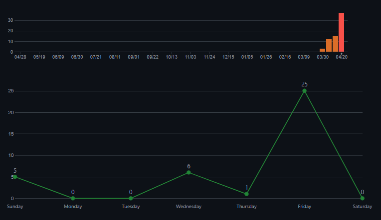

[Registro de los commits donde se realizaron la mayor cantidad]
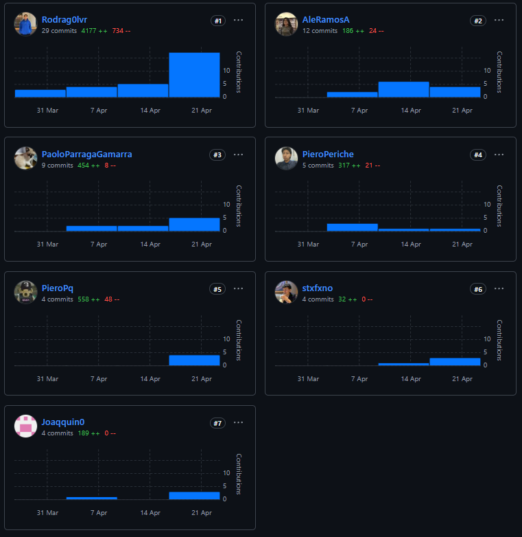

En ambos casos se puede observar el incremento de modificaciones y revisiones en los dias miercoles y una cantidad mayor de cambios que commits.

---

# Contenido

[Registro de Versiones del Informe](#registro-de-versiones-del-informe)

[Project Report Collaboration Insights](#project-report-collaboration-insights)

[Student Outcome](#student-outcome)

[Capítulo I: Introducción](#capítulo-i-introducción)

[1.1 Startup Profile](#11-startup-profile)  
[1.1.1. Descripción de la Startup](#111-descripción-de-la-startup)  
[1.1.2. Perfiles de integrantes del equipo](#112-perfiles-de-integrantes-del-equipo)

[1.2. Solution Profile](#12-solution-profile)  
[1.2.1 Antecedentes y problemática](#121-antecedentes-y-problemática)  
[1.2.2 Lean UX Process.](#122-lean-ux-process)  
[1.2.2.1. Lean UX Problem Statements.](#1221-lean-ux-problem-statements)  
[1.2.2.2. Lean UX Assumptions.](#1222-lean-ux-assumptions)  
[1.2.2.3. Lean UX Hypothesis Statements.](#1223-lean-ux-hypothesis-statements)  
[1.2.2.4. Lean UX Canvas.](#1224-lean-ux-canvas)

[1.3. Segmentos objetivo.](#13-segmentos-objetivo)

[Capítulo II: Requirements Elicitation & Analysis](#capítulo-ii-requirements-elicitation--analysis)

[2.1. Competidores](#21-competidores)  
[2.1.1. Análisis competitivo](#211-análisis-competitivo)  
[2.1.2. Estrategias y tácticas frente a competidores](#212-estrategias-y-tácticas-frente-a-competidores)

[2.2. Entrevistas](#22-entrevistas)  
[2.2.1. Diseño de entrevistas](#221-diseño-de-entrevistas)    
[2.2.3. Análisis de entrevistas](#223-análisis-de-entrevistas)

[2.3. Needfinding](#23-needfinding)  
[2.3.1. User Personas](#231-user-personas)  
[2.3.2. User Task Matrix](#232-user-task-matrix)  
[2.3.3. User Journey Mapping](#233-user-journey-mapping)  
[2.3.4. Empathy Mapping](#234-empathy-mapping)  
[2.3.5. As-is Scenario Mapping](#235-as-is-scenario-mapping)

[2.4. Ubiquitous Language](#24-ubiquitous-language)

[Capítulo III: Requirements Specifications](#capítulo-iii-requirements-specification)

[3.1. To-Be Scenario Mapping](#31-to-be-scenario-mapping)

[3.2. User Stories](#32-user-stories)

[3.3. Impact Mapping](#33-impact-mapping)

[3.4. Product Backlog](#34-product-backlog)

[Capítulo IV: Solution Software Design](#capítulo-iv-solution-software-design)

[4.1. Strategic-Level Domain-Driven Design](#41-strategic-level-domain-driven-design)   
[4.1.1. Event Storming](#411-event-storming)             
[4.1.1.1 Candidate Context Discovery](#4111-candidate-context-discovery)    
[4.1.1.2 Domain Message Flows Modeling](#4112-domain-message-flows-modeling)    
[4.1.1.3 Bounded Context Canvases](#4113-bounded-context-canvases)    
[4.1.2. Context Mapping](#412-context-mapping)    
[4.1.3. Software Architecture](#413-software-architecture)    
[4.1.3.1. Software Architecture System Landscape Diagram](#4131-software-architecture-system-landscape-diagram)        
[4.1.3.2. Software Architecture Context Level Diagrams](#4132-software-architecture-container-level-diagrams)      
[4.1.3.3. Software Architecture Deployment Diagrams](#4133-software-architecture-deployment-diagrams)      
[4.2. Tactical-Level Domain-Driven Design](#42-tactical-level-domain-driven-design)       

[4.2.1. Bounded Context: Management](#421-bounded-context-management)   
[4.2.1.1. Domain Layer](#4211-domain-layer)    
[4.2.1.2. Interface Layer](#4212-interface-layer)    
[4.2.1.3. Application Layer](#4213-application-layer)    
[4.2.1.4. Infrastructure Layer](#4214-infrastructure-layer)    
[4.2.1.5. Bounded Context Software Architecture Component Level Diagrams](#4215-bounded-context-software-architecture-component-level-diagrams)     
[4.2.1.6. Bounded Context Software Architecture Code Level Diagrams](#4216-bounded-context-software-architecture-code-level-diagrams)     
[4.2.1.6.1. Bounded Context Domain Layer Class Diagrams](#42161-bounded-context-domain-layer-class-diagrams)      
[4.2.1.6.2. Bounded Context Database Design Diagram](#42162-bounded-context-database-design-diagram)      

[4.2.2. Bounded Context: Analytics](#422-bounded-context-analytics)    
[4.2.2.1. Domain Layer](#4221-domain-layer)    
[4.2.2.2. Interface Layer](#4222-interface-layer)    
[4.2.2.3. Application Layer](#4223-application-layer)    
[4.2.2.4. Infrastructure Layer](#4224-infrastructure-layer)    
[4.2.2.5. Bounded Context Software Architecture Component Level Diagrams](#4225-bounded-context-software-architecture-component-level-diagrams)    
[4.2.2.6. Bounded Context Software Architecture Code Level Diagrams](#4226-bounded-context-software-architecture-code-level-diagrams)    
[4.2.2.6.1. Bounded Context Domain Layer Class Diagrams](#42261-bounded-context-domain-layer-class-diagrams)    
[4.2.2.6.2. Bounded Context Database Design Diagram](#42262-bounded-context-database-design-diagram)     

[4.2.3. Bounded Context: Consulting](#423-bounded-context-consulting)     
[4.2.3.1. Domain Layer](#4231-domain-layer)     
[4.2.3.2. Interface Layer](#4232-interface-layer)     
[4.2.3.3. Application Layer](#4233-application-layer)    
[4.2.3.4. Infrastructure Layer](#4234-infrastructure-layer)    
[4.2.3.5. Bounded Context Software Architecture Component Level Diagrams](#4235-bounded-context-software-architecture-component-level-diagrams)    
[4.2.3.6. Bounded Context Software Architecture Code Level Diagrams](#4236-bounded-context-software-architecture-code-level-diagrams)    
[4.2.3.6.1. Bounded Context Domain Layer Class Diagrams](#42361-bounded-context-domain-layer-class-diagrams)     
[4.2.3.6.2. Bounded Context Database Design Diagram](#42362-bounded-context-database-design-diagram)      

[4.2.4. Bounded Context: Subscription](#424-bounded-context-subscription)     
[4.2.4.1. Domain Layer](#4241-domain-layer)     
[4.2.4.2. Interface Layer](#4242-interface-layer)     
[4.2.4.3. Application Layer](#4243-application-layer)    
[4.2.4.4. Infrastructure Layer](#4244-infrastructure-layer)    
[4.2.4.5. Bounded Context Software Architecture Component Level Diagrams](#4245-bounded-context-software-architecture-component-level-diagrams)    
[4.2.4.6. Bounded Context Software Architecture Code Level Diagrams](#4246-bounded-context-software-architecture-code-level-diagrams)    
[4.2.4.6.1. Bounded Context Domain Layer Class Diagrams](#42461-bounded-context-domain-layer-class-diagrams)    
[4.2.4.6.2. Bounded Context Database Design Diagram](#42462-bounded-context-database-design-diagram)    

[4.2.5. Bounded Context: Payment](#425-bounded-context-payment)    
[4.2.5.1. Domain Layer](#4251-domain-layer)    
[4.2.5.2. Interface Layer](#4252-interface-layer)    
[4.2.5.3. Application Layer](#4253-application-layer)    
[4.2.5.4. Infrastructure Layer](#4254-infrastructure-layer)    
[4.2.5.5. Bounded Context Software Architecture Component Level Diagrams](#4255-bounded-context-software-architecture-component-level-diagrams)    
[4.2.5.6. Bounded Context Software Architecture Code Level Diagrams](#4256-bounded-context-software-architecture-code-level-diagrams)    
[4.2.5.6.1. Bounded Context Domain Layer Class Diagrams](#42561-bounded-context-domain-layer-class-diagrams)    
[4.2.5.6.2. Bounded Context Database Design Diagram](#42562-bounded-context-database-design-diagram)     

[4.2.6. Bounded Context: Automation](#426-bounded-context-automation)    
[4.2.6.1. Domain Layer](#4261-domain-layer)     
[4.2.6.2. Interface Layer](#4262-interface-layer)     
[4.2.6.3. Application Layer](#4263-application-layer)    
[4.2.6.4. Infrastructure Layer](#4264-infrastructure-layer)    
[4.2.6.5. Bounded Context Software Architecture Component Level Diagrams](#4265-bounded-context-software-architecture-component-level-diagrams)    
[4.2.6.6. Bounded Context Software Architecture Code Level Diagrams](#4266-bounded-context-software-architecture-code-level-diagrams)    
[4.2.6.6.1. Bounded Context Domain Layer Class Diagrams](#42661-bounded-context-domain-layer-class-diagrams)    
[4.2.6.6.2. Bounded Context Database Design Diagram](#42662-bounded-context-database-design-diagram)     

[4.2.7. Bounded Context: Installation](#427-bounded-context-installation)     
[4.2.7.1. Domain Layer](#4271-domain-layer)     
[4.2.7.2. Interface Layer](#4272-interface-layer)     
[4.2.7.3. Application Layer](#4273-application-layer)     
[4.2.7.4. Infrastructure Layer](#4274-infrastructure-layer)     
[4.2.7.5. Bounded Context Software Architecture Component Level Diagrams](#4275-bounded-context-software-architecture-component-level-diagrams)     
[4.2.7.6. Bounded Context Software Architecture Code Level Diagrams](#4276-bounded-context-software-architecture-code-level-diagrams)     
[4.2.7.6.1. Bounded Context Domain Layer Class Diagrams](#42761-bounded-context-domain-layer-class-diagrams)     
[4.2.7.6.2. Bounded Context Database Design Diagram](#42762-bounded-context-database-design-diagram)     

[4.2.8. Bounded Context: Identity and Access Management](#428-bounded-context-identity-and-access-management)     
[4.2.8.1. Domain Layer](#4281-domain-layer)     
[4.2.8.2. Interface Layer](#4282-interface-layer)     
[4.2.8.3. Application Layer](#4283-application-layer)     
[4.2.8.4. Infrastructure Layer](#4284-infrastructure-layer)     
[4.2.8.5. Bounded Context Software Architecture Component Level Diagrams](#4285-bounded-context-software-architecture-component-level-diagrams)     
[4.2.8.6. Bounded Context Software Architecture Code Level Diagrams](#4286-bounded-context-software-architecture-code-level-diagrams)     
[4.2.8.6.1. Bounded Context Domain Layer Class Diagrams](#42861-bounded-context-domain-layer-class-diagrams)     
[4.2.8.6.2. Bounded Context Database Design Diagram](#42862-bounded-context-database-design-diagram)     

[4.2.9. Bounded Context: Notifications](#429-bounded-context-notifications)     
[4.2.9.1. Domain Layer](#4291-domain-layer)     
[4.2.9.2. Interface Layer](#4292-interface-layer)     
[4.2.9.3. Application Layer](#4293-application-layer)     
[4.2.9.4. Infrastructure Layer](#4294-infrastructure-layer)     
[4.2.9.5. Bounded Context Software Architecture Component Level Diagrams](#4295-bounded-context-software-architecture-component-level-diagrams)     
[4.2.9.6. Bounded Context Software Architecture Code Level Diagrams](#4296-bounded-context-software-architecture-code-level-diagrams)     
[4.2.9.6.1. Bounded Context Domain Layer Class Diagrams](#42961-bounded-context-domain-layer-class-diagrams)     
[4.2.9.6.2. Bounded Context Database Design Diagram](#42962-bounded-context-database-design-diagram)     
             

[Conclusiones](#conclusiones)

[Conclusiones y recomendaciones](#conclusiones-y-recomendaciones)

[Video About-the-Team](#video-about-the-team)

[Bibliografía](#bibliografía)

[Anexos](#anexos)

# Student Outcome
El curso contribuye al cumplimiento del Student Outcome ABET:
ABET – EAC - Student Outcome 5
Criterio: La capacidad de funcionar efectivamente en un equipo cuyos miembros
juntos proporcionan liderazgo, crean un entorno de colaboración e inclusivo,
establecen objetivos, planifican tareas y cumplen objetivos.
En el siguiente cuadro se describe las acciones realizadas y enunciados de
conclusiones por parte del grupo, que permiten sustentar el haber alcanzado el logro
del ABET – EAC - Student Outcome 5.

| **Criterio Específico** | **Acciones Realizadas** | **Conclusiones** |
|-------------------------|-------------------------|------------------|
| Trabaja en equipo para proporcionar liderazgo en forma conjunta | **Alexandra Belen Ramos Argüelles** <br>**TB1:**<br> Lideré la organización del equipo en el proyecto AquaConecta, coordinando las reuniones, la definición de la estrategia de trabajo, y la organización de entregables. Supervisé los avances del event storming, la construcción de User Personas, la elaboración del Lean UX Canvas y el modelado de los principales diagramas técnicos, asegurando una visión integrada de todo el proyecto. <br><br> **Rodrigo Aguilar Castillo** <br>**TB1:**<br> Participé en la definición del flujo de usuarios, contribuyendo en la elaboración de los diagramas de interacción y apoyando en el diseño de la arquitectura de capas, especialmente en la identificación de servicios críticos como la gestión de sensores y eventos de AquaConecta. <br><br> **Michael Stefano Carmelino Dueñas** <br>**TB1:**<br> Aporté en el desarrollo del Context Map general del sistema, ayudando en la identificación de Bounded Contexts y trabajando en la definición técnica de los principales aggregates para la plataforma. También colaboré en la elaboración de los primeros esquemas de la base de datos relacional. <br><br> **Joaquin Antonio Cortez Quezada** <br>**TB1:**<br> Trabajé activamente en la definición de User Personas y en la identificación de segmentos de usuario (hogares, agricultores, técnicos). Además, participé en la construcción de los flujos de experiencia iniciales y en el diseño del User Journey Mapping. <br><br> **Paolo Gonzalo Párraga Gamarra** <br>**TB1:**<br> Colaboré en el levantamiento de eventos de negocio durante las sesiones de event storming, apoyando además en la priorización de funcionalidades esenciales para el MVP y en la validación de los flujos de interacción usuario-sistema. <br><br> **Piero Periche Quiroga** <br>**TB1:**<br> Participé en la validación técnica de los diagramas generados (Bounded Contexts, Arquitectura de Capas y Componentes), asegurando su consistencia con los requerimientos levantados y apoyando en la revisión de las entrevistas realizadas a los segmentos objetivo. | El equipo demostró un liderazgo conjunto sólido, con Alexandra coordinando las acciones principales y cada integrante contribuyendo activamente al desarrollo de flujos, levantamiento de eventos, diseño técnico, experiencia de usuario y validación de artefactos. Se logró un avance integral del proyecto AquaConecta de manera organizada y colaborativa. |
| Crea un entorno colaborativo e inclusivo, establece metas, planifica tareas y cumple objetivos. | **Alexandra Belen Ramos Argüelles** <br>**TB1:**<br> Organicé y supervisé la planificación de tareas por etapas, estableciendo metas semanales claras y promoviendo espacios de discusión abiertos para garantizar la participación de todos los miembros en la toma de decisiones clave. <br><br> **Rodrigo Aguilar Castillo** <br>**TB1:**<br> Participé en la coordinación de actividades técnicas, ayudando a definir prioridades en el diseño de flujos de usuario y contribuyendo a mantener la comunicación constante entre todos los miembros durante la construcción de diagramas técnicos. <br><br> **Michael Stefano Carmelino Dueñas** <br>**TB1:**<br> Apoyé en la definición de objetivos técnicos semanales relacionados a la creación del Context Map y Bounded Context Canvas, facilitando la validación cruzada de entregables entre los integrantes. <br><br> **Joaquin Antonio Cortez Quezada** <br>**TB1:**<br> Colaboré activamente en las sesiones de planificación de funcionalidades desde la perspectiva del usuario, asegurando que las metas de experiencia de usuario y segmentación fueran contempladas en todas las decisiones estratégicas. <br><br> **Paolo Gonzalo Párraga Gamarra** <br>**TB1:**<br> Aporté a la organización y priorización de tareas derivadas del event storming y participé en la planificación de las actividades relacionadas a la identificación de eventos críticos del sistema. <br><br> **Piero Periche Quiroga** <br>**TB1:**<br> Contribuí en la planificación y validación de entregables parciales como diagramas técnicos y flujos de usuario, asegurando la correcta alineación de los entregables con los objetivos del proyecto definidos en las reuniones grupales. | Gracias al liderazgo colaborativo y la participación activa de todos los integrantes, se logró establecer un entorno de trabajo inclusivo, con metas claras y planificación efectiva que garantizó el cumplimiento de los entregables y la calidad de los resultados obtenidos en AquaConecta.

# Capítulo I: Introducción

## 1.1. Startup Profile

### 1.1.1. Descripción de la Startup

AquaConecta es una empresa emergente que se destaca por su enfoque innovador en la implementación de soluciones IoT para optimizar el acceso y la distribución de agua potable. Fundada con el propósito de mejorar la gestión del suministro en comunidades que no cuentan con un servicio continuo, AquaConecta ha logrado posicionarse como un actor clave en el sector gracias a su capacidad para desarrollar plataformas tecnológicas que conectan a proveedores de agua con usuarios finales de manera eficiente y transparente. <br><br>

Nuestra empresa se caracteriza por su compromiso con la innovación, la sostenibilidad y el impacto social. En AquaConecta, creemos firmemente en el poder de la tecnología para transformar la forma en que las personas acceden a recursos esenciales. Por ello, nos enfocamos en ofrecer soluciones inteligentes que permitan monitorear en tiempo real la calidad y cantidad del agua, mejorando la toma de decisiones tanto para proveedores como para usuarios.<br><br>

Como empresa emergente, estamos comprometidos con un crecimiento sostenible y con la expansión de nuestro alcance tanto a nivel nacional como internacional. Nos enorgullece ser parte de una revolución tecnológica en la gestión del agua potable, y estamos entusiasmados por seguir desarrollando herramientas que promuevan una distribución más justa, eficiente y segura mediante nuestra tecnología IoT avanzada

#### Visión

La visión de AquaConecta es ser líder en soluciones IoT para el acceso y distribución eficiente de agua potable, ofreciendo tecnología de vanguardia que garantice la calidad, disponibilidad y gestión inteligente del recurso hídrico en comunidades de todo el mundo.

#### Misión

La misión de AquaConecta es desarrollar y ofrecer soluciones tecnológicas basadas en IoT que mejoren el acceso al agua potable, facilitando la conexión entre proveedores y comunidades sin suministro continuo, mediante herramientas que garanticen una distribución eficiente, transparente y sostenible.

### 1.1.2. Perfiles de los integrantes
| Nombre                   | Descripción | Foto |
|--------------------------|-------------|------|
| Rodrigo Aguilar Castillo | Soy Rodrigo, estudiante de Ingeniería de Software en la Universidad Peruana de Ciencias Aplicadas (UPC). Me apasiona la tecnología y los dispositivos electrónicos, y disfruto especialmente programar, lo cual se ha convertido en uno de mis principales pasatiempos.<br>Siempre estoy buscando aprender nuevas herramientas y mejorar mis habilidades en el desarrollo de software.<br><br>**Habilidades Técnicas**<br>- Desarrollo Frontend con **Angular** y **Vue**<br>- Desarrollo Backend con **Java** y **Spring Boot**<br>- Conocimientos en **C++**<br>- Manejo intermedio de **SQL** | |
| Paolo Gonzalo Párraga Gamarra | Soy Paolo Párraga, estudiante de ingeniería de software en séptimo ciclo. Soy una persona que disfruta trabajar duro para lograr mis objetivos y nunca me rindo a pesar de los momentos difíciles. Me gusta el trabajo en equipo porque siento que puedo aportar a mis compañeros cuando lo necesiten.<br><br>**Habilidades Técnicas**<br>- Desarrollo Frontend con **Angular** y **Vue**<br>- Desarrollo Backend con **Java** y **Spring Boot**<br>- Conocimientos en **C++**<br>- Manejo intermedio de **SQL** | |
| Alexandra Belen Ramos Argüelles | Soy Alexandra Ramos, estudiante de la carrera de Ingeniería de Software en la Universidad Peruana de Ciencias Aplicadas (UPC), actualmente cursando el séptimo ciclo. Me considero una persona empática, responsable y perseverante. Disfruto trabajar en equipo y me adapto con facilidad a distintos entornos de colaboración. Creo firmemente que la comunicación asertiva y el apoyo mutuo son claves para alcanzar resultados significativos.<br><br>Me apasiona desarrollar soluciones tecnológicas que generen un impacto positivo en la sociedad, especialmente en contextos donde la innovación puede marcar la diferencia.<br><br>**Habilidades Técnicas**<br>- Desarrollo Frontend con **Angular** y **Vue**<br>- Desarrollo Backend con **Java** y **Spring Boot**<br>- Conocimientos en **C++**, **C#** y **Python** |  |
| Michael Stefano Carmelino Dueñas | Soy Michael Carmelino, estudiante de la carrera de Ingeniería de Software en la Universidad Peruana de Ciencias Aplicadas (UPC), actualmente cursando el séptimo ciclo. Soy una persona que le gusta el trabajo en equipo donde haya una comunicación y formas de integrarse entre todos para llegar a un fin común.<br><br>Me gusta desarrollar proyectos que tengan que ver con la seguridad en ciertos aspectos pero también me gusta hacer proyectos que me den a mí facilidades en lo personal o por diversión.<br><br>**Habilidades Técnicas**<br>- Desarrollo Frontend con **React** y **Tailwind**<br>- Desarrollo Backend con **NestJS** y **Spring Boot**<br>- Conocimientos en **C++**, **Python** y **Java**<br>- Base de datos con **Supabase** |  |
| Joaquin Antonio Cortez Quezada | Soy Joaquin Antonio Cortez Quezada, actualmente estoy cursando el séptimo ciclo de la carrera de Ingeniería de Software en la UPC (Universidad Peruana de Ciencias Aplicadas). Me considero una persona perseverante, responsable, con la capacidad de aprender y adaptarme de forma rápida para enfrentar diversos desafíos tecnológicos.<br><br>**Habilidades Técnicas**<br>- Desarrollo Frontend con **Angular** y **Vue**<br>- Desarrollo Backend con **Java** y **Spring Boot**<br>- Conocimientos en **C++**, **Python**<br>- Manejo intermedio de **MySQL**, **PostgreSQL** |  |
| Piero Fernando Periche Quiroga | Soy Piero Fernando Periche Quiroga, estoy cursando el séptimo ciclo de la carrera de Ingeniería de Software en la UPC. Soy una persona responsable, perseverante y con la capacidad de aprender y aportar buenas ideas al equipo frente a los problemas que se puedan presentar.<br><br>**Habilidades Técnicas**<br>- Desarrollo Frontend con **Vue** y **Angular**<br>- Desarrollo Backend con **Java** y **C#**<br>- Conocimiento en **MySQL** y **MongoDB** |  |


## 1.2. Solution Profile

AquaConecta nace como respuesta a la necesidad de mejorar el acceso y la distribución de agua potable en comunidades sin suministro constante. A través de una plataforma inteligente con tecnología IoT, conecta a proveedores con usuarios, permitiendo monitorear en tiempo real la calidad y cantidad del agua disponible.

Gracias a sus sensores y acceso desde dispositivos móviles o web, la solución facilita la planificación de rutas de distribución y brinda a los usuarios control total sobre su consumo. Su enfoque automatizado, accesible y centrado en datos la convierte en una herramienta eficiente para optimizar la gestión del agua y generar un impacto positivo en la calidad de vida de las personas.

### 1.2.1. Antecedentes y problemática

En regiones como **Ica y Chincha**, miles de familias enfrentan una grave crisis de acceso al agua potable, ya que solo el **13.3% de los hogares** cuentan con suministro continuo durante las 24 horas del día ([Infobae, 2024](https://www.infobae.com/peru/2024/09/08/alarma-por-la-falta-de-acceso-continuo-a-agua-potable-en-ica-solo-el-133-de-los-hogares-cuenta-con-el-servicio-las-24-horas/?utm_source=chatgpt.com)). Ante esta situación, muchas personas dependen del abastecimiento mediante **camiones cisterna**, lo cual resuelve de forma temporal la necesidad, pero genera nuevos desafíos en la gestión y control del recurso. A pesar de los esfuerzos de empresas como **Semapach** y la supervisión de organismos como **Sunass**, se identifican diversos problemas estructurales que dificultan una distribución justa y segura del agua.

#### Principales problemáticas identificadas:

- **Falta de trazabilidad y control por vivienda:** no hay un registro automatizado de cuánta agua se entrega a cada familia.  
- **Distribución ineficiente:** algunas zonas no reciben agua a tiempo o quedan fuera de la planificación.  
- **Riesgos en la calidad del agua:** no siempre se verifica si el agua distribuida por cisterna cumple los estándares de salubridad.  
- **Dependencia de métodos manuales:** muchas decisiones logísticas se toman sin apoyo de datos en tiempo real.  
- **Problemas sanitarios:** el almacenamiento en baldes o tanques sin tapa incrementa el riesgo de enfermedades como el dengue.  

Esta realidad evidencia la necesidad de adoptar soluciones tecnológicas, como sistemas de monitoreo IoT y plataformas digitales de gestión, que permitan optimizar el reparto, mejorar la transparencia y garantizar la calidad del agua entregada.


AquaConecta surge como una solución integral para enfrentar los desafíos en la distribución y gestión del agua potable en comunidades sin acceso continuo al servicio. Esta plataforma inteligente, basada en tecnología IoT, permite a las empresas proveedoras monitorear en tiempo real la calidad y cantidad de agua disponible directamente desde los tanques de almacenamiento en las viviendas, lo que mejora significativamente la trazabilidad y eficiencia del servicio.

Gracias a sensores instalados en cada tanque, se recopilan datos sobre niveles de agua, posibles contaminantes y consumo, los cuales son transmitidos a una aplicación web y móvil. Esto brinda a los usuarios finales información clara sobre su suministro, y a los proveedores una herramienta poderosa para planificar rutas de abastecimiento, priorizar zonas críticas y tomar decisiones basadas en datos reales.

Con AquaConecta, se optimiza la distribución, se reducen los riesgos sanitarios asociados al almacenamiento inseguro y se garantiza un uso más inteligente y equitativo del recurso hídrico. Esta solución no solo responde a una necesidad urgente, sino que también impulsa la transformación digital de los servicios de agua, promoviendo un acceso más justo, transparente y sostenible para todos.


#### Técnica de las 5W's y 2H's

##### ¿What? - ¿Cuál es el problema?

 Falta de control y visibilidad sobre el agua en tanques domésticos, lo que impide a las familias saber cuánta agua tienen y su calidad, y a los proveedores gestionar eficientemente las entregas.

##### ¿Who? - ¿Quienes son los beneficiarios?

 Las familias sin acceso continuo a agua potable y los proveedores de agua como empresas, municipalidades y ONGs que buscan optimizar la distribución y monitoreo del recurso.

 ##### ¿When? - ¿Cuando se origina el problema?
 El problema se origina de forma continua, especialmente cuando no hay acceso constante al agua potable, durante cortes inesperados, épocas de sequía o cuando el usuario no puede supervisar manualmente el estado del agua almacenada.

##### ¿Why? - ¿Por qué se origina el problema?

El problema se origina por el acceso limitado o intermitente al agua potable y la falta de control sobre su almacenamiento, lo que dificulta una distribución eficiente y transparente.

##### ¿Where? - ¿Dónde ocurre el problema?

El problema ocurre en hogares y comunidades de zonas urbanas periféricas y rurales con acceso limitado al agua, como Ica y Chincha, donde se depende de tanques y camiones cisterna para el abastecimiento.


##### ¿How? - ¿Como se origina el problema?

El problema se origina por la falta de visibilidad sobre el nivel y la calidad del agua en los tanques, debido a la ausencia de herramientas que permitan monitoreo continuo y acceso a información en tiempo real. Esto genera ineficiencia, desperdicio y desinformación.

##### ¿How much? - ¿Cuánto dinero está implicado?

AquaConecta ofrece planes mensuales entre S/500 y S/1,000, según la cantidad de usuarios que la empresa de agua gestione, e incluye monitoreo y gestión en tiempo real.
 
---                                                                                            
### 1.2.2 Lean UX Process.

El proceso Lean UX aborda la visión del modelo de negocio que respalda nuestro proyecto, siendo el producto principal nuestro software. A lo largo de este documento y en este capítulo, exploramos varios elementos clave de este proceso.

Comenzamos con los "Problem Statements", que abarcan aspectos como el dominio, los segmentos de clientes, los puntos de dolor, las brechas, la visión/estrategia y el segmento inicial. Siguiendo la metodología Lean UX, también consideramos las "Assumptions Statements" y las "Hypothesis Statements".

#### 1.2.2.1. Lean UX Problem Statements.


En muchas zonas rurales, las comunidades enfrentan un acceso limitado al agua potable debido a una distribución ineficiente y a la falta de información sobre la calidad del agua que consumen. Esta situación pone en riesgo la salud de las personas y dificulta una adecuada gestión del recurso hídrico. Sin un monitoreo continuo y preciso, se vuelve imposible identificar fugas, optimizar el suministro o tomar decisiones informadas para garantizar un servicio equitativo y seguro.

Actualmente no existen mecanismos efectivos ni tecnologías accesibles que permitan monitorear en tiempo real tanto la calidad como la cantidad del agua distribuida. Las soluciones disponibles suelen ser costosas, de difícil implementación en zonas con baja conectividad, o no están adaptadas al contexto rural y comunitario, lo que impide su adopción y sostenibilidad.

AquaConecta se enfoca en ofrecer un sistema integral de monitoreo del recurso hídrico basado en tecnología IoT, diseñado para empoderar a los gestores comunitarios del agua con datos claros y en tiempo real. Esta solución facilita una toma de decisiones más eficiente, transparente y orientada a la sostenibilidad del servicio.

Nuestra plataforma combina sensores para medir caudal, presión y parámetros de calidad del agua. A través de un dashboard centralizado, los usuarios pueden visualizar alertas, generar reportes y tomar decisiones informadas sobre la gestión del agua.

Como resultado, nos enfrentamos al siguiente problema: ¿Cómo podemos proveer una plataforma de monitoreo del recurso hídrico que permita reducir en un 40% el tiempo de respuesta ante fallos, mejorar la calidad del agua distribuida y aumentar la eficiencia operativa en comunidades rurales?

El sistema está pensado para implementarse en comunidades rurales y zonas de alta vulnerabilidad, apoyando tanto a municipalidades, ONGs y líderes comunitarios como a instituciones académicas y proyectos de desarrollo sostenible.

Sabremos que hemos tenido éxito cuando al menos el 50% de las comunidades intervenidas reporten una mejora del 40% en eficiencia operativa, reducción de fugas o mejora percibida en la calidad del agua, según encuestas de seguimiento y métricas recopiladas por la plataforma.

---

#### 1.2.2.2. Lean UX Assumptions.

En esta sección, veremos los Assumptions que podemos esperar de nuestra solución, desde los Features que debe tener, hasta los Outcomes en nuestra perspectiva y la de los usuarios.

**Features:**

Aqui veremos las herramientas que planeamos implementar en nuestra solución.

- Monitoreo en Tiempo Real de Calidad y Cantidad de Agua: Sensores IoT que recopilan datos sobre el caudal, presión, nivel de cloro, turbidez, entre otros parámetros del agua, enviando la información a una plataforma centralizada.
- Alertas Automatizadas: Notificaciones en tiempo real sobre anomalías en la calidad del agua o interrupciones en el suministro, dirigidas a autoridades locales, técnicos o responsables comunitarios.
- Dashboard Centralizado de Datos: Plataforma accesible desde dispositivos móviles o PC para visualizar gráficamente el estado del suministro, históricos y predicciones de comportamiento hídrico.
- Reportes Automáticos para Toma de Decisiones: Generación de reportes periódicos para los tomadores de decisiones, con métricas claves para planificación y mejora de la infraestructura.

**Business Outcomes:**

Acquisition (Base): [3,000 visitantes]
Las comunidades rurales, organizaciones sociales y municipalidades se enteran de nuestra solución a través de campañas en redes sociales, ferias tecnológicas rurales, charlas con ONGs y contenido educativo. Además, se realizarán alianzas con entidades públicas y privadas que promuevan la transformación digital en zonas rurales. Estimamos alcanzar inicialmente a 3,000 personas interesadas en el tema de gestión del agua.

Activation (Plateau): [900 usuarios : 100%]
De los visitantes, se espera que el 30% (900 usuarios) participen activamente en una demostración del sistema o soliciten un diagnóstico gratuito para su comunidad. En esta fase, los usuarios nos comparten información básica como ubicación de su sistema de agua, número de conexiones, tipo de infraestructura y principales problemas. También acceden por primera vez a nuestra plataforma con credenciales temporales.

Retention (Plateau + 1 level): [540 usuarios : 60%]
Tras la activación, un 60% de las comunidades implementan el sistema de manera continua y lo usan para monitorear su infraestructura hídrica. Estas comunidades acceden regularmente a los datos del sistema, reciben alertas automáticas y visualizan mejoras progresivas en su servicio, lo que incentiva el uso constante. Aquí se empieza a notar la reducción del 40% en interrupciones y se ve reflejada la mejora del 25% en la calidad del agua, validando la funcionalidad del producto.

Revenue (Plateau + 2 levels): [80 usuarios : ~15%]
De los usuarios retenidos, se proyecta que al menos el 15% opte por un plan de monitoreo avanzado, que incluye mantenimiento predictivo, personalización de alertas y análisis más profundo de los datos. Este grupo valora la capacidad del sistema para reducir un 30% los costos de operación, y está dispuesto a pagar por estas funcionalidades premium.

Referral (Top): [27 usuarios : 5% del total inicial]
Un 5% de los usuarios referirán nuestra solución a otras comunidades, ONGs o municipios, gracias a su experiencia positiva. Estos promotores naturales ayudan a amplificar nuestro alcance de forma orgánica, aportando nuevas oportunidades de implementación y reforzando nuestra posición como referente en soluciones IoT para zonas rurales.


## Users

En esta sección creamos un Proto-Persona como una suposición de cómo son nuestros usuarios, enfocándonos más en el aspecto de actitud.

| Demográfica                                   | Comportamiento                                                                                          | Necesidades / Obstáculos                                                                                      |
|----------------------------------------------|----------------------------------------------------------------------------------------------------------|----------------------------------------------------------------------------------------------------------------|
| Gestores de Agua Rurales:                    | - Supervisan el sistema de distribución de agua de toda una comunidad                                     | - Necesitan visibilidad total del estado del sistema hídrico                                                   |
| Municipalidad, ONG, Junta de usuarios        | - Tienen experiencia gestionando recursos públicos o sociales                                             | - Requieren reportes detallados para tomar decisiones técnicas y presupuestales                               |
|                                              | - Se enfrentan constantemente a reclamos por fallas o baja calidad del agua                               | - Necesitan detectar fallas rápidamente para reducir tiempos de respuesta e interrupciones                    |
|                                              | - Buscan optimizar los recursos disponibles y generar confianza con la comunidad                          | - Buscan fortalecer la transparencia y generar reportes públicos                                               |
| Personas en zonas vulnerables:               | - Sufren cortes de agua frecuentes o reciben agua de baja calidad                                         | - Quieren saber si el agua que consumen es segura para su familia                                              |
| Residentes de comunidades rurales            | - No cuentan con acceso directo a la gestión del agua                                                     | - Necesitan una forma accesible para reportar fallas o problemas                                                |
|                                              | - Se enteran de las fallas solo cuando el problema ya está avanzado                                       | - Buscan tener más información sobre lo que sucede con el servicio de agua                                     |
|                                              | - Participan en asambleas o reuniones comunales para expresar sus necesidades                             | - Necesitan confiar en los gestores del agua y saber que sus necesidades están siendo atendidas               |

## User Outcomes & Benefits


En esta sección se busca el lado más emocional y empatizar con el usuario para darles los outcomes correctos.

El usuario busca asegurar el acceso a agua segura y confiable para su comunidad, así como mejorar la eficiencia en la gestión del recurso hídrico. En este proceso, desea sentirse tranquilo, empoderado y respaldado por información clara que le permita tomar decisiones oportunas sin depender únicamente de inspecciones manuales. Nuestra solución IoT lo acerca a este logro personal al proporcionarle datos en tiempo real sobre la calidad del agua, permitiéndole anticiparse a posibles problemas y demostrando así su capacidad de liderazgo dentro de la comunidad. El usuario recurriría a nuestro producto porque necesita una herramienta accesible que le facilite detectar a tiempo contaminaciones o fallas en la red de distribución, sin requerir grandes conocimientos técnicos ni inversiones elevadas. Como resultado, observamos un cambio de comportamiento donde consulta la plataforma con mayor frecuencia, responde con rapidez ante eventos anómalos, informa de forma más precisa a su comunidad y optimiza los recursos en la gestión del agua, evidenciando que ha alcanzado su objetivo.

Solutions
A partir de los problemas detectados en las entrevistas y el contexto rural, proponemos las siguientes soluciones tecnológicas:


- Monitoreo de calidad del agua (pH, turbidez, temperatura):

Problema: Las comunidades no tienen forma de detectar a tiempo si el agua está contaminada.

Solución: Sensores que miden en tiempo real parámetros como pH, turbidez y temperatura del agua.

Resultado: El sistema emite alertas inmediatas si se detecta contaminación, lo que permite prevenir enfermedades y mejorar la salud pública.

- Alertas automáticas ante condiciones críticas:

Problema: La falta de monitoreo continuo genera respuestas tardías ante emergencias sanitarias.

Solución: Plataforma que notifica automáticamente a los gestores mediante SMS o app cuando se detectan valores anómalos.

Resultado: Reducción significativa del tiempo de reacción ante problemas, lo que minimiza riesgos sanitarios.

- Panel de control comunitario:

Problema: Los gestores y ciudadanos no tienen acceso a información visual y clara sobre el estado del agua.

Solución: Dashboard con indicadores simples y accesibles (semáforo de calidad, gráficas por día, semana y mes).

Resultado: Mejora de la transparencia, empoderamiento ciudadano y participación comunitaria en el cuidado del agua.

- Historial de datos y reportes automáticos:

Problema: No se cuenta con registros para evaluar tendencias o realizar auditorías.

Solución: Almacenamiento de datos históricos accesibles en cualquier momento y generación de reportes descargables.

Resultado: Mejora de la planificación, mantenimiento predictivo e informes técnicos para autoridades o donantes.

- Funcionalidad offline y bajo consumo energético:

Problema: En zonas remotas no hay conectividad constante ni acceso a energía eléctrica.

Solución: Uso de sensores con batería solar, comunicación vía redes LoRa o GSM y almacenamiento local en el dispositivo.

Resultado: Asegura la continuidad del monitoreo en cualquier entorno, incluso sin internet.


**Business Assumptions:**

Estos son los puntos que podemos asumir de nuestro negocio.

1. Existe una necesidad urgente de mejorar la gestión del agua en zonas rurales, especialmente en lugaers en vías de desarrollo.
2. Esta necesidad puede resolverse con una solución IoT accesible, autónoma y fácil de usar por personal técnico o líderes comunitarios.
3. El valor principal que buscan los clientes es una forma confiable y económica de monitorear y mejorar el sistema hídrico sin requerir grandes inversiones.
4. Nuestros clientes potenciales serán principalmente gobiernos locales, ONGs, cooperativas y empresas sociales con foco en desarrollo rural.
5. Obtendremos ingresos a través de un modelo mixto: venta de kits IoT + suscripción a la plataforma de monitoreo, con opciones de personalización e integración.
6. Aunque existen soluciones similares, muchas son costosas o complejas. Nuestra ventaja está en la adaptabilidad, escalabilidad y soporte local.
7. El mayor riesgo es la falta de conectividad o acceso a tecnologías en zonas remotas.
8. Planeamos mitigar este riesgo mediante tecnologías de bajo consumo energético, almacenamiento offline y comunicación vía redes alternativas (LoRa, GSM, etc.).


#### 1.2.2.3. Lean UX Hypothesis Statements.
### Hipótesis del Proyecto

- **Hipótesis 1:**  
  Creemos que lograremos el posicionamiento como referentes en soluciones IoT para comunidades rurales,  
  si los gestores de agua obtienen una experiencia clara y visualmente intuitiva mediante el uso del dashboard centralizado de datos.

- **Hipótesis 2:**  
  Creemos que obtendremos una mejora significativa en la eficiencia operativa,  
  si los técnicos de mantenimiento reciben alertas automatizadas en tiempo real ante problemas en el sistema de distribución de agua.

- **Hipótesis 3:**  
  Creemos que se logrará una mejora en la calidad del agua distribuida,  
  si los gestores de agua pueden monitorear constantemente parámetros como turbidez, cloro y presión a través de los sensores IoT instalados.

- **Hipótesis 4:**  
  Creemos que se reducirá el tiempo de respuesta ante incidentes,  
  si los técnicos y responsables locales reciben notificaciones inmediatas mediante el sistema de alertas inteligentes.

- **Hipótesis 5:**  
  Creemos que la transparencia y la confianza comunitaria aumentarán,  
  si los líderes comunitarios tienen acceso a reportes automáticos y comprensibles sobre la calidad y cantidad de agua disponible.

- **Hipótesis 6:**  
  Creemos que se logrará una reducción en los costos operativos del sistema de agua,  
  si los responsables de gestión pueden planificar mantenimientos preventivos usando datos históricos y predicciones del sistema.

- **Hipótesis 7:**  
  Creemos que podremos expandir la adopción de nuestra solución en comunidades rurales diversas,  
  si ofrecemos una plataforma adaptable a distintos niveles tecnológicos y conectividad, gracias al uso de tecnologías como LoRa y GSM.

#### 1.2.2.4. Lean UX Canvas.

A partir de todo lo que hemos investigado, creamos el Lean UX Canvas.

# Lean UX Canvas

| **Sección** | **Contenido** |
|:------------|:--------------|
| **1. Business Problem** | En muchas zonas rurales, las comunidades enfrentan un acceso limitado al agua potable debido a una distribución ineficiente y a la falta de información sobre la calidad del agua que consumen. Actualmente, no existen mecanismos efectivos que permitan monitorear en tiempo real tanto la cantidad como la calidad del agua distribuida, lo que impide tomar decisiones informadas para mejorar su distribución y asegurar su salubridad. |
| **2. Business Outcomes** | - Ser reconocidos como referentes en soluciones IoT para comunidades rurales.<br>- Reducción del 40% en el tiempo de respuesta ante problemas de suministro.<br>- Mejora del 25% en estándares de calidad del agua en zonas intervenidas.<br>- Reducción del 30% en gastos de mantenimiento gracias al análisis predictivo.<br>- Mayor transparencia y confianza por parte de la comunidad. |
| **3. Users** | - **Proveedores locales de agua:** encargados de distribuir, gestionar y mantener el servicio.<br>- **Habitantes de viviendas:** consumidores de agua que podrían recibir alertas y monitorear calidad básica. |
| **4. User Outcomes & Benefits** | - Acceso a datos en tiempo real sobre calidad y cantidad del agua.<br>- Toma de decisiones informadas ante emergencias.<br>- Menor riesgo sanitario mediante acciones preventivas.<br>- Simplificación de la gestión técnica.<br>- Empoderamiento ciudadano en la gestión del recurso.<br>- Mayor confianza entre comunidad y proveedores. |
| **5. Solutions** | - **Monitoreo en Tiempo Real:** uso de sensores IoT (caudal, presión, turbidez, cloro).<br>- **Alertas Automatizadas:** notificaciones ante anomalías.<br>- **Dashboard Centralizado:** visualización y reportes desde PC o móvil.<br>- **Reportes para Toma de Decisiones:** informes periódicos para autoridades y líderes. |
| **6. Hypotheses** | - Creemos que lograremos reconocimiento como referentes IoT si los usuarios obtienen una experiencia clara en el dashboard.<br>- Creemos que aumentará la eficiencia si los técnicos reciben alertas en tiempo real.<br>- Creemos que mejorará la calidad del agua mediante monitoreo constante.<br>- Creemos que se reducirá el tiempo de respuesta si las alertas llegan instantáneamente.<br>- Creemos que se aumentará la confianza comunitaria si los reportes son comprensibles.<br>- Creemos que se reducirán costos si los mantenimientos son planificados con base en datos. |
| **7. What’s the Most Important Thing We Need to Learn First?** | - Los usuarios comprenden y valoran el dashboard como herramienta útil.<br>- Las alertas en tiempo real llegan de forma adecuada y ayudan a técnicos.<br>- El monitoreo de parámetros mejora efectivamente la calidad del agua.<br>- Los reportes automáticos generan confianza en la comunidad. |
| **8. What's the Least Amount of Work We Need to Do to Learn the Next Most Important Thing?** | - **Encuestas Rápidas:** a líderes comunitarios y técnicos.<br>- **Pruebas de Concepto:** piloto básico con sensores y dashboard.<br>- **Análisis de Factibilidad Técnica:** validar conectividad en zonas objetivo.<br>- **Recolección de Feedback:** iterar con base en la experiencia de usuarios. |


## 1.3. Segmentos objetivo.
| Variables    | Segmento 1 - Habitantes | Segmento 2 - Proveedores |
|--------------|-------------------------|---------------------------|
| Geográfica   | Comunidades rurales, asentamientos urbanos marginales o zonas residenciales donde el acceso a agua segura puede ser limitado o de baja calidad. | Empresas de servicios hidráulicos, ONG ambientales o proveedores locales de tecnología situados en zonas rurales, periurbanas o cercanas a zonas de alta necesidad hídrica. |
| Demográfica  | Personas de diversa edad y género, principalmente familias o individuos interesados en mejorar su acceso a agua segura y en cuidar su entorno ambiental. | Profesionales técnicos o comerciales, de edad adulta, con formación o experiencia en gestión de recursos hídricos, instalación de sensores IoT o mantenimiento de redes de agua. |
| Psicológica  | Alta preocupación por la salud, calidad del agua y sostenibilidad. Buscan soluciones simples y accesibles para controlar su propio consumo y asegurar el bienestar familiar. | Enfoque orientado a brindar servicios de alta eficiencia. Valoran la innovación tecnológica para monitorear remotamente sensores, optimizar el uso del agua, cumplir estándares ambientales y ofrecer mantenimiento predictivo. |
# Capítulo II: Requirements Elicitation & Analysis

## 2.1. Competidores
- AguaClara: Iniciativa tecnológica centrada en brindar acceso a agua potable en comunidades rurales mediante plantas de tratamiento modulares de bajo costo. Su enfoque se basa en la sostenibilidad, el empoderamiento comunitario y la facilidad de mantenimiento, ofreciendo soluciones que pueden ser operadas y mantenidas por las mismas comunidades, aunque con limitadas capacidades digitales o de monitoreo en tiempo real.
- Ingeniería Ambiental SAC: Empresa peruana especializada en el diseño e implementación de proyectos ambientales, especialmente en el área de tratamiento y distribución de agua potable. Ofrece servicios de ingeniería, consultoría y ejecución de sistemas hidráulicos convencionales, dirigidos principalmente a entidades públicas, empresas privadas y gobiernos regionales, con un enfoque más técnico que tecnológico.
- Transporte de Agua Potable Espinoza: Negocio local dedicado al suministro de agua potable mediante camiones cisterna, atendiendo zonas urbanas y periurbanas con escaso acceso a redes de agua. Su modelo de negocio se basa en la distribución directa bajo demanda, sin integrar herramientas tecnológicas de monitoreo o control de calidad del recurso hídrico.


### 2.1.1. Análisis competitivo

<table> 
  <tr>
    <th colspan="7" valign="top"><b>Competitive Analysis Landscape</b></th>
  </tr>
  <tr>
    <td colspan="2" rowspan="2">¿Por qué llevar a cabo este análisis?</td>
  </tr>
  <tr>
    <td colspan="5">Para proporcionar información valiosa acerca de los competidores, lo cual nos servirá para mejorar la calidad de nuestra aplicación.</td>
  </tr>
  <tr>
    <td colspan="3"></td>
    <td colspan="1" valign="top" style="font-weight: bold;">AquaConecta</td>
    <td colspan="1" valign="top" style="font-weight: bold;">AguaClara</td>
    <td colspan="1" valign="top" style="font-weight: bold;">Ingeniería Ambiental SAC</td>
    <td colspan="1" valign="top" style="font-weight: bold;">Transporte de Agua Potable Espinoza</td>
  </tr>
  <tr>
    <td colspan="1" rowspan="2"><p>Perfil</p></td>
    <td colspan="2">Overview</td>
    <td colspan="1" valign="top">
      AquaConecta optimiza la distribución de agua potable conectando proveedores con comunidades sin acceso continuo, mediante monitoreo en tiempo real usando un enfoque tecnológico (IoT).
    </td>
    <td colspan="1" valign="top">
      AguaClara mejora el acceso al agua potable en comunidades rurales mediante un sistema de distribución eficiente, coordinado con gobiernos y ONGs. 
    </td>
    <td colspan="1" valign="top">
      La empresa se especializa en el abastecimiento de agua potable e industrial. Proporcionan cisternas adecuadamente equipadas para el transporte de agua hacia ubicaciones remotas.
    </td>
    <td colspan="1" valign="top">
      La empresa se dedica a la venta y distribución de agua potable para consumo. Cuenta con una flota moderna de camiones cisterna.
    </td>
  </tr>
  <tr>
    <td colspan="2">Ventaja competitiva</td>
    <td colspan="1" valign="top">
      Brinda distribución eficiente, monitoreo inteligente y mayor transparencia en el acceso al agua potable.
    </td>
    <td colspan="1" valign="top">
      Ofrece acceso continuo a agua segura en zonas rurales mediante una distribución organizada y siguiendo un modelo de bajo costo.
    </td>
    <td colspan="1" valign="top">
      Brinda abastecimiento de agua para una variedad de aplicaciones y brinda precios personalizados basados en las necesidades del cliente.
    </td>
    <td colspan="1" valign="top">
      Ofrece el servicio de distribución de agua potable en zonas donde el suministro puede ser intermitente o limitado.
    </td>
  </tr>
  <tr>
    <td colspan="1" rowspan="2"><p>Perfil de Marketing</p></td>
    <td colspan="2">Mercado objetivo</td>
    <td colspan="1" valign="top">
      Comunidades en zonas urbanas y rurales con servicio intermitente de agua potable. Empresas proveedoras de agua.
    </td>
    <td colspan="1" valign="top">
      Comunidades rurales con acceso limitado a agua potable. Instituciones públicas o ONG’s interesadas en desarrollos de proyectos sostenibles.
    </td>
    <td colspan="1" valign="top">
      Proyectos industriales que necesitan gran volumen de agua.
    </td>
    <td colspan="1" valign="top">
      Hogares que carecen de suministro de agua potable. Proyectos comerciales o industriales.
    </td>
  </tr>
  <tr>
    <td colspan="2">Estrategias de marketing</td>
    <td colspan="1" valign="top">
      Alianzas estratégicas con municipalidades y ONG’s, además de una fuerte presencia en las redes sociales.
    </td>
    <td colspan="1" valign="top">
      Cuenta con alianzas estratégicas con municipalidades y ONG’s. Además, comunidades beneficiadas recomiendan el servicio a través del boca a boca.
    </td>
    <td colspan="1" valign="top">
      Ofrece tarifas ajustadas a las necesidades específicas de cada cliente. Además, cuenta con atención disponible las 24 horas a través de canales como WhatsApp, teléfono y correo.
    </td>
    <td colspan="1" valign="top">
      Brindan confiabilidad, puntualidad y se centran en la satisfacción del cliente.
    </td>
  </tr>
  <tr>
    <td colspan="1" rowspan="3"><p>Perfil de Producto</p></td>
    <td colspan="2">Productos & Servicios</td>
    <td colspan="1" valign="top">
      Distribución de agua potable y monitoreo en tiempo real del nivel y calidad del agua a través de sensores.
    </td>
    <td colspan="1" valign="top">
      Servicio de distribución de agua potable mediante rutas planificadas para camiones cisterna.
    </td>
    <td colspan="1" valign="top">
      Alquiler de cisternas y abastecimiento de agua potable para proyectos mineros, laboratorios, comedores, etc.
    </td>
    <td colspan="1" valign="top">
      Distribución de agua potable para consumo humano, obras civiles, agrícolas o eventos especiales.
    </td>
  </tr>
  <tr>
    <td colspan="2">Precios & Costos</td>
    <td colspan="1" valign="top">
      Precios personalizados que se ajustan a las necesidades específicas de cada cliente.
    </td>
    <td colspan="1" valign="top">
      Costo bajo o subsidiado ya que trabajan junto a gobiernos o ONG’s.
    </td>
    <td colspan="1" valign="top">
      Precios personalizados que se ajustan a las necesidades específicas de cada cliente.
    </td>
    <td colspan="1" valign="top">
      Precios personalizados que se ajustan a las necesidades específicas de cada cliente.
    </td>
  </tr>
  <tr>
    <td colspan="2">Canales de distribución (Web y/o Móvil)</td>
    <td colspan="1" valign="top">
      Sitio web con información esencial para nuestros usuarios, además de una aplicación web y móvil.
    </td>
    <td colspan="1" valign="top">
      Implementación física directa del equipo técnico, no posee una plataforma web comercial.
    </td>
    <td colspan="1" valign="top">
      Canales de comunicación por correo y telefonía. Asimismo, cuenta con un sitio web para gestionar solicitudes.
    </td>
    <td colspan="1" valign="top">
      Canales de comunicación por correo, telefonía y redes sociales.
    </td>
  </tr>
  <tr>
    <td colspan="1" rowspan="5"><p>Análisis SWOT</p></td>
    <td colspan="6">Realice esto para su startup y sus competidores. Sus fortalezas deberían apoyar sus oportunidades y contribuir a lo que ustedes definen como su posible ventaja competitiva.</td>
  </tr>
  <tr>
    <td colspan="2">Fortalezas</td>
    <td colspan="1" valign="top">
      Implementación de tecnologías IoT para el monitoreo en tiempo real del agua.
    </td>
    <td colspan="1" valign="top">
      Fuerte colaboración con gobiernos locales y ONG’s. Presencia en zonas rurales.
    </td>
    <td colspan="1" valign="top">
      Monitoreo de camiones cisterna por GPS, servicio personalizado y sólida experiencia en el sector.
    </td>
    <td colspan="1" valign="top">
      Experiencia en el rubro de distribución de agua y atención las 24 horas del día.
    </td>
  </tr>
  <tr>
    <td colspan="2">Debilidades</td>
    <td colspan="1" valign="top">
      Alta dependencia de la conectividad a internet para operar.
    </td>
    <td colspan="1" valign="top">
      Limitada incorporación de tecnologías IoT.
    </td>
    <td colspan="1" valign="top">
      Costos variables pueden generar incertidumbre en los costos finales.
    </td>
    <td colspan="1" valign="top">
      Falta de presencia digital sólida y poca innovación tecnológica.
    </td>
  </tr>
  <tr>
    <td colspan="2">Oportunidades</td>
    <td colspan="1" valign="top">
      Aprovechamiento de la baja penetración de tecnologías similares en el sector hídrico.
    </td>
    <td colspan="1" valign="top">
      Aumento del alcance con plataforma web e implementación de soluciones digitales como aplicaciones móviles.
    </td>
    <td colspan="1" valign="top">
      Implementación de soluciones tecnológicas como aplicaciones móviles.
    </td>
    <td colspan="1" valign="top">
      Integración de tecnologías IoT para monitoreo en tiempo real de entregas.
    </td>
  </tr>
  <tr>
    <td colspan="2">Amenazas</td>
    <td colspan="1" valign="top">
      Posible resistencia al cambio por parte de proveedores convencionales.
    </td>
    <td colspan="1" valign="top">
      Dificultad para operar sistemas en zonas remotas sin soporte técnico constante.
    </td>
    <td colspan="1" valign="top">
      Aparición de soluciones tecnológicas más eficientes.
    </td>
    <td colspan="1" valign="top">
      Problemas logísticos por tráfico o escasez de agua.
    </td>
  </tr>
</table>


### 2.1.2. Estrategias y tácticas frente a competidores

AquaConecta implementará una estrategia de diferenciación tecnológica al ofrecer un sistema de monitoreo inteligente del consumo de agua en tiempo real, una propuesta que actualmente no es atendida de forma precisa por sus principales competidores. Esto permitirá posicionarse como una solución innovadora tanto para hogares como para proveedores de agua.

Para penetrar en el mercado, se priorizarán nichos desatendidos, como zonas periurbanas y rurales con acceso limitado al agua, aprovechando las debilidades de la competencia en estos sectores. Se buscarán alianzas con ONGs y gobiernos locales para implementar pilotos y subsidios en estas comunidades.

El canal de distribución será completamente digital, mediante una plataforma web y móvil intuitiva, con soporte automatizado, tutoriales y asistencia técnica virtual. Esto facilitará una rápida adopción y escalabilidad, en contraste con los métodos tradicionales de algunos competidores.

## 2.2. Entrevistas

### 2.2.1. Diseño de entrevistas
**Preguntas Generales**

1. ¿Cuál es su nombre? 
2. ¿Qué edad tiene? 
3. ¿A qué se dedica? 
4. ¿Que navegador usa?
5. ¿Que dispositivo usa con mas frecuencia y de que marca es?
6. ¿En que distrito se encuentra?

**Entrevistas usuario segmento (Habitantes)**

1. ¿Cómo obtienen actualmente el agua para el consumo diario?
2. ¿Sienten que el agua que reciben es segura? ¿Por qué?
3. ¿Han tenido problemas de salud relacionados con el agua en los últimos años?
4. ¿Qué hacen cuando sospechan que el agua está contaminada?
5. ¿Con qué frecuencia reciben información sobre la calidad del agua?
6. ¿Quién les informa actualmente sobre el estado del agua?
7. ¿Confían en la información que reciben sobre la calidad del agua?
8. ¿Les gustaría recibir alertas si el agua no es apta para el consumo?
9. ¿Qué tan importante consideran la calidad del agua en su bienestar diario?
10. ¿Estarían dispuestos a participar en el cuidado o monitoreo del sistema si eso ayudara a su comunidad?

**Entrevistas usuario segmento (Proveedores de agua)**
1. ¿Cuáles son los principales retos que enfrentan en la supervisión de la calidad del agua?
2. ¿Qué procesos siguen actualmente para analizar el agua en zonas rurales?
3. ¿Con qué frecuencia se realiza el control de calidad del agua?
4. ¿Qué tipo de datos les gustaría poder monitorear en tiempo real (pH, turbidez, cloro, etc.)?
5. ¿Qué herramientas utilizan para almacenar y analizar los datos del agua?
6. ¿Cómo actúan cuando detectan un problema de calidad en alguna zona?
7. ¿Qué costos están asociados actualmente al monitoreo de agua?
8. ¿Cuánto tiempo tardan en detectar y responder a una posible contaminación?
9. ¿Qué impacto creen que tendría un sistema IoT en su trabajo y en la comunidad?
10. ¿Qué funcionalidades consideran imprescindibles en una solución como esta?

### 2.2.2. Registro de entrevistas

**Link del video de las entrevistas:**

[Entrevistas-AquaConecta](https://upcedupe-my.sharepoint.com/:v:/g/personal/u202215164_upc_edu_pe/EQ2szUgizAFFlLb9ebCtKPAB0ZZNenUhn9z4QF3rskW70g?nav=eyJyZWZlcnJhbEluZm8iOnsicmVmZXJyYWxBcHAiOiJPbmVEcml2ZUZvckJ1c2luZXNzIiwicmVmZXJyYWxBcHBQbGF0Zm9ybSI6IldlYiIsInJlZmVycmFsTW9kZSI6InZpZXciLCJyZWZlcnJhbFZpZXciOiJNeUZpbGVzTGlua0NvcHkifX0&e=BQnFmi)

**Entrevistas usuario segmento (Habitantes)**

**Segmento Doméstico**  
Nombre: Rodrigo Noreña Nuñez
<br>
- Edad: 20
<br>
- Ocupación: Estudiante de Arquitectura
<br>
- Browser: Google Chrome
<br>
- Device: Teléfono Iphone
<br>
- Distrito: Chincha Alta
<br>
- Timing: 0:00
<br>
- Marca: Techo
<br>
<div style="text-align: center;">
  
</div>


Rodrigo Noreña, un joven residente de Chincha, nos cuenta que desde pequeño recuerda cómo llegaban cisternas a su barrio para repartir agua a las viviendas. Comenta que ni él ni sus vecinos sabían con certeza cuánta agua recibían ni qué tan limpia era. Aunque hoy el servicio ha mejorado en algunas zonas, muchas personas siguen sin tener información clara sobre la calidad del agua que consumen. Rodrigo menciona que nunca ha visto un reporte oficial ni ha recibido alertas cuando el agua podría estar contaminada, y cree que sería muy útil contar con un sistema de monitoreo que no solo informe a tiempo, sino que también permita a los vecinos involucrarse activamente en el cuidado del recurso. Para él, el agua es clave para la salud, y confía en que más transparencia y tecnología podrían mejorar mucho la vida en su comunidad.

Nombre: Jorge Medina Flores
<br>
- Edad: 34
<br>
- Ocupación: Agricultor
<br>
- Browser: Google Chrome
<br>
- Device: Teléfono Samsung
<br>
- Distrito: Poblado cercade la ciudad (Ica)
<br>
- Timing: 2:48
<br>
- Marca: Techo
<br>
<div style="text-align: center;">
  
</div>
Jorge Medina, un agricultor de 34 años que vive en una zona rural de Ica, nos comenta que utiliza principalmente un celular Samsung y navega con Google Chrome. Él y su comunidad obtienen agua a través de camiones cisterna, aunque menciona que no siempre alcanza para todos y que muchas veces no parece segura. Nos comenta que su esposa tuvo problemas estomacales, posiblemente por el agua. Aunque suelen hervirla, sabe que eso no garantiza su limpieza. Casi no reciben información oficial sobre la calidad del agua y desconfían de lo poco que oyen. Para él, el agua potable es fundamental para vivir bien, y nos comenta que estaría dispuesto a participar en acciones comunitarias que ayuden a mejorar esta situación.

Nombre: Sergio Aguirre
<br>
- Edad: 22
<br>
- Ocupación: Estudiante de Arquitectura
<br>
- Browser: Google Chrome
<br>
- Device: Teléfono Iphone
<br>
- Distrito: Pueblo Libre
<br>
- Timing: 7:10
<br>
- Marca: Techo
<br>
<div style="text-align: center;">
  
</div>

Sergio Aguirre, un joven residente de Ica, relata que en su comunidad el acceso al agua potable ha sido un desafío constante. En muchas ocasiones, el servicio es irregular y las personas deben almacenar agua durante varios días sin conocer realmente su calidad. Sergio comenta que su familia ha tenido que tomar precauciones básicas, como hervir el agua o filtrarla, pero aún así permanece la incertidumbre sobre si es realmente segura para el consumo. Además, menciona que nunca ha recibido alertas ni informes de las autoridades sobre posibles riesgos de contaminación. Considera que un sistema de monitoreo en tiempo real sería fundamental para brindar tranquilidad a las familias y permitir que la comunidad gestione mejor el cuidado del recurso. Para Sergio, el agua no solo es vital, sino que también representa un derecho que debe ser protegido mediante el uso de la tecnología.


**Entrevistas usuario segmento (Proveedor de agua)**
Nombre: Fabian Reyes Trujillano
<br>
- Edad: 24
<br>
- Ocupación: Empleado de Sedapal
<br>
- Browser: Google Chrome
<br>
- Device: Teléfono Samsung, Laptop Acer
<br>
- Distrito: SMP
<br>
- Timing: 7:10
<br>
- Marca: Sunass
<br>
<div style="text-align: center;">
  
</div>


Fabian Reyes, un trabajador de sedapal de 24 años, que vive en SMP, utiliza como navegador Chrome como dispositivos frecuentes su celular y laptop de marca Samsumg y Acer. En su trabajo nos cuenta como es que según la zona en la que trabaje, puede variar el tiempo para poder sacar medidas de ciertos parámetros del agua. Aunque con los problemas que encuentre suele notificar a sus superiores, lo que nos comenta sobre los costos, están los de transporte, personal, entre otros. El problema principal es el tiempo que tardan para poder obtener datos o saber el estado del agua. Cree que nuestra solución sería increible y de mucho apoyo. Nos sugiere alertas en tiempo real sobre malesas u otras cosas sobre el agua.


Nombre: Tracy Cordova
<br>
- Edad: 34
<br>
- Ocupación: Trabajadora de Sedapal
<br>
- Browser: Google Chrome
<br>
- Device: Teléfono Samsung
<br>
- Distrito: Jesus Maria
<br>
- Timing: 10:35
<br>
- Marca: Sunass
<br>
<div style="text-align: center;">
    


</div>

Tracy, trabajadora de Sedapal, explicó que uno de los principales retos en su labor es la falta de monitoreo en tiempo real, lo que retrasa la detección de problemas en la calidad del agua. Actualmente, el análisis de muestras puede demorar entre 3 y 7 días, dependiendo de la zona, lo cual limita la capacidad de respuesta.
Mencionó que usan herramientas básicas como hojas de cálculo y GIS, pero no cuentan con un sistema automatizado. Los costos logísticos son altos, especialmente en zonas rurales. Tracy considera que una solución IoT sería de gran ayuda, ya que permitiría detectar problemas al instante y proteger a la población. Sugiere incluir alertas automáticas, monitoreo constante y facilidad de uso.

Nombre: Kamila Panduro
<br>
- Edad: 20
<br>
- Ocupación: Trabajadora de Sedapal
<br>
- Browser: Google Chrome
<br>
- Device: Teléfono Samsung
<br>
- Distrito: Santiago de Surco
<br>
- Timing: 13:53
<br>
- Marca: Sunass
<br>
<div style="text-align: center;">
    


</div>

Kamila, trabajadora de una empresa proveedora de agua, señaló que los principales retos que enfrentan son la falta de equipos modernos, personal capacitado y los altos costos logísticos para llegar a zonas rurales. El proceso de análisis actual es lento, ya que deben recolectar muestras y enviarlas a laboratorios, lo que puede tomar varios días.
Indicó que utilizan principalmente hojas de cálculo y registros físicos, y en algunos casos herramientas como QGIS, pero no cuentan con un sistema digital integrado. Kamila considera que un sistema IoT sería clave para mejorar su trabajo, ya que permitiría una detección inmediata de problemas, reduciría costos y fortalecería la confianza de la comunidad. Sugiere que la solución incluya alertas automáticas, acceso a datos históricos y sensores que funcionen sin conexión constante.


### 2.2.3. Análisis de entrevistas
**Segmento 1: Habitantes**

**Estadísticas y Aspectos comunes:**
- Edades entre 20 y 34 años.
- Uso principal de teléfonos móviles (iPhone y Samsung).
- Navegadores más usados: Google Chrome.
- Procedencia de zonas urbanas marginales y rurales (Chincha Alta, Ica, Pueblo Libre).

**Características Objetivas:**
- Consumo de agua proveniente de camiones cisterna.
- Bajo acceso a información oficial sobre calidad del agua.
- Métodos caseros como hervir el agua para intentar garantizar su consumo.
- Uso activo de dispositivos móviles para la comunicación y búsqueda de información.

**Características Subjetivas:**
- Preocupación constante por la calidad del agua.
- Desconfianza hacia las fuentes oficiales de información sobre el estado del agua.
- Disposición a participar en iniciativas comunitarias que busquen mejorar el acceso y control del agua.
- Alta valoración de la transparencia y la información en tiempo real para mejorar su calidad de vida.

---

**Segmento 2: Proveedores**

**Estadísticas y Aspectos comunes:**
- Edad promedio de 24 años.
- Profesionales técnicos relacionados al sector hídrico.
- Uso de dispositivos móviles y laptops (Samsung, Acer).
- Trabajo basado en mediciones físicas y reportes manuales en zonas urbanas como SMP.

**Características Objetivas:**
- Dificultad para obtener datos rápidos sobre calidad del agua.
- Dependencia de procedimientos manuales y supervisión técnica tradicional.
- Costos logísticos relevantes asociados al monitoreo de agua (transporte, personal, tiempo).
- Uso de tecnologías básicas (correo, teléfono) para comunicación.

**Características Subjetivas:**
- Alta apertura a soluciones tecnológicas que agilicen la toma de decisiones.
- Reconocimiento de la necesidad de alertas en tiempo real sobre problemas de calidad del agua.
- Interés por optimizar procesos de medición y respuesta a través de tecnologías IoT.
- Valoración de herramientas que mejoren la eficiencia y reduzcan costos operativos.

### Datos Estadisticos

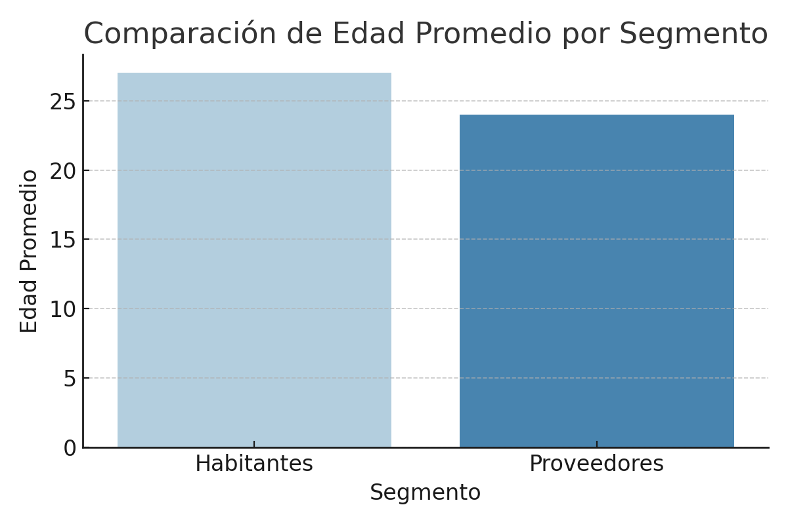

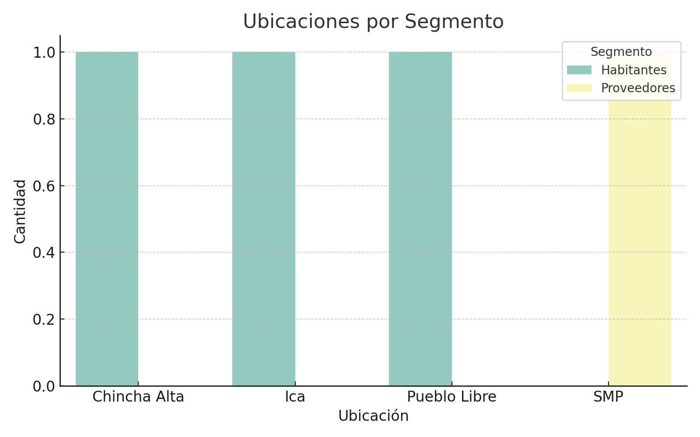

Los gráficos presentan datos relevantes sobre segmentos demográficos y su distribución geográfica. En la Comparación de Edad Promedio por Segmento, se observa que la edad promedio varía significativamente entre los segmentos analizados (habitantes y proveedores), con un rango de 0 a 25 años. Esto sugiere diferencias generacionales marcadas, donde un grupo podría ser notablemente más joven que el otro, lo que podría influir en patrones de consumo, necesidades de servicios o dinámicas laborales. Sin embargo, la falta de valores exactos limita una interpretación más precisa.

Por otro lado, el gráfico Ubicaciones por Segmento revela la distribución geográfica de habitantes y proveedores en localidades como Chincha Alta, Ica, Pueblo Libre y SMP. Las cantidades, representadas en una escala de 0.0 a 0.8, indican variaciones en la concentración de estos segmentos según la zona.

## 2.3. Needfinding

Para crear una solución que responda a las necesidades específicas de los usuarios, realizaremos la identificación del User persona, User Task Matrix, User Journey Maps, Empathy Mapping y As-is Scenario Mapping.

### 2.3.1. User Personas

Se han elaborado los User Persona correspondientes a cada uno de nuestros segmentos objetivos. Estos segmentos incluyen, por un lado, a los pobladores de zonas urbanas y rurales que enfrentan dificultades para acceder y gestionar un suministro de agua potable; y por otro lado, a los proveedores de agua. La construcción de estos perfiles se ha basado en los datos obtenidos a partir de las entrevistas realizadas. 

Los user persona nos permiten entender el perfil y comportamiento de cada segmento, ayudando a identificar sus necesidades técnicas y objetivos de forma general.

### Segmento 1: Habitantes

Presentamos a Mario López, un joven que reside en una zona urbana y enfrenta serias dificultades con el abastecimiento de agua. Este user persona representa a otro de nuestros segmentos objetivos, y fue creado a partir del análisis de problemáticas reales identificadas durante el proceso de entrevistas.

**Enlace para visualizar el User Persona de Habitantes realizado en UXPressia:**
[https://uxpressia.com/w/mDdvz/p/mIlB8](https://uxpressia.com/w/mDdvz/p/mIlB8)

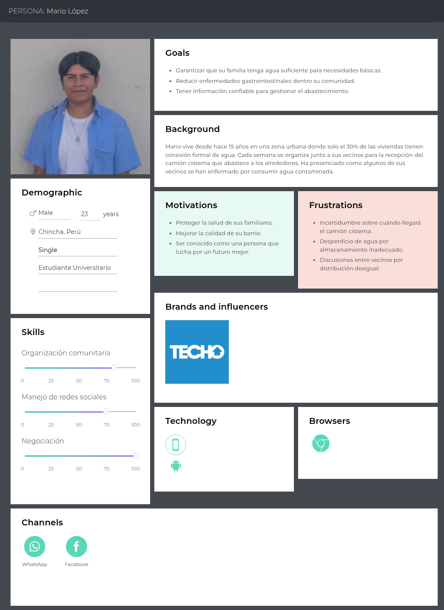

### Segmento 2: Proveedores

Presentamos a Gabriel Gonzales, un user persona construido a partir de la información recopilada durante las entrevistas. Gracias a este proceso, fue posible identificar sus habilidades, motivaciones, frustraciones, canales de comunicación, permitiendo así una comprensión más profunda del perfil correspondiente a uno de nuestros segmentos objetivos.

**Enlace para visualizar el User Persona de Proveedores realizado en UXPressia:** [https://uxpressia.com/w/mDdvz/p/SLYog](https://uxpressia.com/w/mDdvz/p/SLYog)

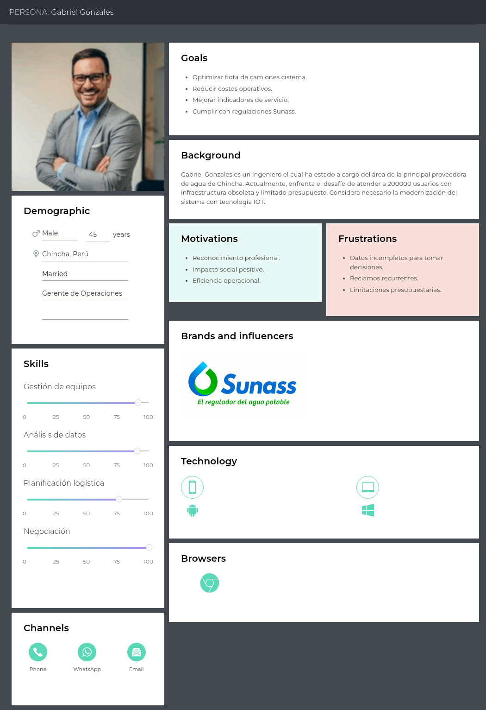


### 2.3.2. User Task Matrix
El user task matrix permite identificar y comparar los procesos clave de cada segmento, destacando sus similitudes en cuanto a frecuencia e importancia.

| **Necesidad / Función**                                | **Importancia (Habitantes)** | **Frecuencia (Habitantes)** | **Importancia (Proveedores de Agua)** | **Frecuencia (Proveedores de Agua)** |
|--------------------------------------------------------|------------------------------|-----------------------------|----------------------------------------|---------------------------------------|
| Ver estado actual del nivel y calidad del agua         | Alta                         | Media                       | Alta                                   | Alta                                  |
| Recibir alertas por bajo nivel o agua no apta          | Alta                         | Alta                        | Alta                                   | Alta                                  |
| Consultar historial de consumo y calidad               | Media                        | Baja                        | Alta                                   | Alta                                  |
| Configurar o gestionar múltiples sensores IoT          | Baja                         | Baja                        | Alta                                   | Alta                                  |
| Medir impacto en distribución y eficiencia del reparto | Baja                         | Nula                        | Alta                                   | Alta                                  |
| Compartir información o generar reportes               | Media                        | Baja                        | Alta                                   | Media                                 |
| Acceder a la plataforma desde app móvil o web          | Alta                         | Alta                        | Media                                  | Media                                 |


En la matriz presentada, se pueden observar las siguientes tareas con mayor frecuencia e importancia:

- **Habitantes**:

  - **Recibir alertas por bajo nivel o agua no apta**  
    Funcionalidad **más crítica**, con **alta importancia y frecuencia**. Necesitan estar informados para actuar ante situaciones de riesgo.

  - **Ver el estado actual del agua** y **acceder a la plataforma móvil/web**  
    Funcionalidades altamente valoradas. Aunque el monitoreo no es constante, desean tener la información disponible de forma accesible.

  - **Consultar historial**, **generar reportes** o **gestionar sensores**  
    Tienen **baja o media relevancia y baja frecuencia**. No forman parte de su rutina diaria, por lo que pueden ofrecerse como funciones secundarias u opcionales.


- **Proveedores de Agua**:

  - **Ver estado actual del nivel y calidad del agua** y **recibir alertas por bajo nivel o agua no apta**  
    Tareas **críticas y frecuentes**, esenciales para el monitoreo constante y la respuesta inmediata ante situaciones de riesgo o emergencia.

  - **Consultar historial de consumo y calidad** y **gestionar múltiples sensores IoT**  
    Funcionalidades con **alta importancia y frecuencia**, necesarias para la supervisión técnica, análisis de patrones y mantenimiento del sistema.

  - **Medir impacto en la distribución y eficiencia del reparto** y **generar reportes**  
    Actividades de **alta importancia**, aunque de **frecuencia moderada**, ya que están orientadas a la planificación estratégica y cumplimiento de normativas.

  - **Acceder a la plataforma desde app móvil o web**  
    Tiene una **importancia y frecuencia media**, ya que suelen utilizar herramientas más especializadas o integradas en sus sistemas operativos diarios.


### 2.3.3. User Journey Mapping
El User Journey Mapping se desarrolló para comprender la experiencia de los usuarios al interactuar con nuestra plataforma. Este mapeo detalla cada paso que el usuario realiza, los obstáculos que puede encontrar, y las emociones que surgen en el proceso. Así, nos ayuda a identificar oportunidades para mejorar la usabilidad y satisfacción del usuario.

### Segmento 1: Habitantes

En este User Journey Map se muestra la experiencia actual del habitante responsable de gestionar el agua en su hogar. El proceso incluye la detección manual del nivel de agua, la solicitud de abastecimiento, la recepción y el almacenamiento. Identificamos problemas como la falta de precisión, comunicación ineficiente y riesgos de contaminación, lo que genera frustración e incertidumbre en el usuario.

**Enlace para visualizar el User Journey Map de Habitantes realizado en UXPressia:** [https://uxpressia.com/w/mDdvz/m/Q2oFD](https://uxpressia.com/w/mDdvz/m/Q2oFD)

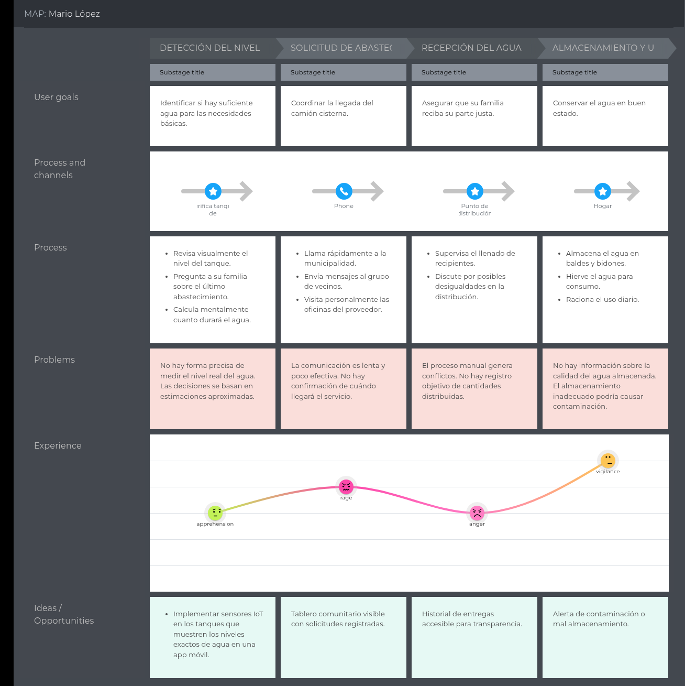


### Segmento 2: Proveedores

En este User Journey Map decribimos el recorrido actual del proveedor responsable de coordinar y supervisar la distribución de agua. Desde la planificación de rutas hasta la presentación de informes a las autoridades, el proveedor enfrenta limitaciones como la falta de información en tiempo real, baja eficiencia en la comunicación y poca visibilidad operativa. Estas dificultades afectan la toma de decisiones, el seguimiento de entregas y el cumplimiento con las normas.

**Enlace para visualizar el User Journey Map de Proveedores realizado en UXPressia:** 

[https://uxpressia.com/w/mDdvz/m/wtXHH](https://uxpressia.com/w/mDdvz/m/wtXHH)


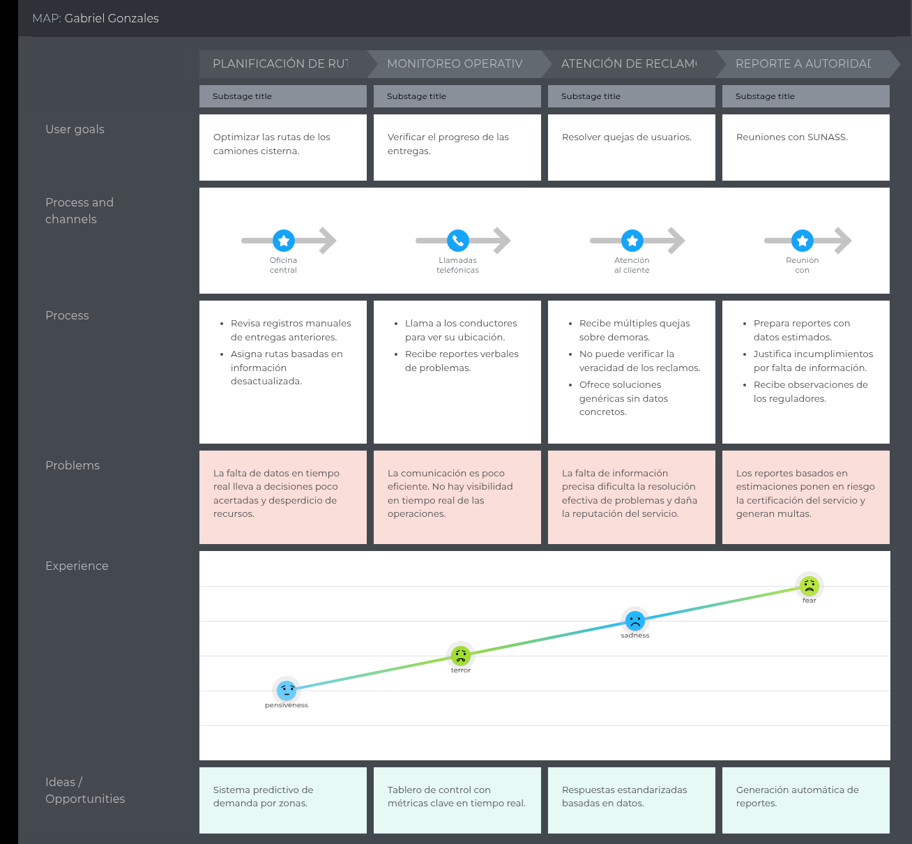

### 2.3.4. Empathy Mapping

Para la creación del Empathy Map, hemos utilizado la información obtenida de nuestros dos User Personas que representan nuestro segmento objetivo. Este mapa nos permite profundizar en la comprensión de las necesidades, pensamientos, emociones y comportamientos de los usuarios, ayudándonos a diseñar soluciones más alineadas con sus expectativas y experiencias reales.


### Segmento 1: Habitantes
En el siguiente Empathy Map tenemos a Mario Lopez, un joven que vive en una zona urbana en Chincha. Él lucha diariamente por garantizar agua segura para su familia y su comunidad. Podemos observar su experencia, la cual refleja los desafíos de miles de personas que dependen de camiones cisterna.

**Enlace para visualizar el Empathy Map de Proveedores realizado en UXPressia:**
[https://uxpressia.com/w/mDdvz/p/ZQOfG](https://uxpressia.com/w/mDdvz/p/ZQOfG) 
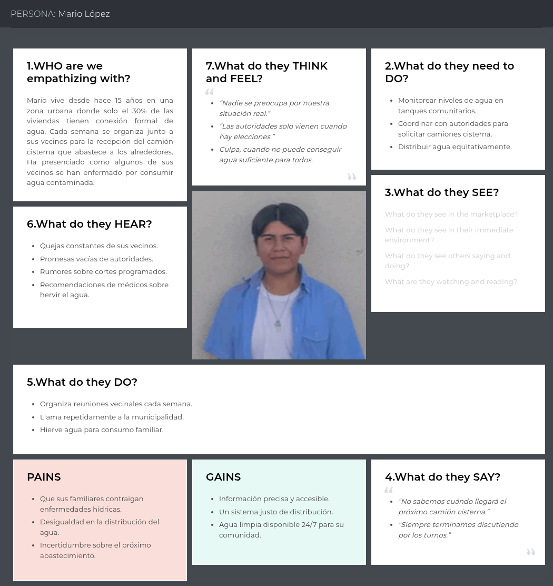

### Segmento 2: Proveedores
En el siguiente Empathy Map observamos la perspectiva de Gabriel Gonzales, encargado del
área principal de la proveedora de agua más grande Chincha. Dentro de su perfil podemos observar los desafíos sa los que se enfrenta como gestionar de recursos limitados mientrasse cumplen regulaciones estrictas y demandas de usuarios insatisfechos.

**Enlace para visualizar el Empathy Map de Proveedores realizado en UXPressia:**
[https://uxpressia.com/w/mDdvz/p/wA0jm](https://uxpressia.com/w/mDdvz/p/wA0jm) 
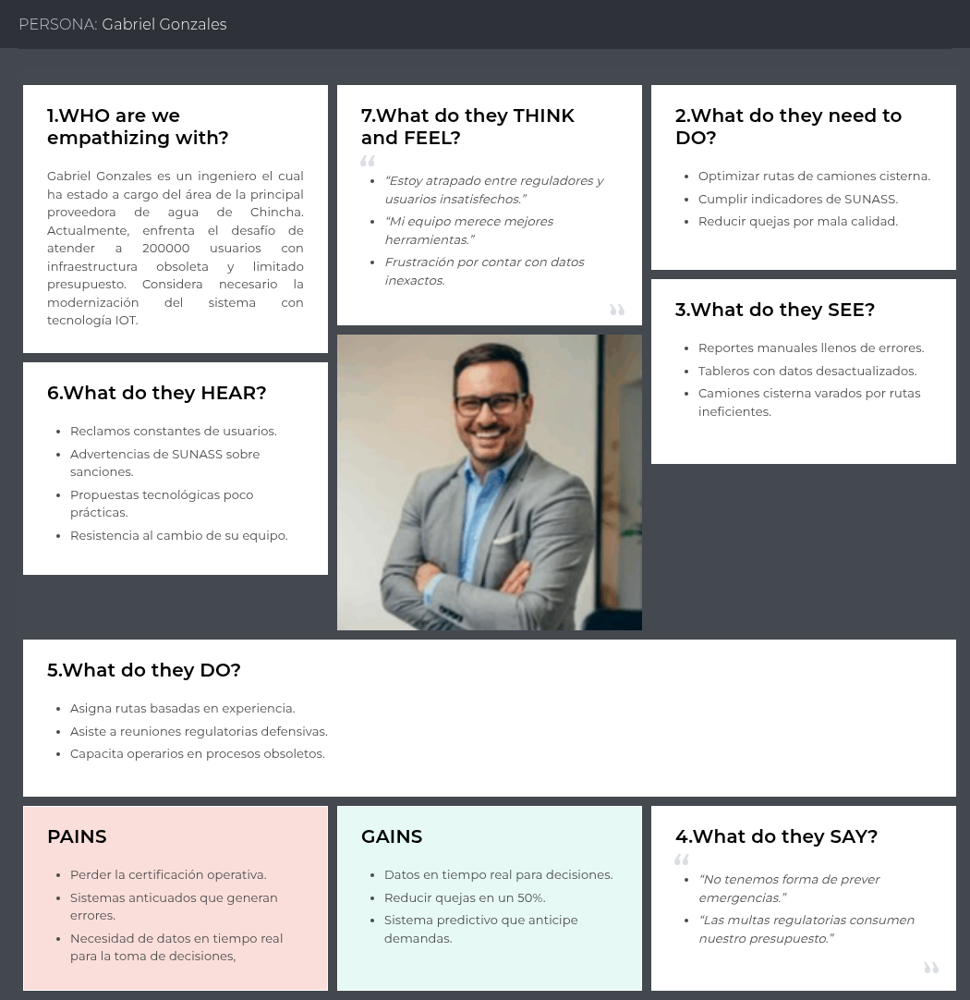

### 2.3.5. As-is Scenario Mapping


### Segmento 1: Habitantes
**Enlace para visualizar el As-is Scenario Map de Proveedores realizado en Miro:** 
[https://miro.com/app/board/uXjVMhdPpY8=/?share_link_id=712775907835](https://miro.com/app/board/uXjVMhdPpY8=/?share_link_id=712775907835)


**Brainstorming:**

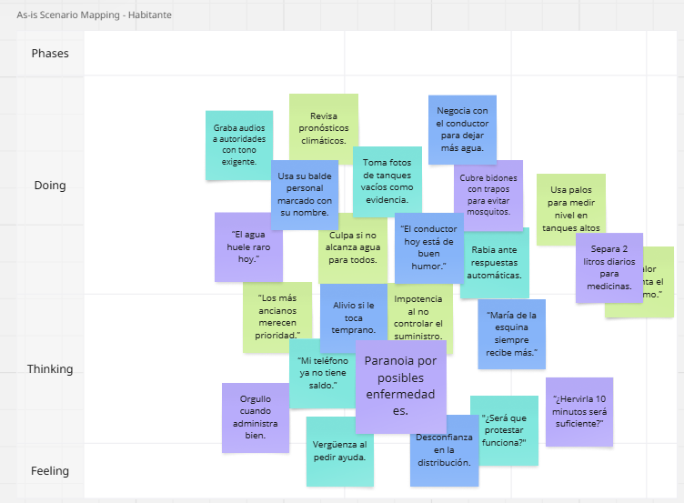

**Identify the highs and lows:**

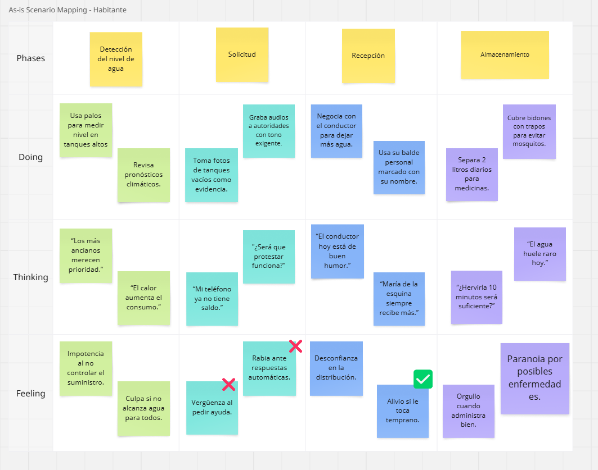

**Positive Areas:**
* Alivio si le toca temprano.

**Negative Areas:**
* Rabia ante respuestas automáticas.
* Vergüenza al pedir ayuda.

**Blank Areas:**
* Podría ser útil explorar cómo es el flujo de la comunicación al solicitar agua.

### Segmento 2: Proveedores
**Enlace para visualizar el As-is Scenario Map de Proveedores realizado en Miro:** 
[https://miro.com/app/board/uXjVMhdPpY8=/?share_link_id=712775907835](https://miro.com/app/board/uXjVMhdPpY8=/?share_link_id=712775907835)


**Brainstorming:**

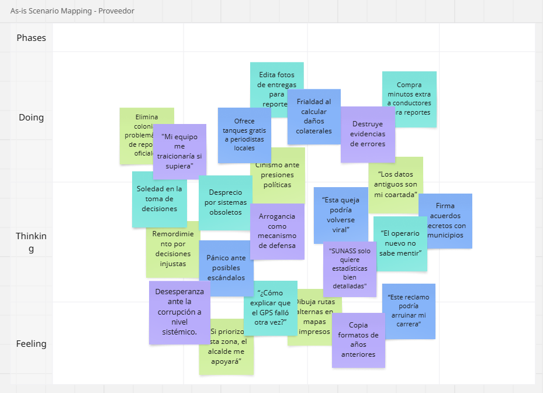


**Identify the highs and lows:**


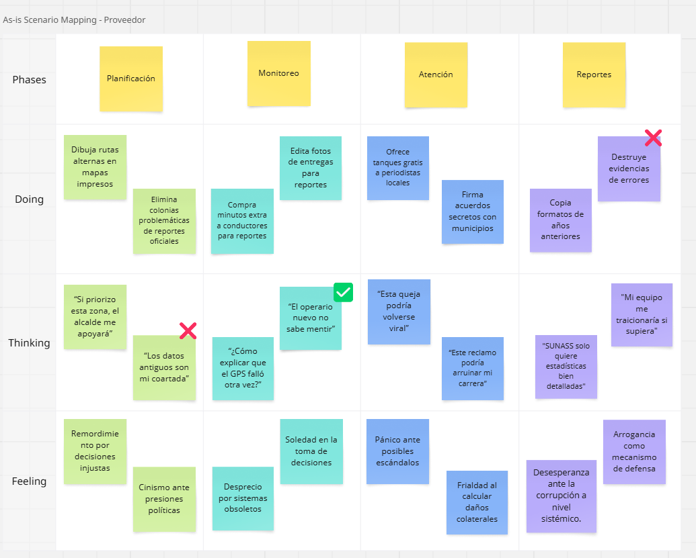

**Positive Areas:**
* ***“El operario nuevo no sabe mentir”*** (esto nos indica tranparecia en su trabajo).

**Negative Areas:**
* Destruye evidencias de errores.
* ***“Los datos antiguos son mi coartada”***

**Blank Areas:**
* Profundizar en la carga emocional que conlleva manipular reportes.


## 2.4. Ubiquitous Languange
| **Term**                             | **Definition** |
|--------------------------------------|----------------|
| **Resident**                       | End user who consumes water at home and uses the platform to stay informed about service quality, water level, and alerts. |
| **Provider**                   | Entity responsible for monitoring, managing, and distributing water in a community or locality. |
| **IoT Sensor**                       | Device installed at strategic points that measures parameters such as water level, quality, or pressure in real time. |
| **Water Quality**                    | Value indicating whether the water is safe for consumption, based on chemical, physical, and biological parameters. |
| **Water Level**                      | Height of stored or distributed water, measured by sensors to anticipate shortages or overflows. |
| **Alert**                            | Automatic notification sent to users when a low level or unsafe water is detected. |
| **Consumption and Quality History**  | Record of water levels and quality over time, useful for analysis and monitoring. |
| **Report**                           | Automatically generated document with historical data, alerts, consumption, and water conditions. |
| **Dashboard**                        | Customized view (for inhabitants or providers) displaying relevant data, graphs, and alerts. |
| **Water Distribution**               | Logistical and technical process through which water is delivered from its source to households. |
| **Distribution Impact**             | Measurement of how system conditions (leaks, pressure, high consumption) affect distribution efficiency. |
| **Web Platform/Mobile App**          | Digital interface accessible via computer or smartphone where users view and manage water service information. |
| **Sensor Management**                | Functionality that allows providers to configure, monitor, or troubleshoot installed IoT sensors. |
| **Real-Time Visualization**          | Dynamic and continuous display of current data about the water system. |
| **Registered Users**                 | People with authenticated access to the platform, either inhabitants or providers, with differentiated functionalities. |
| **Coverage Area**                    | Geographic area where AquaConecta provides services and where sensors are located. |


# Capítulo III: Introducción

## 3.1. To-Be Scenario Mapping

En esta sección se describe cómo serían los escenarios ideales (To-Be) una vez implementada la solución propuesta por nuestro equipo. A partir de los mismos escenarios utilizados en el análisis As-Is, se plantea una visión futura optimizada, en la que los problemas identificados han sido resueltos o mitigados gracias a nuestra intervención.

Cada mapeo To-Be representa la experiencia del usuario mejorada, los escenarios están divididos por segmentos para mantener un enfoque claro y específico.

### Segmento 1: Habitantes 

Enlace para visualizar el As-is Scenario Map de Habitantes realizado en Miro: https://miro.com/app/board/uXjVIBKpWJQ=/?share_link_id=18556028670 

### Brainstorming:

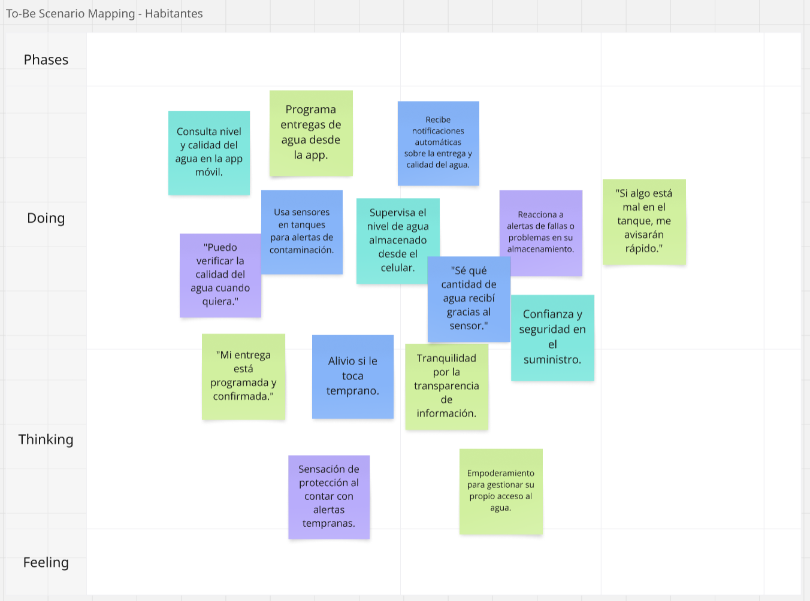

### To-Be Scenario Mapping 

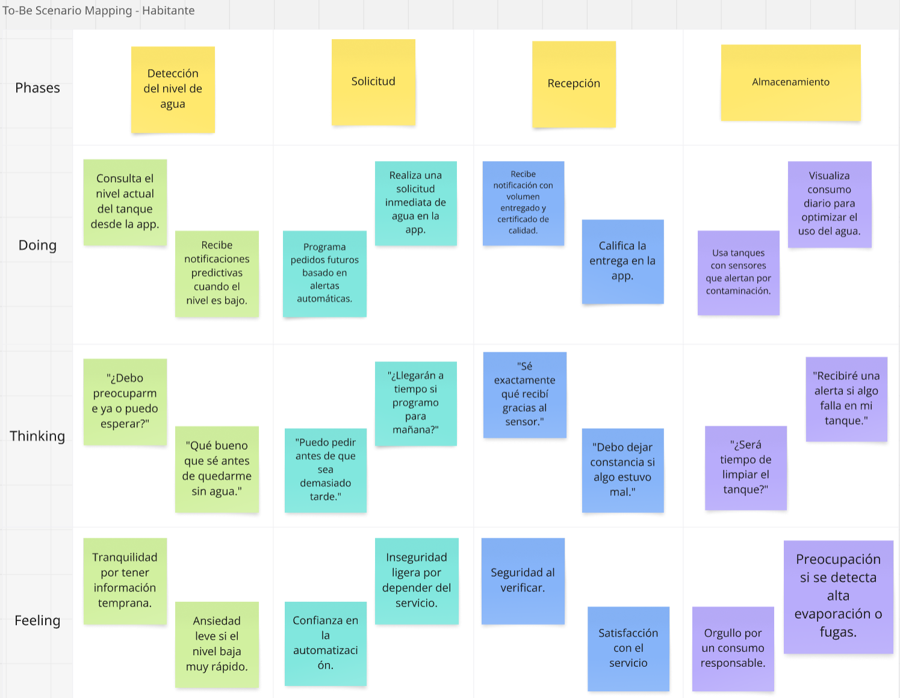

### Segmento 2: Proveedores

Enlace para visualizar el As-is Scenario Map de Proveedores realizado en Miro: https://miro.com/app/board/uXjVIBKpWJQ=/?share_link_id=18556028670

### Brainstorming:

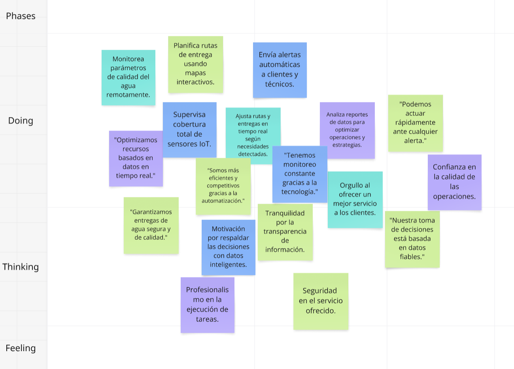

### To-Be Scenario Mapping 

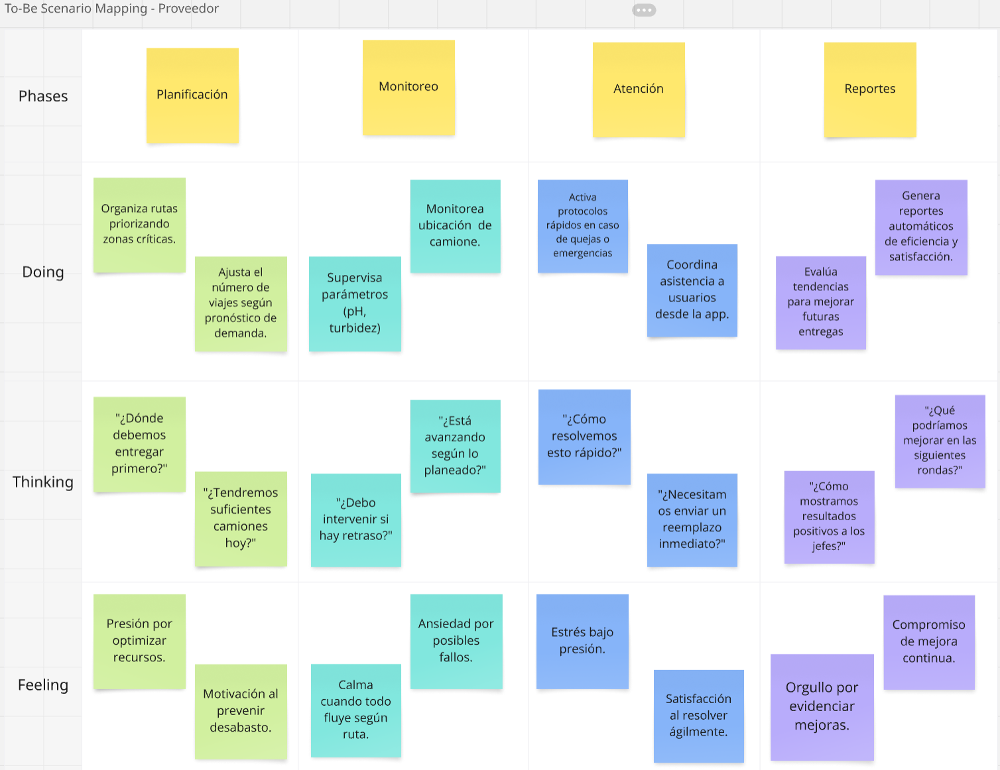

## 3.2. User Stories

El apartado de User Stories permite identificar las diversas situaciones que experimenta el usuario al interactuar con las diferentes áreas del proyecto, desde la página de inicio de sesión hasta las funcionalidades técnicas implementadas por el equipo de desarrollo. Su relevancia radica en que facilita la creación de un product backlog y, mediante los criterios de aceptación, podemos comprobar si estas historias se han cumplido correctamente.


**Epics y User Stories de AquaConecta**

|**Epic / Story ID**|**Título**|**Descripción**|**Criterios de Aceptación**|**Relacionado con (Epic ID)**|
| - | - | - | - | - |
|**EP01**|**Monitoreo del Agua en Tiempo Real**|**Como** usuario, <br>**Quiero** visualizar en tiempo real el estado del agua (nivel y calidad) y acceder a su historial <br>**Para** tomar decisiones informadas sobre la gestión y consumo.|<p>**Escenario 1: El sistema debe mostrar datos actualizados cada minuto.**<br>**Dado** que el usuario accede al panel de monitoreo<br>**Cuando** transcurre un minuto desde la última actualización<br>**Entonces** visualiza los datos de nivel y calidad del agua actualizados automáticamente.</p><p>**Escenario 2: Visualización clara de datos actuales e históricos.**<br>**Dado** que el usuario visualiza el estado del agua<br>**Cuando** consulta los datos actuales o selecciona un rango de fechas<br>**Entonces** visualiza la información en formato comprensible y organizado para facilitar su análisis.</p><p>**Escenario 3: Gráficos e indicadores disponibles.**<br>**Dado** que el usuario accede a la sección de monitoreo o historial<br>**Cuando** selecciona una opción como nivel o calidad del agua<br>**Entonces** visualiza gráficos e indicadores que reflejan los datos en tiempo real o por periodo.</p>||
|**HU01**|Ver nivel actual del agua|**Como** usuario,<br>**Quiero** visualizar el nivel actual del agua <br>**Para** conocer su disponibilidad.|**Escenario 1: Mostrar nivel de agua al acceder al panel<br>Dado** que el usuario accede al panel principal <br>**Cuando** se cargan los datos del nivel <br>**Entonces** observa el valor actualizado.|**EP01**|
|**HU02**|Ver calidad del agua|**Como** usuario, <br>**Quiero** consultar la calidad actual del agua <br>**Para** determinar si es apta para consumo.|**Escenario 1: Mostrar calidad del agua según indicadores<br>Dado** que el usuario visualiza los indicadores<br>**Cuando** revisa el parámetro de calidad del agua<br>**Entonces** visualiza si es apta o no.|**EP01**|
|**HU03**|Actualización automática|**Como** usuario,<br>**Quiero** que los datos del agua se actualicen automáticamente<br>**Para** visualizarlos sin la necesidad de recargar la página.|**Escenario 1: Actualización automática de datos cada minuto<br>Dado** que el usuario está en el panel<br>**Cuando** espera un minuto   **Entonces** observa que los datos se actualizan automáticamente.|**EP01**|
|**HU04**|Consultar historial|**Como** usuario,<br>**Quiero** consultar el historial de datos por fechas<br>**Para** analizar el comportamiento del agua en distintos periodos.|**Escenario 1: Consultar historial de datos<br>Dado** que el usuario elige un rango de fechas<br>**Cuando** da clic en consultar<br>**Entonces** visualiza los datos históricos y gráficos.|**EP01**|
|**HU05**|Exportar historial|**Como** usuario, <br>**Quiero** descargar los datos históricos en Excel o CSV **Para** analizar los datos dados.|**Escenario 1: Exportar historial en archivo descargable<br>Dado** que el usuario selecciona un rango<br>**Cuando** hace clic en exportar<br>**Entonces** puede descargar el archivo con los datos.|**EP01**|
|**EP02**|**Alertas y Notificaciones Inteligentes**|**Como** usuario,<br>**Quiero** recibir alertas cuando el agua esté en niveles críticos o no sea apta para consumo<br>**Para** responder oportunamente ante situaciones que afecten el servicio.|<p>**Escenario 1:** Alertas configurables y en tiempo real.<br>**Dado** que el usuario ha configurado el tipo de alertas que desea recibir<br>**Cuando** se detecta una condición crítica según los parámetros definidos<br>**Entonces** el sistema genera y envía la alerta correspondiente de forma inmediata.</p><p>**Escenario 2:** Envío por push, SMS o correo.<br>**Dado** que el usuario ha seleccionado su medio de notificación preferido<br>**Cuando** se activa una alerta por un evento crítico<br>**Entonces** el sistema envía la notificación al canal configurado.</p><p>**Escenario 3:** Visualización personalizada según usuario.<br>**Dado** que el usuario accede al módulo de alertas<br>**Cuando** se muestran las notificaciones recientes<br>**Entonces** el sistema presenta únicamente las alertas asociadas a su zona o sensores configurados</p>||
|**HU06**|Configurar tipo de alertas|**Como** usuario, <br>**Quiero** configurar qué tipo de alertas desea recibir<br>**Para** estar adecuadamente informado.|**Escenario 1: Configurar tipos de alerta preferidos<br>Dado** que el usuario ingresa a preferencias<br>**Cuando** selecciona tipos de alerta<br>**Entonces** el sistema guarda la configuración.|**EP02**|
|**HU07**|Elegir medio de notificación|**Como** usuario, <br>**Quiero** elegir si deseo recibir alertas por correo, SMS o push<br>**Para** estar informado.|**Escenario 1: Guardar medio de notificación preferido<br>Dado** que el usuario selecciona un canal<br>**Cuando** lo guarda<br>**Entonces** va a recibir alertas por ese medio.|**EP02**|
|**HU08**|Recibir alerta por nivel bajo|**Como** usuario, <br>**Quiero** recibir alertas si el nivel de agua es bajo<br>**Para** comunicar de manera anticipada la necesidad de agua.|**Escenario 1: Enviar alerta cuando el nivel del agua es bajo<br>Dado** que el usuario desea saber sobre el nivel es crítico del agua<br>**Cuando** activa la condición<br>**Entonces** el sistema envía una alerta.|**EP02**|
|**HU09**|Historial de alertas|**Como** usuario, <br>**Quiero** revisar un historial de alertas<br>**Para** conocer eventos pasados y tomar decisiones informadas sobre el sistema.|**Escenario 1: Consultar historial de alertas<br>Dado** que el usuario accede al módulo de alertas<br>**Cuando** visualiza la lista<br>**Entonces** ve las alertas anteriores.|**EP02**|
|**HU10**|Desactivar alertas temporalmente|**Como** usuario, <br>**Quiero** desactivar temporalmente el envío de alertas<br>**Para** evitar interrupciones o notificaciones durante periodos de mantenimiento o baja actividad.|**Escenario 1: Desactivar temporalmente las alertas<br>Dado** que el usuario ingresa a configuración<br>**Cuando**  desactiva alertas<br>**Entonces** el sistema deja de enviarlas temporalmente.|**EP02**|
|**EP03**|**Gestión de Sensores y Sistema**|**Como** proveedor, <br>**Quiero** gestionar sensores IoT y monitorear su estado<br>**Para** supervisar su estado y garantizar una distribución eficiente del agua.|<p>**Escenario 1:** Gestión completa de sensores (alta, edición, baja).<br>**Dado** que el proveedor accede al módulo de gestión de sensores<br>**Cuando** registra, edita o desactiva un sensor directamente desde su panel<br>**Entonces**  el sistema actualiza la información en tiempo real<br>**Y** refleja los cambios en el dashboard de monitoreo.</p><p>**Escenario 2:**  Estado online/offline visible.<br>**Dado** que el proveedor visualiza el listado de sensores<br>**Cuando** el sistema carga los datos<br>**Entonces** cada sensor muestra su estado (online/offline) y la última fecha de actividad registrada.</p><p>**Escenario 3:** Indicadores de eficiencia, presión, cobertura y consumo.<br>**Dado** que el proveedor selecciona un sensor específico<br>**Cuando** consulta las métricas de rendimiento<br>**Entonces** el sistema muestra los gráficos de presión, cobertura y consumo en tiempo real.</p>||
|**HU11**|Registrar sensores|**Como** proveedor, <br>**Quiero** registrar nuevos sensores en el sistema <br>**Para** ampliar la red de monitoreo.|**Escenario 1: Registro de nuevo sensor por parte del proveedor<br>Dado** que el proveedor está autenticado<br>**Cuando**  ingresa los datos de un nuevo sensor y confirmo<br>**Entonces** el sistema lo registra correctamente|**EP03**|
|**HU12**|Solicitar edición de sensor|**Como** proveedor,<br>**Quiero** modificar la configuración de sensores existentes<br>**Para** adaptar los parámetros a nuevas condiciones operativas.|**Escenario 1: Solicitar edición de sensor<br>Dado que** el proveedor selecciona un sensor que requiere ajustes<br>**Cuando** actualiza sus parámetros y guardo<br>**Entonces** el sistema aplica los cambios.|**EP03**|
|**HU13**|Solicitar desactivación de sensor|**Como** proveedor,<br>**Quiero** desactivar temporalmente sensores fuera de servicio<br>**Para** evitar lecturas incorrectas.|**Escenario 1: Desactivación de sensor<br>Dado que** el proveedor observa que el sensor está activo y fuera de funcionamiento<br>**Cuando** lo marca como desactivado<br>**Entonces** el sistema deja de mostrar sus datos.|**EP03**|
|**HU14**|Ver estado de sensores|**Como** proveedor, <br>**Quiero** visualizar el estado online/offline de todos los sensores<br>**Para** monitorear la conectividad en tiempo real y detectar posibles fallos en la red.|**Escenario 1: Visualizar estado de los sensores<br>Dado** que el proveedor accede al panel<br>**Cuando**  revisa el listado<br>**Entonces** cada sensor indica su estado en tiempo real.|**EP03**|
|**HU15**|Visualizar métricas por sensor|**Como** proveedor, <br>**Quiero** acceder a indicadores clave (presión, cobertura, consumo)<br>**Para** evaluar el rendimiento del sistema.|**Escenario 1: Visualización de métricas de sensor seleccionado<br>Dado** que el proveedor selecciona un sensor<br>**Cuando**  consulta sus datos<br>**Entonces** ve los gráficos e indicadores actualizados|**EP03**|
|**EP04**|**Reportes y Compartición de Datos**|**Como** usuario, <br>**Quiero** generar y exportar reportes sobre el servicio de agua<br>**Para** compartir información útil con autoridades o la comunidad.|<p>**Escenario 1:** Reportes exportables en PDF y Excel.<br>**Dado** que el usuario accede al módulo de reportes<br>**Cuando** selecciona un rango de fechas y elige el formato de exportación<br>**Entonces** el sistema genera el reporte y permite su descarga en formato PDF o Excel</p><p>**Escenario 2:** Estadísticas clave por período seleccionable.<br>**Dado** que el usuario ha definido un período de análisis<br>**Cuando** solicita el reporte del servicio<br>**Entonces** el sistema incluye en el reporte estadísticas como máximos, mínimos y promedios relacionados con el consumo y calidad del agua.</p>||
|**HU16**|Generar reporte en PDF|**Como** proveedor, <br>**Quiero** generar un reporte PDF con datos clave<br>**Para** compartir información consolidada y respaldar decisiones operativas.|**Escenario 1: Generación de reporte en PDF<br>Dado** que el proveedor selecciona un rango de fechas<br>**Cuando**  genera el reporte<br>**Entonces** puede descargar el archivo PDF.|**EP04**|
|**HU17**|Exportar a Excel|**Como** proveedor, <br>**Quiero** exportar los datos a un archivo Excel<br>**Para** analizarlos y manipularlos fácilmente en herramientas externas.|**Escenario 1: Exportación de datos en formato Excel<br>Dado** que el proveedor accede al módulo de reportes<br>**Cuando**  elige exportar<br>**Entonces** se descarga un archivo Excel.|**EP04**|
|**HU18**|Incluir estadísticas clave|**Como** proveedor, <br>**Quiero** visualizar estadísticas clave del período seleccionado <br>**Para** analizar el comportamiento del sistema y tomar decisiones basadas en datos históricos.|**Escenario 1: Inclusión de estadísticas clave en el reporte<br>Dado** que el proveedor genera un reporte<br>**Cuando** se calcula el resumen<br>**Entonces** el reporte incluye máximos, mínimos y promedios|**EP04**|
|**EP05**|**Acceso, Seguridad y Multiplataforma**|**Como** usuario, <br>**Quiero** acceder desde cualquier dispositivo y gestionar roles dentro de la plataforma <br>**Para** garantizar seguridad y usabilidad.|<p>**Escenario 1:** Plataforma responsiva y disponible en móvil y web.<br>**Dado** que el usuario accede a la plataforma desde un dispositivo móvil o de escritorio<br>**Cuando** inicia sesión o navega por los módulos principales<br>**Entonces** el sistema ajusta su visualización para garantizar una experiencia adecuada al dispositivo usado.</p><p>**Escenario 2:** Roles diferenciados (habitante, proveedor, admin).<br>**Dado** que el usuario ha sido autenticado<br>**Cuando** accede a la plataforma<br>**Entonces** el sistema permite o restringe el acceso a funcionalidades según el rol asignado</p><p>**Escenario 3:** Dashboard personalizado.<br>**Dado** que el usuario ha iniciado sesión<br>**Cuando** accede al panel principal<br>**Entonces** el sistema presenta un dashboard con información y funcionalidades adaptadas a su rol.</p>||
|**HU19**|Acceso desde dispositivo móvil|**Como** usuario, <br>**Quiero** acceder a la plataforma desde su celular<br>**Para** monitorear y gestionar información de forma práctica y en cualquier momento.|**Escenario 1: Acceso y navegación desde dispositivo móvil<br>Dado** que el usuario usa un navegador móvil<br>**Cuando**  accede a la plataforma<br>**Entonces** puede navegar y ver los datos correctamente.|**EP05**|
|**HU20**|Dashboard personalizado|**Como** usuario, <br>**Quiero** ver un dashboard adaptado a su rol<br>**Para** acceder rápidamente a la información que necesito según mis responsabilidades.|**Escenario 1: Carga de dashboard personalizado según rol<br>Dado** que el usuario inicia sesión<br>**Cuando**  ingresa al sistema<br>**Entonces** visualiza un panel específico con información relevante.|**EP05**|
|**EP06**|**Infraestructura y servicio Backend**|**Como** desarrollador,<br>**Quiero** desarrollar y mantener servicios backend seguros <br>**Para** garantizar la integración con sensores IoT y la gestión eficiente de datos en tiempo real.|<p>**Escenario 1 : Recepción exitosa de datos desde un sensor<br>Dado** que un sensor IoT está configurado para enviar datos al endpoint /api/sensores/data<br>**Cuando** envía datos en formato JSON con valores válidos de nivel, calidad, presión y consumo<br>**Entonces** el sistema registra la información correctamente en la base de datos<br>**Y** responde con un estado HTTP 200.**<br></p><p>**Escenario 2: Recepción exitosa de datos desde un sensor<br>Dado** que un sensor IoT está configurado para enviar datos al endpoint /api/sensores/data<br>**Cuando** envía datos en formato JSON con valores válidos de nivel, calidad, presión y consumo<br>**Entonces** el sistema registra la información correctamente en la base de datos<br>**Y** responde con un estado HTTP 200.</p><p>**Escenario 3: Exportación de datos históricos mediante la API<br>Dado** que un usuario autenticado accede al endpoint /api/reportes/historial<br>**Y** envía un rango de fechas válido<br>**Cuando** el sistema procesa la solicitud<br>**Entonces** retorna un archivo con los datos en el formato especificado (JSON, CSV o PDF).</p><p>**Escenario 4: Generación automática de alerta por condición crítica<br>Dado** que el sistema monitorea los datos en tiempo real<br>**Cuando** un sensor reporta que el nivel de agua es inferior al umbral definido<br>**Entonces** el sistema genera una alerta<br>**Y** envía la notificación al usuario por el canal configurado.</p><p>**Escenario 5: Registro de acceso a endpoints protegidos<br>Dado** que un usuario autenticado realiza una solicitud a un endpoint seguro<br>**Cuando** el sistema valida el token y permite la operación<br>**Entonces** registra en el log la IP, ID del usuario, hora y tipo de operación.</p><p>**Escenario 6: Restricción de acceso a endpoints protegidos<br>Dado** que un usuario no autenticado intenta acceder al endpoint /api/sensores/data<br>**Cuando** realiza una solicitud sin token o con token inválido<br>**Entonces** el sistema responde con un estado HTTP 401.</p>||
|**HT01**|API para recepción de datos de sensores|**Como** desarrollador, <br>**Quiero** implementar un endpoint REST que reciba datos de sensores IoT<br>**Para** asegurar la integración y el flujo continuo de información hacia el sistema.|**Escenario 1: Recepción de datos desde sensores<br>Dado** que el sensor envía datos al endpoint configurado<br>**Cuando** los datos llegan en formato JSON válido<br>**Entonces** el sistema almacena los datos en la base de datos y responde con un código 200.|**EP06**|
|**HT02**|Servicio de actualización automática de datos|**Como** desarrollador**, <br>Quiero** desarrollar un servicio que procese y actualice datos de sensores cada minuto<br>**Para** mantener el monitoreo en tiempo real sin intervención del usuario.|**Escenario 1: Actualización automática cada minuto<br>Dado** que el servicio está activo<br>**Cuando** se cumple el intervalo de un minuto<br>**Entonces** el sistema actualiza los datos visibles en el frontend con los últimos valores reportados por los sensores.|**EP06**|
|**HT03**|Endpoint para reportes históricos|**Como** desarrollador,<br>**Quiero** exponer un endpoint que permita consultar y exportar datos históricos<br>**Para** que los usuarios puedan generar reportes por fechas desde la plataforma.|**Escenario 1: Exportación de datos históricos vía API<br>Dado** que el usuario autenticado realiza una solicitud al endpoint con un rango de fechas<br>**Cuando** el sistema valida los parámetros<br>**Entonces** devuelve los datos históricos correspondientes en formato JSON, CSV o PDF según lo solicitado.|**EP06**|
|**HT04**|Servicio de alertas automáticas|**Como** desarrollador,<br>**Quiero** implementar un servicio que detecte condiciones críticas y dispare alertas automáticas<br>**Para** que el sistema notifique al usuario en tiempo real.|**Escenario 1: Generación automática de alertas<br>Dado** que el sistema monitorea en segundo plano los valores de sensores<br>**Cuando** detecta que el valor supera un umbral crítico<br>**Entonces** se genera una alerta y se envía al usuario por el canal configurado.|**EP06**|
|**HT05**|Registro y auditoría de accesos API|**Como** desarrollador,<br>**Quiero** registrar todas las solicitudes a los endpoints protegidos<br>**Para** mantener un control y detectar posibles accesos indebidos.|**Escenario 1: Registro de accesos a la API<br>Dado** que un usuario autenticado realiza una solicitud a un endpoint protegido<br>**Cuando** el sistema procesa la solicitud<br>**Entonces** guarda en los registros la hora, IP, usuario y tipo de operación realizada.|**EP06**|
|**EP07**|Landing Page informativa y funcional|<p>**Como** usuario interesado en soluciones de acceso a agua,</p><p>**Quiero** navegar por una página clara, informativa y responsiva,                  **Para** comprender los beneficios de Aqua Conecta, explorar planes y contactar al equipo fácilmente.</p>|<p>` `**Escenario 1: Visualización de beneficios principales Dado** que un visitante accede a la landing page desde cualquier dispositivo,                               **Cuando** navega hacia la sección “¿Por qué elegir Aqua Conecta?”,                    **Entonces** puede visualizar de forma clara los beneficios como monitoreo en tiempo real, alertas, rutas e inventario.</p><p>**Escenario 2: Comprensión de públicos objetivos**</p><p>**Dado** que un visitante desea saber a quién está dirigida la solución,<br>` `**Cuando** accede a la sección “A quiénes queremos ayudar”,<br>` `**Entonces** puede leer y diferenciar los beneficios tanto para usuarios como para proveedores de agua.</p><p>**Escenario 3: Explicación clara del problema y solución**</p><p>**Dado** que un visitante necesita entender el contexto de la crisis de agua,<br>` `**Cuando** llega a la sección “La problemática del agua”,<br>` `**Entonces** puede comparar fácilmente el “desafío actual” con “nuestra solución”.</p><p>**Escenario 4: Visualización de planes y precios**</p><p>**Dado** que un visitante desea conocer los servicios disponibles,<br>` `**Cuando** navega a la sección “Nuestros Servicios”**,<br>` `Entonces** puede ver los planes disponibles, su precio y características, con opción para solicitar o agendar.</p><p>**Escenario 5: Contacto mediante formulario**</p><p>**Dado** que un visitante tiene preguntas o desea más información,<br>` `**Cuando** completa el formulario en la sección “Contacta con nosotros”,<br>**Entonces** puede enviar su consulta correctamente y visualizar los datos de contacto de la empresa.</p><p></p>||
|**HU21**|Presentación clara de beneficios de valor|<p>**Como** visitante del sitio web,</p><p>**Quiero** visualizar claramente los beneficios de la plataforma Aqua Conecta,</p><p>**Para** entender cómo puede mejorar el acceso y control del agua en mi comunidad.</p>|**Escenario 1: Visualización de beneficios principales <br>Dado** que un visitante accede a la landing page desde cualquier dispositivo,                               **Cuando** navega hacia la sección “¿Por qué elegir Aqua Conecta?”,                    **Entonces** puede visualizar de forma clara los beneficios como monitoreo en tiempo real, alertas, rutas e inventario.|**EP07**|
|**HU22**|Segmentación de perfiles de usuario|<p>**Como** usuario potencial**,**</p><p>**Quiero** identificar si la solución Aqua Conecta está dirigida a mi tipo de necesidad (usuario final o proveedor),</p><p>**Para** saber si puedo beneficiarme directamente de sus servicios.</p>|<p>**Escenario 2: Comprensión de públicos objetivos**</p><p>**Dado** que un visitante desea saber a quién está dirigida la solución,<br>**Cuando** accede a la sección “A quiénes queremos ayudar”,<br>**Entonces** puede leer y diferenciar los beneficios tanto para usuarios como para proveedores de agua.</p>|**EP07**|
|**HU23**|Comunicación del problema y la solución|<p>**Como** visitante interesado,</p><p>**Quiero** entender el contexto del problema del acceso al agua y cómo Aqua Conecta lo resuelve,</p><p>**Para** evaluar el valor real que la solución puede aportar a mi comunidad o negocio.</p>|<p>**Escenario 3: Explicación clara del problema y solución**</p><p>**Dado** que un visitante necesita entender el contexto de la crisis de agua,<br>**Cuando** llega a la sección “La problemática del agua”,<br>**Entonces** puede comparar fácilmente el “desafío actual” con “nuestra solución”.</p><p></p>|**EP07**|
|**HU24**|Comparación de planes y acciones de compra|<p>**Como** visitante interesado en adquirir un servicio,</p><p>**Quiero** revisar los planes, precios y características de AquaConecta,</p><p>**Para** decidir si deseo solicitar un plan o contactar por asesoría.</p>|<p>**Escenario 4: Visualización de planes y precios**</p><p>**Dado** que un visitante desea conocer los servicios disponibles,<br>` `**Cuando** navega a la sección “Nuestros Servicios”**,<br>` `Entonces** puede ver los planes disponibles, su precio y características, con opción para solicitar o agendar.</p>|**EP07**|
|**HU25**|` `Envío efectivo de consultas por formulario|<p>**Como** usuario con preguntas o interés en Aqua Conecta,</p><p>**Quiero** poder llenar y enviar un formulario de contacto,</p><p>**Para** recibir asistencia, cotización o más información directamente del equipo**.**</p>|<p>**Escenario 5: Contacto mediante formulario**</p><p>**Dado** que un visitante tiene preguntas o desea más información,<br>` `**Cuando** completa el formulario en la sección “Contacta con nosotros”,<br>` `**Entonces** puede enviar su consulta correctamente y visualizar los datos de contacto de la empresa.</p>|**EP07**|


## 3.3. Impact Mapping

### Segmento 1: Habitantes

Para el segmento del usuario final se elaboró un Impact Mapping con el objetivo de aumentar la participación activa en la plataforma y reducir la incertidumbre sobre la calidad del agua. Esta herramienta nos permitió identificar los comportamientos clave que se desean promover en los usuarios, como consultar el estado del agua y configurar alertas personalizadas. A partir de ello, se definieron deliverables y user stories que guían el desarrollo de funcionalidades útiles y alineadas con las necesidades reales de los habitantes.
**Enlace para visualizar el Impact Map de Habitantes realizado en UXPressia:**
[https://uxpressia.com/w/mDdvz/i/0Fem9](https://uxpressia.com/w/mDdvz/i/0Fem9)

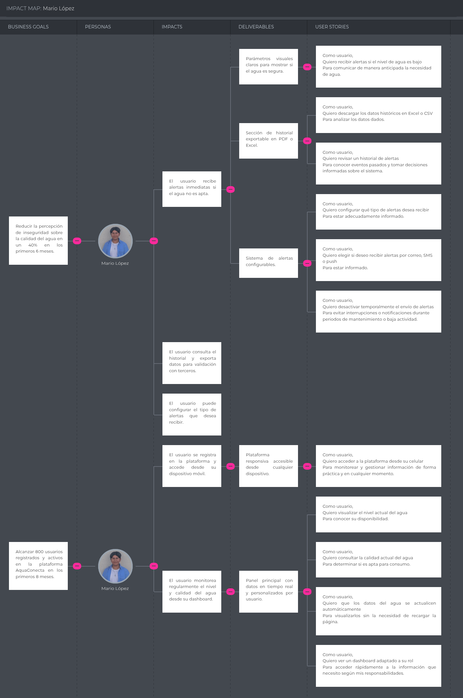


### Segmento 2: Proveedores

En el caso del proveedor, el Impact Mapping se enfocó en facilitar la gestión de sensores y la producción de reportes para la toma de decisiones. Gracias a ello se establecieron los impacts esperados, como registrar y monitorear sensores activos, así como generar estadísticas clave del sistema. Esto permitió definir deliverables específicos y user stories que aseguran un desarrollo enfocado en la eficiencia operativa y el control del servicio por parte del proveedor.
**Enlace para visualizar el Impact Map de Proveedores realizado en UXPressia:**
[https://uxpressia.com/w/mDdvz/i/Ue2yy](https://uxpressia.com/w/mDdvz/i/Ue2yy)

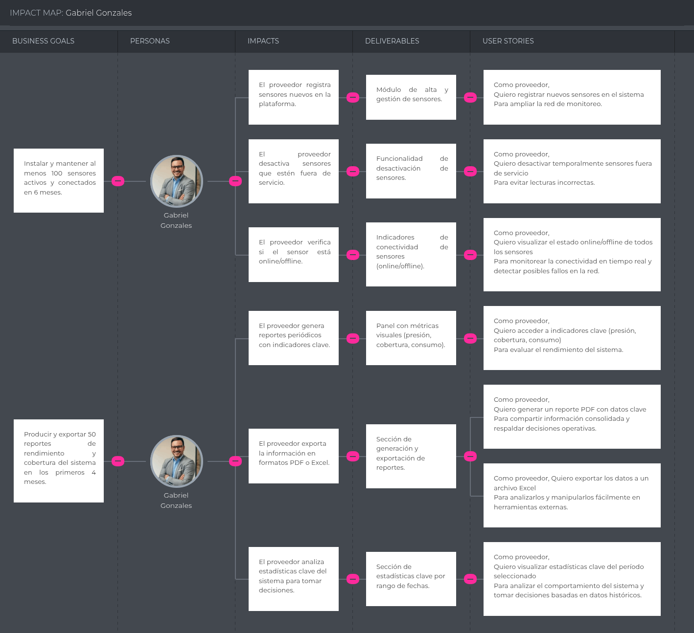


## 3.4. Product Backlog

El Product Backlog es una lista priorizada de tareas, funcionalidades y requisitos necesarios para el desarrollo del proyecto, asegurando que se trabaje en los elementos más importantes y alineados con los objetivos del proyecto. Cada ítem del backlog incluye una descripción, prioridad y título.

Trello: https://trello.com/invite/b/681ce595232e3fbaeaa4c343/ATTI7255de783994d6b57c2bf31dfa3af03aE721DBE0/aquaconecta-product-backlog

<table>
  <thead>
    <tr>
      <th>Orden</th>
      <th>User Story Id</th>
      <th>Título</th>
      <th>Descripción</th>
      <th>Story Points</th>
    </tr>
  </thead>
  <tbody>
    <tr>
      <td>1</td>
      <td>HU19</td>
      <td>Acceso desde dispositivo móvil</td>
      <td>Como usuario, quiero acceder a la plataforma desde su celular para monitorear y gestionar información de forma práctica y en cualquier momento.</td>
      <td>5</td>
    </tr>
    <tr>
      <td>2</td>
      <td>HU21</td>
      <td>Presentación clara de beneficios de valor</td>
      <td>Como visitante del sitio web, quiero visualizar claramente los beneficios de la plataforma Aqua Conecta, para entender cómo puede ayudarme.</td>
      <td>3</td>
    </tr>
    <tr>
      <td>3</td>
      <td>HU22</td>
      <td>Segmentación de perfiles de usuario</td>
      <td>Como usuario potencial, quiero identificar si la solución es para mí, para saber si puedo beneficiarme directamente de sus servicios.</td>
      <td>3</td>
    </tr>
    <tr>
      <td>4</td>
      <td>HU23</td>
      <td>Comunicación del problema y la solución</td>
      <td>Como visitante interesado, quiero entender el problema del acceso al agua y cómo Aqua Conecta lo resuelve, para evaluar su utilidad.</td>
      <td>2</td>
    </tr>
    <tr>
      <td>5</td>
      <td>HU24</td>
      <td>Comparación de planes y acciones de compra</td>
      <td>Como visitante interesado, quiero revisar los planes, precios y características, para decidir si solicitar un plan o contactar por asesoría.</td>
      <td>2</td>
    </tr>
    <tr>
      <td>6</td>
      <td>HU25</td>
      <td>Envío efectivo de consultas por formulario</td>
      <td>Como usuario con preguntas o interés, quiero llenar y enviar un formulario de contacto, para recibir asistencia o cotización.</td>
      <td>2</td>
    </tr>
    <tr>
      <td>7</td>
      <td>HU01</td>
      <td>Ver nivel actual</td>
      <td>Como usuario, quiero visualizar el nivel actual del agua para conocer su disponibilidad.</td>
      <td>5</td>
    </tr>
    <tr>
      <td>8</td>
      <td>HU02</td>
      <td>Ver calidad del agua</td>
      <td>Como usuario, quiero consultar la calidad actual del agua para determinar si es apta para consumo.</td>
      <td>5</td>
    </tr>
    <tr>
      <td>9</td>
      <td>HU03</td>
      <td>Actualización automática</td>
      <td>Como usuario, quiero que los datos del agua se actualicen automáticamente para visualizarlos sin la necesidad de recargar la página.</td>
      <td>5</td>
    </tr>
    <tr>
      <td>10</td>
      <td>HU08</td>
      <td>Recibir alerta por nivel bajo</td>
      <td>Como usuario, quiero recibir alertas si el nivel de agua es bajo para comunicar de manera anticipada la necesidad de agua.</td>
      <td>3</td>
    </tr>
    <tr>
      <td>11</td>
      <td>HU04</td>
      <td>Consultar historial</td>
      <td>Como usuario, consultar el historial de datos por fechas para analizar el comportamiento del agua en distintos periodos.</td>
      <td>5</td>
    </tr>
    <tr>
      <td>12</td>
      <td>HU05</td>
      <td>Exportar historial</td>
      <td>Como usuario, quiero descargar datos históricos en Excel/CSV para analizar los datos dados.</td>
      <td>3</td>
    </tr>
    <tr>
      <td>13</td>
      <td>HU06</td>
      <td>Configurar tipo de alertas</td>
      <td>Como usuario, configurar qué tipo de alertas desea recibir para estar adecuadamente informado.</td>
      <td>3</td>
    </tr>
    <tr>
      <td>14</td>
      <td>HU07</td>
      <td>Elegir medio de notificación</td>
      <td>Como usuario, elegir si deseo recibir alertas por correo, SMS o push para estar informado.</td>
      <td>2</td>
    </tr>
    <tr>
      <td>15</td>
      <td>HU09</td>
      <td>Historial de alertas</td>
      <td>Como usuario, quiero revisar un historial de alertas para conocer eventos pasados y tomar decisiones informadas sobre el sistema.</td>
      <td>2</td>
    </tr>
    <tr>
      <td>16</td>
      <td>HU20</td>
      <td>Dashboard personalizado</td>
      <td>Como usuario, quiero ver un dashboard adaptado a su rol para acceder rápidamente a la información que necesito según mis responsabilidades.</td>
      <td>3</td>
    </tr>
    <tr>
      <td>17</td>
      <td>HU11</td>
      <td>Registrar sensores</td>
      <td>Como proveedor, registrar nuevos sensores en el sistema para ampliar la red de monitoreo.</td>
      <td>5</td>
    </tr>
    <tr>
      <td>18</td>
      <td>HU12</td>
      <td>Solicitar edición de sensor</td>
      <td>Como proveedor, modificar la configuración de sensores existentes para adaptar los parámetros a nuevas condiciones operativas.</td>
      <td>3</td>
    </tr>
    <tr>
      <td>19</td>
      <td>HU13</td>
      <td>Solicitar desactivación de sensor</td>
      <td>Como proveedor, desactivar temporalmente sensores fuera de servicio para evitar lecturas incorrectas.</td>
      <td>2</td>
    </tr>
    <tr>
      <td>20</td>
      <td>HU14</td>
      <td>Ver estado de sensores</td>
      <td>Como proveedor, quiero visualizar el estado online/offline de todos los sensores para monitorear la conectividad en tiempo real y detectar posibles fallos en la red.</td>
      <td>3</td>
    </tr>
    <tr>
      <td>21</td>
      <td>HU15</td>
      <td>Visualizar métricas por sensor</td>
      <td>Como proveedor, quiero acceder a indicadores clave (presión, cobertura, consumo) para evaluar el rendimiento del sistema.</td>
      <td>5</td>
    </tr>
    <tr>
      <td>22</td>
      <td>HU16</td>
      <td>Generar reporte en PDF</td>
      <td>Como proveedor, quiero generar y exportar reportes sobre el servicio de agua para compartir información útil con autoridades o la comunidad.</td>
      <td>3</td>
    </tr>
    <tr>
      <td>23</td>
      <td>HT01</td>
      <td>API para recepción de datos</td>
      <td>Como desarrollador, quiero implementar un endpoint REST para integrar datos de sensores IoT.</td>
      <td>8</td>
    </tr>
    <tr>
      <td>24</td>
      <td>HT03</td>
      <td>Endpoint para reportes históricos</td>
      <td>Como desarrollador, quiero exponer un endpoint para exportar datos históricos.</td>
      <td>8</td>
    </tr>
    <tr>
      <td>25</td>
      <td>HT04</td>
      <td>Servicio de alertas automáticas</td>
      <td>Como desarrollador, quiero implementar un servicio que detecte condiciones críticas.</td>
      <td>5</td>
    </tr>
    <tr>
      <td>26</td>
      <td>HT02</td>
      <td>Servicio de actualización automática de datos</td>
      <td>Como desarrollador, quiero desarrollar un servicio que procese y actualice datos de sensores cada minuto para mantener el monitoreo en tiempo real sin intervención del usuario.</td>
      <td>5</td>
    </tr>
    <tr>
      <td>27</td>
      <td>HT05</td>
      <td>Registro y auditoría de accesos API</td>
      <td>Como desarrollador, quiero registrar todas las solicitudes a los endpoints protegidos para mantener un control y detectar posibles accesos indebidos.</td>
      <td>5</td>
    </tr>
  </tbody>
</table>


# Chapter IV: Solution Software Design
## 4.1. Strategic-Level Domain-Driven Design
### 4.1.1. EventStorming

Llevamos a cabo nuestro proceso de Event Storming utilizando la herramienta MURAL, donde construimos todo el flujo del sistema. Iniciamos con la fase de **Exploración No Estructurada**, en la que intercambiamos ideas y discutimos libremente los eventos del dominio, guiándonos por las recomendaciones establecidas para esta etapa.

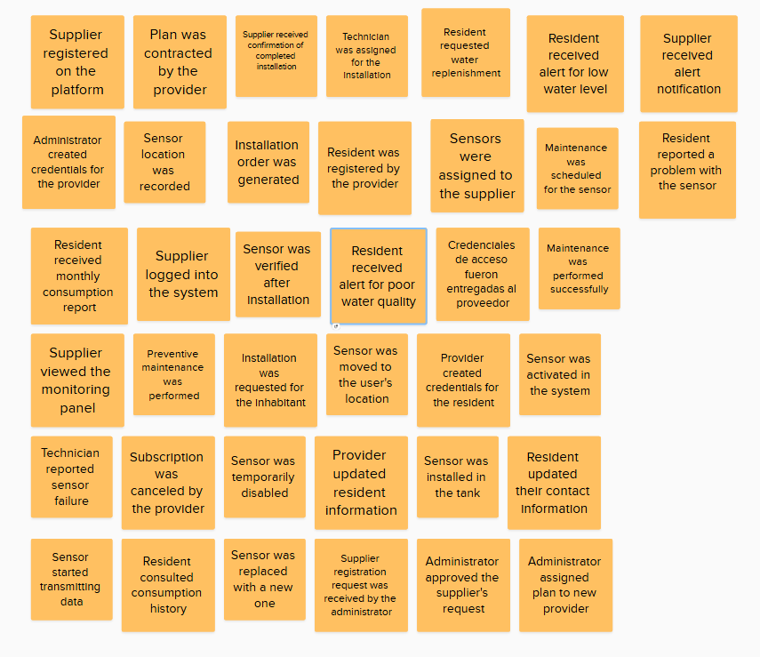

#### 4.1.1.1 Candidate Context Discovery.

El proceso de Candidate Context Discovery fue ejecutado con el objetivo de establecer una aproximación inicial a los posibles bounded contexts presentes en el dominio. Se aplicó la técnica start-with-value, orientada a identificar los elementos core del dominio que representan el mayor valor estratégico para el negocio. Como resultado de esta exploración, se determinaron los siguientes bounded contexts:

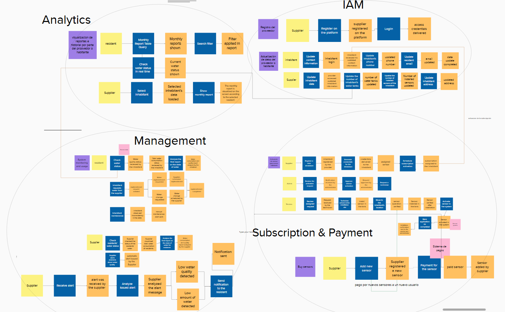

* Management

  Gestiona y supervisa el estado del agua en los tanques de los habitantes. Permite a usuarios visualizar estos datos en tiempo real y generar alertas o solicitudes de recarga. También habilita a los proveedores a monitorear las condiciones del agua y responder a situaciones críticas.  

* Analytics

  Permite visualizar reportes históricos y actuales sobre el estado del agua (nivel, calidad, consumo), tanto en tiempo real como en reportes agregados semanales o mensuales, facilitando la toma de decisiones y el monitoreo eficiente del servicio.  

* User & Profile Management

  Gestiona el registro y la autenticación de los proveedores y habitantes, así como la actualización de sus datos personales. Proporciona credenciales de acceso y asegura que los usuarios puedan interactuar con la plataforma.  

* Subscription & Payment  

  Gestiona la compra, registro y pago de sensores vinculados a usuarios, así como la suscripción al servicio mensual. Asegura que los sensores sean registrados correctamente, vinculados a un proveedor y que se registre el pago inicial y mensual de la suscripción.  

#### 4.1.1.2 Domain Message Flows Modeling.

En esta sección, aplicamos Domain Storytelling para modelar cómo los bounded contexts colaboran mediante flujos de mensajes, resolviendo los casos de uso del negocio. Esta técnica nos permitió visualizar las interacciones entre actores (usuarios, sistemas y servicios), secuenciar los pasos clave y validar el modelo con expertos del dominio. Estos diagramas clarifican dependencias, identifican riesgos y facilitan la alineación entre equipos técnicos y de negocio, asegurando una arquitectura coherente con las necesidades del dominio. 

- **Scenario 1: Habitante revisa el estado del agua de su tanque**
  
El habitante solicita el estado del agua a través del Central System, que procesa la consulta mediante comandos y eventos. El Container Management Context y Analytics Context colaboran para devolver y maximizar la información del nivel del agua, mostrando los resultados en la aplicación.
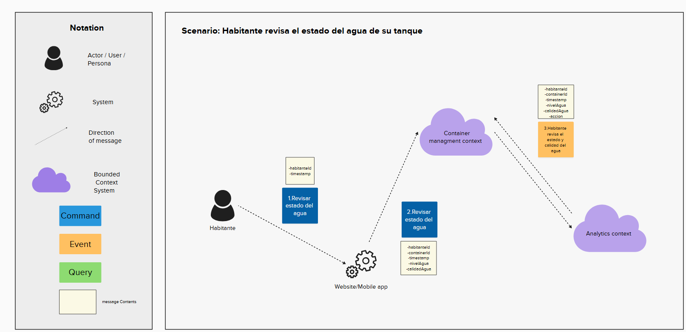

- **Scenario 2: Habitante gestiona su plan de subscripción.**
  
El habitante se registra en la plataforma y el sistema IAM le asigna credenciales. Luego, el Subscription Context activa un plan de suscripción vinculado a su vivienda (NCasa), registrando la constancia del plan seleccionado.
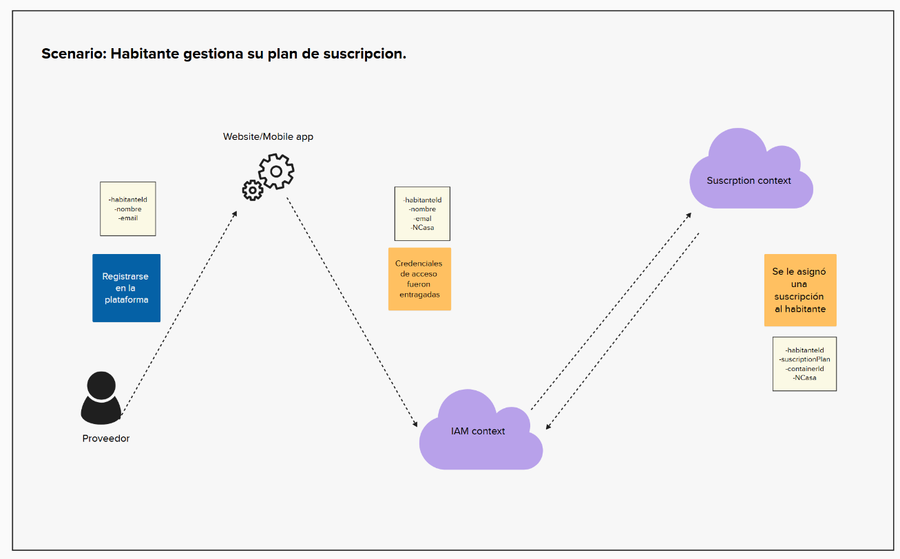

- **Scenario 3: Subscripción y Pago**

El proveedor programa una suscripción en la aplicación, seleccionando un habitante. El Payment Context procesa el pago (por el sensor y el servicio mensual), confirmando la activación del plan y vinculándolo al Subscription Context.
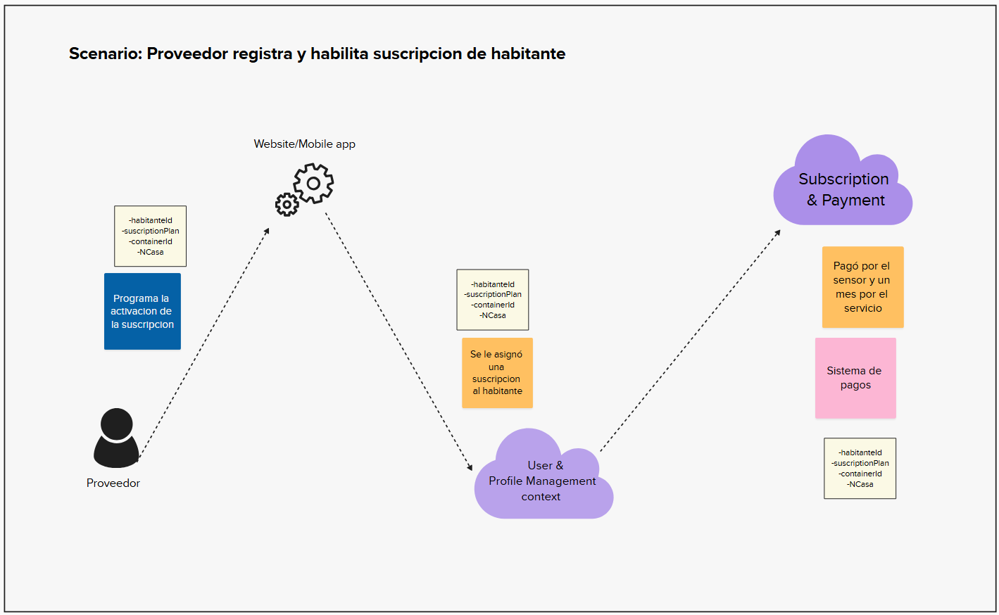

- **Scenario 4: Proveedor actualiza la cantidad de sensores y tanques del habitante**

El proveedor modifica la cantidad de tanques y sensores asociados al habitante. El sistema actualiza estos datos en cascada, reflejando los cambios en los registros y generando eventos para sincronizar la información en otros contextos, como análisis de seguridad o grupos de datos.


#### 4.1.1.3 Bounded Context Canvases. 

- Bounded context Analytics

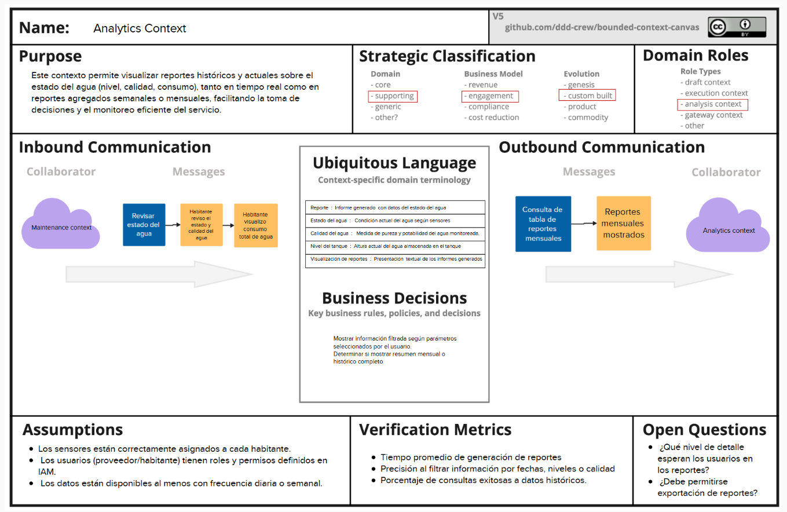

- Bounded context Request Management


- Bounded context User & Profile Management

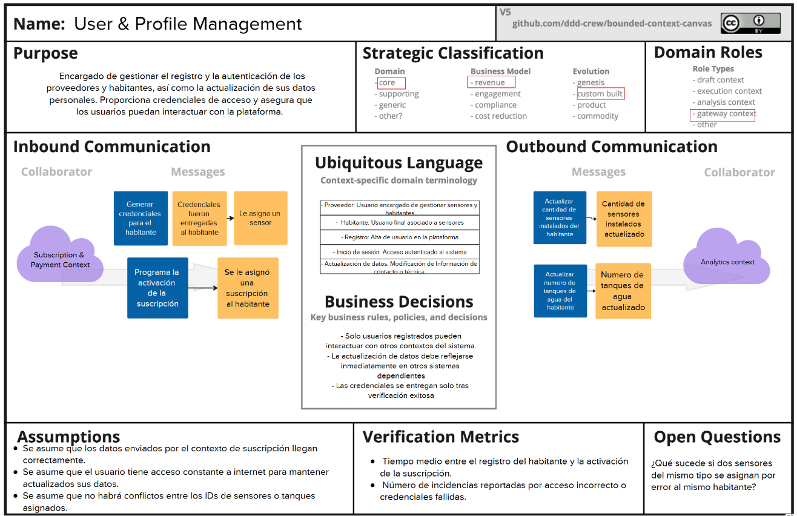

Bounded context Subscription & Payment

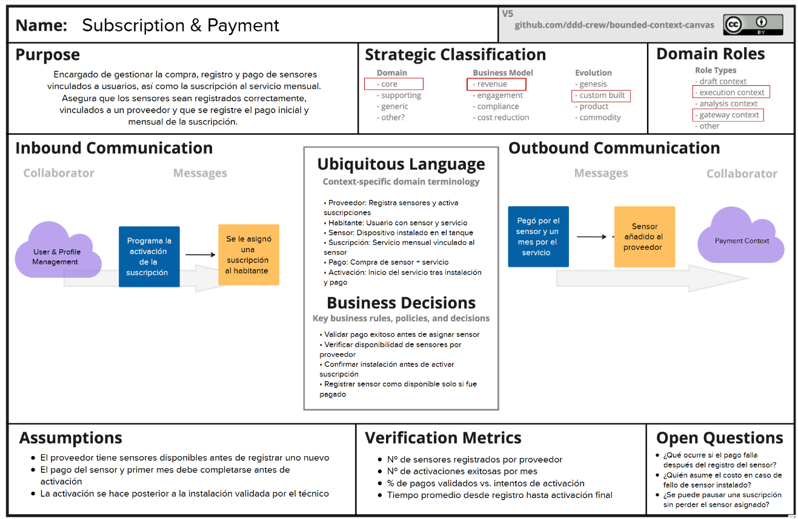

### 4.1.2. Context Mapping.

En este diagrama se visualiza las relaciones clave entre los bounded contexts del sistema, destacando la colaboración entre User & Profile Management, Subscription & Payment, Management Context y Analytics Context, aplicando patrones DDD como Anti-Corruption Layer y Customer/Supplier (contratos claros en pagos) para garantizar una integración eficiente y escalable.

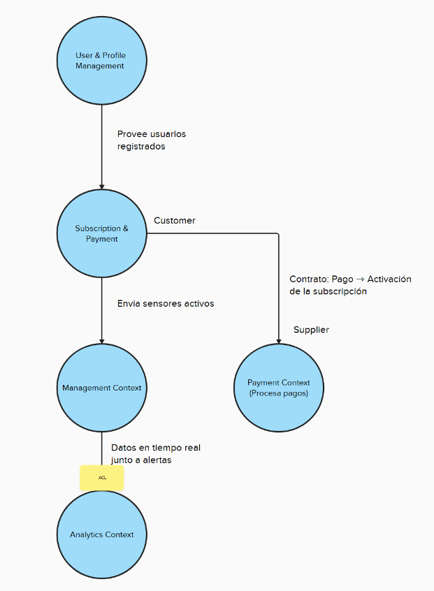


### 4.1.3. Software Architecture.

#### 4.1.3.1. Software Architecture System Landscape Diagram.

#### 4.1.3.2. Software Architecture Context Level Diagrams.


#### 4.1.3.3. Software Architecture Container Level Diagrams.

#### 4.1.3.4. Software Architecture Deployment Diagrams.


## 4.2. Tactical-Level Domain-Driven Design
### 4.2.1. Bounded Context: Subscription & Payment

#### 4.2.1.1. Domain Layer.
En el núcleo del dominio se han definido los siguientes Agregados, que representan los conceptos más importantes del Bounded Context de Suscripciones.


## `Aggregates` 


### `Subscription` 

Representa la suscripción de un sensor. 
#### Atributos principales:

| Atributo     | Tipo                | Descripción                                                 |
|--------------|---------------------|-------------------------------------------------------------|
| `id`         | `Int`               | Identificador único de la suscripción                       |
| `startDate`  | `Date`              | Fecha de inicio de la suscripción                           |
| `endDate`    | `Date`              | Fecha de fin de la suscripción                              |
| `status`     | `SubscriptionStatus`| Estado actual de la suscripción (`ACTIVE`, `EXPIRED`, etc.) |
| `sensorId`   | `Int`               | Identificador del sensor asociado                           |
| `residentId` | `Int`               | Identificador del residente asociado                        |

#### Constructores:

- Por parámetros individuales 
- A partir de `CreateSubscriptionCommand`
- A partir de `UpdateSubscriptionStatusCommand`
- A partir de `UpdateSubscriptionEndDateCommand`
---


### `Payment` 

Representa el pago de una suscripción. 
#### Atributos principales:

| Atributo         | Tipo              | Descripción                         |
|------------------|-------------------|-------------------------------------|
| `id`             | `Int`             | Identificador único del pago        |
| `subscriptionId` | `Int`             | Relación con la suscripción asociada|
| `amount`         | `Decimal`         | Monto del pago                      |
| `status`         | `PaymentStatus`   | Estado del pago (PENDING, SUCCESS, etc.) |
| `method`         | `PaymentMethod`   | Método de pago (CARD, YAPE, etc.)   |
| `paidAt`         | `Date`            | Fecha en la que se realizó el pago  |    |

#### Constructores:

- Por parámetros individuales 
- A partir de `CreatePaymentCommand`
---

Los siguientes enumerados (enums) representan valores fijos que controlan el estado y comportamiento de las entidades del sistema dentro del contexto de suscripciones y pagos. Se utilizan para asegurar consistencia, facilitar validaciones y mejorar la legibilidad del código, evitando el uso de strings sueltos o valores mágicos.


### `SubscriptionStatus(Enum)` 

| Valor       | Descripción                                                  |
|-------------|--------------------------------------------------------------|
| ACTIVE      | La suscripción está activa y el sensor está en funcionamiento |
| EXPIRED     | La suscripción ha terminado su periodo de vigencia            |
| CANCELLED   | La suscripción fue cancelada antes de su vencimiento          |
| PENDING     | La suscripción ha sido creada pero aún no se ha activado      |

### `PaymentStatus (Enum)` 

 | Valor       | Descripción                                 |
|-------------|----------------------------------------------|
| PENDING     | El pago ha sido iniciado pero no completado  |
| SUCCESS     | El pago se procesó correctamente             |
| FAILED      | El intento de pago falló                     |
| CANCELLED   | El pago fue cancelado por el usuario o sistema |

### `PaymentMethod  (Enum)` 

| Valor         | Descripción                             |
|---------------|------------------------------------------|
| CARD          | Pago realizado con tarjeta               |
| YAPE          | Pago a través de la app Yape             |
| PLIN          | Pago a través de la app Plin             |
| BANK_TRANSFER | Transferencia bancaria                   |


## `Commands` 

### `Subscription Commands` 

| Comando                         | Descripción                                                         |
|--------------------------------|----------------------------------------------------------------------|
| `CreateSubscriptionCommand`    | Crea una nueva suscripción, asignando un sensor a un residente con fechas definidas |
| `CancelSubscriptionCommand`    | Cancela una suscripción activa antes de su fecha de fin             |
| `UpdateSubscriptionEndDateCommand` | Modifica la fecha de finalización de la suscripción                 |
| `ExpireSubscriptionCommand`    | Marca una suscripción como expirada si ha superado su fecha de fin  |
| `ActivateSubscriptionCommand`  | Cambia el estado de una suscripción a `ACTIVE`                      |


### `Payment Commands` 
| Comando                     | Descripción                                                       |
|----------------------------|--------------------------------------------------------------------|
| `CreatePaymentCommand`     | Registra un nuevo pago asociado a una suscripción                 |
| `UpdatePaymentStatusCommand` | Cambia el estado de un pago (`PENDING`, `SUCCESS`, `FAILED`, etc.) |


## `Queries` 


### `Subscription Queries` 
| Query                                | Descripción                                                                      |
|-------------------------------------|----------------------------------------------------------------------------------|
| `GetSubscriptionByIdQuery`          | Obtiene una suscripción específica por su ID                                    |
| `GetSubscriptionsByResidentIdQuery`| Lista todas las suscripciones activas o históricas de un residente              |
| `GetActiveSubscriptionBySensorIdQuery` | Devuelve la suscripción activa de un sensor determinado                         |
| `GetAllActiveSubscriptionsQuery`    | Lista todas las suscripciones activas del sistema                               |


### `Payment Queries` 
| Query                              | Descripción                                                    |
|-----------------------------------|----------------------------------------------------------------|
| `GetPaymentByIdQuery`             | Obtiene los detalles de un pago específico por su ID          |
| `GetPaymentsBySubscriptionIdQuery`| Lista todos los pagos hechos para una suscripción dada        |
| `GetRecentPaymentsByResidentIdQuery` | Devuelve los pagos recientes realizados por un residente      |

## `Repositories (Interfaces)` 
| Archivo                     | Descripción breve                                                                 |
|----------------------------|-------------------------------------------------------------------------------------|
| ISubscriptionRepository.cs | Define operaciones sobre suscripciones: `FindByIdAsync`, `FindByResidentIdAsync`, `FindActiveBySensorIdAsync`, `SaveAsync`, `UpdateStatusAsync` |
| IPaymentRepository.cs      | Define operaciones sobre pagos: `FindByIdAsync`, `FindBySubscriptionIdAsync`, `SaveAsync`, `UpdateStatusAsync`             |


## `Services` 
### `Subscription` 

| Archivo                          | Descripción breve                                                                 |
|----------------------------------|-------------------------------------------------------------------------------------|
| ISubscriptionCommandService.cs  | Define comandos como crear, cancelar o renovar suscripciones.                     |
| ISubscriptionQueryService.cs    | Define consultas para obtener suscripciones (por residente, por sensor, por estado, por id). |

### `Payment` 

| Archivo                      | Descripción breve                                                                 |
|------------------------------|-------------------------------------------------------------------------------------|
| IPaymentCommandService.cs   | Define comandos como registrar pago, actualizar estado o reintentar un pago.      |
| IPaymentQueryService.cs     | Define consultas para obtener pagos (por suscripción, por estado, por método, por id). |


#### 4.2.1.2. Interface Layer.

La carpeta `Interfaces/REST` expone los endpoints HTTP que permiten a clientes externos interactuar con la aplicación transformando solicitudes en comandos o queries y devolviendo respuestas.

## `Resources` 
Las clases `Resource` actúan como intermediarias que trasladan datos entre la API REST y la capa de aplicación.

| Archivo                           | Función                                                                 |
|----------------------------------|-------------------------------------------------------------------------|
| `CreateSubscriptionResource.cs`  | Recibe datos para registrar una nueva suscripción desde el cliente.    |
| `CancelSubscriptionResource.cs`  | Permite cancelar una suscripción existente.                            |
| `SubscriptionResource.cs`        | Devuelve información de una suscripción (GET).                         |
| `CreatePaymentResource.cs`       | Recibe datos para registrar un nuevo pago asociado a una suscripción.  |
| `PaymentResource.cs`             | Devuelve detalles del pago realizado (GET).                            |


## `Transform/Assemblers` 

Las clases ubicadas en la carpeta **Transform** (o también conocidas como **Assemblers**) se encargan de:

- Traducir los objetos **Resource** en **Command Objects** que serán procesados por la capa de aplicación.  
- Convertir las entidades del dominio en objetos **Resource** que se utilizarán para construir las respuestas de la API.

| Archivo                                             | Función                                                                 |
|-----------------------------------------------------|-------------------------------------------------------------------------|
| `CreateSubscriptionCommandFromResourceAssembler.cs` | Transforma `CreateSubscriptionResource` en `CreateSubscriptionCommand`. |
| `CreatePaymentCommandFromResourceAssembler.cs`      | Transforma `CreatePaymentResource` en `CreatePaymentCommand`.           |
| `SubscriptionResourceFromEntityAssembler.cs`        | Convierte una entidad `Subscription` en un `SubscriptionResource` limpio. |
| `PaymentResourceFromEntityAssembler.cs`             | Convierte una entidad `Payment` en un `PaymentResource` limpio.         |


## `Controllers` 
Cada entidad principal dentro del Bounded Context *Subscription & Payment* dispone de un **REST Controller**, encargado de exponer los endpoints públicos y coordinar la lógica de ejecución de la aplicación.

| Controlador              | Ruta base típica | Responsabilidad principal                                                                 |
|--------------------------|------------------|--------------------------------------------------------------------------------------------|
| `SubscriptionController.cs` | `/api/subscription` | Gestiona la creación, actualización y consulta de suscripciones.                          |
| `PaymentController.cs`      | `/api/payment`      | Maneja operaciones de pagos: registrar, consultar historial y actualizar estado de pago.  |

#### 4.2.1.3. Application Layer.

### Servicios de Aplicación – Gestión de Flujos de Negocio

## `CommandServices` 
| Clase                             | Descripción                                                                                              |
|----------------------------------|----------------------------------------------------------------------------------------------------------|
| `SubscriptionCommandService.cs`  | Gestiona la lógica para crear nuevas suscripciones, actualizar su estado o renovarlas.                   |
| `PaymentCommandService.cs`       | Maneja los procesos de creación de pagos, validación del estado y aplicación del método de pago.         |

## `QueryServices` 
| Clase                             | Descripción                                                                                              |
|----------------------------------|----------------------------------------------------------------------------------------------------------|
| `SubscriptionQueryService.cs`    | Permite consultar suscripciones por estado, residente, fechas o sensor asociado.                         |
| `PaymentQueryService.cs`         | Proporciona consultas sobre los pagos realizados, incluyendo filtros por suscripción,


#### 4.2.1.4. Infrastructure Layer.

### Implementación de Repositories

| Clase                      | Interfaz implementada       | Función principal |
|---------------------------|------------------------------|-------------------|
| `SubscriptionRepository.cs` | `ISubscriptionRepository`   | Implementa la lógica de persistencia y consultas sobre suscripciones (`Subscription`), permitiendo operaciones como buscar por residente, sensor o estado. |
| `PaymentRepository.cs`      | `IPaymentRepository`        | Gestiona el acceso a datos y operaciones sobre pagos (`Payment`), incluyendo la creación, actualización y consultas por suscripción o estado del pago. |

#### 4.2.1.5. Bounded Context Software Architecture Component Level Diagrams.


#### 4.2.1.6. Bounded Context Software Architecture Code Level Diagrams.


##### 4.2.1.6.1. Bounded Context Domain Layer Class Diagrams.
La imagen muestra un diagrama de clases que describe la interacción entre los servicios y repositorios de suscripciones y pagos. Incluye **ISubscriptionRepository**, que maneja las operaciones de suscripciones como búsqueda y actualización, y **ISubscriptionCommandService**, que gestiona comandos para crear, cancelar, activar o expirar suscripciones. **ISubscriptionQueryService** se encarga de consultar información de suscripciones, mientras que **Payment** representa los detalles de los pagos. **IPaymentRepository**, **IPaymentCommandService**, y **IPaymentQueryService** gestionan operaciones similares para los pagos, como su creación, actualización y consulta, garantizando que el sistema pueda manejar tanto suscripciones como pagos de manera independiente y eficiente.

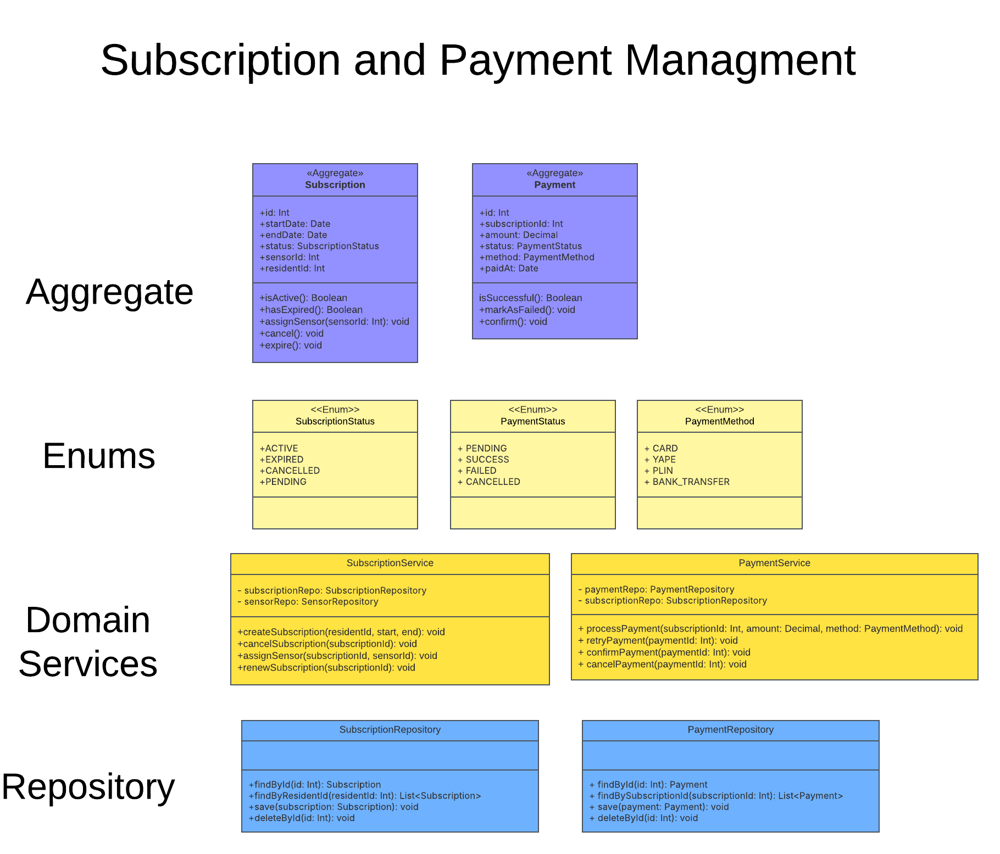

##### 4.2.1.6.2. Bounded Context Database Design Diagram.
El diagrama muestra las relaciones entre las tablas **sensors**, **subscriptions**, **payments** y **residents**. La tabla **sensors** contiene información sobre los sensores, como tipo, descripción y estado. La tabla **subscriptions** almacena los detalles de las suscripciones, incluyendo las fechas de inicio y fin, el estado de la suscripción, y las relaciones con los sensores y residentes. La tabla **payments** registra los pagos realizados, con datos como el monto, el método de pago, el estado, la fecha de pago y su relación con la suscripción correspondiente. Finalmente, **residents** contiene los datos de los residentes, como nombre, apellido y un ID de perfil relacionado.


## `subscriptions` 
| Atributo     | Tipo       | Descripción                                              |
|--------------|------------|----------------------------------------------------------|
| id           | int        | Identificador único de la suscripción                    |
| start_date   | datetime   | Fecha de inicio de la suscripción                        |
| end_date     | datetime   | Fecha de finalización de la suscripción                  |
| status       | string     | Estado actual (ACTIVE, EXPIRED, CANCELLED, etc.)         |
| sensor_id    | int        | Relación con el sensor asignado                          |
| resident_id  | int        | Relación con el residente al que pertenece la suscripción|

## `payments` 
| Atributo         | Tipo       | Descripción                                                |
|------------------|------------|------------------------------------------------------------|
| id               | int        | Identificador único del pago                               |
| amount           | decimal    | Monto total del pago realizado                             |
| status           | string     | Estado del pago (PENDING, SUCCESS, FAILED, CANCELLED)      |
| paid_at          | datetime   | Fecha en la que se efectuó el pago                         |
| method           | string     | Método de pago (YAPE, PLIN, BANK_TRANSFER, CARD, etc.)     |
| subscription_id  | int        | Relación con la suscripción a la que corresponde el pago   |


### 4.2.2. Bounded Context: User & Profile Managment
#### 4.2.2.1. Domain Layer.
-En el núcleo del dominio se han definido los siguientes Agregados, que representan los conceptos más importantes del Bounded Context de usuarios y perfiles.


## `Aggregates`

### `User`

Representa una cuenta de usuario dentro del sistema, asociada a un perfil y un rol.

#### Atributos principales:

| Atributo     | Tipo        | Descripción                                                   |
|--------------|-------------|---------------------------------------------------------------|
| `id`         | `Int`       | Identificador único del usuario                               |
| `username`   | `String`    | Nombre de usuario utilizado para autenticación                |
| `password`   | `String`    | Contraseña cifrada del usuario                                |
| `role`       | `UserRole`  | Rol del usuario dentro del sistema (`ADMIN`, `PROVIDER`, etc.)|
| `createdAt`  | `Date`      | Fecha de creación de la cuenta                                |
| `profileId`  | `Int`       | Relación con el perfil de usuario (`Profile`)                 |

#### Constructores:

- Por parámetros individuales  
- A partir de `RegisterUserCommand`  
- A partir de `UpdateUserPasswordCommand`


### `Profile`

Representa la información personal complementaria de un usuario dentro del sistema.

#### Atributos principales:

| Atributo         | Tipo     | Descripción                                      |
|------------------|----------|--------------------------------------------------|
| `id`             | `Int`    | Identificador único del perfil                  |
| `documentType`   | `String` | Tipo de documento de identidad (DNI, CE, etc.)  |
| `documentNumber` | `String` | Número del documento de identidad               |
| `address`        | `String` | Dirección del usuario                           |
| `phone`          | `String` | Número de teléfono del usuario                  |

#### Constructores:

- Por parámetros individuales  
- A partir de `CreateProfileCommand`  
- A partir de `UpdateProfileInfoCommand`


### `Provider`

Representa un proveedor del servicio que puede gestionar sensores, suscripciones y residentes.

#### Atributos principales:

| Atributo   | Tipo     | Descripción                                          |
|------------|----------|------------------------------------------------------|
| `id`       | `Int`    | Identificador único del proveedor                    |
| `userId`   | `Int`    | Relación con el usuario asociado (`User`)           |
| `taxName`  | `String` | Nombre comercial o razón social del proveedor        |
| `ruc`      | `String` | Registro Único de Contribuyentes (identificación fiscal) |

#### Constructores:

- Por parámetros individuales  
- A partir de `RegisterProviderCommand`  
- A partir de `UpdateProviderInfoCommand`


### `Resident`

Representa a un habitante asociado a un proveedor, que recibe el servicio a través de sensores.

#### Atributos principales:

| Atributo     | Tipo     | Descripción                                          |
|--------------|----------|------------------------------------------------------|
| `id`         | `Int`    | Identificador único del residente                    |
| `firstName`  | `String` | Nombre del residente                                 |
| `lastName`   | `String` | Apellido del residente                               |
| `userId`     | `Int`    | Relación con el usuario asociado (`User`)           |
| `providerId` | `Int`    | Relación con el proveedor que gestiona al residente  |

#### Constructores:

- Por parámetros individuales  
- A partir de `RegisterResidentCommand`  
- A partir de `UpdateResidentInfoCommand`

---

Los siguientes enumerados (enums) representan valores fijos que definen el comportamiento y las características de las entidades dentro del contexto de gestión de usuarios, perfiles, proveedores y residentes. Su uso permite mantener la consistencia del sistema, facilitar las validaciones y mejorar la legibilidad del código, evitando el uso de valores literales o cadenas sueltas.

### `UserRole (Enum)` 

| Valor     | Descripción                                                    |
|-----------|----------------------------------------------------------------|
| ADMIN     | Usuario con permisos de administración sobre todo el sistema   |
| PROVIDER  | Usuario que gestiona sensores, residentes y suscripciones      |
| RESIDENT  | Usuario final que recibe el servicio y visualiza información   |

## `Commands`
### `User Commands`

| Comando                      | Descripción                                                                 |
|-----------------------------|-----------------------------------------------------------------------------|
| `RegisterUserCommand`       | Registra un nuevo usuario en el sistema con su rol y datos de acceso       |
| `UpdateUserPasswordCommand` | Permite actualizar la contraseña de un usuario existente                   |


### `Profile Commands`
| Comando                      | Descripción                                                                 |
|-----------------------------|-----------------------------------------------------------------------------|
| `CreateProfileCommand`      | Crea el perfil personal asociado a un usuario                               |
| `UpdateProfileInfoCommand`  | Actualiza la información de documento, dirección o teléfono del perfil      |

### `Provider Commands`
| Comando                         | Descripción                                                              |
|--------------------------------|---------------------------------------------------------------------------|
| `RegisterProviderCommand`       | Registra un nuevo proveedor del servicio asociado a un usuario            |
| `UpdateProviderInfoCommand`     | Actualiza la razón social (`taxName`) o el RUC del proveedor              |
| `RegisterResidentCommand` | Comando que se ejecuta cuando un proveedor registra a un nuevo residente asociado a él |

### `Resident Commands`
| Comando                          | Descripción                                                              |
|---------------------------------|---------------------------------------------------------------------------|
| `RegisterResidentCommand`       | Registra un nuevo residente asociado a un proveedor                      |
| `UpdateResidentInfoCommand`     | Actualiza el nombre o apellido de un residente                           |


## `Queries` 

### `User Queries`
| Query                     | Descripción                                                                |
|--------------------------|----------------------------------------------------------------------------|
| `GetUserByIdQuery`       | Obtiene los datos de un usuario específico por su ID                       |
| `GetUsersByRoleQuery`    | Lista todos los usuarios que tienen un rol específico (`ADMIN`, `PROVIDER`, etc.) |

### `Profile Queries`
| Query                      | Descripción                                                              |
|---------------------------|---------------------------------------------------------------------------|
| `GetProfileByUserIdQuery` | Obtiene el perfil asociado a un usuario específico                       |
| `GetProfileByIdQuery`     | Recupera el perfil directamente por su identificador único               |

### `Provider  Queries`

| Query                      | Descripción                                                               |
|---------------------------|----------------------------------------------------------------------------|
| `GetProviderByIdQuery`    | Recupera la información de un proveedor por su ID                         |
| `GetProviderByUserIdQuery`| Obtiene los datos del proveedor asociado a un usuario                     |
| `GetAllProvidersQuery`    | Lista todos los proveedores registrados en el sistema                     |

### `Resident   Queries`
| Query                         | Descripción                                                            |
|------------------------------|-------------------------------------------------------------------------|
| `GetResidentByIdQuery`       | Recupera un residente específico por su ID                             |
| `GetResidentsByProviderIdQuery` | Lista todos los residentes registrados bajo un proveedor              |
| `GetResidentByUserIdQuery`   | Obtiene el residente vinculado a un usuario determinado                |

## `Services` 

### `User`
| Archivo                      | Descripción breve                                                                 |
|-----------------------------|-------------------------------------------------------------------------------------|
| IUserCommandService.cs      | Define comandos para registrar usuarios, cambiar rol o actualizar contraseña.      |
| IUserQueryService.cs        | Permite consultas de usuarios por ID o por rol.                                   |

### `Profile`
| Archivo                      | Descripción breve                                                                   |
|-----------------------------|---------------------------------------------------------------------------------------|
| IProfileCommandService.cs   | Maneja la creación y actualización de perfiles personales.                          |
| IProfileQueryService.cs     | Permite obtener perfiles por ID o por usuario asociado.                             |

### `Provider`
| Archivo                        | Descripción breve                                                                   |
|-------------------------------|---------------------------------------------------------------------------------------|
| IProviderCommandService.cs     | Define comandos para registrar o actualizar información de proveedores.             |
| IProviderQueryService.cs       | Permite consultar proveedores por ID o por usuario asociado.                        |

### `Resident`
| Archivo                        | Descripción breve                                                                   |
|-------------------------------|---------------------------------------------------------------------------------------|
| IResidentCommandService.cs     | Gestiona el registro y actualización de datos personales de los residentes.         |
| IResidentQueryService.cs       | Consulta residentes por ID, usuario o proveedor al que están asociados.             |


#### 4.2.2.2. Interface Layer.
La carpeta `Interfaces/REST` expone los endpoints HTTP que permiten a clientes externos interactuar con la aplicación transformando solicitudes en comandos o queries y devolviendo respuestas.

## `Resources`
Las clases `Resource` actúan como intermediarias que trasladan datos entre la API REST y la capa de aplicación.

| Archivo                           | Función                                                                 |
|----------------------------------|-------------------------------------------------------------------------|
| `RegisterUserResource.cs`        | Recibe los datos necesarios para registrar un nuevo usuario.           |
| `UpdateUserPasswordResource.cs`  | Permite actualizar la contraseña del usuario.                          |
| `UserResource.cs`                | Devuelve la información del usuario (GET).                             |
| `CreateProfileResource.cs`       | Recibe los datos para crear un perfil de usuario.                      |
| `UpdateProfileResource.cs`       | Permite actualizar dirección, documento o teléfono del perfil.         |
| `ProfileResource.cs`             | Devuelve los datos de perfil asociados a un usuario.                   |
| `RegisterProviderResource.cs`    | Recibe datos para registrar un nuevo proveedor.                        |
| `UpdateProviderInfoResource.cs`  | Permite actualizar la razón social o el RUC de un proveedor.           |
| `ProviderResource.cs`            | Devuelve información pública de un proveedor (GET).                    |
| `RegisterResidentResource.cs`    | Recibe los datos necesarios para registrar un residente.               |
| `UpdateResidentInfoResource.cs`  | Permite modificar los datos personales del residente.                  |
| `ResidentResource.cs`            | Devuelve la información de un residente (GET).                         |

## `Transform/Assemblers` 
Las clases ubicadas en la carpeta **Transform** (o también conocidas como **Assemblers**) se encargan de:

- Traducir los objetos **Resource** en **Command Objects** que serán procesados por la capa de aplicación.  
- Convertir las entidades del dominio en objetos **Resource** que se utilizarán para construir las respuestas de la API.

| Archivo                                               | Función                                                                 |
|-------------------------------------------------------|-------------------------------------------------------------------------|
| `RegisterUserCommandFromResourceAssembler.cs`         | Transforma `RegisterUserResource` en `RegisterUserCommand`.            |
| `UpdateUserPasswordCommandFromResourceAssembler.cs`   | Transforma `UpdateUserPasswordResource` en `UpdateUserPasswordCommand`.|
| `UserResourceFromEntityAssembler.cs`                  | Convierte una entidad `User` en un `UserResource` limpio.              |
| `CreateProfileCommandFromResourceAssembler.cs`        | Transforma `CreateProfileResource` en `CreateProfileCommand`.          |
| `UpdateProfileCommandFromResourceAssembler.cs`        | Transforma `UpdateProfileResource` en `UpdateProfileInfoCommand`.      |
| `ProfileResourceFromEntityAssembler.cs`               | Convierte una entidad `Profile` en un `ProfileResource`.               |
| `RegisterProviderCommandFromResourceAssembler.cs`     | Transforma `RegisterProviderResource` en `RegisterProviderCommand`.    |
| `UpdateProviderCommandFromResourceAssembler.cs`       | Transforma `UpdateProviderInfoResource` en `UpdateProviderInfoCommand`.|
| `ProviderResourceFromEntityAssembler.cs`              | Convierte una entidad `Provider` en un `ProviderResource`.             |
| `RegisterResidentCommandFromResourceAssembler.cs`     | Transforma `RegisterResidentResource` en `RegisterResidentCommand`.    |
| `UpdateResidentCommandFromResourceAssembler.cs`       | Transforma `UpdateResidentInfoResource` en `UpdateResidentInfoCommand`.|
| `ResidentResourceFromEntityAssembler.cs`              | Convierte una entidad `Resident` en un `ResidentResource`.             |


## `Controllers` 
Cada entidad principal dentro del Bounded Context User & Identity Management dispone de un **REST Controller**, encargado de exponer los endpoints públicos y coordinar la lógica de ejecución de la aplicación.

| Controlador               | Ruta base típica     | Responsabilidad principal                                                                   |
|---------------------------|----------------------|----------------------------------------------------------------------------------------------|
| `UserController.cs`       | `/api/users`         | Gestiona el registro, autenticación, y actualización del usuario.                           |
| `ProfileController.cs`    | `/api/profiles`      | Permite la creación, modificación y consulta del perfil de un usuario.                      |
| `ProviderController.cs`   | `/api/providers`     | Gestiona el registro de proveedores y la actualización de su información fiscal.            |
| `ResidentController.cs`   | `/api/residents`     | Maneja el registro de residentes y sus datos personales asociados al proveedor.             |


#### 4.2.2.3. Application Layer.

### Servicios de Aplicación – Gestión de Flujos de Negocio

## `CommandServices` 

| Clase                             | Descripción                                                                                      |
|----------------------------------|--------------------------------------------------------------------------------------------------|
| `UserCommandService.cs`          | Gestiona el registro de usuarios, cambio de rol y actualización de contraseña.                   |
| `ProfileCommandService.cs`       | Maneja la creación y actualización de perfiles personales.                                       |
| `ProviderCommandService.cs`      | Administra el registro de proveedores y edición de su información fiscal (razón social y RUC).   |
| `ResidentCommandService.cs`      | Gestiona el registro de residentes y la modificación de sus datos personales.                    |yaya 

## `QueryServices` 

| Clase                             | Descripción                                                                                     |
|----------------------------------|-------------------------------------------------------------------------------------------------|
| `UserQueryService.cs`            | Permite consultar usuarios por ID o por rol.                                                    |
| `ProfileQueryService.cs`         | Recupera perfiles asociados a usuarios o directamente por ID.                                   |
| `ProviderQueryService.cs`        | Obtiene la información de proveedores por ID o usuario asociado.                                |
| `ResidentQueryService.cs`        | Permite listar residentes por proveedor o consultar uno específico por ID o usuario.            |

#### 4.2.2.4. Infrastructure Layer.
### Implementación de Repositories

| Clase                        | Interfaz implementada       | Función principal                                                                 |
|-----------------------------|------------------------------|-----------------------------------------------------------------------------------|
| `UserRepository.cs`         | `IUserRepository`           | Gestiona la persistencia y consultas de usuarios, incluyendo búsquedas por ID o rol. |
| `ProfileRepository.cs`      | `IProfileRepository`        | Administra el acceso a datos de perfiles, permitiendo crear, editar y consultar por usuario. |
| `ProviderRepository.cs`     | `IProviderRepository`       | Implementa la lógica para registrar y actualizar información fiscal de proveedores. |
| `ResidentRepository.cs`     | `IResidentRepository`       | Permite almacenar y recuperar información de residentes asociados a un proveedor.  |


#### 4.2.2.5. Bounded Context Software Architecture Component Level Diagrams.
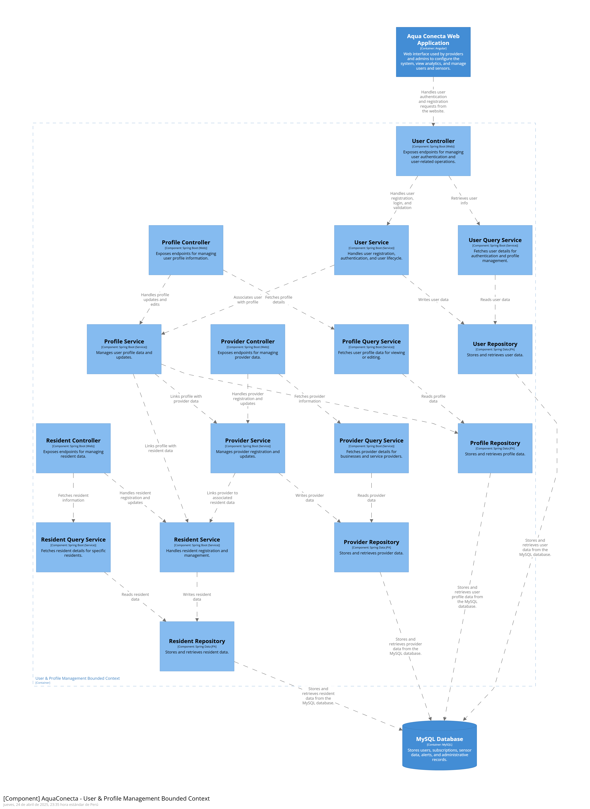
#### 4.2.2.6. Bounded Context Software Architecture Code Level Diagrams.
#### 4.2.2.6.1. Bounded Context Domain Layer Class Diagrams.
El diagrama muestra la estructura de un sistema que gestiona **proveedores**, **residentes**, **usuarios** y **perfiles**. Cada entidad tiene servicios de consulta, comando y repositorio para realizar operaciones como creación, actualización y consulta de datos. **Provider** y **Resident** están vinculados, permitiendo la gestión de información de proveedores y residentes, mientras que **User** maneja roles como ADMIN, PROVIDER y RESIDENT, permitiendo la administración de usuarios. **Profile** almacena información personal de los usuarios, como documentos y datos de contacto. Los servicios proporcionan la funcionalidad necesaria para gestionar estas entidades de manera eficiente.

.png>)

#### 4.2.2.6.2. Bounded Context Database Design Diagram.
El diagrama muestra las relaciones entre las tablas **providers**, **residents**, **users** y **profiles**. Los **providers** están asociados a un **user** mediante el campo `user_id`, y cada **user** tiene un **profile** relacionado, almacenado en la tabla **profiles**, que contiene información personal como tipo de documento, número de documento, dirección y teléfono. Los **residents** están vinculados tanto a un **user** a través del campo `user_id` como a un **provider** mediante el campo `provider_id`. Esta estructura permite gestionar tanto a los usuarios como a los residentes y proveedores, asociando información personal, de contacto y roles en el sistema.


## `users` 

| Atributo     | Tipo       | Descripción                                  |
|--------------|------------|----------------------------------------------|
| id           | int        | Identificador único del usuario              |
| username     | string     | Nombre de usuario del sistema                |
| password     | string     | Contraseña cifrada del usuario               |
| role         | string     | Rol del usuario (`ADMIN`, `PROVIDER`, etc.) |
| createdAt    | datetime   | Fecha de creación del usuario                |
| profile_id   | int        | FK al perfil asociado                        |

## `profiles` 
| Atributo         | Tipo     | Descripción                            |
|------------------|----------|----------------------------------------|
| id               | int      | Identificador único del perfil         |
| documentType     | string   | Tipo de documento (DNI, CE, etc.)      |
| documentNumber   | string   | Número del documento                   |
| address          | string   | Dirección del usuario                  |
| phone            | string   | Número telefónico                      |

## `providers` 
| Atributo     | Tipo     | Descripción                               |
|--------------|----------|-------------------------------------------|
| id           | int      | Identificador único del proveedor         |
| tax_name     | string   | Nombre tributario del proveedor           |
| ruc          | string   | RUC del proveedor                         |
| user_id      | int      | FK al usuario asociado                    |

## `residents` 

| Atributo     | Tipo     | Descripción                                  |
|--------------|----------|----------------------------------------------|
| id           | int      | Identificador único del residente            |
| first_name   | string   | Nombres del residente                        |
| last_name    | string   | Apellidos del residente                      |
| user_id      | int      | FK al usuario asociado                       |
| provider_id  | int      | FK al proveedor que administra al residente  |


### 4.2.3. Bounded Context: Request Management 

#### 4.2.3.1. Domain Layer.
- Este bounded context abarca la gestión de solicitudes generales y de agua realizadas por los residentes a los proveedores dentro de una comunidad.

---

##  `Aggregates`

### `WaterRequest`

Representa una solicitud específica de agua realizada por un residente.

| Atributo         | Tipo     | Descripción                                                    |
|------------------|----------|----------------------------------------------------------------|
| id             | Int      | Identificador único de la solicitud                           |
| residentId     | Int      | ID del residente que solicita el agua                         |
| providerId     | Int      | ID del proveedor que entregará el agua                        |
| requestedLiters| Float    | Litros solicitados                                             |
| status         | Enum     | Estado: PENDING, DELIVERED, CANCELLED                   |
| deliveredAt    | DateTime | Fecha y hora de entrega del agua (si aplica)                  |

Constructores:

- Por parámetros individuales
- A partir de CreateWaterRequestCommand

---

### `Request`

Representa una solicitud general realizada por un residente a un proveedor.

| Atributo       | Tipo     | Descripción                                                       |
|----------------|----------|-------------------------------------------------------------------|
| id           | Int      | Identificador único de la solicitud                               |
| residentId   | Int      | ID del residente solicitante                                      |
| providerId   | Int      | ID del proveedor al que se dirige la solicitud                    |
| title        | String   | Título de la solicitud                                            |
| description  | String   | Detalle de la solicitud                                           |
| status       | Enum     | Estado: OPEN, IN_PROGRESS, RESOLVED, CLOSED               |

Constructores:

- Por parámetros individuales
- A partir de CreateRequestCommand


## `Enumerados (Enums)`

### `WaterRequestStatus`

| Valor       | Descripción                                |
|-------------|--------------------------------------------|
| PENDING   | Solicitud pendiente de entrega             |
| DELIVERED | Agua entregada                             |
| CANCELLED | Solicitud cancelada                        |

### `RequestStatus`

| Valor         | Descripción                                  |
|---------------|----------------------------------------------|
| OPEN        | La solicitud fue creada y está pendiente     |
| IN_PROGRESS | El proveedor está atendiendo la solicitud    |
| RESOLVED    | La solicitud fue atendida satisfactoriamente |
| CLOSED      | La solicitud fue cerrada manualmente         |

---

##  `Commands`

### `Water Management Commands`

| Comando                             | Descripción                                                        |
|-------------------------------------|--------------------------------------------------------------------|
| CreateWaterRequestCommand         | Crea una solicitud de agua                                         |
| UpdateWaterRequestStatusCommand   | Actualiza el estado de una solicitud de agua                       |

### `General Request Commands`

| Comando                        | Descripción                                                        |
|--------------------------------|--------------------------------------------------------------------|
| CreateRequestCommand         | Crea una nueva solicitud general                                   |
| UpdateRequestStatusCommand   | Cambia el estado de una solicitud general                          |

---

## `Query`

| Query                                  | Descripción                                                               |
|----------------------------------------|---------------------------------------------------------------------------|
| GetWaterRequestsByResidentIdQuery    | Solicitudes de agua por residente                                         |
| GetPendingWaterRequestsQuery         | Solicitudes de agua pendientes                                            |
| GetDeliveredWaterRequestsByDateQuery | Solicitudes de agua entregadas en un rango de fechas                     |
| GetRequestsByStatusQuery             | Lista de solicitudes generales por estado                                |
| GetRequestsByResidentIdQuery         | Solicitudes generales hechas por un residente                            |

---

###  `Repositories (Interfaces)`

| Archivo                          | Descripción                                                         |
|----------------------------------|---------------------------------------------------------------------|
| IWaterRequestRepository.cs     | Persistencia y consultas sobre solicitudes de agua                 |
| IRequestRepository.cs          | Persistencia y consultas sobre solicitudes generales               |

---

###  `Services`

| Archivo                          | Descripción                                                         |
|----------------------------------|---------------------------------------------------------------------|
| IWaterRequestCommandService.cs | Comandos de solicitudes de agua                                    |
| IWaterRequestQueryService.cs   | Consultas de solicitudes de agua                                   |
| IRequestCommandService.cs      | Comandos de solicitudes generales                                  |
| IRequestQueryService.cs        | Consultas de solicitudes generales                                 |

---

#### 4.2.3.2. Interface Layer.

## `Resources`

| Archivo                          | Descripción                                                             |
|----------------------------------|-------------------------------------------------------------------------|
| CreateWaterRequestResource.cs | Para registrar solicitud de agua                                       |
| WaterRequestResource.cs       | JSON de solicitud de agua                                              |
| CreateRequestResource.cs      | Para registrar solicitud general                                       |
| RequestResource.cs            | JSON de solicitud general                                              |

---

##  `Transform / Assemblers`

| Archivo                                          | Función                                                              |
|--------------------------------------------------|----------------------------------------------------------------------|
| CreateWaterRequestCommandFromResourceAssembler.cs | De recurso a comando de agua                                     |
| WaterRequestResourceFromEntityAssembler.cs     | De entidad WaterRequest a recurso JSON                          |
| CreateRequestCommandFromResourceAssembler.cs   | De recurso a comando de solicitud general                          |
| RequestResourceFromEntityAssembler.cs          | De entidad Request a recurso JSON                                |

---

## `Controllers`

| Controlador              | Ruta Base             | Descripción                                                           |
|--------------------------|-----------------------|-----------------------------------------------------------------------|
| WaterRequestController.cs | /api/water-requests | Manejo de solicitudes de agua                                         |
| RequestController.cs      | /api/requests       | Manejo de solicitudes generales                                       |

---
##### 4.2.3.3. Application Layer.

## `Command Services`

| Archivo                      | Descripción                                                |
|------------------------------|------------------------------------------------------------|
| WaterRequestCommandService.cs | Implementa lógica de comandos para solicitudes de agua |
| RequestCommandService.cs      | Implementa lógica de comandos para solicitudes generales|

## `Query Services`

| Archivo                     | Descripción                                                  |
|-----------------------------|--------------------------------------------------------------|
| WaterRequestQueryService.cs | Consultas específicas de agua                             |
| RequestQueryService.cs      | Consultas generales de solicitudes                        |

#### 4.2.3.4. Infrastructure Layer.


## `Implementación de Repositories`

| Clase                    | Interfaz implementada      | Función principal                                                                 |
|--------------------------|----------------------------|------------------------------------------------------------------------------------|
| `WaterRequestRepository.cs` | `IWaterRequestRepository`   | Gestiona la persistencia y consultas de solicitudes de agua por residente, estado o fecha. |
| `RequestRepository.cs`      | `IRequestRepository`        | Administra solicitudes generales, permitiendo crear, consultar y actualizar por residente o estado. |


#### 4.2.3.5. Bounded Context Software Architecture Component Level Diagrams.

#### 4.2.3.6. Bounded Context Software Architecture Code Level Diagrams.
##### 4.2.3.6.1. Bounded Context Domain Layer Class Diagrams.
El diagrama muestra cómo se gestionan las **solicitudes generales** y **solicitudes de agua** en el sistema. Las **Request** representan las solicitudes generales de los residentes, mientras que **WaterRequest** se refiere a las solicitudes específicas de agua. Los servicios de comando (**IRequestCommandService** y **IWaterRequestCommandService**) permiten crear y actualizar estas solicitudes, mientras que los repositorios (**IRequestRepository** y **IWaterRequestRepository**) gestionan su persistencia. También hay servicios de consulta (**IRequestQueryService** y **IWaterRequestQueryService**) para obtener solicitudes según diferentes criterios, como estado o residente.


##### 4.2.3.6.2. Bounded Context Database Design Diagram.
El diagrama muestra dos tablas: **requests** y **water\_requests**. La tabla **requests** almacena solicitudes generales de los residentes, incluyendo información como el `title`, `description`, y el `status`, junto con las relaciones a los residentes y proveedores. La tabla **water\_requests** contiene solicitudes específicas de agua, incluyendo el número de litros solicitados (`request_liters`), el estado de la solicitud y la fecha de entrega (`delivered_at`). Ambas tablas están relacionadas a través de los campos `resident_id` y `provider_id`.


## 4.2.4. Bounded Context: Dashboard & Analytics
- Este bounded context abarca la gestión de datos analíticos y reportes generados a partir de las interacciones entre residentes, proveedores y sensores. Su objetivo es proporcionar información valiosa para la toma de decisiones estratégicas y operativas.
#### 4.2.4.1. Domain Layer.

## `Event`

Representa un evento individual registrado por un sensor de monitoreo ambiental.

| Atributo       | Tipo     | Descripción                                                           |
|----------------|----------|------------------------------------------------------------------------|
| `id`           | Int      | Identificador único del evento                                        |
| `sensorId`     | Int      | Identificador del sensor asociado                                     |
| `value`        | Float    | Valor registrado por el sensor (ej. nivel de agua)                    |
| `type`         | Enum     | Tipo de evento: `WATER_LEVEL`, `WATER_QUALITY`, `PRESSURE`, etc.      |
| `status`       | Enum     | Estado del evento: `NORMAL`, `ALERT`, `CRITICAL`                      |
| `created_at`   | DateTime | Fecha de creación del evento                                          |

**Constructores:**

- Por parámetros individuales
- A partir de `RegisterEventCommand`

---

## `SensorManagement`

Representa la administración y configuración de un sensor en campo.

| Atributo     | Tipo     | Descripción                                                |
|--------------|----------|------------------------------------------------------------|
| `id`         | Int      | Identificador único del sensor                             |
| `type`       | Enum     | Tipo de sensor (ej. `WATER_LEVEL`, `PRESSURE`, etc.)       |
| `status`     | Enum     | Estado del sensor: `INSTALLED`, `INACTIVE`, etc.           |
| `description`| String   | Descripción general del sensor                             |
| `residentId` | Int      | ID del residente o responsable asociado al sensor          |
| `location`   | String   | Ubicación o comunidad donde está instalado el sensor       |

**Constructores:**

- Por parámetros individuales
- A partir de `InstallSensorCommand`


## ` Enumerados (Enums)`

### `EventStatus`

| Valor      | Descripción                                     |
|------------|-------------------------------------------------|
| `NORMAL`   | Valores dentro de lo aceptable                  |
| `ALERT`    | Valores fuera del promedio, no críticos         |
| `CRITICAL` | Riesgo de salud o impacto grave                 |

### `EventType`

| Valor           | Descripción                      |
|------------------|---------------------------------|
| `WATER_LEVEL`    | Nivel de agua                   |
| `WATER_QUALITY`  | Calidad del agua                |
| `PRESSURE`       | Presión                         |
| `TEMPERATURE`    | Temperatura                     |

### `SensorStatus`

| Valor        | Descripción                                       |
|--------------|---------------------------------------------------|
| `INSTALLED`  | Sensor instalado y operativo                      |
| `INACTIVE`   | Sensor fuera de servicio temporalmente            |
| `MAINTENANCE`| Sensor en mantenimiento                           |
| `FAULTY`     | Sensor con fallas                                 |


##  `Commands`

### `Analytics Commands`

| Comando                     | Descripción                                                |
|-----------------------------|------------------------------------------------------------|
| `RegisterEventCommand`      | Registra un nuevo evento generado por un sensor           |
| `UpdateEventStatusCommand`  | Actualiza el estado de un evento específico               |

### `Management Commands`

| Comando                     | Descripción                                                |
|-----------------------------|------------------------------------------------------------|
| `InstallSensorCommand`      | Instala un sensor en un lugar determinado                 |
| `UpdateSensorStatusCommand` | Modifica el estado operativo de un sensor                 |


## `Queries`

### `Analytics Queries`

| Query                                  | Descripción                                                                 |
|----------------------------------------|-----------------------------------------------------------------------------|
| `GetEventsBySensorIdQuery`            | Lista todos los eventos registrados por un sensor específico               |
| `GetRecentCriticalEventsQuery`        | Devuelve eventos recientes con estado crítico                              |
| `GetMonthlyEventsBySensorQuery`       | Devuelve eventos agrupados por mes para un sensor                          |
| `GenerateSensorReportQuery`           | Genera reporte consolidado con estadísticas de eventos de un sensor        |
| `GetEventsByDateRangeQuery`           | Lista eventos registrados entre dos fechas (`created_at`)                  |
| `GetEventsByStatusAndSensorIdQuery`   | Lista eventos filtrados por estado (`status`) y sensor específico          |

### `Management Queries`

| Query                             | Descripción                                                                 |
|-----------------------------------|-----------------------------------------------------------------------------|
| `GetSensorsByLocationQuery`       | Lista sensores instalados en una ubicación específica                      |
| `GetSensorStatusByIdQuery`        | Devuelve el estado actual de un sensor                                     |


### ` Repositories (Interfaces)`

| Archivo                          | Descripción                                                                  |
|----------------------------------|------------------------------------------------------------------------------|
| `IEventRepository.cs`            | Operaciones sobre eventos:                                                   |
|                                  | - `FindBySensorIdAsync`                                                     |
|                                  | - `FindByDateRangeAsync`                                                    |
|                                  | - `FindByStatusAndSensorIdAsync`                                            |
|                                  | - `FindMonthlyAsync`, `SaveAsync`                                           |
| `ISensorManagementRepository.cs` | Operaciones sobre sensores:                                                 |
|                                  | - `FindByIdAsync`, `FindByLocationAsync`, `UpdateStatusAsync`, `SaveAsync` |


## `Services`

### `Analytics Services`

| Archivo                    | Descripción                                                              |
|----------------------------|--------------------------------------------------------------------------|
| `IEventCommandService.cs`   | Comandos para registrar y modificar eventos                             |
| `IEventQueryService.cs`     | Consultas de eventos: por sensor, por mes, por estado, por fechas, etc. |

### `Management Services`

| Archivo                      | Descripción                                                             |
|------------------------------|-------------------------------------------------------------------------|
| `ISensorCommandService.cs`    | Comandos para instalación y actualización de sensores                   |
| `ISensorQueryService.cs`      | Consultas por ubicación o ID del sensor                                |


#### 4.2.4.2. Interface Layer.
### `Resources`

| Archivo                          | Descripción                                                            |
|----------------------------------|------------------------------------------------------------------------|
| `RegisterEventResource.cs`       | Recurso para registrar nuevos eventos                                  |
| `EventResource.cs`               | Recurso JSON para listar eventos                                       |
| `MonthlyEventsResource.cs`       | Agrupación de eventos por mes                                          |
| `SensorReportResource.cs`        | Resumen estadístico de sensor                                          |
| `InstallSensorResource.cs`       | Recurso para registrar un sensor nuevo                                 |
| `SensorManagementResource.cs`    | Estado, descripción y ubicación del sensor                             |


### `Transform / Assemblers`

| Archivo                                           | Función                                                                  |
|--------------------------------------------------|---------------------------------------------------------------------------|
| `RegisterEventCommandFromResourceAssembler.cs`   | Transforma recurso en `RegisterEventCommand`                             |
| `EventResourceFromEntityAssembler.cs`            | Convierte entidad `Event` a recurso JSON                                 |
| `MonthlyEventsResourceFromEntityAssembler.cs`    | Agrupa eventos y los transforma a recurso mensual                        |
| `SensorReportResourceFromDataAssembler.cs`       | Convierte datos agregados en un recurso tipo reporte                     |
| `InstallSensorCommandFromResourceAssembler.cs`   | Transforma recurso en `InstallSensorCommand`                             |
| `SensorResourceFromEntityAssembler.cs`           | Convierte `SensorManagement` en recurso JSON                             |

---

### ` Controllers`

| Controlador             | Ruta Base          | Descripción                                                      |
|--------------------------|--------------------|------------------------------------------------------------------|
| `EventController.cs`     | `/api/events`      | Registro, consulta, filtro por sensor, estado y fechas           |
| `SensorController.cs`    | `/api/sensors`     | Instalación y gestión de sensores                                |

---
#### 4.2.4.3. Application Layer.
### `Command Services`

| Archivo                  | Descripción                                                         |
|--------------------------|---------------------------------------------------------------------|
| `EventCommandService.cs`  | Lógica para registrar y actualizar eventos                         |
| `SensorCommandService.cs` | Lógica para instalación y modificación de sensores                 |

### `Query Services`

| Archivo                    | Descripción                                                                 |
|----------------------------|-----------------------------------------------------------------------------|
| `EventQueryService.cs`      | Consultas sobre eventos incluyendo:                                         |
|                            | - Por sensorId                                                              |
|                            | - Por rango de fechas                                                       |
|                            | - Por estado y sensorId                                                     |
|                            | - Agrupados por mes                                                         |
|                            | - Generación de reporte                                                     |
| `SensorQueryService.cs`     | Consultas por ubicación, ID o estado de sensor                             |

---
#### 4.2.4.4. Infrastructure Layer.

### `Implementación de Repositories`

| Clase                          | Interfaz implementada         | Función principal                                                                 |
|-------------------------------|-------------------------------|------------------------------------------------------------------------------------|
| `EventRepository.cs`          | `IEventRepository`            | Gestiona la persistencia de eventos generados por sensores, incluyendo búsqueda por sensor, fechas o estado. |
| `SensorManagementRepository.cs` | `ISensorManagementRepository` | Administra la configuración y estado de sensores, incluyendo consultas por ubicación e ID. |

#### 4.2.4.5. Bounded Context Software Architecture Component Level Diagrams.
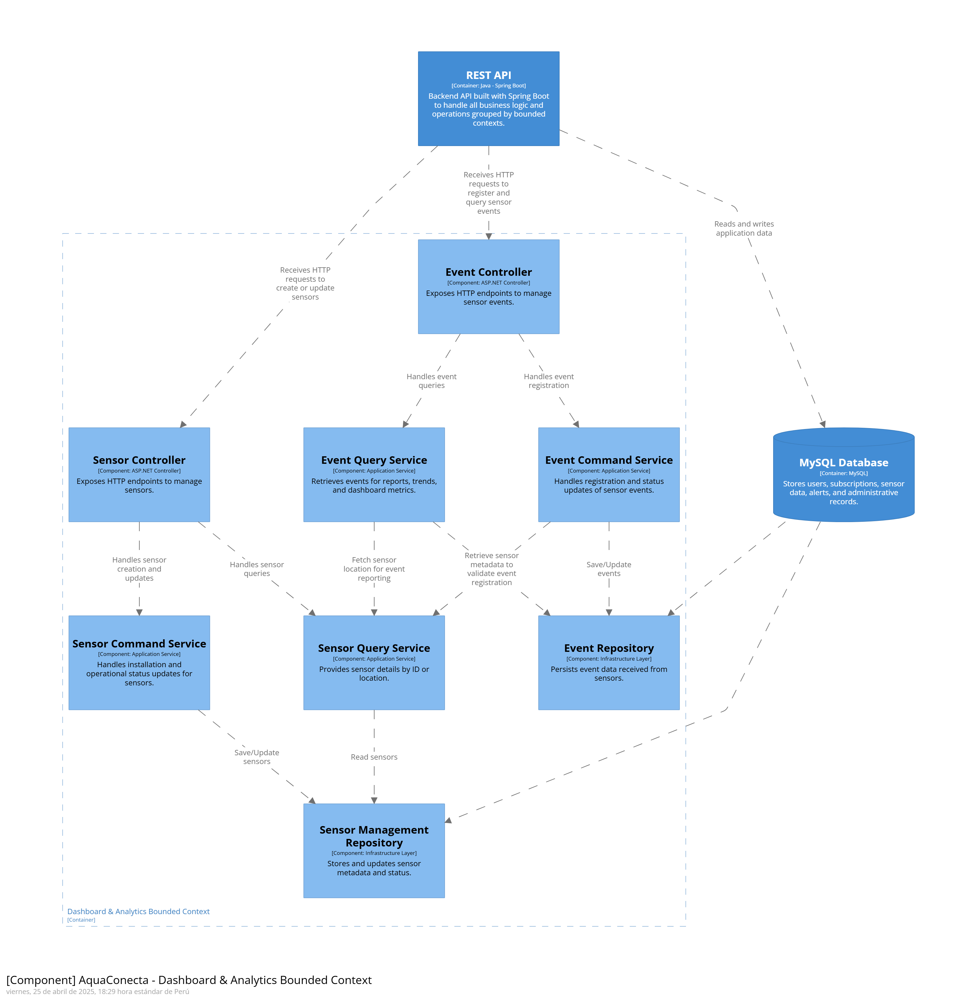
#### 4.2.4.6. Bounded Context Software Architecture Code Level Diagrams.
##### 4.2.4.6.1. Bounded Context Domain Layer Class Diagrams.
Este diagrama muestra la estructura de servicios y repositorios para la gestión de **eventos** y **sensores**. La **Event** tabla registra eventos relacionados con los sensores, como el valor del sensor y el tipo de evento (por ejemplo, calidad de agua baja, presión, etc.). Los servicios de **IEventCommandService** permiten registrar y actualizar el estado de los eventos, mientras que **IEventRepository** gestiona las operaciones de almacenamiento y consulta de eventos. En paralelo, el sistema también gestiona la instalación y el estado de los **sensores** a través de **SensorManagement** y su **SensorStatus** asociado (activo, inactivo, instalado, defectuoso). Los servicios **ISensorCommandService** y **ISensorQueryService** permiten interactuar con los sensores, incluyendo su instalación y actualización de estado, así como consultas sobre sensores por ubicación o estado.

##### 4.2.4.6.2. Bounded Context Database Design Diagram.
Este diagrama muestra las relaciones entre las tablas **events** y **sensors**. La tabla **events** almacena eventos relacionados con los sensores, incluyendo el **valor** registrado, el **tipo** de evento, y el **estado** del evento. El campo `sensor_id` en la tabla de eventos está relacionado con la tabla **sensors**, que contiene información sobre los sensores, como su **tipo**, **descripción**, **estado**, y la **ubicación** del sensor, así como el **residente\_id** asociado. Cada evento está vinculado a un sensor específico a través de `sensor_id`, permitiendo asociar los eventos a sensores particulares.


## Bounded Context Database Design Diagram

## `events`
| Columna    | Tipo    |
|------------|---------|
| id         | int     |
| sensor_it  | int     |
| value      | decimal |
| type       | string  |
| status     | string  |

### `sensors`
| Columna     | Tipo    |
|-------------|---------|
| id          | int     |
| type        | string  |
| description | string  |
| status      | string  |
| resident_id | int     |
| location    | string  |

### Relación
- Un `sensor` puede tener múltiples `events`.
- La relación es de **uno a muchos** (1:N) desde `sensors` hacia `events`.


## Conclusiones
**TB1:**  En esta primera etapa (TB1), se llevaron a cabo procesos fundamentales previos al desarrollo del software, incluyendo la investigación de contexto, la identificación de necesidades y la definición de la solución propuesta. Además, se elaboró el diseño preliminar de la arquitectura del sistema y se consolidó una visión sólida sobre el funcionamiento general de la aplicación.
# Bibliografía

``` 
## Referencias

- Infobae. (2024, septiembre 8). *Alarma por la falta de acceso continuo a agua potable en Ica: solo el 13.3% de los hogares cuenta con el servicio las 24 horas*. Infobae. [https://www.infobae.com/peru/2024/09/08/alarma-por-la-falta-de-acceso-continuo-a-agua-potable-en-ica-solo-el-133-de-los-hogares-cuenta-con-el-servicio-las-24-horas/](https://www.infobae.com/peru/2024/09/08/alarma-por-la-falta-de-acceso-continuo-a-agua-potable-en-ica-solo-el-133-de-los-hogares-cuenta-con-el-servicio-las-24-horas/)

- Superintendencia Nacional de Servicios de Saneamiento (Sunass). (2025, enero 17). *Chincha: Sunass monitoreó camiones cisterna para verificar abastecimiento alternativo de agua potable*. Gobierno del Perú. [https://www.gob.pe/institucion/sunass/noticias/1091902-chincha-sunass-monitoreo-camiones-cisterna-para-verificar-abastecimiento-alternativo-de-agua-potable](https://www.gob.pe/institucion/sunass/noticias/1091902-chincha-sunass-monitoreo-camiones-cisterna-para-verificar-abastecimiento-alternativo-de-agua-potable)

- Diario Correo. (2025, febrero 21). *Más de 20 mil vecinos de Pueblo Nuevo y Chincha Alta tendrán acceso al agua y alcantarillado*. Diario Correo. [https://diariocorreo.pe/edicion/ica/mas-de-20-mil-vecinos-de-pueblo-nuevo-y-chincha-alta-tendran-acceso-al-agua-y-alcantarillado-noticia/](https://diariocorreo.pe/edicion/ica/mas-de-20-mil-vecinos-de-pueblo-nuevo-y-chincha-alta-tendran-acceso-al-agua-y-alcantarillado-noticia/)

- Infobae. (2025, febrero 14). *Ica en peligro de quedarse sin agua potable: EPS activa planes de contingencia por intensas lluvias en la región*. Infobae. [https://www.infobae.com/peru/2025/02/14/ica-en-peligro-de-quedarse-sin-agua-potable-eps-activa-planes-de-contingencia-por-intensas-lluvias-en-la-region/](https://www.infobae.com/peru/2025/02/14/ica-en-peligro-de-quedarse-sin-agua-potable-eps-activa-planes-de-contingencia-por-intensas-lluvias-en-la-region/)

- Superintendencia Nacional de Servicios de Saneamiento (Sunass). (2025, febrero 28). *Sunass monitorea abastecimiento y continuidad del agua potable en más de 200 colegios de Ica*. Gobierno del Perú. [https://www.gob.pe/institucion/sunass/noticias/1118140-sunass-monitorea-abastecimiento-y-continuidad-del-agua-potable-en-mas-de-200-colegios-de-ica](https://www.gob.pe/institucion/sunass/noticias/1118140-sunass-monitorea-abastecimiento-y-continuidad-del-agua-potable-en-mas-de-200-colegios-de-ica)

- Perú Construye. (2024, agosto 21). *Chincha: Pozo de agua potable en Alto Larán incrementará la producción de agua para más de 9 mil pobladores*. Perú Construye. [https://peruconstruye.net/2024/08/21/chincha-pozo-de-agua-potable-en-alto-laran/](https://peruconstruye.net/2024/08/21/chincha-pozo-de-agua-potable-en-alto-laran/)

- Superintendencia Nacional de Servicios de Saneamiento (Sunass). (2025, enero 10). *Sunass fiscaliza a Semapach ante interrupción del servicio de agua potable en Chincha*. Gobierno del Perú. [https://www.gob.pe/institucion/sunass/noticias/886137-ica-sunass-fiscaliza-a-semapach-ante-interrupcion-del-servicio-de-agua-potable-en-chincha](https://www.gob.pe/institucion/sunass/noticias/886137-ica-sunass-fiscaliza-a-semapach-ante-interrupcion-del-servicio-de-agua-potable-en-chincha)

- Infobae. (2024, mayo 9). *El 73.7% de peruanos no tiene acceso a agua de manera segura, según INEI*. Infobae. [https://www.infobae.com/peru/2024/05/09/el-737-de-peruanos-no-tiene-acceso-a-agua-de-manera-segura-segun-inei/](https://www.infobae.com/peru/2024/05/09/el-737-de-peruanos-no-tiene-acceso-a-agua-de-manera-segura-segun-inei/)

```

# Anexos
- **Link del video de exposición TB1:**
  [Video de Exposición TB1](https://upcedupe-my.sharepoint.com/:v:/g/personal/u202215164_upc_edu_pe/ETCVLslxvIZDoce3gp7P9hUBSkBLCr3_qsh5fF8CfDaiOg?nav=eyJyZWZlcnJhbEluZm8iOnsicmVmZXJyYWxBcHAiOiJPbmVEcml2ZUZvckJ1c2luZXNzIiwicmVmZXJyYWxBcHBQbGF0Zm9ybSI6IldlYiIsInJlZmVycmFsTW9kZSI6InZpZXciLCJyZWZlcnJhbFZpZXciOiJNeUZpbGVzTGlua0NvcHkifX0&e=rbP70p)