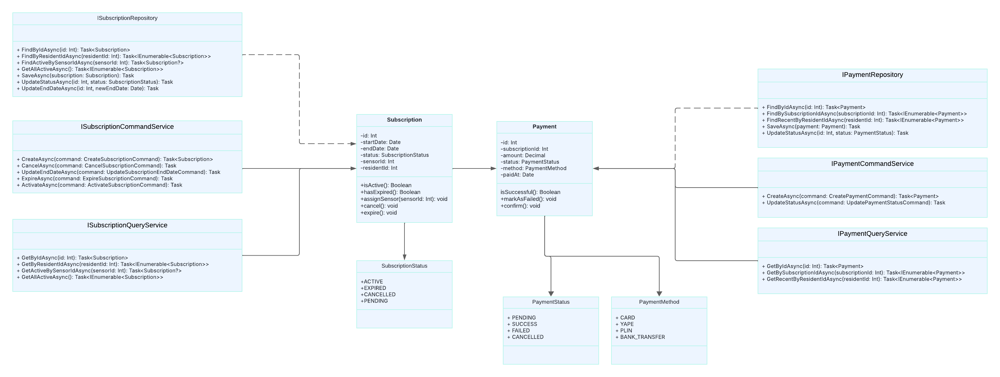
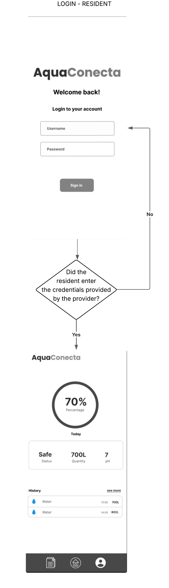
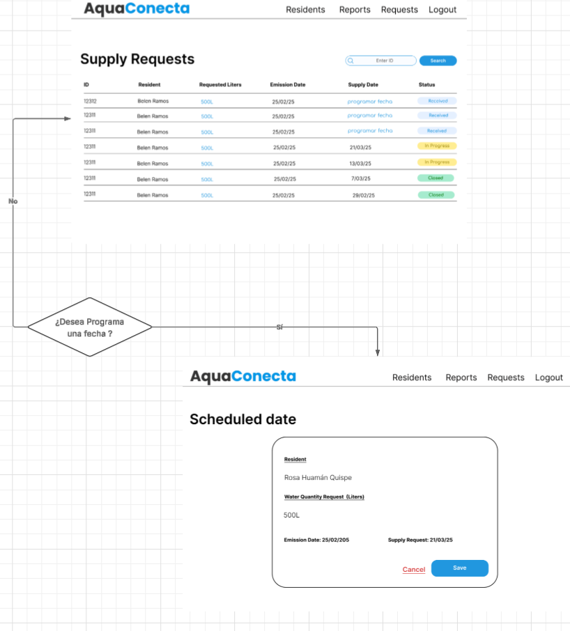
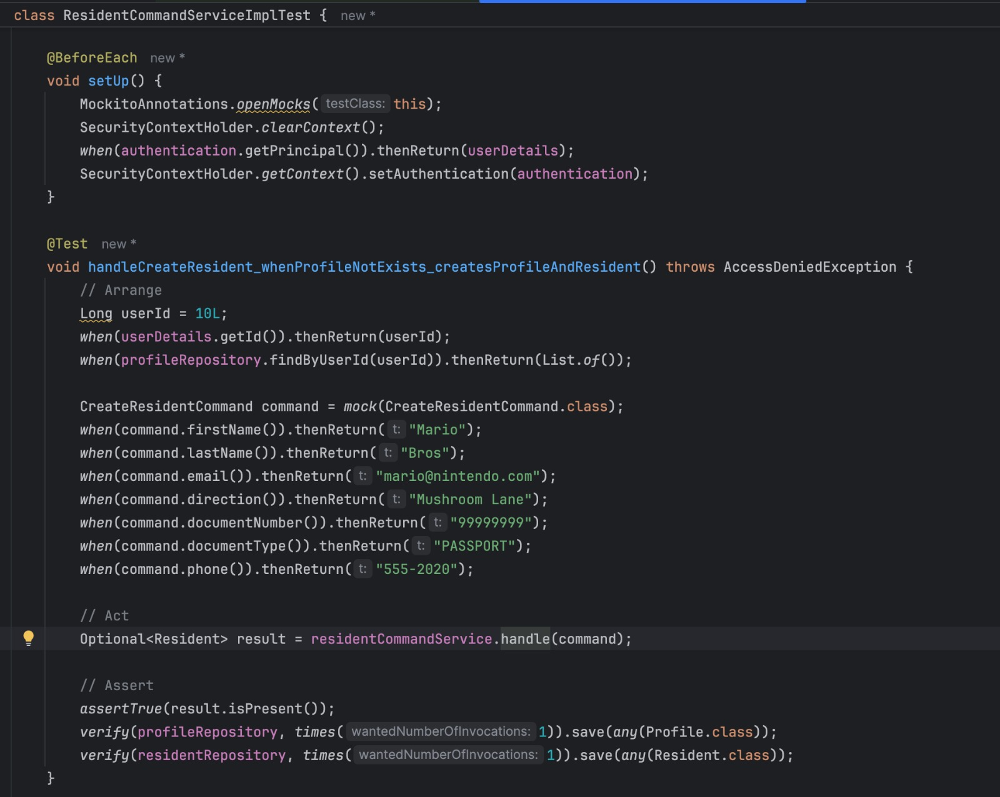

# 
COURSE PROJECT

    <strong>Universidad Peruana de Ciencias Aplicadas</strong> 
     
    <strong>Ingeniería de Software</strong> 
    <strong>Desarrollo de Soluciones IOT - 2947</strong> 
    <strong>Profesor: Angel Augusto Velasquez Nuñez </strong> 
     <strong>INFORME</strong>

<h4 style="text-align: center;"><strong>Startup: IronCoders</strong></h4>

<h4 style="text-align: center;"><strong>Product: AquaConecta</strong></h4>

<h5 style="text-align: center;"> Team Members</h5>

<table style="margin-left: auto; margin-right: auto; text-align: center;">
  <thead>
    <tr>
      <th>Member</th>
      <th>Code</th>
    </tr>
  </thead>
  <tbody>
    <tr>
      <td>Aguilar Castillo, Rodrigo</td>
      <td>U202210584</td>
    </tr>
    <tr>
      <td>Carmelino Dueñas, Michael Stefano</td>
      <td>U202212760</td>
    </tr>
    <tr>
      <td>Cortez Quezada, Joaquin Antonio</td>
      <td>U202212648</td>
    </tr>
    <tr>
      <td>Párraga Gamarra, Paolo Gonzalo</td>
      <td>U202219186</td>
    </tr>
    <tr>
      <td>Periche Quiroga, Piero</td>
      <td>U202210192</td>
    </tr>
    <tr>
      <td>Ramos Argüelles, Alexandra Belen</td>
      <td>U202215164</td>
    </tr>
  </tbody>
</table>

# Registro de Versiones del Informe

|**Versión**|**Fecha**|**Autor**|**Descripción de modificación**|
| :-: | :-: | :-: | :-: |
|1\.0|7/04/2025|Rodrigo Aguilar Castillo|Redacción del perfil de la Startup.|
|1\.1|9/04/2025|Rodrigo Aguilar Castillo|Actualización de la descripción de las 5W y 2H.|
|1\.2|10/04/2025|Piero Periche Quiroga|Redacción de Lean UX Statement y agregar Lean UX Canvas del Capítulo I.|
|1\.3|11/04/2025|Joaquin Antonio Cortez Quezada|Agregar información acerca de los competidores.|
|1\.4|12/04/2025|Rodrigo Aguilar Castillo|Actualización de las hipótesis y redacción de user outcomes.|
|1\.5|14/04/2025|Piero Periche Quiroga|Actualización de Lean UX Assumptions.|
|1\.6|15/04/2025|Rodrigo Aguilar Castillo|Actualización de how much, elaboración de user task matrix y ubiquitous language.|
|1\.7|15/04/2024|Alexandra Belen Ramos Argüelles|Elaboración de user personas y user journey mapping por segmento objetivo.|
|1\.8|16/04/2024|Rodrigo Aguilar Castillo|Elaboración de event storming.|
|1\.9|16/04/2024|Paolo Gonzalo Párraga Gamarra|Elaboración de to-be scenario mapping.|
|2\.0|19/04/2025|Alexandra Belen Ramos Argüelles|Redacción de user stories, technical stories y elaboración de empathy mapping.|
|2\.1|20/04/2025|Alexandra Belen Ramos Argüelles|Elaboración de impact mapping y as-is scenario mapping por cada segmento objetivo.|
|2\.2|20/04/2025|Paolo Gonzalo Párraga Gamarra|Elaboración de product backlog.|
|2\.3|20/04/2025|Rodrigo Aguilar Castillo|Elaboración del bounded context de subscription and payment, user and profile, deployment diagrams.|
|2\.4|24/04/2025|Rodrigo Aguilar Castillo|Elaboración de user and profile management (c4 model).|
|2\.5|24/04/2025|Michael Stefano Carmelino Dueñas|Elaboración de las user stories para la landing page.|
|2\.6|25/04/2025|Michael Stefano Carmelino Dueñas|Agregar entrevista y resumen de entrevistas para segmento objetivo de habitantes.|
|2\.7|25/04/2025|Paolo Gonzalo Párraga Gamarra|Elaboración en bounded context canvas de analytics, modificación de to-be scenario mapping.|
|2\.8|25/04/2025|Joaquin Antonio Cortez Quezada|Elaboración en bounded context canvas de management.|
|2\.9|25/04/2025|Rodrigo Aguilar Castillo|Actualización de entrevistas, agregar contenido a bibliografía.|
|3\.0|25/04/2025|Alexandra Belen Ramos Argüelles|Elaboración de domain message flows modeling y context mapping.|
|3\.1|06/05/2025|Rodrigo Aguilar Castillo|Agregar conceptos de sensor y eventos a los diagramas|
|3\.2|07/05/2025|Paolo Gonzalo Párraga Gamarra|Actualización de product backlog.|
|3.3|08/06/2025|Rodrigo Aguilar Castillo|Actualización de product backlog y user stories para Sprint 2.|
|3.4|10/06/2025|Michael Stefano Carmelino Dueñas|Actualización de evidencia de desarrollo y commits de frontend y mobile app.|
|3.5|12/06/2025|Paolo Gonzalo Párraga Gamarra|Actualización de evidencia de backend, documentación de endpoints y despliegue en Netlify.|
|3.6|13/06/2025|Alexandra Belen Ramos Argüelles|Actualización de user journey mapping y empathy mapping para nuevos segmentos.|
|3.7|14/06/2025|Joaquin Antonio Cortez Quezada|Actualización de bounded context canvas y diagramas de clases para management y analytics.|
|3.8|15/06/2025|Piero Periche Quiroga|Actualización de documentación de arquitectura, diagramas de despliegue y base de datos.|
|3.9|16/06/2025|Rodrigo Aguilar Castillo|Revisión y actualización de la tabla de registro de versiones y ajustes finales de formato.|

# Project Report Collaboration Insights

Repositorios:

Proyecto: [https://github.com/IronCoders-IOT/Final-Project](https://github.com/IronCoders-IOT/Final-Project)

Frontend: [https://github.com/IronCoders-IOT/Frontend](https://github.com/IronCoders-IOT/Frontend)

Backend: [https://github.com/IronCoders-IOT/Backend](https://github.com/IronCoders-IOT/Backend)

Mobile: [https://github.com/IronCoders-IOT/mobile_iot](https://github.com/IronCoders-IOT/mobile_iot)

Edge: [https://github.com/IronCoders-IOT/Edge](https://github.com/IronCoders-IOT/Edge)

Embedded: [https://github.com/IronCoders-IOT/Embedded](https://github.com/IronCoders-IOT/Embedded)

### TB2

Para la entrega del TB2 se han realizado los procesos necesarios para lograr los objetivos propuestos de la entrega. Se toma en cuenta la importancia de la persistencia y como grupo nos dedicamos a mantener una frecuencia de commits y cambios proyectada a ser optima a futuro.

Se muestran evidencias de los commits realizados en la entrega de la TB2 en el informe.

[Colaboraciones del repositorio]

[Registro de los commits donde se realizaron la mayor cantidad]

En ambos casos se puede observar el incremento de modificaciones y revisiones en los dias jueves y una cantidad mayor de cambios que commits durante esos días.

---

# Contenido

[Registro de Versiones del Informe](#registro-de-versiones-del-informe)

[Project Report Collaboration Insights](#project-report-collaboration-insights)

[Student Outcome](#student-outcome)

[Capítulo I: Introducción](#capítulo-i-introducción)

[1.1 Startup Profile](#11-startup-profile)  
[1.1.1. Descripción de la Startup](#111-descripción-de-la-startup)  
[1.1.2. Perfiles de integrantes del equipo](#112-perfiles-de-integrantes-del-equipo)

[1.2. Solution Profile](#12-solution-profile)  
[1.2.1 Antecedentes y problemática](#121-antecedentes-y-problemática)  
[1.2.2 Lean UX Process.](#122-lean-ux-process)  
[1.2.2.1. Lean UX Problem Statements.](#1221-lean-ux-problem-statements)  
[1.2.2.2. Lean UX Assumptions.](#1222-lean-ux-assumptions)  
[1.2.2.3. Lean UX Hypothesis Statements.](#1223-lean-ux-hypothesis-statements)  
[1.2.2.4. Lean UX Canvas.](#1224-lean-ux-canvas)

[1.3. Segmentos objetivo.](#13-segmentos-objetivo)

[Capítulo II: Requirements Elicitation & Analysis](#capítulo-ii-requirements-elicitation--analysis)

[2.1. Competidores](#21-competidores)  
[2.1.1. Análisis competitivo](#211-análisis-competitivo)  
[2.1.2. Estrategias y tácticas frente a competidores](#212-estrategias-y-tácticas-frente-a-competidores)

[2.2. Entrevistas](#22-entrevistas)  
[2.2.1. Diseño de entrevistas](#221-diseño-de-entrevistas)    
[2.2.3. Análisis de entrevistas](#223-análisis-de-entrevistas)

[2.3. Needfinding](#23-needfinding)  
[2.3.1. User Personas](#231-user-personas)  
[2.3.2. User Task Matrix](#232-user-task-matrix)  
[2.3.3. User Journey Mapping](#233-user-journey-mapping)  
[2.3.4. Empathy Mapping](#234-empathy-mapping)  
[2.3.5. As-is Scenario Mapping](#235-as-is-scenario-mapping)

[2.4. Ubiquitous Language](#24-ubiquitous-language)

[Capítulo III: Requirements Specifications](#capítulo-iii-requirements-specification)

[3.1. To-Be Scenario Mapping](#31-to-be-scenario-mapping)

[3.2. User Stories](#32-user-stories)

[3.3. Impact Mapping](#33-impact-mapping)

[3.4. Product Backlog](#34-product-backlog)

[Capítulo IV: Solution Software Design](#capítulo-iv-solution-software-design)

[4.1. Strategic-Level Domain-Driven Design](#41-strategic-level-domain-driven-design)   
[4.1.1. Event Storming](#411-event-storming)             
[4.1.1.1 Candidate Context Discovery](#4111-candidate-context-discovery)    
[4.1.1.2 Domain Message Flows Modeling](#4112-domain-message-flows-modeling)    
[4.1.1.3 Bounded Context Canvases](#4113-bounded-context-canvases)    
[4.1.2. Context Mapping](#412-context-mapping)    
[4.1.3. Software Architecture](#413-software-architecture)    
[4.1.3.1. Software Architecture System Landscape Diagram](#4131-software-architecture-system-landscape-diagram)        
[4.1.3.2. Software Architecture Context Level Diagrams](#4132-software-architecture-container-level-diagrams)      
[4.1.3.3. Software Architecture Deployment Diagrams](#4133-software-architecture-deployment-diagrams)      
[4.2. Tactical-Level Domain-Driven Design](#42-tactical-level-domain-driven-design)       

[4.2.1. Bounded Context: Management](#421-bounded-context-management)   
[4.2.1.1. Domain Layer](#4211-domain-layer)    
[4.2.1.2. Interface Layer](#4212-interface-layer)    
[4.2.1.3. Application Layer](#4213-application-layer)    
[4.2.1.4. Infrastructure Layer](#4214-infrastructure-layer)    
[4.2.1.5. Bounded Context Software Architecture Component Level Diagrams](#4215-bounded-context-software-architecture-component-level-diagrams)     
[4.2.1.6. Bounded Context Software Architecture Code Level Diagrams](#4216-bounded-context-software-architecture-code-level-diagrams)     
[4.2.1.6.1. Bounded Context Domain Layer Class Diagrams](#42161-bounded-context-domain-layer-class-diagrams)      
[4.2.1.6.2. Bounded Context Database Design Diagram](#42162-bounded-context-database-design-diagram)      

[4.2.2. Bounded Context: Analytics](#422-bounded-context-analytics)    
[4.2.2.1. Domain Layer](#4221-domain-layer)    
[4.2.2.2. Interface Layer](#4222-interface-layer)    
[4.2.2.3. Application Layer](#4223-application-layer)    
[4.2.2.4. Infrastructure Layer](#4224-infrastructure-layer)    
[4.2.2.5. Bounded Context Software Architecture Component Level Diagrams](#4225-bounded-context-software-architecture-component-level-diagrams)    
[4.2.2.6. Bounded Context Software Architecture Code Level Diagrams](#4226-bounded-context-software-architecture-code-level-diagrams)    
[4.2.2.6.1. Bounded Context Domain Layer Class Diagrams](#42261-bounded-context-domain-layer-class-diagrams)    
[4.2.2.6.2. Bounded Context Database Design Diagram](#42262-bounded-context-database-design-diagram)     

[4.2.3. Bounded Context: Consulting](#423-bounded-context-consulting)     
[4.2.3.1. Domain Layer](#4231-domain-layer)     
[4.2.3.2. Interface Layer](#4232-interface-layer)     
[4.2.3.3. Application Layer](#4233-application-layer)    
[4.2.3.4. Infrastructure Layer](#4234-infrastructure-layer)    
[4.2.3.5. Bounded Context Software Architecture Component Level Diagrams](#4235-bounded-context-software-architecture-component-level-diagrams)    
[4.2.3.6. Bounded Context Software Architecture Code Level Diagrams](#4236-bounded-context-software-architecture-code-level-diagrams)    
[4.2.3.6.1. Bounded Context Domain Layer Class Diagrams](#42361-bounded-context-domain-layer-class-diagrams)     
[4.2.3.6.2. Bounded Context Database Design Diagram](#42362-bounded-context-database-design-diagram)      

[4.2.4. Bounded Context: Subscription](#424-bounded-context-subscription)     
[4.2.4.1. Domain Layer](#4241-domain-layer)     
[4.2.4.2. Interface Layer](#4242-interface-layer)     
[4.2.4.3. Application Layer](#4243-application-layer)    
[4.2.4.4. Infrastructure Layer](#4244-infrastructure-layer)    
[4.2.4.5. Bounded Context Software Architecture Component Level Diagrams](#4245-bounded-context-software-architecture-component-level-diagrams)    
[4.2.4.6. Bounded Context Software Architecture Code Level Diagrams](#4246-bounded-context-software-architecture-code-level-diagrams)    
[4.2.4.6.1. Bounded Context Domain Layer Class Diagrams](#42461-bounded-context-domain-layer-class-diagrams)    
[4.2.4.6.2. Bounded Context Database Design Diagram](#42462-bounded-context-database-design-diagram)    

[4.2.5. Bounded Context: Payment](#425-bounded-context-payment)    
[4.2.5.1. Domain Layer](#4251-domain-layer)    
[4.2.5.2. Interface Layer](#4252-interface-layer)    
[4.2.5.3. Application Layer](#4253-application-layer)    
[4.2.5.4. Infrastructure Layer](#4254-infrastructure-layer)    
[4.2.5.5. Bounded Context Software Architecture Component Level Diagrams](#4255-bounded-context-software-architecture-component-level-diagrams)    
[4.2.5.6. Bounded Context Software Architecture Code Level Diagrams](#4256-bounded-context-software-architecture-code-level-diagrams)    
[4.2.5.6.1. Bounded Context Domain Layer Class Diagrams](#42561-bounded-context-domain-layer-class-diagrams)    
[4.2.5.6.2. Bounded Context Database Design Diagram](#42562-bounded-context-database-design-diagram)     

[4.2.6. Bounded Context: Automation](#426-bounded-context-automation)    
[4.2.6.1. Domain Layer](#4261-domain-layer)     
[4.2.6.2. Interface Layer](#4262-interface-layer)     
[4.2.6.3. Application Layer](#4263-application-layer)    
[4.2.6.4. Infrastructure Layer](#4264-infrastructure-layer)    
[4.2.6.5. Bounded Context Software Architecture Component Level Diagrams](#4265-bounded-context-software-architecture-component-level-diagrams)    
[4.2.6.6. Bounded Context Software Architecture Code Level Diagrams](#4266-bounded-context-software-architecture-code-level-diagrams)    
[4.2.6.6.1. Bounded Context Domain Layer Class Diagrams](#42661-bounded-context-domain-layer-class-diagrams)    
[4.2.6.6.2. Bounded Context Database Design Diagram](#42662-bounded-context-database-design-diagram)     

[4.2.7. Bounded Context: Installation](#427-bounded-context-installation)     
[4.2.7.1. Domain Layer](#4271-domain-layer)     
[4.2.7.2. Interface Layer](#4272-interface-layer)     
[4.2.7.3. Application Layer](#4273-application-layer)     
[4.2.7.4. Infrastructure Layer](#4274-infrastructure-layer)     
[4.2.7.5. Bounded Context Software Architecture Component Level Diagrams](#4275-bounded-context-software-architecture-component-level-diagrams)     
[4.2.7.6. Bounded Context Software Architecture Code Level Diagrams](#4276-bounded-context-software-architecture-code-level-diagrams)     
[4.2.7.6.1. Bounded Context Domain Layer Class Diagrams](#42761-bounded-context-domain-layer-class-diagrams)     
[4.2.7.6.2. Bounded Context Database Design Diagram](#42762-bounded-context-database-design-diagram)     

[4.2.8. Bounded Context: Identity and Access Management](#428-bounded-context-identity-and-access-management)     
[4.2.8.1. Domain Layer](#4281-domain-layer)     
[4.2.8.2. Interface Layer](#4282-interface-layer)     
[4.2.8.3. Application Layer](#4283-application-layer)     
[4.2.8.4. Infrastructure Layer](#4284-infrastructure-layer)     
[4.2.8.5. Bounded Context Software Architecture Component Level Diagrams](#4285-bounded-context-software-architecture-component-level-diagrams)     
[4.2.8.6. Bounded Context Software Architecture Code Level Diagrams](#4286-bounded-context-software-architecture-code-level-diagrams)     
[4.2.8.6.1. Bounded Context Domain Layer Class Diagrams](#42861-bounded-context-domain-layer-class-diagrams)     
[4.2.8.6.2. Bounded Context Database Design Diagram](#42862-bounded-context-database-design-diagram)     

[4.2.9. Bounded Context: Notifications](#429-bounded-context-notifications)     
[4.2.9.1. Domain Layer](#4291-domain-layer)     
[4.2.9.2. Interface Layer](#4292-interface-layer)     
[4.2.9.3. Application Layer](#4293-application-layer)     
[4.2.9.4. Infrastructure Layer](#4294-infrastructure-layer)     
[4.2.9.5. Bounded Context Software Architecture Component Level Diagrams](#4295-bounded-context-software-architecture-component-level-diagrams)     
[4.2.9.6. Bounded Context Software Architecture Code Level Diagrams](#4296-bounded-context-software-architecture-code-level-diagrams)     
[4.2.9.6.1. Bounded Context Domain Layer Class Diagrams](#42961-bounded-context-domain-layer-class-diagrams)     
[4.2.9.6.2. Bounded Context Database Design Diagram](#42962-bounded-context-database-design-diagram)     

[Capítulo V: Solution UI/UX Design](#capítulo-v-solution-uiux-design)

[5.1 Style Guidelines](#51-style-guidelines)  
[5.1.1. General Style Guidelines](#511-general-style-guidelines)  
[5.1.2. Web Style Guidelines](#512-web-style-guidelines)  

[5.2 Software Architecture](#52-software-architecture)  
[5.2.1 Organization System](#521-organization-system)  
[5.2.2 Labeling System](#522-labeling-system)  
[5.2.3 SEO Tags and Meta Tags](#523-seo-tags-and-meta-tags)  
[5.2.4 Searching Systems](#524-searching-systems)  
[5.2.5 Navigation Systems](#525-navigation-systems)  

[5.3 Landing Page UI Design](#53-landing-page-ui-design)  
[5.3.1 Landing Page Wireframe](#531-landing-page-wireframe)  
[5.3.2 Landing Page Mock Up](#532-landing-page-mock-up)  

[5.4 Applications UX/UI Design](#54-applications-uxui-design)  
[5.4.1 Applications Wireframes](#541-applications-wireframes)  
[5.4.2 Applications Wireflow Diagrams](#542-applications-wireflow-diagrams)  
[5.4.3 Applications Mockups](#543-applications-mockups)  
[5.4.4 Applications User Flow Diagrams](#544-applications-user-flow-diagrams)  

[5.5 Applications Prototyping](#55-applications-prototyping)  

[Capítulo VI: Product Implementation, Validation & Deployment](#capítulo-vi-product-implementation-validation--deployment)

[6.1. Software Configuration Management](#61-software-configuration-management)  
[6.1.1. Software Development Environment Configuration](#611-software-development-environment-configuration)  
[6.1.2. Source Code Management](#612-source-code-management)  
[6.1.3. Guía de Estilo y Convenciones del Código Fuente](#613-guía-de-estilo-y-convenciones-del-código-fuente)  
[6.1.4. Configuración para el Despliegue de Software](#614-configuración-para-el-despliegue-de-software)  

[6.2. Implementación de Landing Page, Servicios y Aplicaciones](#62-implementación-de-landing-page-servicios-y-aplicaciones)  
[6.2.1. Sprint 1](#621-sprint-1)  
[6.2.1.1. Sprint Planning 1](#6211-sprint-planning-1)  
[6.2.1.2. Aspect Leaders and Collaborators](#6212-aspect-leaders-and-collaborators)  
[6.2.1.3. Sprint Backlog 1](#6213-sprint-backlog-1)  
[6.2.1.4. Development Evidence for Sprint Review](#6214-development-evidence-for-sprint-review)  
[6.2.1.5. Testing Suite Evidence for Sprint Review](#6215-testing-suite-evidence-for-sprint-review)  
[6.2.1.6. Execution Evidence for Sprint Review](#6216-execution-evidence-for-sprint-review)  
[6.2.1.7. Services Documentation Evidence for Sprint Review](#6217-services-documentation-evidence-for-sprint-review)  
[6.2.1.8. Software Deployment Evidence for Sprint Review](#6218-software-deployment-evidence-for-sprint-review)  
[6.2.1.9. Team Collaboration Insights during Sprint](#6219-team-collaboration-insights-during-sprint)  

[6.2.2. Sprint 2](#622-sprint-2)  
[6.2.2.1. Sprint Planning 2](#6221-sprint-planning-2)  
[6.2.2.2. Aspect Leaders and Collaborators](#6222-aspect-leaders-and-collaborators)  
[6.2.2.3. Sprint Backlog 2](#6223-sprint-backlog-2)  
[6.2.2.4. Development Evidence for Sprint Review](#6224-development-evidence-for-sprint-review)  
[6.2.2.5. Testing Suite Evidence for Sprint Review](#6225-testing-suite-evidence-for-sprint-review)  
[6.2.2.6. Execution Evidence for Sprint Review](#6226-execution-evidence-for-sprint-review)  
[6.2.2.7. Services Documentation Evidence for Sprint Review](#6227-services-documentation-evidence-for-sprint-review)  
[6.2.2.8. Software Deployment Evidence for Sprint Review](#6228-software-deployment-evidence-for-sprint-review)  
[6.2.2.9. Team Collaboration Insights during Sprint](#6229-team-collaboration-insights-during-sprint)  

[6.3 Validation Interviews](#63-validation-interviews)  
[6.3.1. Diseño de Entrevistas](#631-diseño-de-entrevistas)  
[6.3.2. Registro de Entrevistas](#632-registro-de-entrevistas)  
[6.3.3. Evaluaciones según heurísticas](#633-evaluaciones-según-heurísticas)  

[6.4. Video About-the-Product](#64-video-about-the-product)
             

[Conclusiones](#conclusiones)

[Conclusiones y recomendaciones](#conclusiones-y-recomendaciones)

[Video About-the-Team](#video-about-the-team)

[Bibliografía](#bibliografía)

[Anexos](#anexos)

# Student Outcome
El curso contribuye al cumplimiento del Student Outcome ABET:
ABET – EAC - Student Outcome 5
Criterio: La capacidad de funcionar efectivamente en un equipo cuyos miembros
juntos proporcionan liderazgo, crean un entorno de colaboración e inclusivo,
establecen objetivos, planifican tareas y cumplen objetivos.
En el siguiente cuadro se describe las acciones realizadas y enunciados de
conclusiones por parte del grupo, que permiten sustentar el haber alcanzado el logro
del ABET – EAC - Student Outcome 5.

| **Criterio Específico** | **Acciones Realizadas** | **Conclusiones** |
|-------------------------|-------------------------|------------------|
| Trabaja en equipo para proporcionar liderazgo en forma conjunta | **Alexandra Belen Ramos Argüelles**  **TB1:**  Lideré la organización del equipo en el proyecto AquaConecta, coordinando las reuniones, la definición de la estrategia de trabajo, y la organización de entregables. Supervisé los avances del event storming, la construcción de User Personas, la elaboración del Lean UX Canvas y el modelado de los principales diagramas técnicos, asegurando una visión integrada de todo el proyecto.  **TP1:**  Durante este entregable, coordiné las reuniones diarias y ayudé a asignar las User Stories de la Landing Page y de la Aplicación Web. Además, desarrollé y cumplí de acuerdo a los horario de entrega definidos.  **TB2:**  Durante este entregable apoyé con el desarrollo de los módulos de Mobile y Backend, coordinando la integración entre los diferentes componentes del sistema. Aseguré la comunicación efectiva entre el equipo de desarrollo para mantener la consistencia en el diseño y funcionalidad de la aplicación.    **Rodrigo Aguilar Castillo**  **TB1:**  Participé en la definición del flujo de usuarios, contribuyendo en la elaboración de los diagramas de interacción y apoyando en el diseño de la arquitectura de capas, especialmente en la identificación de servicios críticos como la gestión de sensores y eventos de AquaConecta.  **TP1:**  Para la TP1, me enfoqué en definir el Lean UX Problem Statement centrándome en un problema principal del usuario y corregir diagramas. Además, estuve a cargo de suepervisar y elaborar algunas vistas de aplicación web.  **TB2:**  Colabore activamente en el desarrollo del Backend así como di apoyo al Edge y Embedded, coordinando la integración entre los diferentes componentes del sistema. Ayudé a la implementación del Embedded con el Edge  y aseguré la comunicación efectiva entre estos para mantener la funcionalidad de la aplicación mobil.    **Michael Stefano Carmelino Dueñas**  **TB1:**  Diseñé el User Journey Mapping en inglés, alineando los pasos con los User Outcomes & Benefits. También corregí el Domain Message Flows Modeling para mantener consistencia con el lenguaje ubicuo.  **TP1:**  Participé activamente en el desarrollo de las interfaces de usuario y su implementación en la aplicación frontend. En colaboración con el equipo, organizamos y definimos cuidadosamente el flujo de cada interfaz. Este trabajo en equipo  permitió un progreso coordinado y eficiente, para garantizar que cada etapa del desarrollo cumpliera con los objetivos y necesidades del proyecto.  **TB2:**  Participé en el desarrollo del Frontend y brindé apoyo al desarrollo Mobile, coordinando la integración funcional del Frontend con el Backend desplegado, así como apoyando con el desarrollo de estilos de las principales vistas del mobile.    **Joaquin Antonio Cortez Quezada**  **TB1:**  Trabajé activamente en la definición de User Personas y en la identificación de segmentos de usuario (hogares, agricultores, técnicos). Además, participé en la construcción de los flujos de experiencia iniciales y en el diseño del User Journey Mapping.  **TP1:**  Participé activamente en el desarrollo de las interfaces de usuario y su implementación en la aplicación frontend. En colaboración con el equipo, organizamos y definimos cuidadosamente el flujo de cada interfaz. Este trabajo conjunto permitió un progreso coordinado y eficiente, para garantizar que cada etapa del desarrollo cumpliera con los objetivos y necesidades del proyecto.  **TB2:**  Para este entregable participé activamente en el desarrollo e implementación del Frontend así como apoyando con el Backend para ciertos endpoints y aseguré la comunicación efectiva entre el equipo de desarrollo para mantener la consistencia en el diseño y funcionalidad de la aplicación.    **Paolo Gonzalo Párraga Gamarra**  **TB1:**  Colaboré en el levantamiento de eventos de negocio durante las sesiones de event storming, apoyando además en la priorización de funcionalidades esenciales para el MVP y en la validación de los flujos de interacción usuario-sistema.  **TP1:**  Trabajé en los Bounded Context Canvases y me aseguré de que estuvieran en inglés. También revisé el Software Architecture Container Level Diagram, agregando la base de datos para sensores y textos explicativos. Diseñe algunas vistas de al app web en Figma.  **TB2:**  Colaboré activamente para el desarrollo de la aplicacion movil conectando cada endpoint al backend desplegado en la nube asi como refinando el diseño de las vistas o creando nuevas, apoyé para el desarrollo del Edge y Embedded asegurando una conexion entre estos dos productos.    **Piero Periche Quiroga**  **TB1:**  Participé en la validación técnica de los diagramas generados (Bounded Contexts, Arquitectura de Capas y Componentes), asegurando su consistencia con los requerimientos levantados y apoyando en la revisión de las entrevistas realizadas a los segmentos objetivo.  **TP1:**  Me encargué de implementar los SEO Tags y Meta Tags para la Landing Page. También guié al equipo en la creación del User Task Matrix, evitando soluciones técnicas antes de tiempo.  **TB2:**  En este entregable me apoyé en la integración de funcionalidades backend y frontend, con verificación de flujos de datos y realizando validación de endpoints para la implementacion del Frontend.  | El equipo demostró un liderazgo conjunto sólido, con Alexandra coordinando las acciones principales y cada integrante contribuyendo activamente al desarrollo de flujos, levantamiento de eventos, diseño técnico, experiencia de usuario y validación de artefactos. Se logró un avance integral del proyecto AquaConecta de manera organizada y colaborativa.     Durante el desarrollo del proyecto, cada uno de nosotros asumió iniciativas clave: desde la coordinación de reuniones diarias y la asignación de User Stories hasta la dirección de actividades técnicas como la implementación de GitFlow, el diseño de arquitectura y la configuración de entornos de desarrollo. Destacamos nuestra capacidad para guiar procesos críticos sin centralizar decisiones, fomentando así un liderazgo distribuido. |
| Crea un entorno colaborativo e inclusivo, establece metas, planifica tareas y cumple objetivos. | **Alexandra Belen Ramos Argüelles**  **TB1:**  Organicé y supervisé la planificación de tareas por etapas, estableciendo metas semanales claras y promoviendo espacios de discusión abiertos para garantizar la participación de todos los miembros en la toma de decisiones clave.  **TP1:**  Durante este entregable, organicé sesiones para participar y corregir algunos puntos mencionados con respecto al primer entregable y documenté los bounded contexts y los events en inglés. Además, nos comunicamos acertivamente para que todos compartieran sus ideas en el desarrollo de la Web App   **TB2:**  Lideré la planificación y coordinación de las actividades del equipo, estableciendo metas claras y objetivos específicos para cada nano sprint. Aseguré la comunicación efectiva entre los miembros del equipo y promoví un entorno de trabajo colaborativo e inclusivo.    **Rodrigo Aguilar Castillo**  **TB1:**  Participé en la coordinación de actividades técnicas, ayudando a definir prioridades en el diseño de flujos de usuario y contribuyendo a mantener la comunicación constante entre todos los miembros durante la construcción de diagramas técnicos.  **TP1:**  Para la TP1, Definí los criterios de aceptación para las User Stories de la Web App, evitando detalles técnicos y enfocándome en escenarios reales. También ayudé a actualizar el Product Backlog según las entregas y agregar la documentación de los nuevos capítulos.  **TB2:**  Propuse metas semanales para el desarrollo de los productos, definiendo prioridades y realizando reuniones semanales para verificar nuestro avance.    **Michael Stefano Carmelino Dueñas**  **TB1:**  Apoyé en la definición de objetivos técnicos semanales relacionados a la creación del Context Map y Bounded Context Canvas, facilitando la validación cruzada de entregables entre los integrantes.  **TP1:**  Para este entregable, implementé GitFlow para gestionar versiones del código y documenté estrategias competitivas, destacando las debilidades de otras empresas. Además, desarrollé las vistas de la aplicación web y de la landing en el tiempo correspondiente  **TB2:**  Participé activamente en la organización de la app móvil. Promoví la comunicación entre los frentes de desarrollo para evitar duplicidades y asegurar una experiencia de usuario uniforme.    **Joaquin Antonio Cortez Quezada**  **TB1:**  Colaboré activamente en las sesiones de planificación de funcionalidades desde la perspectiva del usuario, asegurando que las metas de experiencia de usuario y segmentación fueran contempladas en todas las decisiones estratégicas.  **TP1:**  Fomenté un entorno colaborativo e inclusivo, estableciendo metas claras y planificando tareas en equipo para cumplir con los objetivos del desarrollo de las interfaces frontend, asegurando alineación con las historias de usuario.  **TB2:**  Contribuí en la planificación de vistas del frontend, asegurando que estuvieran alineadas con los datos provenientes del backend. Apoyé a cada miembro del equipo a aportar mejoras tanto técnicas como de diseño.    **Paolo Gonzalo Párraga Gamarra**  **TB1:**  Aporté a la organización y priorización de tareas derivadas del event storming y participé en la planificación de las actividades relacionadas a la identificación de eventos críticos del sistema. **TP1:**  Organicé sesiones para desarrollar los wireflows de la aplicación, asegurando que todos contribuyeran. Además, documenté los resultados en el informe.  **TB2:**  Organicé sesiones conjuntas para definir y sincronizar tareas de la aplicación movil y frontend. A través de herramientas colaborativas, organicé la priorización de funcionalidades y aseguré que cada colaborador avanzara con objetivos claros y compartido.    **Piero Periche Quiroga**  **TB1:**  Contribuí en la planificación y validación de entregables parciales como diagramas técnicos y flujos de usuario, asegurando la correcta alineación de los entregables con los objetivos del proyecto definidos en las reuniones grupales.  **TP1:**  Para esta entrega, facilité las ideas sobre los procesos AsIs y ToBe, documentando mejoras. Además, recopilé feedback para los mock-ups, integrando aportes de todos.  **TB2:**  Para esta entrega garanticé ideas sobre la implementación del backend ya sea con endpoints o temas de orden de la estructura del projecto  | Gracias al liderazgo colaborativo y la participación activa de todos los integrantes, se logró establecer un entorno de trabajo inclusivo, con metas claras y planificación efectiva que garantizó el cumplimiento de los entregables y la calidad de los resultados obtenidos en AquaConecta.     Implementamos prácticas como sesiones de feedback grupales, documentación compartida y empleamos herramientas visuales para garantizar claridad y transparencia. Establecimos metas realistas mediante la descomposición de tareas en el Product Backlog y la definición de criterios de aceptación centrados en el usuario. Gracias a esta planificación detallada y a la adaptabilidad del equipo, logramos cumplir con los entregables en los plazos establecidos, desde los wireframes hasta el prototipo funcional.

# Capítulo I: Introducción

## 1.1. Startup Profile

### 1.1.1. Descripción de la Startup

AquaConecta es una empresa emergente que se destaca por su enfoque innovador en la implementación de soluciones IoT para optimizar el acceso y la distribución de agua potable. Fundada con el propósito de mejorar la gestión del suministro en comunidades que no cuentan con un servicio continuo, AquaConecta ha logrado posicionarse como un actor clave en el sector gracias a su capacidad para desarrollar plataformas tecnológicas que conectan a proveedores de agua con usuarios finales de manera eficiente y transparente.   

Nuestra empresa se caracteriza por su compromiso con la innovación, la sostenibilidad y el impacto social. En AquaConecta, creemos firmemente en el poder de la tecnología para transformar la forma en que las personas acceden a recursos esenciales. Por ello, nos enfocamos en ofrecer soluciones inteligentes que permitan monitorear en tiempo real la calidad y cantidad del agua, mejorando la toma de decisiones tanto para proveedores como para usuarios.  

Como empresa emergente, estamos comprometidos con un crecimiento sostenible y con la expansión de nuestro alcance tanto a nivel nacional como internacional. Nos enorgullece ser parte de una revolución tecnológica en la gestión del agua potable, y estamos entusiasmados por seguir desarrollando herramientas que promuevan una distribución más justa, eficiente y segura mediante nuestra tecnología IoT avanzada

#### Visión

La visión de AquaConecta es ser líder en soluciones IoT para el acceso y distribución eficiente de agua potable, ofreciendo tecnología de vanguardia que garantice la calidad, disponibilidad y gestión inteligente del recurso hídrico en comunidades de todo el mundo.

#### Misión

La misión de AquaConecta es desarrollar y ofrecer soluciones tecnológicas basadas en IoT que mejoren el acceso al agua potable, facilitando la conexión entre proveedores y comunidades sin suministro continuo, mediante herramientas que garanticen una distribución eficiente, transparente y sostenible.

### 1.1.2. Perfiles de los integrantes
| Nombre                   | Descripción | Foto |
|--------------------------|-------------|------|
| Rodrigo Aguilar Castillo | Soy Rodrigo, estudiante de Ingeniería de Software en la Universidad Peruana de Ciencias Aplicadas (UPC). Me apasiona la tecnología y los dispositivos electrónicos, y disfruto especialmente programar, lo cual se ha convertido en uno de mis principales pasatiempos. Siempre estoy buscando aprender nuevas herramientas y mejorar mis habilidades en el desarrollo de software.  **Habilidades Técnicas** - Desarrollo Frontend con **Angular** y **Vue** - Desarrollo Backend con **Java** y **Spring Boot** - Conocimientos en **C++** - Manejo intermedio de **SQL** | |
| Paolo Gonzalo Párraga Gamarra | Soy Paolo Párraga, estudiante de ingeniería de software en séptimo ciclo. Soy una persona que disfruta trabajar duro para lograr mis objetivos y nunca me rindo a pesar de los momentos difíciles. Me gusta el trabajo en equipo porque siento que puedo aportar a mis compañeros cuando lo necesiten.  **Habilidades Técnicas** - Desarrollo Frontend con **Angular** y **Vue** - Desarrollo Backend con **Java** y **Spring Boot** - Conocimientos en **C++** - Manejo intermedio de **SQL** | |
| Alexandra Belen Ramos Argüelles | Soy Alexandra Ramos, estudiante de la carrera de Ingeniería de Software en la Universidad Peruana de Ciencias Aplicadas (UPC), actualmente cursando el séptimo ciclo. Me considero una persona empática, responsable y perseverante. Disfruto trabajar en equipo y me adapto con facilidad a distintos entornos de colaboración. Creo firmemente que la comunicación asertiva y el apoyo mutuo son claves para alcanzar resultados significativos.  Me apasiona desarrollar soluciones tecnológicas que generen un impacto positivo en la sociedad, especialmente en contextos donde la innovación puede marcar la diferencia.  **Habilidades Técnicas** - Desarrollo Frontend con **Angular** y **Vue** - Desarrollo Backend con **Java** y **Spring Boot** - Conocimientos en **C++**, **C#** y **Python** |  |
| Michael Stefano Carmelino Dueñas | Soy Michael Carmelino, estudiante de la carrera de Ingeniería de Software en la Universidad Peruana de Ciencias Aplicadas (UPC), actualmente cursando el séptimo ciclo. Soy una persona que le gusta el trabajo en equipo donde haya una comunicación y formas de integrarse entre todos para llegar a un fin común.  Me gusta desarrollar proyectos que tengan que ver con la seguridad en ciertos aspectos pero también me gusta hacer proyectos que me den a mí facilidades en lo personal o por diversión.  **Habilidades Técnicas** - Desarrollo Frontend con **React** y **Tailwind** - Desarrollo Backend con **NestJS** y **Spring Boot** - Conocimientos en **C++**, **Python** y **Java** - Base de datos con **Supabase** |  |
| Joaquin Antonio Cortez Quezada | Soy Joaquin Antonio Cortez Quezada, actualmente estoy cursando el séptimo ciclo de la carrera de Ingeniería de Software en la UPC (Universidad Peruana de Ciencias Aplicadas). Me considero una persona perseverante, responsable, con la capacidad de aprender y adaptarme de forma rápida para enfrentar diversos desafíos tecnológicos.  **Habilidades Técnicas** - Desarrollo Frontend con **Angular** y **Vue** - Desarrollo Backend con **Java** y **Spring Boot** - Conocimientos en **C++**, **Python** - Manejo intermedio de **MySQL**, **PostgreSQL** |  |
| Piero Fernando Periche Quiroga | Soy Piero Fernando Periche Quiroga, estoy cursando el séptimo ciclo de la carrera de Ingeniería de Software en la UPC. Soy una persona responsable, perseverante y con la capacidad de aprender y aportar buenas ideas al equipo frente a los problemas que se puedan presentar.  **Habilidades Técnicas** - Desarrollo Frontend con **Vue** y **Angular** - Desarrollo Backend con **Java** y **C#** - Conocimiento en **MySQL** y **MongoDB** |  |

## 1.2. Solution Profile

AquaConecta nace como respuesta a la necesidad de mejorar el acceso y la distribución de agua potable en comunidades sin suministro constante. A través de una plataforma inteligente con tecnología IoT, conecta a proveedores con usuarios, permitiendo monitorear en tiempo real la calidad y cantidad del agua disponible.

Gracias a sus sensores y acceso desde dispositivos móviles o web, la solución facilita la planificación de rutas de distribución y brinda a los usuarios control total sobre su consumo. Su enfoque automatizado, accesible y centrado en datos la convierte en una herramienta eficiente para optimizar la gestión del agua y generar un impacto positivo en la calidad de vida de las personas.

### 1.2.1. Antecedentes y problemática

En regiones como **Ica y Chincha**, miles de familias enfrentan una grave crisis de acceso al agua potable, ya que solo el **13.3% de los hogares** cuentan con suministro continuo durante las 24 horas del día ([Infobae, 2024](https://www.infobae.com/peru/2024/09/08/alarma-por-la-falta-de-acceso-continuo-a-agua-potable-en-ica-solo-el-133-de-los-hogares-cuenta-con-el-servicio-las-24-horas/?utm_source=chatgpt.com)). Ante esta situación, muchas personas dependen del abastecimiento mediante **camiones cisterna**, lo cual resuelve de forma temporal la necesidad, pero genera nuevos desafíos en la gestión y control del recurso. A pesar de los esfuerzos de empresas como **Semapach** y la supervisión de organismos como **Sunass**, se identifican diversos problemas estructurales que dificultan una distribución justa y segura del agua.

#### Principales problemáticas identificadas:

- **Falta de trazabilidad y control por vivienda:** no hay un registro automatizado de cuánta agua se entrega a cada familia.  
- **Distribución ineficiente:** algunas zonas no reciben agua a tiempo o quedan fuera de la planificación.  
- **Riesgos en la calidad del agua:** no siempre se verifica si el agua distribuida por cisterna cumple los estándares de salubridad.  
- **Dependencia de métodos manuales:** muchas decisiones logísticas se toman sin apoyo de datos en tiempo real.  
- **Problemas sanitarios:** el almacenamiento en baldes o tanques sin tapa incrementa el riesgo de enfermedades como el dengue.  

Esta realidad evidencia la necesidad de adoptar soluciones tecnológicas, como sistemas de monitoreo IoT y plataformas digitales de gestión, que permitan optimizar el reparto, mejorar la transparencia y garantizar la calidad del agua entregada.

AquaConecta surge como una solución integral para enfrentar los desafíos en la distribución y gestión del agua potable en comunidades sin acceso continuo al servicio. Esta plataforma inteligente, basada en tecnología IoT, permite a las empresas proveedoras monitorear en tiempo real la calidad y cantidad de agua disponible directamente desde los tanques de almacenamiento en las viviendas, lo que mejora significativamente la trazabilidad y eficiencia del servicio.

Gracias a sensores instalados en cada tanque, se recopilan datos sobre niveles de agua, posibles contaminantes y consumo, los cuales son transmitidos a una aplicación web y móvil. Esto brinda a los usuarios finales información clara sobre su suministro, y a los proveedores una herramienta poderosa para planificar rutas de abastecimiento, priorizar zonas críticas y tomar decisiones basadas en datos reales.

Con AquaConecta, se optimiza la distribución, se reducen los riesgos sanitarios asociados al almacenamiento inseguro y se garantiza un uso más inteligente y equitativo del recurso hídrico. Esta solución no solo responde a una necesidad urgente, sino que también impulsa la transformación digital de los servicios de agua, promoviendo un acceso más justo, transparente y sostenible para todos.

#### Técnica de las 5W's y 2H's

##### ¿What? - ¿Cuál es el problema?

 Falta de control y visibilidad sobre el agua en tanques domésticos, lo que impide a las familias saber cuánta agua tienen y su calidad, y a los proveedores gestionar eficientemente las entregas.

##### ¿Who? - ¿Quienes son los beneficiarios?

 Las familias sin acceso continuo a agua potable y los proveedores de agua como empresas, municipalidades y ONGs que buscan optimizar la distribución y monitoreo del recurso.

 ##### ¿When? - ¿Cuando se origina el problema?
 El problema se origina de forma continua, especialmente cuando no hay acceso constante al agua potable, durante cortes inesperados, épocas de sequía o cuando el usuario no puede supervisar manualmente el estado del agua almacenada.

##### ¿Why? - ¿Por qué se origina el problema?

El problema se origina por el acceso limitado o intermitente al agua potable y la falta de control sobre su almacenamiento, lo que dificulta una distribución eficiente y transparente.

##### ¿Where? - ¿Dónde ocurre el problema?

El problema ocurre en hogares y comunidades de zonas urbanas periféricas y rurales con acceso limitado al agua, como Ica y Chincha, donde se depende de tanques y camiones cisterna para el abastecimiento.

##### ¿How? - ¿Como se origina el problema?

El problema se origina por la falta de visibilidad sobre el nivel y la calidad del agua en los tanques, debido a la ausencia de herramientas que permitan monitoreo continuo y acceso a información en tiempo real. Esto genera ineficiencia, desperdicio y desinformación.

##### ¿How much? - ¿Cuánto dinero está implicado?

AquaConecta ofrece planes mensuales entre S/500 y S/1,000, según la cantidad de usuarios que la empresa de agua gestione, e incluye monitoreo y gestión en tiempo real.
 
---                                                                                            
### 1.2.2 Lean UX Process.

El proceso Lean UX aborda la visión del modelo de negocio que respalda nuestro proyecto, siendo el producto principal nuestro software. A lo largo de este documento y en este capítulo, exploramos varios elementos clave de este proceso.

Comenzamos con los "Problem Statements", que abarcan aspectos como el dominio, los segmentos de clientes, los puntos de dolor, las brechas, la visión/estrategia y el segmento inicial. Siguiendo la metodología Lean UX, también consideramos las "Assumptions Statements" y las "Hypothesis Statements".

#### 1.2.2.1. Lean UX Problem Statements.

En muchas zonas rurales, las comunidades tienen un acceso limitado al agua potable debido a una distribución ineficiente y a la falta de información confiable sobre la calidad del agua. La ausencia de mecanismos efectivos de monitoreo en tiempo real dificulta la identificación de problemas en la red, impide una gestión basada en datos y limita la capacidad de tomar decisiones oportunas para mejorar la distribución y garantizar un suministro seguro.

Hemos observado que los gestores comunitarios suelen enfrentar dificultades para detectar fugas, identificar fallas en el sistema o conocer la calidad del agua en tiempo real, lo que con frecuencia deriva en respuestas tardías, desperdicio del recurso y riesgos para la salud de la población.

¿Cómo podemos implementar un sistema de monitoreo accesible y en tiempo real que permita a los gestores comunitarios mejorar la distribución y asegurar la calidad del agua en zonas rurales?

#### 1.2.2.2. Lean UX Assumptions.

En esta sección, veremos los Assumptions que podemos esperar de nuestra solución, desde los Features que debe tener, hasta los Outcomes en nuestra perspectiva y la de los usuarios.

**Features:**

Aqui veremos las herramientas que planeamos implementar en nuestra solución.

- Monitoreo en Tiempo Real de Calidad y Cantidad de Agua: Sensores IoT que recopilan datos sobre el caudal, presión, nivel de cloro, turbidez, entre otros parámetros del agua, enviando la información a una plataforma centralizada.
- Alertas Automatizadas: Notificaciones en tiempo real sobre anomalías en la calidad del agua o interrupciones en el suministro, dirigidas a autoridades locales, técnicos o responsables comunitarios.
- Dashboard Centralizado de Datos: Plataforma accesible desde dispositivos móviles o PC para visualizar gráficamente el estado del suministro, históricos y predicciones de comportamiento hídrico.
- Reportes Automáticos para Toma de Decisiones: Generación de reportes periódicos para los tomadores de decisiones, con métricas claves para planificación y mejora de la infraestructura.

**Business Outcomes:**

Acquisition (Base): [3,000 visitantes]
Las comunidades rurales, organizaciones sociales y municipalidades se enteran de nuestra solución a través de campañas en redes sociales, ferias tecnológicas rurales, charlas con ONGs y contenido educativo. Además, se realizarán alianzas con entidades públicas y privadas que promuevan la transformación digital en zonas rurales. Estimamos alcanzar inicialmente a 3,000 personas interesadas en el tema de gestión del agua.

Activation (Plateau): [900 usuarios : 100%]
De los visitantes, se espera que el 30% (900 usuarios) participen activamente en una demostración del sistema o soliciten un diagnóstico gratuito para su comunidad. En esta fase, los usuarios nos comparten información básica como ubicación de su sistema de agua, número de conexiones, tipo de infraestructura y principales problemas. También acceden por primera vez a nuestra plataforma con credenciales temporales.

Retention (Plateau + 1 level): [540 usuarios : 60%]
Tras la activación, un 60% de las comunidades implementan el sistema de manera continua y lo usan para monitorear su infraestructura hídrica. Estas comunidades acceden regularmente a los datos del sistema, reciben alertas automáticas y visualizan mejoras progresivas en su servicio, lo que incentiva el uso constante. Aquí se empieza a notar la reducción del 40% en interrupciones y se ve reflejada la mejora del 25% en la calidad del agua, validando la funcionalidad del producto.

Revenue (Plateau + 2 levels): [80 usuarios : ~15%]
De los usuarios retenidos, se proyecta que al menos el 15% opte por un plan de monitoreo avanzado, que incluye mantenimiento predictivo, personalización de alertas y análisis más profundo de los datos. Este grupo valora la capacidad del sistema para reducir un 30% los costos de operación, y está dispuesto a pagar por estas funcionalidades premium.

Referral (Top): [27 usuarios : 5% del total inicial]
Un 5% de los usuarios referirán nuestra solución a otras comunidades, ONGs o municipios, gracias a su experiencia positiva. Estos promotores naturales ayudan a amplificar nuestro alcance de forma orgánica, aportando nuevas oportunidades de implementación y reforzando nuestra posición como referente en soluciones IoT para zonas rurales.

## Users

En esta sección creamos un Proto-Persona como una suposición de cómo son nuestros usuarios, enfocándonos más en el aspecto de actitud.

| Demográfica                                   | Comportamiento                                                                                          | Necesidades / Obstáculos                                                                                      |
|----------------------------------------------|----------------------------------------------------------------------------------------------------------|----------------------------------------------------------------------------------------------------------------|
| Gestores de Agua Rurales:                    | - Supervisan el sistema de distribución de agua de toda una comunidad                                     | - Necesitan visibilidad total del estado del sistema hídrico                                                   |
| Municipalidad, ONG, Junta de usuarios        | - Tienen experiencia gestionando recursos públicos o sociales                                             | - Requieren reportes detallados para tomar decisiones técnicas y presupuestales                               |
|                                              | - Se enfrentan constantemente a reclamos por fallas o baja calidad del agua                               | - Necesitan detectar fallas rápidamente para reducir tiempos de respuesta e interrupciones                    |
|                                              | - Buscan optimizar los recursos disponibles y generar confianza con la comunidad                          | - Buscan fortalecer la transparencia y generar reportes públicos                                               |
| Personas en zonas vulnerables:               | - Sufren cortes de agua frecuentes o reciben agua de baja calidad                                         | - Quieren saber si el agua que consumen es segura para su familia                                              |
| Residentes de comunidades rurales            | - No cuentan con acceso directo a la gestión del agua                                                     | - Necesitan una forma accesible para reportar fallas o problemas                                                |
|                                              | - Se enteran de las fallas solo cuando el problema ya está avanzado                                       | - Buscan tener más información sobre lo que sucede con el servicio de agua                                     |
|                                              | - Participan en asambleas o reuniones comunales para expresar sus necesidades                             | - Necesitan confiar en los gestores del agua y saber que sus necesidades están siendo atendidas               |

## User Outcomes & Benefits

En esta sección se busca el lado más emocional y empatizar con el usuario para darles los outcomes correctos.

El usuario busca asegurar el acceso a agua segura y confiable para su comunidad, así como mejorar la eficiencia en la gestión del recurso hídrico. En este proceso, desea sentirse tranquilo, empoderado y respaldado por información clara que le permita tomar decisiones oportunas sin depender únicamente de inspecciones manuales. Nuestra solución IoT lo acerca a este logro personal al proporcionarle datos en tiempo real sobre la calidad del agua, permitiéndole anticiparse a posibles problemas y demostrando así su capacidad de liderazgo dentro de la comunidad. El usuario recurriría a nuestro producto porque necesita una herramienta accesible que le facilite detectar a tiempo contaminaciones o fallas en la red de distribución, sin requerir grandes conocimientos técnicos ni inversiones elevadas. Como resultado, observamos un cambio de comportamiento donde consulta la plataforma con mayor frecuencia, responde con rapidez ante eventos anómalos, informa de forma más precisa a su comunidad y optimiza los recursos en la gestión del agua, evidenciando que ha alcanzado su objetivo.

Solutions
A partir de los problemas detectados en las entrevistas y el contexto rural, proponemos las siguientes soluciones tecnológicas:

- Monitoreo de calidad del agua (pH, turbidez, temperatura):

Problema: Las comunidades no tienen forma de detectar a tiempo si el agua está contaminada.

Solución: Sensores que miden en tiempo real parámetros como pH, turbidez y temperatura del agua.

Resultado: El sistema emite alertas inmediatas si se detecta contaminación, lo que permite prevenir enfermedades y mejorar la salud pública.

- Alertas automáticas ante condiciones críticas:

Problema: La falta de monitoreo continuo genera respuestas tardías ante emergencias sanitarias.

Solución: Plataforma que notifica automáticamente a los gestores mediante SMS o app cuando se detectan valores anómalos.

Resultado: Reducción significativa del tiempo de reacción ante problemas, lo que minimiza riesgos sanitarios.

- Panel de control comunitario:

Problema: Los gestores y ciudadanos no tienen acceso a información visual y clara sobre el estado del agua.

Solución: Dashboard con indicadores simples y accesibles (semáforo de calidad, gráficas por día, semana y mes).

Resultado: Mejora de la transparencia, empoderamiento ciudadano y participación comunitaria en el cuidado del agua.

- Historial de datos y reportes automáticos:

Problema: No se cuenta con registros para evaluar tendencias o realizar auditorías.

Solución: Almacenamiento de datos históricos accesibles en cualquier momento y generación de reportes descargables.

Resultado: Mejora de la planificación, mantenimiento predictivo e informes técnicos para autoridades o donantes.

- Funcionalidad offline y bajo consumo energético:

Problema: En zonas remotas no hay conectividad constante ni acceso a energía eléctrica.

Solución: Uso de sensores con batería solar, comunicación vía redes LoRa o GSM y almacenamiento local en el dispositivo.

Resultado: Asegura la continuidad del monitoreo en cualquier entorno, incluso sin internet.

**Business Assumptions:**

Estos son los puntos que podemos asumir de nuestro negocio.

1. Existe una necesidad urgente de mejorar la gestión del agua en zonas rurales, especialmente en lugaers en vías de desarrollo.
2. Esta necesidad puede resolverse con una solución IoT accesible, autónoma y fácil de usar por personal técnico o líderes comunitarios.
3. El valor principal que buscan los clientes es una forma confiable y económica de monitorear y mejorar el sistema hídrico sin requerir grandes inversiones.
4. Nuestros clientes potenciales serán principalmente gobiernos locales, ONGs, cooperativas y empresas sociales con foco en desarrollo rural.
5. Obtendremos ingresos a través de un modelo mixto: venta de kits IoT + suscripción a la plataforma de monitoreo, con opciones de personalización e integración.
6. Aunque existen soluciones similares, muchas son costosas o complejas. Nuestra ventaja está en la adaptabilidad, escalabilidad y soporte local.
7. El mayor riesgo es la falta de conectividad o acceso a tecnologías en zonas remotas.
8. Planeamos mitigar este riesgo mediante tecnologías de bajo consumo energético, almacenamiento offline y comunicación vía redes alternativas (LoRa, GSM, etc.).

#### 1.2.2.3. Lean UX Hypothesis Statements.
### Hipótesis del Proyecto

- **Hipótesis 1:**  
  Creemos que lograremos el posicionamiento como referentes en soluciones IoT para comunidades rurales,  
  si los gestores de agua obtienen una experiencia clara y visualmente intuitiva mediante el uso del dashboard centralizado de datos.

- **Hipótesis 2:**  
  Creemos que obtendremos una mejora significativa en la eficiencia operativa,  
  si los técnicos de mantenimiento reciben alertas automatizadas en tiempo real ante problemas en el sistema de distribución de agua.

- **Hipótesis 3:**  
  Creemos que se logrará una mejora en la calidad del agua distribuida,  
  si los gestores de agua pueden monitorear constantemente parámetros como turbidez, cloro y presión a través de los sensores IoT instalados.

- **Hipótesis 4:**  
  Creemos que se reducirá el tiempo de respuesta ante incidentes,  
  si los técnicos y responsables locales reciben notificaciones inmediatas mediante el sistema de alertas inteligentes.

- **Hipótesis 5:**  
  Creemos que la transparencia y la confianza comunitaria aumentarán,  
  si los líderes comunitarios tienen acceso a reportes automáticos y comprensibles sobre la calidad y cantidad de agua disponible.

- **Hipótesis 6:**  
  Creemos que se logrará una reducción en los costos operativos del sistema de agua,  
  si los responsables de gestión pueden planificar mantenimientos preventivos usando datos históricos y predicciones del sistema.

- **Hipótesis 7:**  
  Creemos que podremos expandir la adopción de nuestra solución en comunidades rurales diversas,  
  si ofrecemos una plataforma adaptable a distintos niveles tecnológicos y conectividad, gracias al uso de tecnologías como LoRa y GSM.

#### 1.2.2.4. Lean UX Canvas.

A partir de todo lo que hemos investigado, creamos el Lean UX Canvas.

# Lean UX Canvas

| **Sección** | **Contenido** |
|:------------|:--------------|
| **1. Business Problem** | En muchas zonas rurales, las comunidades enfrentan un acceso limitado al agua potable debido a una distribución ineficiente y a la falta de información sobre la calidad del agua que consumen. Actualmente, no existen mecanismos efectivos que permitan monitorear en tiempo real tanto la cantidad como la calidad del agua distribuida, lo que impide tomar decisiones informadas para mejorar su distribución y asegurar su salubridad. |
| **2. Business Outcomes** | - Ser reconocidos como referentes en soluciones IoT para comunidades rurales. - Reducción del 40% en el tiempo de respuesta ante problemas de suministro. - Mejora del 25% en estándares de calidad del agua en zonas intervenidas. - Reducción del 30% en gastos de mantenimiento gracias al análisis predictivo. - Mayor transparencia y confianza por parte de la comunidad. |
| **3. Users** | - **Proveedores locales de agua:** encargados de distribuir, gestionar y mantener el servicio. - **Habitantes de viviendas:** consumidores de agua que podrían recibir alertas y monitorear calidad básica. |
| **4. User Outcomes & Benefits** | - Acceso a datos en tiempo real sobre calidad y cantidad del agua. - Toma de decisiones informadas ante emergencias. - Menor riesgo sanitario mediante acciones preventivas. - Simplificación de la gestión técnica. - Empoderamiento ciudadano en la gestión del recurso. - Mayor confianza entre comunidad y proveedores. |
| **5. Solutions** | - **Monitoreo en Tiempo Real:** uso de sensores IoT (caudal, presión, turbidez, cloro). - **Alertas Automatizadas:** notificaciones ante anomalías. - **Dashboard Centralizado:** visualización y reportes desde PC o móvil. - **Reportes para Toma de Decisiones:** informes periódicos para autoridades y líderes. |
| **6. Hypotheses** | - Creemos que lograremos reconocimiento como referentes IoT si los usuarios obtienen una experiencia clara en el dashboard. - Creemos que aumentará la eficiencia si los técnicos reciben alertas en tiempo real. - Creemos que mejorará la calidad del agua mediante monitoreo constante. - Creemos que se reducirá el tiempo de respuesta si las alertas llegan instantáneamente. - Creemos que se aumentará la confianza comunitaria si los reportes son comprensibles. - Creemos que se reducirán costos si los mantenimientos son planificados con base en datos. |
| **7. What's the Most Important Thing We Need to Learn First?** | - Los usuarios comprenden y valoran el dashboard como herramienta útil. - Las alertas en tiempo real llegan de forma adecuada y ayudan a técnicos. - El monitoreo de parámetros mejora efectivamente la calidad del agua. - Los reportes automáticos generan confianza en la comunidad. |
| **8. What's the Least Amount of Work We Need to Do to Learn the Next Most Important Thing?** | - **Encuestas Rápidas:** a líderes comunitarios y técnicos. - **Pruebas de Concepto:** piloto básico con sensores y dashboard. - **Análisis de Factibilidad Técnica:** validar conectividad en zonas objetivo. - **Recolección de Feedback:** iterar con base en la experiencia de usuarios. |

## 1.3. Segmentos objetivo.
| Variables    | Segmento 1 - Habitantes | Segmento 2 - Proveedores |
|--------------|-------------------------|---------------------------|
| Geográfica   | Comunidades rurales, asentamientos urbanos marginales o zonas residenciales donde el acceso a agua segura puede ser limitado o de baja calidad. | Empresas de servicios hidráulicos, ONG ambientales o proveedores locales de tecnología situados en zonas rurales, periurbanas o cercanas a zonas de alta necesidad hídrica. |
| Demográfica  | Personas de diversa edad y género, principalmente familias o individuos interesados en mejorar su acceso a agua segura y en cuidar su entorno ambiental. | Profesionales técnicos o comerciales, de edad adulta, con formación o experiencia en gestión de recursos hídricos, instalación de sensores IoT o mantenimiento de redes de agua. |
| Psicológica  | Alta preocupación por la salud, calidad del agua y sostenibilidad. Buscan soluciones simples y accesibles para controlar su propio consumo y asegurar el bienestar familiar. | Enfoque orientado a brindar servicios de alta eficiencia. Valoran la innovación tecnológica para monitorear remotamente sensores, optimizar el uso del agua, cumplir estándares ambientales y ofrecer mantenimiento predictivo. |
# Capítulo II: Requirements Elicitation & Analysis

## 2.1. Competidores
- AguaClara: Iniciativa tecnológica centrada en brindar acceso a agua potable en comunidades rurales mediante plantas de tratamiento modulares de bajo costo. Su enfoque se basa en la sostenibilidad, el empoderamiento comunitario y la facilidad de mantenimiento, ofreciendo soluciones que pueden ser operadas y mantenidas por las mismas comunidades, aunque con limitadas capacidades digitales o de monitoreo en tiempo real.
- Ingeniería Ambiental SAC: Empresa peruana especializada en el diseño e implementación de proyectos ambientales, especialmente en el área de tratamiento y distribución de agua potable. Ofrece servicios de ingeniería, consultoría y ejecución de sistemas hidráulicos convencionales, dirigidos principalmente a entidades públicas, empresas privadas y gobiernos regionales, con un enfoque más técnico que tecnológico.
- Transporte de Agua Potable Espinoza: Negocio local dedicado al suministro de agua potable mediante camiones cisterna, atendiendo zonas urbanas y periurbanas con escaso acceso a redes de agua. Su modelo de negocio se basa en la distribución directa bajo demanda, sin integrar herramientas tecnológicas de monitoreo o control de calidad del recurso hídrico.

### 2.1.1. Análisis competitivo

<table> 
  <tr>
    <th colspan="7" valign="top"><b>Competitive Analysis Landscape</b></th>
  </tr>
  <tr>
    <td colspan="2" rowspan="2">¿Por qué llevar a cabo este análisis?</td>
  </tr>
  <tr>
    <td colspan="5">Para proporcionar información valiosa acerca de los competidores, lo cual nos servirá para mejorar la calidad de nuestra aplicación.</td>
  </tr>
  <tr>
    <td colspan="3"></td>
    <td colspan="1" valign="top" style="font-weight: bold;">AquaConecta</td>
    <td colspan="1" valign="top" style="font-weight: bold;">AguaClara</td>
    <td colspan="1" valign="top" style="font-weight: bold;">Ingeniería Ambiental SAC</td>
    <td colspan="1" valign="top" style="font-weight: bold;">Transporte de Agua Potable Espinoza</td>
  </tr>
  <tr>
    <td colspan="1" rowspan="2">
Perfil
</td>
    <td colspan="2">Overview</td>
    <td colspan="1" valign="top">
      AquaConecta optimiza la distribución de agua potable conectando proveedores con comunidades sin acceso continuo, mediante monitoreo en tiempo real usando un enfoque tecnológico (IoT).
    </td>
    <td colspan="1" valign="top">
      AguaClara mejora el acceso al agua potable en comunidades rurales mediante un sistema de distribución eficiente, coordinado con gobiernos y ONGs. 
    </td>
    <td colspan="1" valign="top">
      La empresa se especializa en el abastecimiento de agua potable e industrial. Proporcionan cisternas adecuadamente equipadas para el transporte de agua hacia ubicaciones remotas.
    </td>
    <td colspan="1" valign="top">
      La empresa se dedica a la venta y distribución de agua potable para consumo. Cuenta con una flota moderna de camiones cisterna.
    </td>
  </tr>
  <tr>
    <td colspan="2">Ventaja competitiva</td>
    <td colspan="1" valign="top">
      Brinda distribución eficiente, monitoreo inteligente y mayor transparencia en el acceso al agua potable.
    </td>
    <td colspan="1" valign="top">
      Ofrece acceso continuo a agua segura en zonas rurales mediante una distribución organizada y siguiendo un modelo de bajo costo.
    </td>
    <td colspan="1" valign="top">
      Brinda abastecimiento de agua para una variedad de aplicaciones y brinda precios personalizados basados en las necesidades del cliente.
    </td>
    <td colspan="1" valign="top">
      Ofrece el servicio de distribución de agua potable en zonas donde el suministro puede ser intermitente o limitado.
    </td>
  </tr>
  <tr>
    <td colspan="1" rowspan="3">
Perfil de Marketing
</td>
    <td colspan="2">Mercado objetivo</td>
    <td colspan="1" valign="top">
      Comunidades en zonas urbanas y rurales con servicio intermitente de agua potable. Empresas proveedoras de agua.
    </td>
    <td colspan="1" valign="top">
      Comunidades rurales con acceso limitado a agua potable. Instituciones públicas o ONG's interesadas en desarrollos de proyectos sostenibles.
    </td>
    <td colspan="1" valign="top">
      Proyectos industriales que necesitan gran volumen de agua.
    </td>
    <td colspan="1" valign="top">
      Hogares que carecen de suministro de agua potable. Proyectos comerciales o industriales.
    </td>
  </tr>
  <tr>
    <td colspan="2">Estrategias de marketing</td>
    <td colspan="1" valign="top">
      Alianzas estratégicas con municipalidades y ONG's, además de una fuerte presencia en las redes sociales.
    </td>
    <td colspan="1" valign="top">
      Cuenta con alianzas estratégicas con municipalidades y ONG's. Además, comunidades beneficiadas recomiendan el servicio a través del boca a boca.
    </td>
    <td colspan="1" valign="top">
      Ofrece tarifas ajustadas a las necesidades específicas de cada cliente. Además, cuenta con atención disponible las 24 horas a través de canales como WhatsApp, teléfono y correo.
    </td>
    <td colspan="1" valign="top">
      Brindan confiabilidad, puntualidad y se centran en la satisfacción del cliente.
    </td>
  </tr>
  <tr>
    <td colspan="1" rowspan="3">
Perfil de Producto
</td>
    <td colspan="2">Productos & Servicios</td>
    <td colspan="1" valign="top">
      Distribución de agua potable y monitoreo en tiempo real del nivel y calidad del agua a través de sensores.
    </td>
    <td colspan="1" valign="top">
      Servicio de distribución de agua potable mediante rutas planificadas para camiones cisterna.
    </td>
    <td colspan="1" valign="top">
      Alquiler de cisternas y abastecimiento de agua potable para proyectos mineros, laboratorios, comedores, etc.
    </td>
    <td colspan="1" valign="top">
      Distribución de agua potable para consumo humano, obras civiles, agrícolas o eventos especiales.
    </td>
  </tr>
  <tr>
    <td colspan="2">Precios & Costos</td>
    <td colspan="1" valign="top">
      Precios personalizados que se ajustan a las necesidades específicas de cada cliente.
    </td>
    <td colspan="1" valign="top">
      Costo bajo o subsidiado ya que trabajan junto a gobiernos o ONG's.
    </td>
    <td colspan="1" valign="top">
      Precios personalizados que se ajustan a las necesidades específicas de cada cliente.
    </td>
    <td colspan="1" valign="top">
      Precios personalizados que se ajustan a las necesidades específicas de cada cliente.
    </td>
  </tr>
  <tr>
    <td colspan="2">Canales de distribución (Web y/o Móvil)</td>
    <td colspan="1" valign="top">
      Sitio web con información esencial para nuestros usuarios, además de una aplicación web y móvil.
    </td>
    <td colspan="1" valign="top">
      Implementación física directa del equipo técnico, no posee una plataforma web comercial.
    </td>
    <td colspan="1" valign="top">
      Canales de comunicación por correo y telefonía. Asimismo, cuenta con un sitio web para gestionar solicitudes.
    </td>
    <td colspan="1" valign="top">
      Canales de comunicación por correo, telefonía y redes sociales.
    </td>
  </tr>
  <tr>
    <td colspan="1" rowspan="5">
Análisis SWOT
</td>
    <td colspan="6">Realice esto para su startup y sus competidores. Sus fortalezas deberían apoyar sus oportunidades y contribuir a lo que ustedes definen como su posible ventaja competitiva.</td>
  </tr>
  <tr>
    <td colspan="2">Fortalezas</td>
    <td colspan="1" valign="top">
      Implementación de tecnologías IoT para el monitoreo en tiempo real del agua.
    </td>
    <td colspan="1" valign="top">
      Fuerte colaboración con gobiernos locales y ONG's. Presencia en zonas rurales.
    </td>
    <td colspan="1" valign="top">
      Monitoreo de camiones cisterna por GPS, servicio personalizado y sólida experiencia en el sector.
    </td>
    <td colspan="1" valign="top">
      Experiencia en el rubro de distribución de agua y atención las 24 horas del día.
    </td>
  </tr>
  <tr>
    <td colspan="2">Debilidades</td>
    <td colspan="1" valign="top">
      Alta dependencia de la conectividad a internet para operar.
    </td>
    <td colspan="1" valign="top">
      Limitada incorporación de tecnologías IoT.
    </td>
    <td colspan="1" valign="top">
      Costos variables pueden generar incertidumbre en los costos finales.
    </td>
    <td colspan="1" valign="top">
      Falta de presencia digital sólida y poca innovación tecnológica.
    </td>
  </tr>
  <tr>
    <td colspan="2">Oportunidades</td>
    <td colspan="1" valign="top">
      Aprovechamiento de la baja penetración de tecnologías similares en el sector hídrico.
    </td>
    <td colspan="1" valign="top">
      Aumento del alcance con plataforma web e implementación de soluciones digitales como aplicaciones móviles.
    </td>
    <td colspan="1" valign="top">
      Implementación de soluciones tecnológicas como aplicaciones móviles.
    </td>
    <td colspan="1" valign="top">
      Integración de tecnologías IoT para monitoreo en tiempo real de entregas.
    </td>
  </tr>
  <tr>
    <td colspan="2">Amenazas</td>
    <td colspan="1" valign="top">
      Posible resistencia al cambio por parte de proveedores convencionales.
    </td>
    <td colspan="1" valign="top">
      Dificultad para operar sistemas en zonas remotas sin soporte técnico constante.
    </td>
    <td colspan="1" valign="top">
      Aparición de soluciones tecnológicas más eficientes.
    </td>
    <td colspan="1" valign="top">
      Problemas logísticos por tráfico o escasez de agua.
    </td>
  </tr>
</table>

### 2.1.2. Estrategias y tácticas frente a competidores

AquaConecta implementará una estrategia de diferenciación tecnológica al ofrecer un sistema de monitoreo inteligente del consumo de agua en tiempo real, una propuesta que actualmente no es atendida de forma precisa por sus principales competidores. Esto permitirá posicionarse como una solución innovadora tanto para hogares como para proveedores de agua.

Nuestra estrategia se basa en aprovechar las principales debilidades detectadas en los competidores actuales del mercado. En primer lugar, la limitada incorporación de tecnologías IoT representa una oportunidad clave para diferenciarnos. Integramos sensores inteligentes que permiten monitorear en tiempo real tanto la cantidad como la calidad del agua, así como el estado de los tanques. Esto no solo optimiza el servicio, sino que también proporciona datos valiosos para la toma de decisiones y el mantenimiento predictivo.

En segundo lugar, frente a la incertidumbre generada por los costos variables que ofrecen otras empresas, implementamos un modelo de tarifa plana mediante suscripción, que brinda a los usuarios mayor previsibilidad, control y confianza sobre sus pagos mensuales. Esto también fortalece la relación a largo plazo con nuestros clientes al eliminar sorpresas financieras.

Por último, ante la escasa presencia digital y la falta de innovación tecnológica de nuestros competidores, hemos desarrollado una plataforma web y móvil robusta, intuitiva y moderna, que permite a los usuarios registrarse, actualizar sus datos, revisar el estado del servicio y realizar solicitudes de forma rápida y sencilla. Esta propuesta refuerza nuestro posicionamiento como una empresa innovadora, accesible y centrada en la experiencia del usuario.

## 2.2. Entrevistas

### 2.2.1. Diseño de entrevistas
**Preguntas Generales**

1. ¿Cuál es su nombre? 
2. ¿Qué edad tiene? 
3. ¿A qué se dedica? 
4. ¿Que navegador usa?
5. ¿Que dispositivo usa con mas frecuencia y de que marca es?
6. ¿En que distrito se encuentra?

**Entrevistas usuario segmento (Habitantes)**

1. ¿Cómo obtienen actualmente el agua para el consumo diario?
2. ¿Sienten que el agua que reciben es segura? ¿Por qué?
3. ¿Han tenido problemas de salud relacionados con el agua en los últimos años?
4. ¿Qué hacen cuando sospechan que el agua está contaminada?
5. ¿Con qué frecuencia reciben información sobre la calidad del agua?
6. ¿Quién les informa actualmente sobre el estado del agua?
7. ¿Confían en la información que reciben sobre la calidad del agua?
8. ¿Les gustaría recibir alertas si el agua no es apta para el consumo?
9. ¿Qué tan importante consideran la calidad del agua en su bienestar diario?
10. ¿Estarían dispuestos a participar en el cuidado o monitoreo del sistema si eso ayudara a su comunidad?

**Entrevistas usuario segmento (Proveedores de agua)**
1. ¿Cuáles son los principales retos que enfrentan en la supervisión de la calidad del agua?
2. ¿Qué procesos siguen actualmente para analizar el agua en zonas rurales?
3. ¿Con qué frecuencia se realiza el control de calidad del agua?
4. ¿Qué tipo de datos les gustaría poder monitorear en tiempo real (pH, turbidez, cloro, etc.)?
5. ¿Qué herramientas utilizan para almacenar y analizar los datos del agua?
6. ¿Cómo actúan cuando detectan un problema de calidad en alguna zona?
7. ¿Qué costos están asociados actualmente al monitoreo de agua?
8. ¿Cuánto tiempo tardan en detectar y responder a una posible contaminación?
9. ¿Qué impacto creen que tendría un sistema IoT en su trabajo y en la comunidad?
10. ¿Qué funcionalidades consideran imprescindibles en una solución como esta?

### 2.2.2. Registro de entrevistas

**Link del video de las entrevistas:**

[Entrevistas-AquaConecta](https://upcedupe-my.sharepoint.com/:v:/g/personal/u202215164_upc_edu_pe/EQ2szUgizAFFlLb9ebCtKPAB0ZZNenUhn9z4QF3rskW70g?nav=eyJyZWZlcnJhbEluZm8iOnsicmVmZXJyYWxBcHAiOiJPbmVEcml2ZUZvckJ1c2luZXNzIiwicmVmZXJyYWxBcHBQbGF0Zm9ybSI6IldlYiIsInJlZmVycmFsTW9kZSI6InZpZXciLCJyZWZlcnJhbFZpZXciOiJNeUZpbGVzTGlua0NvcHkifX0&e=BQnFmi)

**Entrevistas usuario segmento (Habitantes)**

**Segmento Doméstico**  
Nombre: Rodrigo Noreña Nuñez
 
- Edad: 20
 
- Ocupación: Estudiante de Arquitectura
 
- Browser: Google Chrome
 
- Device: Teléfono Iphone
 
- Distrito: Chincha Alta
 
- Timing: 0:00
 
- Marca: Techo
 

  

Rodrigo Noreña, un joven residente de Chincha, nos cuenta que desde pequeño recuerda cómo llegaban cisternas a su barrio para repartir agua a las viviendas. Comenta que ni él ni sus vecinos sabían con certeza cuánta agua recibían ni qué tan limpia era. Aunque hoy el servicio ha mejorado en algunas zonas, muchas personas siguen sin tener información clara sobre la calidad del agua que consumen. Rodrigo menciona que nunca ha visto un reporte oficial ni ha recibido alertas cuando el agua podría estar contaminada, y cree que sería muy útil contar con un sistema de monitoreo que no solo informe a tiempo, sino que también permita a los vecinos involucrarse activamente en el cuidado del recurso. Para él, el agua es clave para la salud, y confía en que más transparencia y tecnología podrían mejorar mucho la vida en su comunidad.

Nombre: Jorge Medina Flores
 
- Edad: 34
 
- Ocupación: Agricultor
 
- Browser: Google Chrome
 
- Device: Teléfono Samsung
 
- Distrito: Poblado cercade la ciudad (Ica)
 
- Timing: 2:48
 
- Marca: Techo
 

  

Jorge Medina, un agricultor de 34 años que vive en una zona rural de Ica, nos comenta que utiliza principalmente un celular Samsung y navega con Google Chrome. Él y su comunidad obtienen agua a través de camiones cisterna, aunque menciona que no siempre alcanza para todos y que muchas veces no parece segura. Nos comenta que su esposa tuvo problemas estomacales, posiblemente por el agua. Aunque suelen hervirla, sabe que eso no garantiza su limpieza. Casi no reciben información oficial sobre la calidad del agua y desconfían de lo poco que oyen. Para él, el agua potable es fundamental para vivir bien, y nos comenta que estaría dispuesto a participar en acciones comunitarias que ayuden a mejorar esta situación.

Nombre: Sergio Aguirre
 
- Edad: 22
 
- Ocupación: Estudiante de Arquitectura
 
- Browser: Google Chrome
 
- Device: Teléfono Iphone
 
- Distrito: Pueblo Libre
 
- Timing: 7:10
 
- Marca: Techo
 

  

Sergio Aguirre, un joven residente de Ica, relata que en su comunidad el acceso al agua potable ha sido un desafío constante. En muchas ocasiones, el servicio es irregular y las personas deben almacenar agua durante varios días sin conocer realmente su calidad. Sergio comenta que su familia ha tenido que tomar precauciones básicas, como hervir el agua o filtrarla, pero aún así permanece la incertidumbre sobre si es realmente segura para el consumo. Además, menciona que nunca ha recibido alertas ni informes de las autoridades sobre posibles riesgos de contaminación. Considera que un sistema de monitoreo en tiempo real sería fundamental para brindar tranquilidad a las familias y permitir que la comunidad gestione mejor el cuidado del recurso. Para Sergio, el agua no solo es vital, sino que también representa un derecho que debe ser protegido mediante el uso de la tecnología.

**Entrevistas usuario segmento (Proveedor de agua)**
Nombre: Fabian Reyes Trujillano
 
- Edad: 24
 
- Ocupación: Empleado de Sedapal
 
- Browser: Google Chrome
 
- Device: Teléfono Samsung, Laptop Acer
 
- Distrito: SMP
 
- Timing: 7:10
 
- Marca: Sunass
 

  

Fabian Reyes, un trabajador de sedapal de 24 años, que vive en SMP, utiliza como navegador Chrome como dispositivos frecuentes su celular y laptop de marca Samsumg y Acer. En su trabajo nos cuenta como es que según la zona en la que trabaje, puede variar el tiempo para poder sacar medidas de ciertos parámetros del agua. Aunque con los problemas que encuentre suele notificar a sus superiores, lo que nos comenta sobre los costos, están los de transporte, personal, entre otros. El problema principal es el tiempo que tardan para poder obtener datos o saber el estado del agua. Cree que nuestra solución sería increible y de mucho apoyo. Nos sugiere alertas en tiempo real sobre malesas u otras cosas sobre el agua.

Nombre: Tracy Cordova
 
- Edad: 34
 
- Ocupación: Trabajadora de Sedapal
 
- Browser: Google Chrome
 
- Device: Teléfono Samsung
 
- Distrito: Jesus Maria
 
- Timing: 10:35
 
- Marca: Sunass
 

    

Tracy, trabajadora de Sedapal, explicó que uno de los principales retos en su labor es la falta de monitoreo en tiempo real, lo que retrasa la detección de problemas en la calidad del agua. Actualmente, el análisis de muestras puede demorar entre 3 y 7 días, dependiendo de la zona, lo cual limita la capacidad de respuesta.
Mencionó que usan herramientas básicas como hojas de cálculo y GIS, pero no cuentan con un sistema automatizado. Los costos logísticos son altos, especialmente en zonas rurales. Tracy considera que una solución IoT sería de gran ayuda, ya que permitiría detectar problemas al instante y proteger a la población. Sugiere incluir alertas automáticas, monitoreo constante y facilidad de uso.

Nombre: Kamila Panduro
 
- Edad: 20
 
- Ocupación: Trabajadora de Sedapal
 
- Browser: Google Chrome
 
- Device: Teléfono Samsung
 
- Distrito: Santiago de Surco
 
- Timing: 13:53
 
- Marca: Sunass
 

    

Kamila, trabajadora de una empresa proveedora de agua, señaló que los principales retos que enfrentan son la falta de equipos modernos, personal capacitado y los altos costos logísticos para llegar a zonas rurales. El proceso de análisis actual es lento, ya que deben recolectar muestras y enviarlas a laboratorios, lo que puede tomar varios días.
Indicó que utilizan principalmente hojas de cálculo y registros físicos, y en algunos casos herramientas como QGIS, pero no cuentan con un sistema digital integrado. Kamila considera que un sistema IoT sería clave para mejorar su trabajo, ya que permitiría una detección inmediata de problemas, reduciría costos y fortalecería la confianza de la comunidad. Sugiere que la solución incluya alertas automáticas, acceso a datos históricos y sensores que funcionen sin conexión constante.

### 2.2.3. Análisis de entrevistas
**Segmento 1: Habitantes**

**Estadísticas y Aspectos comunes:**
- Edades entre 20 y 34 años.
- Uso principal de teléfonos móviles (iPhone y Samsung).
- Navegadores más usados: Google Chrome.
- Procedencia de zonas urbanas marginales y rurales (Chincha Alta, Ica, Pueblo Libre).

**Características Objetivas:**
- Consumo de agua proveniente de camiones cisterna.
- Bajo acceso a información oficial sobre calidad del agua.
- Métodos caseros como hervir el agua para intentar garantizar su consumo.
- Uso activo de dispositivos móviles para la comunicación y búsqueda de información.

**Características Subjetivas:**
- Preocupación constante por la calidad del agua.
- Desconfianza hacia las fuentes oficiales de información sobre el estado del agua.
- Disposición a participar en iniciativas comunitarias que busquen mejorar el acceso y control del agua.
- Alta valoración de la transparencia y la información en tiempo real para mejorar su calidad de vida.

---

**Segmento 2: Proveedores**

**Estadísticas y Aspectos comunes:**
- Edad promedio de 24 años.
- Profesionales técnicos relacionados al sector hídrico.
- Uso de dispositivos móviles y laptops (Samsung, Acer).
- Trabajo basado en mediciones físicas y reportes manuales en zonas urbanas como SMP.

**Características Objetivas:**
- Dificultad para obtener datos rápidos sobre calidad del agua.
- Dependencia de procedimientos manuales y supervisión técnica tradicional.
- Costos logísticos relevantes asociados al monitoreo de agua (transporte, personal, tiempo).
- Uso de tecnologías básicas (correo, teléfono) para comunicación.

**Características Subjetivas:**
- Alta apertura a soluciones tecnológicas que agilicen la toma de decisiones.
- Reconocimiento de la necesidad de alertas en tiempo real sobre problemas de calidad del agua.
- Interés por optimizar procesos de medición y respuesta a través de tecnologías IoT.
- Valoración de herramientas que mejoren la eficiencia y reduzcan costos operativos.

### Datos Estadisticos

Los gráficos presentan datos relevantes sobre segmentos demográficos y su distribución geográfica. En la Comparación de Edad Promedio por Segmento, se observa que la edad promedio varía significativamente entre los segmentos analizados (habitantes y proveedores), con un rango de 0 a 25 años. Esto sugiere diferencias generacionales marcadas, donde un grupo podría ser notablemente más joven que el otro, lo que podría influir en patrones de consumo, necesidades de servicios o dinámicas laborales. Sin embargo, la falta de valores exactos limita una interpretación más precisa.

Por otro lado, el gráfico Ubicaciones por Segmento revela la distribución geográfica de habitantes y proveedores en localidades como Chincha Alta, Ica, Pueblo Libre y SMP. Las cantidades, representadas en una escala de 0.0 a 0.8, indican variaciones en la concentración de estos segmentos según la zona.

## 2.3. Needfinding

Para crear una solución que responda a las necesidades específicas de los usuarios, realizaremos la identificación del User persona, User Task Matrix, User Journey Maps, Empathy Mapping y As-is Scenario Mapping.

### 2.3.1. User Personas

Se han elaborado los User Persona correspondientes a cada uno de nuestros segmentos objetivos. Estos segmentos incluyen, por un lado, a los pobladores de zonas urbanas y rurales que enfrentan dificultades para acceder y gestionar un suministro de agua potable; y por otro lado, a los proveedores de agua. La construcción de estos perfiles se ha basado en los datos obtenidos a partir de las entrevistas realizadas. 

Los user persona nos permiten entender el perfil y comportamiento de cada segmento, ayudando a identificar sus necesidades técnicas y objetivos de forma general.

### Segmento 1: Habitantes

Presentamos a Mario López, un joven que reside en una zona urbana y enfrenta serias dificultades con el abastecimiento de agua. Este user persona representa a otro de nuestros segmentos objetivos, y fue creado a partir del análisis de problemáticas reales identificadas durante el proceso de entrevistas.

**Enlace para visualizar el User Persona de Habitantes realizado en UXPressia:**
[https://uxpressia.com/w/mDdvz/p/mIlB8](https://uxpressia.com/w/mDdvz/p/mIlB8)

### Segmento 2: Proveedores

Presentamos a Gabriel Gonzales, un user persona construido a partir de la información recopilada durante las entrevistas. Gracias a este proceso, fue posible identificar sus habilidades, motivaciones, frustraciones, canales de comunicación, permitiendo así una comprensión más profunda del perfil correspondiente a uno de nuestros segmentos objetivos.

**Enlace para visualizar el User Persona de Proveedores realizado en UXPressia:** [https://uxpressia.com/w/mDdvz/p/SLYog](https://uxpressia.com/w/mDdvz/p/SLYog)

### 2.3.2. User Task Matrix
El user task matrix permite identificar y comparar los procesos clave de cada segmento, destacando sus similitudes en cuanto a frecuencia e importancia.

|**Necesidad / Función**|**Importancia (Habitantes)**|**Frecuencia (Habitantes)**|**Importancia (Proveedores de Agua)**|**Frecuencia (Proveedores de Agua)**|
| :- | :- | :- | :- | :- |
|Solicitar agua potable	|Alta|Alta|Alta|Alta|
|Coordinar horarios de entrega	|Alta|Alta|Alta|Alta|
|Verificar calidad del agua	|Alta|Media|Alta|Alta|
|Pagar por el servicio	|Alta|Media|Alta|Alta|
|Reportar problemas|Media|Media|Alta|Media|
|Planificar rutas de distribución	|Baja|Baja|Alta|Media|
|Gestionar inventario de agua disponible|Baja|Alta|Alta|
Media

|

En la matriz presentada, se pueden observar las siguientes tareas con mayor frecuencia e importancia:

- **Habitantes**:

  - **Solicitar agua potable y coordinar horarios de entrega**  
    Funcionalidad **más crítica**, con **alta importancia y frecuencia**. 
    Los habitantes necesitan un sistema confiable para pedir agua y conocer los horarios exactos de entrega, eliminando la incertidumbre actual.

  - **Verificar calidad del agua y pagar por el servicio**  
    Tareas de **alta importancia**pero **frecuencia media**.
    Requieren métodos sencillos para comprobar la calidad del agua y realizar pagos seguros.

  - **Reportar problemas**  
    De **importancia y frecuencia media**. No forman parte de su rutina diaria, por lo que pueden ofrecerse como funciones secundarias u opcionales.
    Necesitan un canal formal para reportar incidencias, con seguimiento garantizado.

- **Proveedores de Agua**:

  - **Verificar calidad del agua, gestionar inventario y planificar rutas**  
    Tareas **críticas y frecuentes**, esenciales esenciales para su operación diaria.
    Requieren herramientas para optimizar rutas, controlar inventarios en tiempo real y garantizar la calidad del servicio.

  - **Consultar historial de consumo y calidad** y **gestionar múltiples sensores IoT**  
    Funcionalidades con **alta importancia y frecuencia**.
    Necesitan un sistema integrado para gestionar pagos digitales y atender reportes de manera eficiente.

  - **Coordinar horarios de entrega**  
    Actividades de **alta importancia** y de **frecuencia alta**.
    

### 2.3.3. User Journey Mapping
El User Journey Mapping se desarrolló para comprender la experiencia de los usuarios al interactuar con nuestra plataforma. Este mapeo detalla cada paso que el usuario realiza, los obstáculos que puede encontrar, y las emociones que surgen en el proceso. Así, nos ayuda a identificar oportunidades para mejorar la usabilidad y satisfacción del usuario.

### Segmento 1: Habitantes

En este User Journey Map se muestra la experiencia actual del habitante responsable de gestionar el agua en su hogar. El proceso incluye la detección manual del nivel de agua, la solicitud de abastecimiento, la recepción y el almacenamiento. Identificamos problemas como la falta de precisión, comunicación ineficiente y riesgos de contaminación, lo que genera frustración e incertidumbre en el usuario.

**Enlace para visualizar el User Journey Map de Habitantes realizado en UXPressia:** [https://uxpressia.com/w/mDdvz/m/Q2oFD](https://uxpressia.com/w/mDdvz/m/Q2oFD)

### Segmento 2: Proveedores

En este User Journey Map decribimos el recorrido actual del proveedor responsable de coordinar y supervisar la distribución de agua. Desde la planificación de rutas hasta la presentación de informes a las autoridades, el proveedor enfrenta limitaciones como la falta de información en tiempo real, baja eficiencia en la comunicación y poca visibilidad operativa. Estas dificultades afectan la toma de decisiones, el seguimiento de entregas y el cumplimiento con las normas.

**Enlace para visualizar el User Journey Map de Proveedores realizado en UXPressia:** 

[https://uxpressia.com/w/mDdvz/m/wtXHH](https://uxpressia.com/w/mDdvz/m/wtXHH)

### 2.3.4. Empathy Mapping

Para la creación del Empathy Map, hemos utilizado la información obtenida de nuestros dos User Personas que representan nuestro segmento objetivo. Este mapa nos permite profundizar en la comprensión de las necesidades, pensamientos, emociones y comportamientos de los usuarios, ayudándonos a diseñar soluciones más alineadas con sus expectativas y experiencias reales.

### Segmento 1: Habitantes
En el siguiente Empathy Map tenemos a Mario Lopez, un joven que vive en una zona urbana en Chincha. Él lucha diariamente por garantizar agua segura para su familia y su comunidad. Podemos observar su experencia, la cual refleja los desafíos de miles de personas que dependen de camiones cisterna.

**Enlace para visualizar el Empathy Map de Proveedores realizado en UXPressia:**
[https://uxpressia.com/w/mDdvz/p/ZQOfG](https://uxpressia.com/w/mDdvz/p/ZQOfG) 

### Segmento 2: Proveedores
En el siguiente Empathy Map observamos la perspectiva de Gabriel Gonzales, encargado del
área principal de la proveedora de agua más grande Chincha. Dentro de su perfil podemos observar los desafíos sa los que se enfrenta como gestionar de recursos limitados mientrasse cumplen regulaciones estrictas y demandas de usuarios insatisfechos.

**Enlace para visualizar el Empathy Map de Proveedores realizado en UXPressia:**
[https://uxpressia.com/w/mDdvz/p/wA0jm](https://uxpressia.com/w/mDdvz/p/wA0jm) 

### 2.3.5. As-is Scenario Mapping

Aquí tenemos el As-Is Scenario para el segmento de habitantes, que contiene un proceso donde los pedidos se realizan por llamadas o mensajes sin confirmación inmediata, las entregas se coordinan verbalmente sin horarios fijos, los pagos son en efectivo sin comprobantes, no se verifica la calidad del agua y no existe un sistema formal de seguimiento o quejas.
### Segmento 1: Habitantes
**Enlace para visualizar el As-is Scenario Map de Proveedores realizado en Miro:** 
[https://miro.com/app/board/uXjVMhdPpY8=/?share_link_id=712775907835](https://miro.com/app/board/uXjVMhdPpY8=/?share_link_id=712775907835)

**Brainstorming:**

**Identify the highs and lows:**

**Positive Areas:**
* Alivio si le toca temprano.

**Negative Areas:**
* Rabia ante respuestas automáticas.
* Vergüenza al pedir ayuda.

**Blank Areas:**
* Podría ser útil explorar cómo es el flujo de la comunicación al solicitar agua.

Tenemos el As-Is Scenario para el segmento de proveedores, que contiene una operación desorganizada donde la gestión de pedidos se hace en libretas o por mensajes, las rutas se planifican manualmente, los cobros son en efectivo sin registros digitales, no hay control de inventario ni historial de entregas, y no pueden demostrar la calidad del agua que distribuyen.

### Segmento 2: Proveedores
**Enlace para visualizar el As-is Scenario Map de Proveedores realizado en Miro:** 
[https://miro.com/app/board/uXjVMhdPpY8=/?share_link_id=712775907835](https://miro.com/app/board/uXjVMhdPpY8=/?share_link_id=712775907835)

**Brainstorming:**

**Identify the highs and lows:**

**Positive Areas:**
* ***"El operario nuevo no sabe mentir"*** (esto nos indica tranparecia en su trabajo).

**Negative Areas:**
* Destruye evidencias de errores.
* ***"Los datos antiguos son mi coartada"***

**Blank Areas:**
* Profundizar en la carga emocional que conlleva manipular reportes.

## 2.4. Ubiquitous Languange
| **Term**                             | **Definition** |
|--------------------------------------|----------------|
| **Resident**                       | End user who consumes water at home and uses the platform to stay informed about service quality, water level, and alerts. |
| **Provider**                   | Entity responsible for monitoring, managing, and distributing water in a community or locality. |
| **IoT Sensor**                       | Device installed at strategic points that measures parameters such as water level, quality, or pressure in real time. |
| **Water Quality**                    | Value indicating whether the water is safe for consumption, based on chemical, physical, and biological parameters. |
| **Water Level**                      | Height of stored or distributed water, measured by sensors to anticipate shortages or overflows. |
| **Alert**                            | Automatic notification sent to users when a low level or unsafe water is detected. |
| **Consumption and Quality History**  | Record of water levels and quality over time, useful for analysis and monitoring. |
| **Report**                           | Automatically generated document with historical data, alerts, consumption, and water conditions. |
| **Dashboard**                        | Customized view (for inhabitants or providers) displaying relevant data, graphs, and alerts. |
| **Water Distribution**               | Logistical and technical process through which water is delivered from its source to households. |
| **Distribution Impact**             | Measurement of how system conditions (leaks, pressure, high consumption) affect distribution efficiency. |
| **Web Platform/Mobile App**          | Digital interface accessible via computer or smartphone where users view and manage water service information. |
| **Sensor Management**                | Functionality that allows providers to configure, monitor, or troubleshoot installed IoT sensors. |
| **Real-Time Visualization**          | Dynamic and continuous display of current data about the water system. |
| **Registered Users**                 | People with authenticated access to the platform, either inhabitants or providers, with differentiated functionalities. |
| **Coverage Area**                    | Geographic area where AquaConecta provides services and where sensors are located. |

# Capítulo III: Introducción

## 3.1. To-Be Scenario Mapping

En esta sección se describe cómo serían los escenarios ideales (To-Be) una vez implementada la solución propuesta por nuestro equipo. A partir de los mismos escenarios utilizados en el análisis As-Is, se plantea una visión futura optimizada, en la que los problemas identificados han sido resueltos o mitigados gracias a nuestra intervención.

Cada mapeo To-Be representa la experiencia del usuario mejorada, los escenarios están divididos por segmentos para mantener un enfoque claro y específico.

### Segmento 1: Habitantes 

Enlace para visualizar el As-is Scenario Map de Habitantes realizado en Miro: https://miro.com/app/board/uXjVIBKpWJQ=/?share_link_id=18556028670 

### Brainstorming:

### To-Be Scenario Mapping 

### Segmento 2: Proveedores

Enlace para visualizar el As-is Scenario Map de Proveedores realizado en Miro: https://miro.com/app/board/uXjVIBKpWJQ=/?share_link_id=18556028670

### Brainstorming:

### To-Be Scenario Mapping 

## 3.2. User Stories

El apartado de User Stories permite identificar las diversas situaciones que experimenta el usuario al interactuar con las diferentes áreas del proyecto, desde la página de inicio de sesión hasta las funcionalidades técnicas implementadas por el equipo de desarrollo. Su relevancia radica en que facilita la creación de un product backlog y, mediante los criterios de aceptación, podemos comprobar si estas historias se han cumplido correctamente.

**Epics y User Stories de AquaConecta**

| *Epic / Story ID* | *Título*                               | *Descripción*                                                                                                                                                                | *Criterios de Aceptación*                                                                                                                                                                                                                                                                                                                                                                                                                                                       | *Relacionado con (Epic ID)* |
| ------------------- | ---------------------------------------- | ------------------------------------------------------------------------------------------------------------------------------------------------------------------------------ | --------------------------------------------------------------------------------------------------------------------------------------------------------------------------------------------------------------------------------------------------------------------------------------------------------------------------------------------------------------------------------------------------------------------------------------------------------------------------------- | ----------------------------- |
| EP01                | Gestión y autenticación de usuarios      | Como usuario de la plataforma, quiero poder crear una cuenta, iniciar sesión y gestionar mi información personal para acceder a los servicios de forma segura y personalizada. |                                                                                                                                                                                                                                                                                                                                                                                                                                                                                   |                               |
| HU01                | Registro de usuario Web                  | Como usuario, quiero registrarme desde la web para acceder a los servicios del sistema.                                                                                        | - *Dado* que el usuario está en el formulario de registro *Cuando* completa sus datos correctamente *Entonces* se crea su cuenta y es redirigido al login  - *Dado* que el usuario no completa todos los campos requeridos *Cuando* intenta registrar los datos *Entonces* el sistema muestra mensajes de validación en los campos incompletos                                                                                                      | EP01                          |
| HU02                | Inicio de sesión de usuario móvil        | Como usuario, quiero iniciar sesión desde el móvil para acceder a mi cuenta personal.                                                                                          | - *Dado* que el usuario ingresa sus credenciales válidas *Cuando* se encuentra en la sección de login *Entonces* el sistema valida los datos y lo redirige al panel principal  - *Dado* que el usuario ingresa un nombre de usuario correcto pero una contraseña incorrecta *Cuando* intenta iniciar sesión *Entonces* el sistema muestra un mensaje de error                                                                                       | EP01                          |
| HU03                | Inicio de sesión de usuario web          | Como usuario, quiero iniciar sesión desde la web para acceder a los servicios.                                                                                                 | - *Dado* que el usuario ingresa sus credenciales válidas *Cuando* se encuentra en la sección de login *Entonces* el sistema valida los datos y lo redirige a la lista de residentes  - *Dado* que el usuario ingresa un nombre de usuario correcto pero una contraseña incorrecta *Cuando* intenta iniciar sesión *Entonces* el sistema muestra un mensaje de error                                                                                 | EP01                          |
| HU04                | Perfil de usuario móvil                  | Como usuario, quiero ver y editar mi perfil desde el móvil para mantener mi información actualizada.                                                                           | - *Dado* que el usuario accede al menú de la app *Cuando* se dirige a la sección de perfil *Entonces* el sistema muestra su información personal actual  - *Dado* que el usuario edita sus datos *Cuando* los actualiza *Entonces* el sistema confirma los cambios con un mensaje  - *Dado* que el usuario ingresa un número de teléfono inválido *Cuando* intenta guardar *Entonces* el sistema bloquea el envío y muestra error | EP01                          |
| HU05                | Perfil de usuario web                    | Como usuario, quiero ver y editar mi perfil desde la web para mantener mi información actualizada.                                                                             | - *Dado* que el usuario accede a la pantalla principal *Cuando* entra a la sección de perfil *Entonces* el sistema muestra su información personal  - *Dado* que el usuario edita sus datos *Cuando* los actualiza *Entonces* el sistema confirma los cambios  - *Dado* que el usuario ingresa un número inválido *Cuando* guarda *Entonces* el sistema muestra mensaje de error                                                  | EP01                          |
| HT01                | Registro de credenciales de acceso (API) | Como developer, quiero registrar usuarios a través de la API para crear cuentas automáticamente.                                                                               | - *Dado* que el endpoint POST /api/v1/authentication/sign-up está disponible *Cuando* se envía una solicitud válida *Entonces* se recibe estado 201 y datos del nuevo usuario  - *Dado* que se envía un role incorrecto *Cuando* la solicitud es procesada *Entonces* el sistema devuelve un 400                                                                                                                                                  | EP01                          |
| HT02                | Inicio de sesión API                     | Como developer, quiero iniciar sesión vía API para obtener el token de usuario.                                                                                                | - *Dado* que el endpoint POST /api/v1/authentication/sign-in está disponible *Cuando* se envía correo y contraseña válidos *Entonces* se recibe estado 200 y token  - *Dado* que las credenciales son incorrectas *Cuando* se envía la solicitud *Entonces* se recibe 401 con mensaje "Credenciales incorrectas"                                                                                                                                  | EP01                          |
| HT03                | Gestión de perfiles API                  | Como developer, quiero obtener y actualizar el perfil del usuario autenticado.                                                                                                 | - *Dado* que el usuario está autenticado *Cuando* hace una solicitud GET a /api/v1/profiles/me *Entonces* recibe su información actual  - *Dado* que realiza una solicitud PUT válida *Cuando* actualiza los datos *Entonces* el sistema devuelve estado 200 y los datos actualizados                                                                                                                                                             | EP01                          |
| EP07                | Pagos y Suscripciones                    | Como usuario del sistema, quiero gestionar y consultar suscripciones asociadas a sensores IoT para asegurar un monitoreo adecuado.                                             |                                                                                                                                                                                                                                                                                                                                                                                                                                                                                   |                               |
| HU06                | Crear suscripción al registrar residente | Como proveedor, quiero registrar un residente y generar automáticamente una suscripción con sensor.                                                                            | - *Dado* que el proveedor está en la lista de residentes *Cuando* crea un nuevo residente *Entonces* se abre el formulario con datos y pago  - *Dado* que se completa el formulario *Y* el pago de S/200 se confirma *Entonces* se registra el residente, se crea la suscripción y se asigna sensor  - *Dado* que el pago falla *Entonces* se muestra error y no se guarda nada                                                        | EP07                          |
| HU07                | Ver suscripciones activas por residente  | Como proveedor, quiero visualizar las suscripciones activas de cada residente para monitorear el servicio.                                                                     | - *Dado* que el proveedor accede a la vista de residentes *Cuando* selecciona un residente *Entonces* puede ver su suscripción activa y detalles del sensor                                                                                                                                                                                                                                                                                                           | EP07                          |
| HU08                | Ver todas las suscripciones del sistema  | Como administrador, quiero ver todas las suscripciones para supervisar el uso del sistema.                                                                                     | - *Dado* que el admin accede a la sección de suscripciones *Cuando* hay registros *Entonces* se muestra una lista con proveedor, residente y sensor  - *Cuando* no hay registros *Entonces* se muestra un mensaje informativo                                                                                                                                                                                                                            | EP07                          |
| HU09                | Ver suscripción desde app móvil          | Como residente, quiero consultar mi suscripción para saber si mi sensor está activo.                                                                                           | - *Dado* que el residente accede a “Mi suscripción” *Cuando* tiene una suscripción *Entonces* ve la información y estado actual  - *Cuando* no tiene suscripción *Entonces* se muestra un mensaje indicándolo                                                                                                                                                                                                                                            | EP07                          |
| HT04                | Crear suscripción vía API                | Como developer, quiero crear suscripciones vía API para vincular sensores.                                                                                                     | - *Dado* que el endpoint POST /subscriptions está disponible *Cuando* se envía sensorId, residentId y providerId *Entonces* responde 201 con datos  - *Dado* que el sensor ya tiene una suscripción activa *Cuando* se intenta crear otra *Entonces* responde 409 con mensaje de conflicto                                                                                                                                                        | EP07                          |
| HT05                | Obtener suscripciones por residente      | Como developer, quiero exponer un endpoint para listar las suscripciones de un residente.                                                                                      | - *Dado* que el endpoint GET /residents/{id}/subscriptions está disponible *Cuando* hay suscripciones *Entonces* se muestra una lista  - *Cuando* no hay *Entonces* se retorna lista vacía o mensaje informativo                                                                                                                                                                                                                                       | EP07                          |
| HT06                | Listar todas las suscripciones vía API   | Como developer, quiero exponer un endpoint para listar todas las suscripciones registradas.                                                                                    | - *Dado* que un ADMIN accede a /subscriptions *Entonces* recibe lista de suscripciones  - *Dado* que un usuario sin permisos accede *Entonces* recibe 403 y mensaje de acceso denegado                                                                                                                                                                                                                                                                      | EP07                          |
| HU10                | Dashboard básico para proveedores        | Como proveedor, quiero ver un resumen del estado de mis residentes.                                                                                                            | - *Dado* que el proveedor accede al dashboard *Entonces* ve un resumen con información básica  - *Dado* que está en el dashboard *Cuando* accede al menú *Entonces* puede navegar a residentes y configuración                                                                                                                                                                                                                                           | EP07                          |
| HU11                | Métricas móviles simplificadas           | Como habitante, quiero ver métricas básicas desde mi celular para monitorear mi consumo.                                                                                       | - *Dado* que el habitante accede al app *Entonces* ve su consumo actual, promedio y nivel del tanque  - *Cuando* el consumo se agota *Entonces* recibe una notificación                                                                                                                                                                                                                                                                                       | EP07                          |
| HU12                | Ver reportes de fallos del sensor        | Como habitante, quiero ver los fallos técnicos de mi sensor desde el móvil.                                                                                                    | - *Dado* que accede a la sección "REPORTS" *Entonces* ve una lista de fallos ordenados por fecha  - *Cuando* toca un fallo *Entonces* ve los detalles                                                                                                                                                                                                                                                                                                         | EP07                          |
| HU13                | Filtrar y buscar reportes                | Como habitante, quiero filtrar mis reportes para encontrar información específica.                                                                                             | - *Dado* que está en "REPORTS" *Cuando* filtra por tipo o fecha *Entonces* el sistema muestra los resultados correspondientes                                                                                                                                                                                                                                                                                                                                         | EP07                          |
| HU14                | Ver estado de mi tanque                  | Como habitante, quiero consultar el nivel y calidad del agua de mi tanque.                                                                                                     | - *Dado* que accede a la app *Cuando* revisa el estado *Entonces* ve nivel y calidad  - *Cuando* hay cambios *Entonces* ve el historial  - *Cuando* no hay conexión *Entonces* se muestra mensaje de error                                                                                                                                                                                                                                  | Management                    |
| HU15                | Recibir alertas sobre el agua            | Como habitante, quiero recibir alertas cuando el agua esté sucia o baja.                                                                                                       | - *Dado* que el nivel es <15% *Entonces* se envía alerta  - *Dado* que la calidad es mala *Entonces* se envía alerta  - *Dado* que consulta el historial *Entonces* ve las últimas 5 alertas                                                                                                                                                                                                                                                     | Management                    |
| HU16                | Monitorear tanques asignados             | Como proveedor, quiero ver el estado de los tanques de mis residentes.                                                                                                         | - *Dado* que accede al panel *Entonces* ve nivel y calidad de cada tanque  - *Cuando* filtra por zona o estado *Entonces* se muestran solo los relevantes  - *Cuando* entra a detalles *Entonces* ve gráfico con últimos 7 días                                                                                                                                                                                                                  | Management                    |
| HU17                | Recibir alertas de tanques               | Como proveedor, quiero recibir alertas sobre problemas en tanques.                                                                                                             | - *Dado* que el nivel <10% o cambia calidad *Entonces* se genera alerta  - *Cuando* resuelve la alerta *Entonces* puede marcarla como resuelta y dejar una observación                                                                                                                                                                                                                                                                                        | Management                    |
| HU18                | Consultar estado general del sistema     | Como administrador, quiero ver el estado agregado de los tanques por zona y proveedor.                                                                                         | - *Dado* que accede al panel *Cuando* elige proveedor *Entonces* ve resumen por estado  - *Cuando* accede al mapa *Entonces* ve zonas en rojo o amarillo  - *Cuando* exporta *Entonces* obtiene CSV o PDF                                                                                                                                                                                                                                   | Management                    |
| HU19                | Gestionar información de usuarios        | Como administrador, quiero editar y revisar los datos de habitantes y proveedores.                                                                                             | - *Dado* que accede al perfil *Cuando* edita dirección *Entonces* guarda cambios  - *Cuando* desactiva usuario *Entonces* se registra como inactivo  - *Cuando* revisa historial *Entonces* ve quién modificó y cuándo                                                                                                                                                                                                                      | Management                    |
| HU20                | Gestionar solicitudes de agua            | Como proveedor, quiero revisar las solicitudes de agua de mis residentes.                                                                                                      | - *Dado* que accede a "Water Requests" *Entonces* ve lista con estados  - *Cuando* elige una *Entonces* ve los detalles  - *Cuando* actualiza la fecha de entrega *Entonces* se guarda y muestra confirmación                                                                                                                                                                                                                                    | Management                    |

## 3.3. Impact Mapping

### Segmento 1: Habitantes

Para el segmento del usuario final se elaboró un Impact Mapping con el objetivo de aumentar la participación activa en la plataforma y reducir la incertidumbre sobre la calidad del agua. Esta herramienta nos permitió identificar los comportamientos clave que se desean promover en los usuarios, como consultar el estado del agua y configurar alertas personalizadas. A partir de ello, se definieron deliverables y user stories que guían el desarrollo de funcionalidades útiles y alineadas con las necesidades reales de los habitantes.
**Enlace para visualizar el Impact Map de Habitantes realizado en UXPressia:**
[https://uxpressia.com/w/mDdvz/i/0Fem9](https://uxpressia.com/w/mDdvz/i/0Fem9)

### Segmento 2: Proveedores

En el caso del proveedor, el Impact Mapping se enfocó en facilitar la gestión de sensores y la producción de reportes para la toma de decisiones. Gracias a ello se establecieron los impacts esperados, como registrar y monitorear sensores activos, así como generar estadísticas clave del sistema. Esto permitió definir deliverables específicos y user stories que aseguran un desarrollo enfocado en la eficiencia operativa y el control del servicio por parte del proveedor.
**Enlace para visualizar el Impact Map de Proveedores realizado en UXPressia:**
[https://uxpressia.com/w/mDdvz/i/Ue2yy](https://uxpressia.com/w/mDdvz/i/Ue2yy)

## 3.4. Product Backlog

El Product Backlog es una lista priorizada de tareas, funcionalidades y requisitos necesarios para el desarrollo del proyecto, asegurando que se trabaje en los elementos más importantes y alineados con los objetivos del proyecto. Cada ítem del backlog incluye una descripción, prioridad y título.

Trello: https://trello.com/invite/b/681ce595232e3fbaeaa4c343/ATTI7255de783994d6b57c2bf31dfa3af03aE721DBE0/aquaconecta-product-backlog

<table>
  <thead>
    <tr>
      <th>Orden</th>
      <th>User Story Id</th>
      <th>Título</th>
      <th>Descripción</th>
      <th>Story Points</th>
    </tr>
  </thead>
  <tbody>
    <tr>
      <td>1</td>
      <td>HU13</td>
      <td>Presentación clara de beneficios de valor</td>
      <td>Como visitante del sitio web, quiero visualizar claramente los beneficios de la plataforma Aqua Conecta para entender cómo puede mejorar el acceso y control del agua en mi comunidad.</td>
      <td>3</td>
    </tr>
    <tr>
      <td>2</td>
      <td>HU14</td>
      <td>Información sobre segmentación de perfiles de usuario</td>
      <td>Como usuario potencial, quiero identificar si la solución Aqua Conecta está dirigida a mi tipo de necesidad saber si puedo beneficiarme directamente de sus servicios.</td>
      <td>3</td>
    </tr>
    <tr>
      <td>3</td>
      <td>HU15</td>
      <td>Comunicación del problema y la solución</td>
      <td>Como visitante interesado, entender el contexto del problema del acceso al agua y cómo Aqua Conecta lo resuelve, evaluar el valor real que la solución puede aportar a mi comunidad o negocio.</td>
      <td>2</td>
    </tr>
    <tr>
      <td>4</td>
      <td>HU16</td>
      <td>Comparación de planes y acciones de compra</td>
      <td>Como visitante interesado, quiero revisar los planes, precios y características de AquaConecta, para decidir si deseo solicitar un plan o contactar por asesoría.</td>
      <td>2</td>
    </tr>
    <tr>
      <td>5</td>
      <td>HU17</td>
      <td>Envío efectivo de consultas por formulario</td>
      <td>usuario con preguntas o interés en Aqua Conecta, quiero poder llenar y enviar un formulario de contacto para recibir asistencia, cotización o más información directamente del equipo.</td>
      <td>2</td>
    </tr>
    <tr>
      <td>6</td>
      <td>HU03</td>
      <td>Ver calidad del agua</td>
      <td>Como habitante, quiero consultar la calidad actual del agua determinar si es apta para consumo.</td>
      <td>3</td>
    </tr>
    <tr>
      <td>7</td>
      <td>HU07</td>
      <td>Historial de alertas</td>
      <td>Como usuario, quiero revisar un historial de alertas para conocer eventos pasados y tomar decisiones informadas sobre el sistema.</td>
      <td>3</td>
    </tr>
    <tr>
      <td>8</td>
      <td>HU06</td>
      <td>Recibir solicitud de reabastecimiento</td>
      <td>Como proveedor, quiero gestionar las solicitudes de reabastecimiento para tener un control sobre las solicitudes recibidas.</td>
      <td>5</td>
    </tr>
    <tr>
      <td>9</td>
      <td>HU11</td>
      <td>Visualizar perfil del proveedor</td>
      <td>Como proveedor, quiero ver mi perfil con información detallada de mi empresa para confirmar y conocer los datos registrados.</td>
      <td>3</td>
    </tr>
    <tr>
      <td>10</td>
      <td>HU01</td>
      <td>Ver nivel actual del agua de los habitantes</td>
      <td>Como proveedor, quiero visualizar el nivel actual del agua de un habitante para conocer la cantidad disponible.</td>
      <td>5</td>
    </tr>
    <tr>
      <td>11</td>
      <td>HU02</td>
      <td>Ver nivel actual del agua</td>
      <td>Como habitante, quiero visualizar mi nivel actual del agua para conocer la cantidad disponible y solicitar el reabastecimiento correspondiente.</td>
      <td>3</td>
    </tr>
    <tr>
      <td>12</td>
      <td>HU05</td>
      <td>Recibir alerta por nivel bajo</td>
      <td>Como usuario, quiero recibir alertas si el nivel de agua es bajo para comunicar de manera anticipada la necesidad de agua.</td>
      <td>5</td>
    </tr>
    <tr>
      <td>13</td>
      <td>HU04</td>
      <td>Configurar tipo de alertas</td>
      <td>Como habitante, quiero configurar qué tipo de alertas deseo recibir para estar informado.</td>
      <td>2</td>
    </tr>
    <tr>
      <td>14</td>
      <td>HU09</td>
      <td>Registrar sensores</td>
      <td>Como proveedor, quiero registrar nuevos sensores en el sistemas para ampliar la red de monitoreo.</td>
      <td>2</td>
    </tr>
    <tr>
      <td>15</td>
      <td>HU10</td>
      <td>Ver estado de suscripción</td>
      <td>Como usuario, quiero visualizar el estado de la suscripción de los habitantes para monitorear y administrar el estado de los planes activos de mis clientes.</td>
      <td>3</td>
    </tr>
    <tr>
      <td>17</td>
      <td>HU12</td>
      <td>Acceso desde dispositivo móvil</td>
      <td>Como proveedor, quiero  acceder a la plataforma desde su celular
 para monitorear y gestionar información de forma práctica y en cualquier momento.</td>
      <td>5</td>
    </tr>
    <tr>
      <td>18</td>
      <td>HT01</td>
      <td>API para recepción de datos</td>
      <td>Como desarrollador, quiero implementar un endpoint REST para integrar datos de sensores IoT para asegurar la integración y el flujo continuo de información hacia el sistema..</td>
      <td>8</td>
    </tr>
    <tr>
      <td>19</td>
      <td>HT03</td>
      <td>Servicio de alertas automáticas</td>
      <td>Como desarrollador, quiero implementar un servicio que detecte condiciones críticas y dispare alertas automáticas para que el sistema notifique al usuario en tiempo real.</td>
      <td>8</td>
    </tr>
    <tr>
      <td>20</td>
      <td>HT04</td>
      <td>Registro y auditoría de accesos API</td>
      <td>Como desarrollador, quiero registrar todas las solicitudes a los endpoints protegidos para mantener un control y detectar posibles accesos indebidos.
    </td>
      <td>5</td>
    </tr>
    <tr>
      <td>21</td>
      <td>HT02</td>
      <td>Servicio de actualización automática de datos</td>
      <td>Como desarrollador, quiero desarrollar un servicio que procese y actualice datos de sensores cada minuto para mantener el monitoreo en tiempo real sin intervención del usuario.</td>
      <td>5</td>
    </tr>
  </tbody>
</table>

# Chapter IV: Solution Software Design
## 4.1. Strategic-Level Domain-Driven Design
### 4.1.1. EventStorming

Llevamos a cabo nuestro proceso de Event Storming utilizando la herramienta MURAL, donde construimos todo el flujo del sistema. Iniciamos con la fase de **Exploración No Estructurada**, en la que intercambiamos ideas y discutimos libremente los eventos del dominio, guiándonos por las recomendaciones establecidas para esta etapa.

#### 4.1.1.1 Candidate Context Discovery.

El proceso de Candidate Context Discovery fue ejecutado con el objetivo de establecer una aproximación inicial a los posibles bounded contexts presentes en el dominio. Se aplicó la técnica start-with-value, orientada a identificar los elementos core del dominio que representan el mayor valor estratégico para el negocio. Como resultado de esta exploración, se determinaron los siguientes bounded contexts:

* Assets and Resource Management

  Administra los recursos del sistema, como los sensores, actuadores y otros componentes necesarios para el buen funcionamiento del sistema.

* Management

  Gestiona y supervisa el estado del agua en los tanques de los habitantes. Permite a usuarios visualizar estos datos en tiempo real y generar alertas o solicitudes de recarga. También habilita a los proveedores a monitorear las condiciones del agua y responder a situaciones críticas.  

* Analytics

  Permite visualizar reportes históricos y actuales sobre el estado del agua (nivel, calidad, consumo), tanto en tiempo real como en reportes agregados semanales o mensuales, facilitando la toma de decisiones y el monitoreo eficiente del servicio.  

* User & Profile Management

  Gestiona el registro y la autenticación de los proveedores y habitantes, así como la actualización de sus datos personales. Proporciona credenciales de acceso y asegura que los usuarios puedan interactuar con la plataforma.  

* Subscription & Payment  

  Gestiona la compra, registro y pago de sensores vinculados a usuarios, así como la suscripción al servicio mensual. Asegura que los sensores sean registrados correctamente, vinculados a un proveedor y que se registre el pago inicial y mensual de la suscripción.  

#### 4.1.1.2 Domain Message Flows Modeling.

En esta sección, aplicamos Domain Storytelling para modelar cómo los bounded contexts colaboran mediante flujos de mensajes, resolviendo los casos de uso del negocio. Esta técnica nos permitió visualizar las interacciones entre actores (usuarios, sistemas y servicios), secuenciar los pasos clave y validar el modelo con expertos del dominio. Estos diagramas clarifican dependencias, identifican riesgos y facilitan la alineación entre equipos técnicos y de negocio, asegurando una arquitectura coherente con las necesidades del dominio. 

- **Scenario 1: Habitante revisa el estado del agua de su tanque**
  
El habitante solicita el estado del agua a través del Central System, que procesa la consulta mediante comandos y eventos. El Container 4.1.1.1 Candidate Context Discovery.
Context y Analytics Context colaboran para devolver y maximizar la información del nivel del agua, mostrando los resultados en la aplicación.

- **Scenario 2: Habitante gestiona su plan de subscripción.**
  
El habitante se registra en la plataforma y el sistema IAM le asigna credenciales. Luego, el Subscription Context activa un plan de suscripción vinculado a su vivienda (NCasa), registrando la constancia del plan seleccionado.

- **Scenario 3: Subscripción y Pago**

El proveedor programa una suscripción en la aplicación, seleccionando un habitante. El Payment Context procesa el pago (por el sensor y el servicio mensual), confirmando la activación del plan y vinculándolo al Subscription Context.

- **Scenario 4: Proveedor actualiza la cantidad de sensores y tanques del habitante**

El proveedor modifica la cantidad de tanques y sensores asociados al habitante. El sistema actualiza estos datos en cascada, reflejando los cambios en los registros y generando eventos para sincronizar la información en otros contextos, como análisis de seguridad o grupos de datos.

#### 4.1.1.3 Bounded Context Canvases. 

- Bounded context Analytics

Este canvas está diseñado para visualizar y analizar datos históricos y en tiempo real sobre el estado del agua, incluyendo nivel, calidad y consumo. Su propósito principal es facilitar la toma de decisiones mediante reportes semanales o mensuales, así como el monitoreo eficiente del servicio. La información se clasifica en roles de dominio como "analysis context", y se utilizan términos específicos como "Water Status" y "Water Quality" para estandarizar la comunicación. Las métricas de verificación incluyen el tiempo de generación de reportes y la precisión de los filtros aplicados. Entre las preguntas abiertas destacan la necesidad de definir el nivel de detalle esperado por los usuarios y si se debe permitir la exportación de reportes.

- Bounded context Request Management

Este canvas se enfoca en gestionar y supervisar el estado del agua en los tanques, permitiendo a usuarios y proveedores visualizar datos en tiempo real, generar alertas y solicitar recargas. Incluye suposiciones clave, como el acceso constante a internet y la atención inmediata a alertas por parte de los proveedores. La clasificación estratégica lo ubica como un dominio "core", con métricas que miden el tiempo de respuesta y el porcentaje de solicitudes atendidas. Términos como "Maintenance alert" y "Problem analysis" forman parte de su lenguaje ubicuo. Las preguntas abiertas abordan situaciones como la inactividad de sensores y la priorización de solicitudes.

- Bounded context User & Profile Management

Este canvas administra el registro y autenticación de proveedores y habitantes, garantizando el acceso a la plataforma y la actualización de datos personales. Las reglas de negocio exigen que solo usuarios registrados interactúen con el sistema y que las credenciales se entreguen tras verificación. Términos como "Registered person" y "Updated context information" estandarizan la comunicación. Las métricas miden incidencias de acceso y tiempos de activación, mientras que las preguntas abiertas abordan conflictos potenciales, como la asignación errónea de sensores.

Bounded context Subscription & Payment

Este canvas gestiona la compra, registro y pago de sensores, así como suscripciones mensuales al servicio. Asegura que los sensores se vinculen correctamente a proveedores y que los pagos se registren antes de la activación. Las decisiones de negocio incluyen validar pagos y verificar disponibilidad de sensores, mientras que el lenguaje ubicuo define términos como "Active subscription" y "Payment period". Las métricas evalúan registros exitosos y tiempos de activación, y las preguntas abiertas exploran escenarios como fallos de pago o responsabilidades por sensores defectuosos.

### 4.1.2. Context Mapping.

En este diagrama se visualiza las relaciones clave entre los bounded contexts del sistema, destacando la colaboración entre User & Profile Management, Subscription & Payment, Management Context y Analytics Context, aplicando patrones DDD como Anti-Corruption Layer y Customer/Supplier (contratos claros en pagos) para garantizar una integración eficiente y escalable.

### 4.1.3. Software Architecture.

#### 4.1.3.1. Software Architecture System Landscape Diagram.

#### 4.1.3.2. Software Architecture Context Level Diagrams.

En el diagrama de contexto se observa que el Proveedor gestiona usuarios y sensores a través de la plataforma web, el Administrador supervisa operaciones globales como aprobación de solicitudes y asignación de planes, y los Residentes reciben alertas y monitorean el consumo mediante una aplicación móvil. El sistema central AquaConecta se integra con Mercado Pago para procesar pagos y con los dispositivos hardware IoT, que capturan y transmiten datos de nivel y calidad del agua.

#### 4.1.3.3. Software Architecture Container Level Diagrams.

El diagrama de contenedores muestra cómo interactúan los distintos usuarios y componentes del sistema. Los usuarios incluyen: residentes (que usan una app móvil para monitorear consumo y recibir alertas), proveedores (que gestionan sensores desde una plataforma web) y administradores (que configuran y supervisan el sistema). En el núcleo, el hardware AquaConecta mide calidad y nivel del agua, enviando datos a una app embebida que los recolecta. Luego, la Edge Processing App analiza la información y la guarda en una base SQLite. Una API REST en Spring Boot conecta las aplicaciones con una base de datos MySQL centralizada. La app móvil permite a los residentes interactuar, mientras que la web permite gestionar sensores, usuarios y planes. Además, el sistema se integra con Mercado Pago para gestionar pagos de servicios.

#### 4.1.3.4. Software Architecture Deployment Diagrams.

El diagrama de despliegue muestra cómo se distribuyen los distintos componentes de software en su entorno de ejecución. El sistema está compuesto por una aplicación web desarrollada con Angular y una aplicación móvil desarrollada con Flutter, ambas desplegadas sobre Firebase. Estas aplicaciones se comunican mediante JSON/HTTPS con una API REST construida con Spring Boot (Java), que encapsula toda la lógica de negocio organizada por contextos delimitados. La API, a su vez, realiza operaciones de lectura y escritura sobre una base de datos MySQL, que almacena información de usuarios, suscripciones, sensores, alertas y registros administrativos. Además, el backend se integra con el sistema de pagos externo Mercado Pago, utilizado para procesar transacciones.

## 4.2. Tactical-Level Domain-Driven Design
### 4.2.1. Bounded Context: Subscription & Payment

#### 4.2.1.1. Domain Layer.
En el núcleo del dominio se han definido los siguientes Agregados, que representan los conceptos más importantes del Bounded Context de Suscripciones.

## `Aggregates` 

### `Subscription` 

Representa la suscripción de un sensor. 
#### Atributos principales:

| Atributo     | Tipo                | Descripción                                                 |
|--------------|---------------------|-------------------------------------------------------------|
| `id`         | `Int`               | Identificador único de la suscripción                       |
| `startDate`  | `Date`              | Fecha de inicio de la suscripción                           |
| `endDate`    | `Date`              | Fecha de fin de la suscripción                              |
| `status`     | `SubscriptionStatus`| Estado actual de la suscripción (`ACTIVE`, `EXPIRED`, etc.) |
| `sensorId`   | `Int`               | Identificador del sensor asociado                           |
| `residentId` | `Int`               | Identificador del residente asociado                        |

#### Constructores:

- Por parámetros individuales 
- A partir de `CreateSubscriptionCommand`
- A partir de `UpdateSubscriptionStatusCommand`
- A partir de `UpdateSubscriptionEndDateCommand`
---

### `Payment` 

Representa el pago de una suscripción. 
#### Atributos principales:

| Atributo         | Tipo              | Descripción                         |
|------------------|-------------------|-------------------------------------|
| `id`             | `Int`             | Identificador único del pago        |
| `subscriptionId` | `Int`             | Relación con la suscripción asociada|
| `amount`         | `Decimal`         | Monto del pago                      |
| `status`         | `PaymentStatus`   | Estado del pago (PENDING, SUCCESS, etc.) |
| `method`         | `PaymentMethod`   | Método de pago (CARD, YAPE, etc.)   |
| `paidAt`         | `Date`            | Fecha en la que se realizó el pago  |    |

#### Constructores:

- Por parámetros individuales 
- A partir de `CreatePaymentCommand`
---

Los siguientes enumerados (enums) representan valores fijos que controlan el estado y comportamiento de las entidades del sistema dentro del contexto de suscripciones y pagos. Se utilizan para asegurar consistencia, facilitar validaciones y mejorar la legibilidad del código, evitando el uso de strings sueltos o valores mágicos.

### `SubscriptionStatus(Enum)` 

| Valor       | Descripción                                                  |
|-------------|--------------------------------------------------------------|
| ACTIVE      | La suscripción está activa y el sensor está en funcionamiento |
| EXPIRED     | La suscripción ha terminado su periodo de vigencia            |
| CANCELLED   | La suscripción fue cancelada antes de su vencimiento          |
| PENDING     | La suscripción ha sido creada pero aún no se ha activado      |

### `PaymentStatus (Enum)` 

 | Valor       | Descripción                                 |
|-------------|----------------------------------------------|
| PENDING     | El pago ha sido iniciado pero no completado  |
| SUCCESS     | El pago se procesó correctamente             |
| FAILED      | El intento de pago falló                     |
| CANCELLED   | El pago fue cancelado por el usuario o sistema |

### `PaymentMethod  (Enum)` 

| Valor         | Descripción                             |
|---------------|------------------------------------------|
| CARD          | Pago realizado con tarjeta               |
| YAPE          | Pago a través de la app Yape             |
| PLIN          | Pago a través de la app Plin             |
| BANK_TRANSFER | Transferencia bancaria                   |

## `Commands` 

### `Subscription Commands` 

| Comando                         | Descripción                                                         |
|--------------------------------|----------------------------------------------------------------------|
| `CreateSubscriptionCommand`    | Crea una nueva suscripción, asignando un sensor a un residente con fechas definidas |
| `CancelSubscriptionCommand`    | Cancela una suscripción activa antes de su fecha de fin             |
| `UpdateSubscriptionEndDateCommand` | Modifica la fecha de finalización de la suscripción                 |
| `ExpireSubscriptionCommand`    | Marca una suscripción como expirada si ha superado su fecha de fin  |
| `ActivateSubscriptionCommand`  | Cambia el estado de una suscripción a `ACTIVE`                      |

### `Payment Commands` 
| Comando                     | Descripción                                                       |
|----------------------------|--------------------------------------------------------------------|
| `CreatePaymentCommand`     | Registra un nuevo pago asociado a una suscripción                 |
| `UpdatePaymentStatusCommand` | Cambia el estado de un pago (`PENDING`, `SUCCESS`, `FAILED`, etc.) |

## `Queries` 

### `Subscription Queries` 
| Query                                | Descripción                                                                      |
|-------------------------------------|----------------------------------------------------------------------------------|
| `GetSubscriptionByIdQuery`          | Obtiene una suscripción específica por su ID                                    |
| `GetSubscriptionsByResidentIdQuery`| Lista todas las suscripciones activas o históricas de un residente              |
| `GetActiveSubscriptionBySensorIdQuery` | Devuelve la suscripción activa de un sensor determinado                         |
| `GetAllActiveSubscriptionsQuery`    | Lista todas las suscripciones activas del sistema                               |

### `Payment Queries` 
| Query                              | Descripción                                                    |
|-----------------------------------|----------------------------------------------------------------|
| `GetPaymentByIdQuery`             | Obtiene los detalles de un pago específico por su ID          |
| `GetPaymentsBySubscriptionIdQuery`| Lista todos los pagos hechos para una suscripción dada        |
| `GetRecentPaymentsByResidentIdQuery` | Devuelve los pagos recientes realizados por un residente      |

## `Repositories (Interfaces)` 
| Archivo                     | Descripción breve                                                                 |
|----------------------------|-------------------------------------------------------------------------------------|
| ISubscriptionRepository.cs | Define operaciones sobre suscripciones: `FindByIdAsync`, `FindByResidentIdAsync`, `FindActiveBySensorIdAsync`, `SaveAsync`, `UpdateStatusAsync` |
| IPaymentRepository.cs      | Define operaciones sobre pagos: `FindByIdAsync`, `FindBySubscriptionIdAsync`, `SaveAsync`, `UpdateStatusAsync`             |

## `Services` 
### `Subscription` 

| Archivo                          | Descripción breve                                                                 |
|----------------------------------|-------------------------------------------------------------------------------------|
| ISubscriptionCommandService.cs  | Define comandos como crear, cancelar o renovar suscripciones.                     |
| ISubscriptionQueryService.cs    | Define consultas para obtener suscripciones (por residente, por sensor, por estado, por id). |

### `Payment` 

| Archivo                      | Descripción breve                                                                 |
|------------------------------|-------------------------------------------------------------------------------------|
| IPaymentCommandService.cs   | Define comandos como registrar pago, actualizar estado o reintentar un pago.      |
| IPaymentQueryService.cs     | Define consultas para obtener pagos (por suscripción, por estado, por método, por id). |

#### 4.2.1.2. Interface Layer.

La carpeta `Interfaces/REST` expone los endpoints HTTP que permiten a clientes externos interactuar con la aplicación transformando solicitudes en comandos o queries y devolviendo respuestas.

## `Resources` 
Las clases `Resource` actúan como intermediarias que trasladan datos entre la API REST y la capa de aplicación.

| Archivo                           | Función                                                                 |
|----------------------------------|-------------------------------------------------------------------------|
| `CreateSubscriptionResource.cs`  | Recibe datos para registrar una nueva suscripción desde el cliente.    |
| `CancelSubscriptionResource.cs`  | Permite cancelar una suscripción existente.                            |
| `SubscriptionResource.cs`        | Devuelve información de una suscripción (GET).                         |
| `CreatePaymentResource.cs`       | Recibe datos para registrar un nuevo pago asociado a una suscripción.  |
| `PaymentResource.cs`             | Devuelve detalles del pago realizado (GET).                            |

## `Transform/Assemblers` 

Las clases ubicadas en la carpeta **Transform** (o también conocidas como **Assemblers**) se encargan de:

- Traducir los objetos **Resource** en **Command Objects** que serán procesados por la capa de aplicación.  
- Convertir las entidades del dominio en objetos **Resource** que se utilizarán para construir las respuestas de la API.

| Archivo                                             | Función                                                                 |
|-----------------------------------------------------|-------------------------------------------------------------------------|
| `CreateSubscriptionCommandFromResourceAssembler.cs` | Transforma `CreateSubscriptionResource` en `CreateSubscriptionCommand`. |
| `CreatePaymentCommandFromResourceAssembler.cs`      | Transforma `CreatePaymentResource` en `CreatePaymentCommand`.           |
| `SubscriptionResourceFromEntityAssembler.cs`        | Convierte una entidad `Subscription` en un `SubscriptionResource` limpio. |
| `PaymentResourceFromEntityAssembler.cs`             | Convierte una entidad `Payment` en un `PaymentResource` limpio.         |

## `Controllers` 
Cada entidad principal dentro del Bounded Context *Subscription & Payment* dispone de un **REST Controller**, encargado de exponer los endpoints públicos y coordinar la lógica de ejecución de la aplicación.

| Controlador              | Ruta base típica | Responsabilidad principal                                                                 |
|--------------------------|------------------|--------------------------------------------------------------------------------------------|
| `SubscriptionController.cs` | `/api/subscription` | Gestiona la creación, actualización y consulta de suscripciones.                          |
| `PaymentController.cs`      | `/api/payment`      | Maneja operaciones de pagos: registrar, consultar historial y actualizar estado de pago.  |

#### 4.2.1.3. Application Layer.

### Servicios de Aplicación – Gestión de Flujos de Negocio

## `CommandServices` 
| Clase                             | Descripción                                                                                              |
|----------------------------------|----------------------------------------------------------------------------------------------------------|
| `SubscriptionCommandService.cs`  | Gestiona la lógica para crear nuevas suscripciones, actualizar su estado o renovarlas.                   |
| `PaymentCommandService.cs`       | Maneja los procesos de creación de pagos, validación del estado y aplicación del método de pago.         |

## `QueryServices` 
| Clase                             | Descripción                                                                                              |
|----------------------------------|----------------------------------------------------------------------------------------------------------|
| `SubscriptionQueryService.cs`    | Permite consultar suscripciones por estado, residente, fechas o sensor asociado.                         |
| `PaymentQueryService.cs`         | Proporciona consultas sobre los pagos realizados, incluyendo filtros por suscripción,

#### 4.2.1.4. Infrastructure Layer.

### Implementación de Repositories

| Clase                      | Interfaz implementada       | Función principal |
|---------------------------|------------------------------|-------------------|
| `SubscriptionRepository.cs` | `ISubscriptionRepository`   | Implementa la lógica de persistencia y consultas sobre suscripciones (`Subscription`), permitiendo operaciones como buscar por residente, sensor o estado. |
| `PaymentRepository.cs`      | `IPaymentRepository`        | Gestiona el acceso a datos y operaciones sobre pagos (`Payment`), incluyendo la creación, actualización y consultas por suscripción o estado del pago. |

#### 4.2.1.5. Bounded Context Software Architecture Component Level Diagrams.

El diagrama de componentes muestra como la aplicación web desarrollada con Angular accede a endpoints relacionados con suscripciones y pagos expuestos por controladores REST en Spring Boot, como Subscription Controller y Payment Controller. Estos controladores delegan la lógica a servicios como Subscription Service y Payment Service, que gestionan el ciclo de vida de las suscripciones y los pagos, respectivamente. A su vez, estos servicios acceden a capas de consulta (Subscription Query Service y Payment Query Service) para recuperar información, y escriben datos mediante los repositorios Subscription Repository y Payment Repository, que usan Spring Data JPA para interactuar con la base de datos MySQL.

#### 4.2.1.6. Bounded Context Software Architecture Code Level Diagrams.

##### 4.2.1.6.1. Bounded Context Domain Layer Class Diagrams.
La imagen muestra un diagrama de clases que describe la interacción entre los servicios y repositorios de suscripciones y pagos. Incluye **ISubscriptionRepository**, que maneja las operaciones de suscripciones como búsqueda y actualización, y **ISubscriptionCommandService**, que gestiona comandos para crear, cancelar, activar o expirar suscripciones. **ISubscriptionQueryService** se encarga de consultar información de suscripciones, mientras que **Payment** representa los detalles de los pagos. **IPaymentRepository**, **IPaymentCommandService**, y **IPaymentQueryService** gestionan operaciones similares para los pagos, como su creación, actualización y consulta, garantizando que el sistema pueda manejar tanto suscripciones como pagos de manera independiente y eficiente.

##### 4.2.1.6.2. Bounded Context Database Design Diagram.
El diagrama muestra las relaciones entre las tablas **sensors**, **subscriptions**, **payments** y **residents**. La tabla **sensors** contiene información sobre los sensores, como tipo, descripción y estado. La tabla **subscriptions** almacena los detalles de las suscripciones, incluyendo las fechas de inicio y fin, el estado de la suscripción, y las relaciones con los sensores y residentes. La tabla **payments** registra los pagos realizados, con datos como el monto, el método de pago, el estado, la fecha de pago y su relación con la suscripción correspondiente. Finalmente, **residents** contiene los datos de los residentes, como nombre, apellido y un ID de perfil relacionado.

## `subscriptions` 
| Atributo     | Tipo       | Descripción                                              |
|--------------|------------|----------------------------------------------------------|
| id           | int        | Identificador único de la suscripción                    |
| start_date   | datetime   | Fecha de inicio de la suscripción                        |
| end_date     | datetime   | Fecha de finalización de la suscripción                  |
| status       | string     | Estado actual (ACTIVE, EXPIRED, CANCELLED, etc.)         |
| sensor_id    | int        | Relación con el sensor asignado                          |
| resident_id  | int        | Relación con el residente al que pertenece la suscripción|

## `payments` 
| Atributo         | Tipo       | Descripción                                                |
|------------------|------------|------------------------------------------------------------|
| id               | int        | Identificador único del pago                               |
| amount           | decimal    | Monto total del pago realizado                             |
| status           | string     | Estado del pago (PENDING, SUCCESS, FAILED, CANCELLED)      |
| paid_at          | datetime   | Fecha en la que se efectuó el pago                         |
| method           | string     | Método de pago (YAPE, PLIN, BANK_TRANSFER, CARD, etc.)     |
| subscription_id  | int        | Relación con la suscripción a la que corresponde el pago   |

### 4.2.2. Bounded Context: User & Profile Managment
#### 4.2.2.1. Domain Layer.
-En el núcleo del dominio se han definido los siguientes Agregados, que representan los conceptos más importantes del Bounded Context de usuarios y perfiles.

## `Aggregates`

### `User`

Representa una cuenta de usuario dentro del sistema, asociada a un perfil y un rol.

#### Atributos principales:

| Atributo     | Tipo        | Descripción                                                   |
|--------------|-------------|---------------------------------------------------------------|
| `id`         | `Int`       | Identificador único del usuario                               |
| `username`   | `String`    | Nombre de usuario utilizado para autenticación                |
| `password`   | `String`    | Contraseña cifrada del usuario                                |
| `role`       | `UserRole`  | Rol del usuario dentro del sistema (`ADMIN`, `PROVIDER`, etc.)|
| `createdAt`  | `Date`      | Fecha de creación de la cuenta                                |
| `profileId`  | `Int`       | Relación con el perfil de usuario (`Profile`)                 |

#### Constructores:

- Por parámetros individuales  
- A partir de `RegisterUserCommand`  
- A partir de `UpdateUserPasswordCommand`

### `Profile`

Representa la información personal complementaria de un usuario dentro del sistema.

#### Atributos principales:

| Atributo         | Tipo     | Descripción                                      |
|------------------|----------|--------------------------------------------------|
| `id`             | `Int`    | Identificador único del perfil                  |
| `documentType`   | `String` | Tipo de documento de identidad (DNI, CE, etc.)  |
| `documentNumber` | `String` | Número del documento de identidad               |
| `address`        | `String` | Dirección del usuario                           |
| `phone`          | `String` | Número de teléfono del usuario                  |

#### Constructores:

- Por parámetros individuales  
- A partir de `CreateProfileCommand`  
- A partir de `UpdateProfileInfoCommand`

### `Provider`

Representa un proveedor del servicio que puede gestionar sensores, suscripciones y residentes.

#### Atributos principales:

| Atributo   | Tipo     | Descripción                                          |
|------------|----------|------------------------------------------------------|
| `id`       | `Int`    | Identificador único del proveedor                    |
| `userId`   | `Int`    | Relación con el usuario asociado (`User`)           |
| `taxName`  | `String` | Nombre comercial o razón social del proveedor        |
| `ruc`      | `String` | Registro Único de Contribuyentes (identificación fiscal) |

#### Constructores:

- Por parámetros individuales  
- A partir de `RegisterProviderCommand`  
- A partir de `UpdateProviderInfoCommand`

### `Resident`

Representa a un habitante asociado a un proveedor, que recibe el servicio a través de sensores.

#### Atributos principales:

| Atributo     | Tipo     | Descripción                                          |
|--------------|----------|------------------------------------------------------|
| `id`         | `Int`    | Identificador único del residente                    |
| `firstName`  | `String` | Nombre del residente                                 |
| `lastName`   | `String` | Apellido del residente                               |
| `userId`     | `Int`    | Relación con el usuario asociado (`User`)           |
| `providerId` | `Int`    | Relación con el proveedor que gestiona al residente  |

#### Constructores:

- Por parámetros individuales  
- A partir de `RegisterResidentCommand`  
- A partir de `UpdateResidentInfoCommand`

---

Los siguientes enumerados (enums) representan valores fijos que definen el comportamiento y las características de las entidades dentro del contexto de gestión de usuarios, perfiles, proveedores y residentes. Su uso permite mantener la consistencia del sistema, facilitar las validaciones y mejorar la legibilidad del código, evitando el uso de valores literales o cadenas sueltas.

### `UserRole (Enum)` 

| Valor     | Descripción                                                    |
|-----------|----------------------------------------------------------------|
| ADMIN     | Usuario con permisos de administración sobre todo el sistema   |
| PROVIDER  | Usuario que gestiona sensores, residentes y suscripciones      |
| RESIDENT  | Usuario final que recibe el servicio y visualiza información   |

## `Commands`
### `User Commands`

| Comando                      | Descripción                                                                 |
|-----------------------------|-----------------------------------------------------------------------------|
| `RegisterUserCommand`       | Registra un nuevo usuario en el sistema con su rol y datos de acceso       |
| `UpdateUserPasswordCommand` | Permite actualizar la contraseña de un usuario existente                   |

### `Profile Commands`
| Comando                      | Descripción                                                                 |
|-----------------------------|-----------------------------------------------------------------------------|
| `CreateProfileCommand`      | Crea el perfil personal asociado a un usuario                               |
| `UpdateProfileInfoCommand`  | Actualiza la información de documento, dirección o teléfono del perfil      |

### `Provider Commands`
| Comando                         | Descripción                                                              |
|--------------------------------|---------------------------------------------------------------------------|
| `RegisterProviderCommand`       | Registra un nuevo proveedor del servicio asociado a un usuario            |
| `UpdateProviderInfoCommand`     | Actualiza la razón social (`taxName`) o el RUC del proveedor              |
| `RegisterResidentCommand` | Comando que se ejecuta cuando un proveedor registra a un nuevo residente asociado a él |

### `Resident Commands`
| Comando                          | Descripción                                                              |
|---------------------------------|---------------------------------------------------------------------------|
| `RegisterResidentCommand`       | Registra un nuevo residente asociado a un proveedor                      |
| `UpdateResidentInfoCommand`     | Actualiza el nombre o apellido de un residente                           |

## `Queries` 

### `User Queries`
| Query                     | Descripción                                                                |
|--------------------------|----------------------------------------------------------------------------|
| `GetUserByIdQuery`       | Obtiene los datos de un usuario específico por su ID                       |
| `GetUsersByRoleQuery`    | Lista todos los usuarios que tienen un rol específico (`ADMIN`, `PROVIDER`, etc.) |

### `Profile Queries`
| Query                      | Descripción                                                              |
|---------------------------|---------------------------------------------------------------------------|
| `GetProfileByUserIdQuery` | Obtiene el perfil asociado a un usuario específico                       |
| `GetProfileByIdQuery`     | Recupera el perfil directamente por su identificador único               |

### `Provider  Queries`

| Query                      | Descripción                                                               |
|---------------------------|----------------------------------------------------------------------------|
| `GetProviderByIdQuery`    | Recupera la información de un proveedor por su ID                         |
| `GetProviderByUserIdQuery`| Obtiene los datos del proveedor asociado a un usuario                     |
| `GetAllProvidersQuery`    | Lista todos los proveedores registrados en el sistema                     |

### `Resident   Queries`
| Query                         | Descripción                                                            |
|------------------------------|-------------------------------------------------------------------------|
| `GetResidentByIdQuery`       | Recupera un residente específico por su ID                             |
| `GetResidentsByProviderIdQuery` | Lista todos los residentes registrados bajo un proveedor              |
| `GetResidentByUserIdQuery`   | Obtiene el residente vinculado a un usuario determinado                |

## `Services` 

### `User`
| Archivo                      | Descripción breve                                                                 |
|-----------------------------|-------------------------------------------------------------------------------------|
| IUserCommandService.cs      | Define comandos para registrar usuarios, cambiar rol o actualizar contraseña.      |
| IUserQueryService.cs        | Permite consultas de usuarios por ID o por rol.                                   |

### `Profile`
| Archivo                      | Descripción breve                                                                   |
|-----------------------------|---------------------------------------------------------------------------------------|
| IProfileCommandService.cs   | Maneja la creación y actualización de perfiles personales.                          |
| IProfileQueryService.cs     | Permite obtener perfiles por ID o por usuario asociado.                             |

### `Provider`
| Archivo                        | Descripción breve                                                                   |
|-------------------------------|---------------------------------------------------------------------------------------|
| IProviderCommandService.cs     | Define comandos para registrar o actualizar información de proveedores.             |
| IProviderQueryService.cs       | Permite consultar proveedores por ID o por usuario asociado.                        |

### `Resident`
| Archivo                        | Descripción breve                                                                   |
|-------------------------------|---------------------------------------------------------------------------------------|
| IResidentCommandService.cs     | Gestiona el registro y actualización de datos personales de los residentes.         |
| IResidentQueryService.cs       | Consulta residentes por ID, usuario o proveedor al que están asociados.             |

#### 4.2.2.2. Interface Layer.
La carpeta `Interfaces/REST` expone los endpoints HTTP que permiten a clientes externos interactuar con la aplicación transformando solicitudes en comandos o queries y devolviendo respuestas.

## `Resources`
Las clases `Resource` actúan como intermediarias que trasladan datos entre la API REST y la capa de aplicación.

| Archivo                           | Función                                                                 |
|----------------------------------|-------------------------------------------------------------------------|
| `RegisterUserResource.cs`        | Recibe los datos necesarios para registrar un nuevo usuario.           |
| `UpdateUserPasswordResource.cs`  | Permite actualizar la contraseña del usuario.                          |
| `UserResource.cs`                | Devuelve la información del usuario (GET).                             |
| `CreateProfileResource.cs`       | Recibe los datos para crear un perfil de usuario.                      |
| `UpdateProfileResource.cs`       | Permite actualizar dirección, documento o teléfono del perfil.         |
| `ProfileResource.cs`             | Devuelve los datos de perfil asociados a un usuario.                   |
| `RegisterProviderResource.cs`    | Recibe datos para registrar un nuevo proveedor.                        |
| `UpdateProviderInfoResource.cs`  | Permite actualizar la razón social o el RUC de un proveedor.           |
| `ProviderResource.cs`            | Devuelve información pública de un proveedor (GET).                    |
| `RegisterResidentResource.cs`    | Recibe los datos necesarios para registrar un residente.               |
| `UpdateResidentInfoResource.cs`  | Permite modificar los datos personales del residente.                  |
| `ResidentResource.cs`            | Devuelve la información de un residente (GET).                         |

## `Transform/Assemblers` 
Las clases ubicadas en la carpeta **Transform** (o también conocidas como **Assemblers**) se encargan de:

- Traducir los objetos **Resource** en **Command Objects** que serán procesados por la capa de aplicación.  
- Convertir las entidades del dominio en objetos **Resource** que se utilizarán para construir las respuestas de la API.

| Archivo                                               | Función                                                                 |
|-------------------------------------------------------|-------------------------------------------------------------------------|
| `RegisterUserCommandFromResourceAssembler.cs`         | Transforma `RegisterUserResource` en `RegisterUserCommand`.            |
| `UpdateUserPasswordCommandFromResourceAssembler.cs`   | Transforma `UpdateUserPasswordResource` en `UpdateUserPasswordCommand`.|
| `UserResourceFromEntityAssembler.cs`                  | Convierte una entidad `User` en un `UserResource` limpio.              |
| `CreateProfileCommandFromResourceAssembler.cs`        | Transforma `CreateProfileResource` en `CreateProfileCommand`.          |
| `UpdateProfileCommandFromResourceAssembler.cs`        | Transforma `UpdateProfileResource` en `UpdateProfileInfoCommand`.      |
| `ProfileResourceFromEntityAssembler.cs`               | Convierte una entidad `Profile` en un `ProfileResource`.               |
| `RegisterProviderCommandFromResourceAssembler.cs`     | Transforma `RegisterProviderResource` en `RegisterProviderCommand`.    |
| `UpdateProviderCommandFromResourceAssembler.cs`       | Transforma `UpdateProviderInfoResource` en `UpdateProviderInfoCommand`.|
| `ProviderResourceFromEntityAssembler.cs`              | Convierte una entidad `Provider` en un `ProviderResource`.             |
| `RegisterResidentCommandFromResourceAssembler.cs`     | Transforma `RegisterResidentResource` en `RegisterResidentCommand`.    |
| `UpdateResidentCommandFromResourceAssembler.cs`       | Transforma `UpdateResidentInfoResource` en `UpdateResidentInfoCommand`.|
| `ResidentResourceFromEntityAssembler.cs`              | Convierte una entidad `Resident` en un `ResidentResource`.             |

## `Controllers` 
Cada entidad principal dentro del Bounded Context User & Identity Management dispone de un **REST Controller**, encargado de exponer los endpoints públicos y coordinar la lógica de ejecución de la aplicación.

| Controlador               | Ruta base típica     | Responsabilidad principal                                                                   |
|---------------------------|----------------------|----------------------------------------------------------------------------------------------|
| `UserController.cs`       | `/api/users`         | Gestiona el registro, autenticación, y actualización del usuario.                           |
| `ProfileController.cs`    | `/api/profiles`      | Permite la creación, modificación y consulta del perfil de un usuario.                      |
| `ProviderController.cs`   | `/api/providers`     | Gestiona el registro de proveedores y la actualización de su información fiscal.            |
| `ResidentController.cs`   | `/api/residents`     | Maneja el registro de residentes y sus datos personales asociados al proveedor.             |

#### 4.2.2.3. Application Layer.

### Servicios de Aplicación – Gestión de Flujos de Negocio

## `CommandServices` 

| Clase                             | Descripción                                                                                      |
|----------------------------------|--------------------------------------------------------------------------------------------------|
| `UserCommandService.cs`          | Gestiona el registro de usuarios, cambio de rol y actualización de contraseña.                   |
| `ProfileCommandService.cs`       | Maneja la creación y actualización de perfiles personales.                                       |
| `ProviderCommandService.cs`      | Administra el registro de proveedores y edición de su información fiscal (razón social y RUC).   |
| `ResidentCommandService.cs`      | Gestiona el registro de residentes y la modificación de sus datos personales.                    |

## `QueryServices` 

| Clase                             | Descripción                                                                                     |
|----------------------------------|-------------------------------------------------------------------------------------------------|
| `UserQueryService.cs`            | Permite consultar usuarios por ID o por rol.                                                    |
| `ProfileQueryService.cs`         | Recupera perfiles asociados a usuarios o directamente por ID.                                   |
| `ProviderQueryService.cs`        | Obtiene la información de proveedores por ID o usuario asociado.                                |
| `ResidentQueryService.cs`        | Permite listar residentes por proveedor o consultar uno específico por ID o usuario.            |

#### 4.2.2.4. Infrastructure Layer.
### Implementación de Repositories

| Clase                        | Interfaz implementada       | Función principal                                                                 |
|-----------------------------|------------------------------|-----------------------------------------------------------------------------------|
| `UserRepository.cs`         | `IUserRepository`           | Gestiona la persistencia y consultas de usuarios, incluyendo búsquedas por ID o rol. |
| `ProfileRepository.cs`      | `IProfileRepository`        | Administra el acceso a datos de perfiles, permitiendo crear, editar y consultar por usuario. |
| `ProviderRepository.cs`     | `IProviderRepository`       | Implementa la lógica para registrar y actualizar información fiscal de proveedores. |
| `ResidentRepository.cs`     | `IResidentRepository`       | Permite almacenar y recuperar información de residentes asociados a un proveedor.  |

#### 4.2.2.5. Bounded Context Software Architecture Component Level Diagrams.

El diagrama de contexto muestra como la aplicación web se conecta con una serie de controladores REST (User Controller, Profile Controller, Provider Controller, Resident Controller) que exponen los endpoints necesarios para gestionar autenticación, perfiles, proveedores y residentes. Cada controlador delega su lógica a servicios específicos como User Service, Profile Service, Provider Service y Resident Service, los cuales se encargan de procesar operaciones como registros, validaciones, actualizaciones y asociaciones entre entidades. A su vez, los servicios interactúan con repositorios (User Repository, Profile Repository, Provider Repository, Resident Repository) implementados con Spring Data JPA para persistir y recuperar datos desde la base de datos MySQL. Paralelamente, existen servicios de consulta (Query Services) que permiten acceder a los datos actuales de forma segura y eficiente para su visualización o edición.

#### 4.2.2.6. Bounded Context Software Architecture Code Level Diagrams.
#### 4.2.2.6.1. Bounded Context Domain Layer Class Diagrams.
El diagrama muestra la estructura de un sistema que gestiona **proveedores**, **residentes**, **usuarios** y **perfiles**. Cada entidad tiene servicios de consulta, comando y repositorio para realizar operaciones como creación, actualización y consulta de datos. **Provider** y **Resident** están vinculados, permitiendo la gestión de información de proveedores y residentes, mientras que **User** maneja roles como ADMIN, PROVIDER y RESIDENT, permitiendo la administración de usuarios. **Profile** almacena información personal de los usuarios, como documentos y datos de contacto. Los servicios proporcionan la funcionalidad necesaria para gestionar estas entidades de manera eficiente.

.png>)

#### 4.2.2.6.2. Bounded Context Database Design Diagram.
El diagrama muestra las relaciones entre las tablas **providers**, **residents**, **users** y **profiles**. Los **providers** están asociados a un **user** mediante el campo `user_id`, y cada **user** tiene un **profile** relacionado, almacenado en la tabla **profiles**, que contiene información personal como tipo de documento, número de documento, dirección y teléfono. Los **residents** están vinculados tanto a un **user** a través del campo `user_id` como a un **provider** mediante el campo `provider_id`. Esta estructura permite gestionar tanto a los usuarios como a los residentes y proveedores, asociando información personal, de contacto y roles en el sistema.

## `users` 

| Atributo     | Tipo       | Descripción                                  |
|--------------|------------|----------------------------------------------|
| id           | int        | Identificador único del usuario              |
| username     | string     | Nombre de usuario del sistema                |
| password     | string     | Contraseña cifrada del usuario               |
| role         | string     | Rol del usuario (`ADMIN`, `PROVIDER`, etc.) |
| createdAt    | datetime   | Fecha de creación del usuario                |
| profile_id   | int        | FK al perfil asociado                        |

## `profiles` 
| Atributo         | Tipo     | Descripción                            |
|------------------|----------|----------------------------------------|
| id               | int      | Identificador único del perfil         |
| documentType     | string   | Tipo de documento (DNI, CE, etc.)      |
| documentNumber   | string   | Número del documento                   |
| address          | string   | Dirección del usuario                  |
| phone            | string   | Número telefónico                      |

## `providers` 
| Atributo     | Tipo     | Descripción                               |
|--------------|----------|-------------------------------------------|
| id           | int      | Identificador único del proveedor         |
| tax_name     | string   | Nombre tributario del proveedor           |
| ruc          | string   | RUC del proveedor                         |
| user_id      | int      | FK al usuario asociado                    |

## `residents` 

| Atributo     | Tipo     | Descripción                                  |
|--------------|----------|----------------------------------------------|
| id           | int      | Identificador único del residente            |
| first_name   | string   | Nombres del residente                        |
| last_name    | string   | Apellidos del residente                      |
| user_id      | int      | FK al usuario asociado                       |
| provider_id  | int      | FK al proveedor que administra al residente  |

### 4.2.3. Bounded Context: Request Management 

#### 4.2.3.1. Domain Layer.
- Este bounded context abarca la gestión de solicitudes generales y de agua realizadas por los residentes a los proveedores dentro de una comunidad.

---

##  `Aggregates`

### `WaterRequest`

Representa una solicitud específica de agua realizada por un residente.

| Atributo         | Tipo     | Descripción                                                    |
|------------------|----------|----------------------------------------------------------------|
| id             | Int      | Identificador único de la solicitud                           |
| residentId     | Int      | ID del residente que solicita el agua                         |
| providerId     | Int      | ID del proveedor que entregará el agua                        |
| requestedLiters| Float    | Litros solicitados                                             |
| status         | Enum     | Estado: PENDING, DELIVERED, CANCELLED                   |
| deliveredAt    | DateTime | Fecha y hora de entrega del agua (si aplica)                  |

Constructores:

- Por parámetros individuales
- A partir de CreateWaterRequestCommand

---

### `Request`

Representa una solicitud general realizada por un residente a un proveedor.

| Atributo       | Tipo     | Descripción                                                       |
|----------------|----------|-------------------------------------------------------------------|
| id           | Int      | Identificador único de la solicitud                               |
| residentId   | Int      | ID del residente solicitante                                      |
| providerId   | Int      | ID del proveedor al que se dirige la solicitud                    |
| title        | String   | Título de la solicitud                                            |
| description  | String   | Detalle de la solicitud                                           |
| status       | Enum     | Estado: OPEN, IN_PROGRESS, RESOLVED, CLOSED               |

Constructores:

- Por parámetros individuales
- A partir de CreateRequestCommand

## `Enumerados (Enums)`

### `WaterRequestStatus`

| Valor       | Descripción                                |
|-------------|--------------------------------------------|
| PENDING   | Solicitud pendiente de entrega             |
| DELIVERED | Agua entregada                             |
| CANCELLED | Solicitud cancelada                        |

### `RequestStatus`

| Valor         | Descripción                                  |
|---------------|----------------------------------------------|
| OPEN        | La solicitud fue creada y está pendiente     |
| IN_PROGRESS | El proveedor está atendiendo la solicitud    |
| RESOLVED    | La solicitud fue atendida satisfactoriamente |
| CLOSED      | La solicitud fue cerrada manualmente         |

---

##  `Commands`

### `Water Management Commands`

| Comando                             | Descripción                                                        |
|-------------------------------------|--------------------------------------------------------------------|
| CreateWaterRequestCommand         | Crea una solicitud de agua                                         |
| UpdateWaterRequestStatusCommand   | Actualiza el estado de una solicitud de agua                       |

### `General Request Commands`

| Comando                        | Descripción                                                        |
|--------------------------------|--------------------------------------------------------------------|
| CreateRequestCommand         | Crea una nueva solicitud general                                   |
| UpdateRequestStatusCommand   | Cambia el estado de una solicitud general                          |

---

## `Query`

| Query                                  | Descripción                                                               |
|----------------------------------------|---------------------------------------------------------------------------|
| GetWaterRequestsByResidentIdQuery    | Solicitudes de agua por residente                                         |
| GetPendingWaterRequestsQuery         | Solicitudes de agua pendientes                                            |
| GetDeliveredWaterRequestsByDateQuery | Solicitudes de agua entregadas en un rango de fechas                     |
| GetRequestsByStatusQuery             | Lista de solicitudes generales por estado                                |
| GetRequestsByResidentIdQuery         | Solicitudes generales hechas por un residente                            |

---

###  `Repositories (Interfaces)`

| Archivo                          | Descripción                                                         |
|----------------------------------|---------------------------------------------------------------------|
| IWaterRequestRepository.cs     | Persistencia y consultas sobre solicitudes de agua                 |
| IRequestRepository.cs          | Persistencia y consultas sobre solicitudes generales               |

---

###  `Services`

| Archivo                          | Descripción                                                         |
|----------------------------------|---------------------------------------------------------------------|
| IWaterRequestCommandService.cs | Comandos de solicitudes de agua                                    |
| IWaterRequestQueryService.cs   | Consultas de solicitudes de agua                                   |
| IRequestCommandService.cs      | Comandos de solicitudes generales                                  |
| IRequestQueryService.cs        | Consultas de solicitudes generales                                 |

---

#### 4.2.3.2. Interface Layer.

## `Resources`

| Archivo                          | Descripción                                                             |
|----------------------------------|-------------------------------------------------------------------------|
| CreateWaterRequestResource.cs | Para registrar solicitud de agua                                       |
| WaterRequestResource.cs       | JSON de solicitud de agua                                              |
| CreateRequestResource.cs      | Para registrar solicitud general                                       |
| RequestResource.cs            | JSON de solicitud general                                              |

---

##  `Transform / Assemblers`

| Archivo                                          | Función                                                              |
|--------------------------------------------------|----------------------------------------------------------------------|
| CreateWaterRequestCommandFromResourceAssembler.cs | De recurso a comando de agua                                     |
| WaterRequestResourceFromEntityAssembler.cs     | De entidad WaterRequest a recurso JSON                          |
| CreateRequestCommandFromResourceAssembler.cs   | De recurso a comando de solicitud general                          |
| RequestResourceFromEntityAssembler.cs          | De entidad Request a recurso JSON                                |

---

## `Controllers`

| Controlador              | Ruta Base             | Descripción                                                           |
|--------------------------|-----------------------|-----------------------------------------------------------------------|
| WaterRequestController.cs | /api/water-requests | Manejo de solicitudes de agua                                         |
| RequestController.cs      | /api/requests       | Manejo de solicitudes generales                                       |

---
##### 4.2.3.3. Application Layer.

## `Command Services`

| Archivo                      | Descripción                                                |
|------------------------------|------------------------------------------------------------|
| WaterRequestCommandService.cs | Implementa lógica de comandos para solicitudes de agua |
| RequestCommandService.cs      | Implementa lógica de comandos para solicitudes generales|

## `Query Services`

| Archivo                     | Descripción                                                  |
|-----------------------------|--------------------------------------------------------------|
| WaterRequestQueryService.cs | Consultas específicas de agua                             |
| RequestQueryService.cs      | Consultas generales de solicitudes                        |

#### 4.2.3.4. Infrastructure Layer.

## `Implementación de Repositories`

| Clase                    | Interfaz implementada      | Función principal                                                                 |
|--------------------------|----------------------------|------------------------------------------------------------------------------------|
| `WaterRequestRepository.cs` | `IWaterRequestRepository`   | Gestiona la persistencia y consultas de solicitudes de agua por residente, estado o fecha. |
| `RequestRepository.cs`      | `IRequestRepository`        | Administra solicitudes generales, permitiendo crear, consultar y actualizar por residente o estado. |

#### 4.2.3.5. Bounded Context Software Architecture Component Level Diagrams.

El diagrama muestra cómo la aplicación web sirve como interfaz para proveedores y administradores, permitiéndoles configurar el sistema, visualizar análisis y gestionar usuarios y sensores. Esta aplicación se comunica con el Request Controller (implementado en Spring Boot), que maneja las solicitudes entrantes para crear, actualizar y gestionar solicitudes. El controlador delega estas operaciones al Request Command Service, que se encarga de realizar los cambios necesarios y almacenar los datos mediante el Request Repository (basado en Spring Data JPA), o al Request Query Service, que filtra y recupera datos según criterios como estado o tipo de solicitud. El Request Repository actúa como puente entre los servicios y la base de datos MySQL, donde se almacenan las solicitudes junto con información de usuarios, suscripciones, sensores, alertas y registros administrativos.

#### 4.2.3.6. Bounded Context Software Architecture Code Level Diagrams.
##### 4.2.3.6.1. Bounded Context Domain Layer Class Diagrams.
El diagrama muestra cómo se gestionan las **solicitudes generales** y **solicitudes de agua** en el sistema. Las **Request** representan las solicitudes generales de los residentes, mientras que **WaterRequest** se refiere a las solicitudes específicas de agua. Los servicios de comando (**IRequestCommandService** y **IWaterRequestCommandService**) permiten crear y actualizar estas solicitudes, mientras que los repositorios (**IRequestRepository** y **IWaterRequestRepository**) gestionan su persistencia. También hay servicios de consulta (**IRequestQueryService** y **IWaterRequestQueryService**) para obtener solicitudes según diferentes criterios, como estado o residente.

##### 4.2.3.6.2. Bounded Context Database Design Diagram.
El diagrama muestra dos tablas: **requests** y **water\_requests**. La tabla **requests** almacena solicitudes generales de los residentes, incluyendo información como el `title`, `description`, y el `status`, junto con las relaciones a los residentes y proveedores. La tabla **water\_requests** contiene solicitudes específicas de agua, incluyendo el número de litros solicitados (`request_liters`), el estado de la solicitud y la fecha de entrega (`delivered_at`). Ambas tablas están relacionadas a través de los campos `resident_id` y `provider_id`.

## 4.2.4. Bounded Context: Dashboard & Analytics
- Este bounded context abarca la gestión de datos analíticos y reportes generados a partir de las interacciones entre residentes, proveedores y sensores. Su objetivo es proporcionar información valiosa para la toma de decisiones estratégicas y operativas.
#### 4.2.4.1. Domain Layer.

## `Event`

Representa un evento individual registrado por un sensor de monitoreo ambiental.

| Atributo       | Tipo     | Descripción                                                           |
|----------------|----------|------------------------------------------------------------------------|
| `id`           | Int      | Identificador único del evento                                        |
| `sensorId`     | Int      | Identificador del sensor asociado                                     |
| `value`        | Float    | Valor registrado por el sensor (ej. nivel de agua)                    |
| `type`         | Enum     | Tipo de evento: `WATER_LEVEL`, `WATER_QUALITY`, `PRESSURE`, etc.      |
| `status`       | Enum     | Estado del evento: `NORMAL`, `ALERT`, `CRITICAL`                      |
| `created_at`   | DateTime | Fecha de creación del evento                                          |

**Constructores:**

- Por parámetros individuales
- A partir de `RegisterEventCommand`

---

## `SensorManagement`

Representa la administración y configuración de un sensor en campo.

| Atributo     | Tipo     | Descripción                                                |
|--------------|----------|------------------------------------------------------------|
| `id`         | Int      | Identificador único del sensor                             |
| `type`       | Enum     | Tipo de sensor (ej. `WATER_LEVEL`, `PRESSURE`, etc.)       |
| `status`     | Enum     | Estado del sensor: `INSTALLED`, `INACTIVE`, etc.           |
| `description`| String   | Descripción general del sensor                             |
| `residentId` | Int      | ID del residente o responsable asociado al sensor          |
| `location`   | String   | Ubicación o comunidad donde está instalado el sensor       |

**Constructores:**

- Por parámetros individuales
- A partir de `InstallSensorCommand`

## ` Enumerados (Enums)`

### `EventStatus`

| Valor      | Descripción                                     |
|------------|-------------------------------------------------|
| `NORMAL`   | Valores dentro de lo aceptable                  |
| `ALERT`    | Valores fuera del promedio, no críticos         |
| `CRITICAL` | Riesgo de salud o impacto grave                 |

### `EventType`

| Valor           | Descripción                      |
|------------------|---------------------------------|
| `WATER_LEVEL`    | Nivel de agua                   |
| `WATER_QUALITY`  | Calidad del agua                |
| `PRESSURE`       | Presión                         |
| `TEMPERATURE`    | Temperatura                     |

### `SensorStatus`

| Valor        | Descripción                                       |
|--------------|---------------------------------------------------|
| `INSTALLED`  | Sensor instalado y operativo                      |
| `INACTIVE`   | Sensor fuera de servicio temporalmente            |
| `MAINTENANCE`| Sensor en mantenimiento                           |
| `FAULTY`     | Sensor con fallas                                 |

##  `Commands`

### `Analytics Commands`

| Comando                     | Descripción                                                |
|-----------------------------|------------------------------------------------------------|
| `RegisterEventCommand`      | Registra un nuevo evento generado por un sensor           |
| `UpdateEventStatusCommand`  | Actualiza el estado de un evento específico               |

### `Management Commands`

| Comando                     | Descripción                                                |
|-----------------------------|------------------------------------------------------------|
| `InstallSensorCommand`      | Instala un sensor en un lugar determinado                 |
| `UpdateSensorStatusCommand` | Modifica el estado operativo de un sensor                 |

## `Queries`

### `Analytics Queries`

| Query                                  | Descripción                                                                 |
|----------------------------------------|-----------------------------------------------------------------------------|
| `GetEventsBySensorIdQuery`            | Lista todos los eventos registrados por un sensor específico               |
| `GetRecentCriticalEventsQuery`        | Devuelve eventos recientes con estado crítico                              |
| `GetMonthlyEventsBySensorQuery`       | Devuelve eventos agrupados por mes para un sensor                          |
| `GenerateSensorReportQuery`           | Genera reporte consolidado con estadísticas de eventos de un sensor        |
| `GetEventsByDateRangeQuery`           | Lista eventos registrados entre dos fechas (`created_at`)                  |
| `GetEventsByStatusAndSensorIdQuery`   | Lista eventos filtrados por estado (`status`) y sensor específico          |

### `Management Queries`

| Query                             | Descripción                                                                 |
|-----------------------------------|-----------------------------------------------------------------------------|
| `GetSensorsByLocationQuery`       | Lista sensores instalados en una ubicación específica                      |
| `GetSensorStatusByIdQuery`        | Devuelve el estado actual de un sensor                                     |

### ` Repositories (Interfaces)`

| Archivo                          | Descripción                                                                  |
|----------------------------------|------------------------------------------------------------------------------|
| `IEventRepository.cs`            | Operaciones sobre eventos:                                                   |
|                                  | - `FindBySensorIdAsync`                                                     |
|                                  | - `FindByDateRangeAsync`                                                    |
|                                  | - `FindByStatusAndSensorIdAsync`                                            |
|                                  | - `FindMonthlyAsync`, `SaveAsync`                                           |
| `ISensorManagementRepository.cs` | Operaciones sobre sensores:                                                 |
|                                  | - `FindByIdAsync`, `FindByLocationAsync`, `UpdateStatusAsync`, `SaveAsync` |

## `Services`

### `Analytics Services`

| Archivo                    | Descripción                                                              |
|----------------------------|--------------------------------------------------------------------------|
| `IEventCommandService.cs`   | Comandos para registrar y modificar eventos                             |
| `IEventQueryService.cs`     | Consultas de eventos: por sensor, por mes, por estado, por fechas, etc. |

### `Management Services`

| Archivo                      | Descripción                                                             |
|------------------------------|-------------------------------------------------------------------------|
| `ISensorCommandService.cs`    | Comandos para instalación y actualización de sensores                   |
| `ISensorQueryService.cs`      | Consultas por ubicación o ID del sensor                                |

#### 4.2.4.2. Interface Layer.
### `Resources`

| Archivo                          | Descripción                                                            |
|----------------------------------|------------------------------------------------------------------------|
| `RegisterEventResource.cs`       | Recurso para registrar nuevos eventos                                  |
| `EventResource.cs`               | Recurso JSON para listar eventos                                       |
| `MonthlyEventsResource.cs`       | Agrupación de eventos por mes                                          |
| `SensorReportResource.cs`        | Resumen estadístico de sensor                                          |
| `InstallSensorResource.cs`       | Recurso para registrar un sensor nuevo                                 |
| `SensorManagementResource.cs`    | Estado, descripción y ubicación del sensor                             |

### `Transform / Assemblers`

| Archivo                                           | Función                                                                  |
|--------------------------------------------------|---------------------------------------------------------------------------|
| `RegisterEventCommandFromResourceAssembler.cs`   | Transforma recurso en `RegisterEventCommand`                             |
| `EventResourceFromEntityAssembler.cs`            | Convierte entidad `Event` a recurso JSON                                 |
| `MonthlyEventsResourceFromEntityAssembler.cs`    | Agrupa eventos y los transforma a recurso mensual                        |
| `SensorReportResourceFromDataAssembler.cs`       | Convierte datos agregados en un recurso tipo reporte                     |
| `InstallSensorCommandFromResourceAssembler.cs`   | Transforma recurso en `InstallSensorCommand`                             |
| `SensorResourceFromEntityAssembler.cs`           | Convierte `SensorManagement` en recurso JSON                             |

---

### ` Controllers`

| Controlador             | Ruta Base          | Descripción                                                      |
|--------------------------|--------------------|------------------------------------------------------------------|
| `EventController.cs`     | `/api/events`      | Registro, consulta, filtro por sensor, estado y fechas           |
| `SensorController.cs`    | `/api/sensors`     | Instalación y gestión de sensores                                |

---
#### 4.2.4.3. Application Layer.
### `Command Services`

| Archivo                  | Descripción                                                         |
|--------------------------|---------------------------------------------------------------------|
| `EventCommandService.cs`  | Lógica para registrar y actualizar eventos                         |
| `SensorCommandService.cs` | Lógica para instalación y modificación de sensores                 |

### `Query Services`

| Archivo                    | Descripción                                                                 |
|----------------------------|-----------------------------------------------------------------------------|
| `EventQueryService.cs`      | Consultas sobre eventos incluyendo:                                         |
|                            | - Por sensorId                                                              |
|                            | - Por rango de fechas                                                       |
|                            | - Por estado y sensorId                                                     |
|                            | - Agrupados por mes                                                         |
|                            | - Generación de reporte                                                     |
| `SensorQueryService.cs`     | Consultas por ubicación, ID o estado de sensor                             |

---
#### 4.2.4.4. Infrastructure Layer.

### `Implementación de Repositories`

| Clase                          | Interfaz implementada         | Función principal                                                                 |
|-------------------------------|-------------------------------|------------------------------------------------------------------------------------|
| `EventRepository.cs`          | `IEventRepository`            | Gestiona la persistencia de eventos generados por sensores, incluyendo búsqueda por sensor, fechas o estado. |
| `SensorManagementRepository.cs` | `ISensorManagementRepository` | Administra la configuración y estado de sensores, incluyendo consultas por ubicación e ID. |

#### 4.2.4.5. Bounded Context Software Architecture Component Level Diagrams.

En este diagrama, el REST API actúa como punto de entrada para recibir solicitudes HTTP relacionadas con sensores y eventos. Estas solicitudes son manejadas por controladores específicos: Sensor Controller y Event Controller, que exponen los endpoints necesarios para gestionar sensores y eventos respectivamente. Las operaciones de creación o actualización de sensores se delegan al Sensor Command Service, mientras que las consultas de sensores se manejan a través del Sensor Query Service; ambos interactúan con el Sensor Management Repository, el cual almacena y recupera metadatos y estados de sensores. Para los eventos, el Event Command Service gestiona el registro y actualización de eventos, y el Event Query Service permite recuperar información para reportes y métricas del tablero, utilizando datos proporcionados por el Sensor Query Service. Todos los eventos son almacenados en el Event Repository, y tanto este repositorio como el de sensores interactúan con una base de datos MySQL, que almacena información sobre usuarios, sensores, suscripciones, datos de eventos y alertas administrativas.

#### 4.2.4.6. Bounded Context Software Architecture Code Level Diagrams.
##### 4.2.4.6.1. Bounded Context Domain Layer Class Diagrams.
Este diagrama muestra la estructura de servicios y repositorios para la gestión de **eventos** y **sensores**. La **Event** tabla registra eventos relacionados con los sensores, como el valor del sensor y el tipo de evento (por ejemplo, calidad de agua baja, presión, etc.). Los servicios de **IEventCommandService** permiten registrar y actualizar el estado de los eventos, mientras que **IEventRepository** gestiona las operaciones de almacenamiento y consulta de eventos. En paralelo, el sistema también gestiona la instalación y el estado de los **sensores** a través de **SensorManagement** y su **SensorStatus** asociado (activo, inactivo, instalado, defectuoso). Los servicios **ISensorCommandService** y **ISensorQueryService** permiten interactuar con los sensores, incluyendo su instalación y actualización de estado, así como consultas sobre sensores por ubicación o estado.

##### 4.2.4.6.2. Bounded Context Database Design Diagram.
Este diagrama muestra las relaciones entre las tablas **events** y **sensors**. La tabla **events** almacena eventos relacionados con los sensores, incluyendo el **valor** registrado, el **tipo** de evento, y el **estado** del evento. El campo `sensor_id` en la tabla de eventos está relacionado con la tabla **sensors**, que contiene información sobre los sensores, como su **tipo**, **descripción**, **estado**, y la **ubicación** del sensor, así como el **residente\_id** asociado. Cada evento está vinculado a un sensor específico a través de `sensor_id`, permitiendo asociar los eventos a sensores particulares.

## Bounded Context Database Design Diagram

## `events`
| Columna    | Tipo    |
|------------|---------|
| id         | int     |
| sensor_it  | int     |
| value      | decimal |
| type       | string  |
| status     | string  |

### `sensors`
| Columna     | Tipo    |
|-------------|---------|
| id          | int     |
| type        | string  |
| description | string  |
| status      | string  |
| resident_id | int     |
| location    | string  |

### Relación
- Un `sensor` puede tener múltiples `events`.
- La relación es de **uno a muchos** (1:N) desde `sensors` hacia `events`.

## 4.2.5. Bounded Context: Assets and Resources
### 4.2.5.1 Domain Layer

Mobile App:
En esta capa se definen las clases que representan las abstracciones del dominio. Se incluyen clases encargadas de la serialización de solicitudes y respuestas, así como aquellas responsables de realizar peticiones a nuestro servicio.

## IAM Request

Este es el formato de solicitud para el servicio de IAM. Los campos device_id y api_key son necesarios para autenticar al dispositivo en el sistema.

| **Request**               | 
|---------------------------|
| `device_id: str`           |
| `api_key: str`             |

## IAM Response

Esta es la respuesta que se obtiene cuando la autenticación es exitosa. Devuelve los datos del device_id, api_key y un timestamp de creación.

| **Response**              | 
|---------------------------|
| `device_id: str`           |
| `api_key: str`             |
| `created_at: datetime`     |

## Water Request

Este es el formato de solicitud para registrar un Water. Los campos como device_id, bpm, y otros son necesarios para crear un nuevo registro de datos de agua.

| **Request**               | 
|---------------------------|
| `device_id: str`           |
| `bpm: float`               |
| `created_at: datetime`     |
| `eventType: str`           |
| `qualityValue: float`      |
| `levelValue: float`        |
| `sensorId: str`            |

## Water Response

La respuesta a la solicitud de Water Record incluye el id generado para el nuevo registro, junto con los datos proporcionados, como device_id, bpm, y created_at.

| **Response**              | 
|---------------------------|
| `id: int`                 |
| `device_id: str`          |
| `bpm: float`              |
| `eventType: str`          |
| `qualityValue: float`     |
| `levelValue: float`       |
| `sensorId: str`           |
| `created_at: datetime`    |

## `Entities`

Las siguientes son las entidades del dominio, que representan las abstracciones de los modelos Device y Water.

### Device Entity
La entidad Device representa la información del dispositivo que se utiliza para la autenticación en el sistema. Incluye un api_key para autenticar el dispositivo y una marca de tiempo created_at.

| **Device**              | 
|--------------------------|
| `id: str`          |
| `api_key: str`            |
| `created_at: datetime`    |

## `Record`

### Water Record

Water Record Entity
La entidad Water representa el registro de datos relacionados con el dispositivo de monitoreo de agua, como los bpm (latidos por minuto), el device_id que lo generó y la marca de tiempo created_at.

| **Water**             | 
|--------------------------|
| `id: int`                 |
| `device_id: str`          |
| `bpm: float`              |
| `created_at: datetime`    |

## `Services`

### AuthService
El AuthService es responsable de autenticar un dispositivo. Toma un objeto Device y verifica si es válido para proceder con la autenticación. En este caso, simplemente verifica si el dispositivo es None o no.

| **Service**    | **Method**          | **Description**                                                                 |
|----------------|---------------------|---------------------------------------------------------------------------------|
| **AuthService** | `authenticate()`     | Verifica si un dispositivo proporcionado es válido para autenticarlo.           |
|                |                     | **Args:** `device: Optional[Device]` - El dispositivo a autenticar.              |
|                |                     | **Returns:** `bool` - Retorna `True` si el dispositivo es válido, de lo contrario `False`. |

### WaterRecordService

El WaterRecordService se encarga de crear un nuevo registro de datos de agua (representado por WaterRecord). La función create_record toma los parámetros de device_id, bpm, y created_at, y crea un nuevo WaterRecord asegurándose de que los valores sean válidos.

| **Service**        | **Method**         | **Description**                                                                 |
|--------------------|--------------------|---------------------------------------------------------------------------------|
| **WaterRecordService** | `create_record()`  | Crea una nueva instancia de **WaterRecord** con los datos proporcionados.      |
|                    |                    | **Args:**                                                                      |
|                    |                    | `device_id: str` - Identificador del dispositivo que registra los datos.         |
|                    |                    | `bpm: float` - Latidos por minuto registrados por el dispositivo.               |
|                    |                    | `created_at: str | None` - Fecha y hora de creación en formato ISO, o `None` si se usa la hora actual. |
|                    |                    | **Returns:** `WaterRecord` - Instancia de **WaterRecord** creada con los datos. |

### 4.2.5.2 Infrastructure Layer

## `Repositories`

### DeviceRepository
El DeviceRepository se encarga de gestionar las entidades Device en el contexto de IAM. Permite encontrar dispositivos por device_id y api_key, así como crear dispositivos de prueba para fines de desarrollo.

| **Repository**         | **Method**                    | **Description**                                                                 |
|------------------------|-------------------------------|---------------------------------------------------------------------------------|
| **DeviceRepository**    | `find_by_id_and_api_key()`     | Busca un dispositivo por su **device_id** y **api_key**.                       |
|                        |                               | **Args:** `device_id: str`, `api_key: str` - Identificadores del dispositivo.  |
|                        |                               | **Returns:** `Device` - El dispositivo si es encontrado, `None` en caso contrario. |
|                        | `get_or_create_test_device()`  | Obtiene o crea un dispositivo de prueba para desarrollo.                        |
|                        |                               | **Returns:** `Device` - Un dispositivo de prueba con un **device_id** y **api_key** predefinidos. |

### WaterRecordRepository

El WaterRecordRepository gestiona los registros de WaterRecord. Su principal función es guardar los registros de datos de agua en la base de datos.

| **Repository**          | **Method**            | **Description**                                                                 |
|-------------------------|-----------------------|---------------------------------------------------------------------------------|
| **WaterRecordRepository** | `save()`             | Guarda un registro de agua en la base de datos.                                 |
|                         |                       | **Args:** `water_record: WaterRecord` - El registro de agua a guardar.          |
|                         |                       | **Returns:** `WaterRecord` - El registro de agua guardado con su ID asignado.  |

### 4.2.5.3 Interfaces Layer

 ## `IAM Service`
 authenticate_request Method
El método authenticate_request valida el device_id desde el cuerpo de la solicitud y el api_key desde los encabezados. Si alguna de estas credenciales falta o es inválida, devuelve una respuesta con error 401 (No autorizado).

| **Service**           | **Method**            | **Description**                                                                 |
|-----------------------|-----------------------|---------------------------------------------------------------------------------|
| **IAM**               | `authenticate_request()` | Valida la autenticación de la solicitud utilizando el **device_id** y **api_key**. |
|                       |                       | **Args:** `device_id: str` - Identificador del dispositivo.                     |
|                       |                       | **Args:** `api_key: str` - Clave API del dispositivo.                           |
|                       |                       | **Returns:** `None` si la autenticación es exitosa, o un `Response` con error 401 si falla. |

 ## `Water Record Service`

authenticate_request Method
El método authenticate_request valida si la solicitud contiene un device_id y api_key válidos. Si no se encuentra alguno de los campos o la clave no es correcta, se retorna un error.

| **Service**           | **Method**            | **Description**                                                                 |
|-----------------------|-----------------------|---------------------------------------------------------------------------------|
| **WaterRecord**       | `authenticate_request()` | Valida la autenticación de la solicitud utilizando el **device_id** y **api_key**. |
|                       |                       | **Args:** `device_id: str` - Identificador del dispositivo.                     |
|                       |                       | **Args:** `api_key: str` - Clave API del dispositivo.                           |
|                       |                       | **Returns:** `None` si la autenticación es exitosa, o un `Response` con error 401 si falla. |

# Capítulo V: Solution UI/UX Design

## 5.1 Style Guidelines
### 5.1.1. General Style Guidelines

Los siguientes elementos se han considerado para mejorar la experiencia del usuario.
COLOR: Para los colores hemos elegido un esquema monocromático del color #81c9fa

Se eligió este esquema debido a que el color azul y blanco representan un entorno ordenado, limpio y poco complejo, lo que son practicamente caracteristicas que nos ayudarán con los procesos de gestion

Tiporafía: Para la tipografia se está usando Comfortaa principalmente pr su simplicidad y buen diseño en las paginas web.
 

Branding: Nuestro logotipo nuestra el nombre del producto AquaConecta, resaltando en azul parte del mismo, pensamos en un logo minimalista que con el hecho de verse el logo se pueda distinguir quienes somos.

### 5.1.2. Web Style Guidelines
En nuestra app web y landing page estamos usando los colores ya mencionados en diferentes maneras.
Background: Color Primario: 539BCA Color Secundario: BAE0FC Color Terniario: 6A9CDE y 003785

Text Styles: (H1, H2, p, a,) Nuestros estilos de texto van a depender del color que tengan detras, para colores mas osucros como 003785 se usa EEEEEE para dar contraste, mientras que si es un color claro se usa 00628D para que el color del texto pueda resaltar.

Button Style: Los botones de la interfaz tienen un diseño rectangular con bordes redondeados de 4px y utilizan una paleta de tres colores: #6A9CDE como color principal (el más utilizado), #003785 como color secundario para estados alternativos o jerarquías menores, y #DBEFFE como color de fondo claro para estados suaves o desactivados. Actualmente, los botones no siguen de forma consistente esta guía de estilos, como se observa en la imagen, donde hay variaciones en el color, forma y jerarquía visual.

Icons: (Fondo blanco con los iconos que vamos a usar)

Los iconos que estaremos usando seran de las redes sociales en el caso de la landing page junto a otros relacionados a los beneficios. Seguidamente, se estaran utilizando menos iconos en la web aplication siendo los mas prominentes la lupa, icono de residente y proveedores
 

Misc (Cosas como nav var o slideshows que pensemos usar)

Estaremos usando nav vars, tablas y dashboards para poner informacion de sensores, reportes y el historial.

## 5.2 Software Architecture

### 5.2.1 Organization System

La aplicación **AquaConecta** utiliza un sistema de organización secuencial. Desde la pantalla principal, los usuarios pueden navegar paso a paso por las funcionalidades críticas del sistema: como el acceso al panel de administrador, solicitud de suministros, generación de reportes, gestión de proveedores, visualización de residentes y monitoreo del historial de sensores. Este enfoque facilita la navegación y asegura que los usuarios completen tareas en un orden lógico y estructurado.

### 5.2.2 Labeling System
Se han implementado etiquetas claras y concisas para representar funciones específicas dentro de la aplicación. Estas etiquetas ayudan a los usuarios a comprender fácilmente la función de cada módulo. Las etiquetas principales son:

- `Admin Dashboard`
- `Sign In`
- `Sign Up`
- `Supply Requests`
- `Report List`
- `Providers List`
- `Provider Profile`
- `Residents`
- `Sensor History`

Estas permiten una identificación directa de las secciones sin necesidad de interpretación adicional.

### 5.2.3 SEO Tags and Meta Tags 

Para optimizar la visibilidad en buscadores y ofrecer contexto sobre la aplicación, se proponen las siguientes etiquetas:

Título: AquaConecta | Solución Inteligente de Gestión del Agua

Description: meta name="description" content="Gestión eficiente de agua a través de sensores, reportes y control de usuarios y proveedores. Plataforma integral para comunidades." /

Palabras clave: Gestión del agua, sensores de agua, AquaConecta, plataforma hídrica, sistema de suministro, comunidades rurales"

### 5.2.4. Searching Systems 
¿Qué se busca?: El usuario puede buscar residentes, proveedores o registros históricos de sensores.
¿Qué resultados se mostrarán?: La búsqueda devolverá registros específicos como nombres de usuarios, reportes o datos de sensores.
Interfaz de búsqueda: En el panel principal se presentan botones con acceso directo a funcionalidades clave. Aunque actualmente no hay un ícono de lupa visible, se recomienda su implementación en secciones como Residents o Sensor History para mejorar la usabilidad y facilitar la búsqueda contextual.

### 5.2.5. Navigation Systems
La navegación se basa en un sistema global donde, desde la pantalla de inicio, los usuarios pueden acceder directamente a cualquier sección mediante botones claramente etiquetados. Esta navegación plana y accesible garantiza una experiencia intuitiva, reduciendo la necesidad de múltiples clics o rutas complejas.

## 5.3 Landing Page UI Design 

### 5.3.1 Landing Page Wireframe

### 5.3.2 Landing Page Mock Up

## 5.4 Applications UX/UI Design.

### 5.4.1 Applications Wireframes
En esta sección, se presentan los wireflows de la aplicación guiándose de las historias de usuario en la herramienta Figma.

https://www.figma.com/design/qX7HAGMI1mEN4ddBdaNBLh/Untitled?node-id=2-753&t=tRdexuYpspb54rXk-0

Application web wireframes

 

 

 
 
 
 
 
 
 
 
 

Application mobile wireframe

 
 
 
 
 
 
 

### 5.4.2 Applications Wireflow Diagrams

Los Wireflows se utilizan principalmente en el diseño UX o por sus siglas, experiencia de usuario y especialmente para aplicaciones que involucran flujos de trabajo e interacciones complejas.

Aplicación web: Dentro de la aplicación web desarrollamos los wireframes para las vistas de proveedores y administrador. Por ello, lo adecuamos a los siguientes user goals.

Se pueden visualizar los diagramas mediante los siguientes links:

[Wireflow Diagrams - Part 1](https://lucid.app/lucidchart/cad1c99d-5cb4-4093-813e-33104b659158/edit?view_items=pARm1.wAPT7y%2CTARm4nxKBq0f%2CCCRm4Zqc-HFd%2CbARmrvyHya2~%2COCRmFsxfQ.qb%2C~CRm.sHtOqd6%2C0BRmBuei47Ae&invitationId=inv_4a29aed8-53fd-45ae-8fcc-c4cda3bd837f)

[Wireflow Diagrams - Part 2](https://lucid.app/lucidchart/eaef7f03-17aa-47a0-8612-4509eed9f03c/edit?view_items=ImPmSh-Zq8UF%2C3KFjd7jZ.pqS%2CMfPmkdY_~JDG%2CJrQmrBMRh9qS%2CEoPmqnEPdpJ-%2CjsPmRhsg-77H%2CkyPmskq5v9rA%2CnyPmzjpisGfP%2CzyPmv99DNYbW%2CTqPmHysIVjOu%2C1qPmftdVRUBN&invitationId=inv_6d74a072-b13a-4298-ba23-e1e7a4b99e0e)

- **User goal:** Iniciar sesión, como admnistrador o proveedor quiero autenticarme en la aplicaión web.

**Proveedores**

- **User goal:** Crear nuevo habitante, como proveedor quiero registrar nuevo residente completando toda la información requerida (nombre, ubicación, contacto) y confirmar su correcta incorporación al sistema.

- **User goal:** Ver información de los habitantes, como proveedor quiero ver la información de cada uno de mis habitantes.

- **User goal:** Ver solicitudes de abastecimiento, como proveedor quiero visualizar las solicitudes de abastecimiento para editar el status y agendar la fecha de entrega.

- **User goal:** Ver reportes, como proveedor quiero visualizar los reportes de fallas en sensores para solucionar los respectivos problemas.

**Administrador**

- **User goal:** Ver información de provedores, como admnistrador quiero ver la información de todos los proveedores para tener control de planes activos.

- **User goal:** Ver solicitudes de abastecimiento, como admnistrador quiero ver la información de todas las solicitudes de abastecimiento realizadas por cada habitante.

- **User goal:** Ver reportes, como administrador quiero ver toda la información de los reportes acerca de problemas en los sensores.

**Aplicación móvil:** Para la aplicación móvil hemos implementado los wireframes para los habitantes. Se presentan los diagramas de acuerdo a los usuer goals.

Se pueden visualizar los diagramas mediante el siguiente link:
[Wireflow Diagrams - Resident](https://lucid.app/lucidchart/fbb0d802-e2a3-43a2-afcd-9299e5110c60/edit?viewport_loc=-2230%2C-2180%2C4989%2C2421%2C0_0&invitationId=inv_a5838467-9192-4ad8-88fd-36d477fabeb3)

- **User goal:** Iniciar sesión, como habitante quiero autenticarme en la aplicaión móvil con las credenciales brindadas por el proveedor para visualizar la información del agua en mi tanque.

- **User goal:** Editar perfil, como residente quiero editar y actualizar la información de mi perfil. 

- **User goal:** Ver reportes, como residente deseo ver un historial de reportes acerca de los problemas de los sensores en el tanque.

### 5.4.3 Applications Mockups

En esta sección, se presentan los mockups de la aplicación guiándose de las historias de usuario en la herramienta Figma.

 Link del figma: https://www.figma.com/design/SXnYnLkWRLhSqb1uYhrTYL/Untitled?node-id=53-187&p=f&t=qFCtSb0uZ8VwSga4-0
  
  
 
 
 
 
 
 
 
 
 
 

Application mobile mockup

 
 
 
 
 
 
 

### 5.4.4 Applications User Flow Diagrams
Esta sección presenta la propuesta de User Flows. Se considera un User Flow para cada User goal, considerando los User Persona para cada aplicación que forma parte del alcance. Estos User Flows deben ser consistentes con los Wireflows de los cuales se derivan.

En este caso los user flow que definimos serian:

Login de Usuario Resident:

Login de Usuario Provider:

Programacion de fecha:

Creacion de nuevo residente:

Visualizar historial de eventos:

Visulizar Reportes:

Visualizar Detalles de Proveedores:

## 5.5 Applications Prototyping.

Esta sección incluye Prototipos de UI para Desktop y Mobile Web Browser con simulación de interacción y navegación, acorde con la propuesta de paths de User Flow Diagrams. Esta sección inicia con una introducción en la que se explica los principales criterios para las decisiones de interacción.
 

 

Link del Figma: https://www.figma.com/design/SXnYnLkWRLhSqb1uYhrTYL/Untitled?node-id=34-2&p=f&t=OiU4jqy2vMCEVEam-0

# Capítulo VI: Product Implementation, Validation & Deployment

## 6.1. Software Configuration Management.

En los siguientes puntos, detallaremos las herramientas, convenciones, referencias y configuraciones empleadas a lo largo del desarrollo del proyecto, los cuales contribuyeron a mantener la base en el trabajo realizado.

## 6.1.1. Software Development Environment Configuration.
Figma: https://www.figma.com/

Es una herramienta visual, donde diseñamos el prototipo de la pagina web. Se usó para crear los wireframes, mock-ups, asi como los desktop and mobile application del proyecto.

LucidChart: https://lucid.app/

Es una plataforma, la cual tiene opciones que nos ayudaron en la creación de diagramas, mapas y flujos usando plantillas y tableros. Fue usado para la creación del event storming

PlantText: https://www.planttext.com/

Es una plataforma que permite interpretar código uml y diagramarlo. Fue usado para la creación de los diagramas de clase.

Software Development: Para el desarrollo de la landing page se utilizarón las tecnologías basicas del desarrollo web: HTML, CSS Y JS.

Frontend Web Applications

Para el desarrollo del Frontend de la aplicación web se utilizó Vue.Js junto con algunas librerias de material design como PrimeVue y PrimeFlex, además de Chart.Js para la generación de dashboards.

Software Deployment

Netlify: https://www.netlify.com/

Es una plataforma en la cual hospedamos la lading page del proyecto, se integra con repositorios en Git.

Vercel: https://vercel.com/

Es una plataforma en la cual hospedamos la aplicación web.

Software Documentation

Vertabelo: https://vertabelo.com/

Es una herramienta online la cual ayuda en el desarrollo y creacion de base de datos. Se usó para la base de datos del proyecto.

Structurizr: https://www.structurizr.com/

Esta plataforma permite el modelado de diagramas de arquitectura de software. Se usó para la creación de los diagramas C4

## 6.1.2. Source Code Management.

Para la gestión y actualización del proyecto, se creó una organización via GitHub, en la cual se tuvo un control sobre los cambios a lo largo del ciclo de vida del proyect. Se organizo de la siguiente manera.

Organization: https://github.com/IronCoders-IOT 
Landing page repository: https://github.com/IronCoders-IOT/Landing-Page

Report repository: https://github.com/IronCoders-IOT/Final-Project

Web Application repository: https://aquaconecta-app.netlify.app/

Para controlar de manera eficiente el flujo de trabajo se utilizó GitFlow, donde contamos con una rama principal main que es donde se encuentra la versión más estable y lista para pasar a producción del proyecto.

Ramas auxiliares:

feature: Son las ramas donde se desarrollan las funcionalidades del proyecto. Luego de completarlas, se fusionan con la rama develop.

La nomenclatura para los features fueron las siguientes: feature/chapter-n. Por ejemplo, feature/chapter-6.

Commit Conventions

Para el formato de los commits se siguió la estructura de Conventional Commits 1.0.0, la cual tiene la siguiente estructura:

< type > [optional scope]: < description > Donde:

type: Es el tipo de cambio. Tenemos valores como: fix, feat, build, chore, ci, docs, style, refactor, perf, test, etc. scope: Indica donde se realizó el commit (opcional). description: Menciona las actualizaciones del codigo.

## 6.1.3. Guía de Estilo y Convenciones del Código Fuente

Durante el desarrollo en HTML y CSS, se optó por seguir la **Guía de Estilo de Google para HTML/CSS**. Algunos principios clave incluyen:

- Iniciar el documento con la declaración del tipo de documento y etiquetas meta adecuadas.
- Incluir la etiqueta `<title>` dentro de la sección `<head>`.
- Aplicar una **sangría de dos espacios** de manera consistente.
- Usar **letras minúsculas** para elementos HTML, atributos, valores, propiedades y selectores CSS.
- Encerrar los atributos HTML entre **comillas**.
- Asegurarse de que todos los elementos tengan su **etiqueta de cierre correspondiente**.
- Evitar líneas de código demasiado extensas.
- Las imágenes deben tener definidos su `width`, `height` y un atributo `alt` descriptivo.

Para JavaScript, se sigue la **guía de estilo de Google para C#**, que establece lo siguiente:

- Todas las instrucciones deben finalizar con un **punto y coma (`;`)**.
- Los nombres de variables y funciones deben escribirse en **UpperCamelCase**.
- Los valores de tipo cadena deben colocarse entre **comillas simples**.

En cuanto a las pruebas de aceptación escritas en **Gherkin**, se aplican las **convenciones para especificaciones legibles**, haciendo uso de palabras clave como `Dado`, `Cuando`, `Entonces` y `Y`, manteniendo sangría adecuada y comentarios bien organizados.

Para el desarrollo en **C#**, se respetan las **convenciones de nomenclatura de Microsoft**, las cuales contemplan:

- Reglas para nombrar carpetas, clases y métodos.
- Organización del código con una sangría clara y consistente.
- División de líneas largas para facilitar la lectura.
- Coincidencia entre el nombre del archivo y la clase que contiene.
- Uso de un **salto de línea** tras cada declaración.

En **C++**, se adoptan las pautas de la **Google C++ Style Guide**, donde:

- Se utiliza **CamelCase** para nombres de clases.
- Se emplea **snake_case** para variables, funciones y archivos.
- Se priorizan nombres descriptivos, evitando abreviaturas innecesarias.
- La sangría debe ser consistente, comúnmente de dos espacios.

Finalmente, para el lenguaje **Dart**, se siguen las normas de la **Effective Dart Style Guide**. Estas incluyen:

- Uso de **lowerCamelCase** para variables, funciones y parámetros.
- Uso de **UpperCamelCase** para clases, tipos y enumeraciones.
- Los archivos deben nombrarse usando **snake_case**.
- Es importante evitar líneas largas y mantener la consistencia en la sangría.

## 6.1.4. Configuración para el Despliegue de Software

Para el despliegue de la Landing Page y la Aplicación Web, se utiliza **GitHub Pages** y **Firebase Hosting** como servicios principales. 

Durante las primeras fases del desarrollo, se emplea **json-server en local** para simular datos (mock) y validar funcionalidades. Esta configuración permite trabajar sin una base de datos real durante las pruebas iniciales. Una vez que se tenga una base de datos definitiva, esta configuración será reemplazada por una conexión real.

## 6.2. Implementación de Landing Page, Servicios y Aplicaciones

## 6.2.1. Sprint 1
### 6.2.1.1. Sprint Planning 1.
<table border="1">
    <thead>
        <tr>
            <th>Sprint #</th>
            <th>Sprint 1</th>
        </tr>
    </thead>
    <tbody>
        <tr>
            <td colspan="3">Sprint Planning Background</td>
        </tr>
        <tr>
            <td>Date</td>
            <td>2025-05-14</td>
        </tr>
        <tr>
            <td>Time</td>
            <td>19:20 PM</td>
        </tr>
        <tr>
            <td>Location</td>
            <td>La reunión se realizó virtualmente vía Discord</td>
        </tr>
        <tr>
            <td>Prepared By</td>
            <td>Ramos Argüelles, Alexandra Belen</td>
        </tr>
        <tr>
            <td>Attendees (to planning meeting)</td>
            <td>
                Párraga Gamarra, Paolo Gonzalo / Aguilar Castillo, Rodrigo / Carmelino Dueñas, Michael Stefano / Cortez Quezada, Joaquin Antonio / Periche Quiroga, Piero Fernando
            </td>
        </tr>
        <tr>
            <td>Sprint n – 1 Review Summary</td>
            <td>No aplica</td>
        </tr>
        <tr>
            <td>Sprint n – 1 Retrospective Summary</td>
            <td>No aplica</td>
        </tr>
        <tr>
            <td>Sprint n Goal</td>
            <td>
              El objetivo de este sprint es desarrollar una landing page funcional y una versión inicial de la aplicación web. Estas primeras versiones permitirán presentar la propuesta de valor del proyecto, mostrar sus beneficios y sentar las bases para futuras funcionalidades orientadas al usuario final.
            </td>
        </tr>
        <tr>
            <td>Sprint n Velocity</td>
            <td>26</td>
        </tr>
        <tr>
            <td>Sum of Story Points</td>
            <td>0 (En esta ocasión al estar en planificación se mantiene como 0)</td>
        </tr>
    </tbody>
</table>

### 6.2.1.2. Aspect Leaders and Collaborators

La siguiente matriz (LACX) indica los líderes (L) y colaboradores (C) por cada aspecto del sistema abordado en el sprint:

| Team Member (Last Name, First Name)       | GitHub Username       | Management | Subscription & Payment | Analytics | User & Profile |
|-------------------------------------------|------------------------|------------|--------------------------|-----------|----------------|
| Aguilar Castillo, Rodrigo                 | RodrAg0lvr            | C          | L                        | C         | C              |
| Carmelino Dueñas, Michael Stefano         | stxfxno               | C          | C                        | C         | C              |
| Cortez Quezada, Joaquín Antonio           | Joaqqquin0            | C          | C                        | C         | L              |
| Párraga Gamarra, Paolo Gonzalo            | PaoloPárragaGamarra   | C          | C                        | C         | C              |
| Periche Quiroga, Piero                    | PieroPeriche          | C          | C                        | L         | C              |
| Ramos Argüelles, Alexandra Belén          | AleRamosA             | L          | C                        | C         | C              |

### 6.2.1.3. Sprint Backlog 1
| Sprint #    | Sprint 1 |           |             |             |                     |             |                                          |
|-------------|----------|-----------|-------------|-------------|---------------------|-------------|------------------------------------------|
| User Story  |          | Work-Item / Task |         |             |                     |             |                                          |
| Id          | Title    | Id        | Title       | Description | Estimation (Hours)   | Assigned To | Status (To-do / InProcess / ToReview / Done) |
| HU13 | Presentación clara de beneficios de valor | T01 | Crear sección de beneficios | Como visitante quiero visualizar claramente los beneficios de la plataforma. | 6 | Rodrigo Aguilar | Done |
| HU14 | Información sobre segmentación de perfiles de usuario | T02 | Crear sección de perfiles | Como usuario quiero identificar si la solución está dirigida a mi necesidad. | 5 | Paolo Párraga | Done |
| HU15 | Comunicación del problema y la solución | T03 | Crear sección problema y solución | Como visitante interesado, quiero entender el contexto del problema y cómo la solución lo resuelve. | 4 | Michael Carmelino | Done |
| HU16 | Comparación de planes y acciones de compra | T04 | Crear tabla de planes y precios | Como visitante interesado, quiero revisar los planes, precios y características para decidir si deseo solicitar un plan o contactar por asesoría. | 5 | Joaquín Cortez | Done |
| HU17 | Envío efectivo de consultas por formulario | T05 | Implementar formulario de contacto | Usuario con preguntas o interés, quiero poder llenar y enviar un formulario de contacto para recibir asistencia. | 4 | Alexandra Ramos | Done |
| HU01 | Ver nivel actual del agua de habitantes | T06 | Mostrar tabla de niveles de agua | Como habitante, quiero consultar la calidad actual del agua para determinar si es apta para consumo. | 6 | Rodrigo Aguilar | Done |
| HU02 | Ver nivel actual del agua | T07 | Mostrar nivel de agua personal | Como habitante, quiero visualizar mi nivel actual del agua para conocer la cantidad disponible y solicitar el reabastecimiento. | 5 | Paolo Párraga | Done |
| HU03 | Ver calidad del agua | T08 | Reporte de calidad de agua | Como habitante, quiero consultar la calidad del agua actual para asegurarme que es potable. | 6 | Michael Carmelino | Done |
| HU07 | Historial de alertas | T09 | Mostrar historial de alertas | Como usuario, quiero revisar un historial de alertas para tomar decisiones informadas. | 5 | Alexandra Ramos | Done |
| HU11 | Visualizar perfil del proveedor | T11 | Mostrar perfil de proveedor | Como proveedor, quiero ver mi perfil con información detallada de mi empresa. | 4 | Joaquín Cortez | Done |

### 6.2.1.4. Development Evidence for Sprint Review

| Repository                   | Branch  | Commit Id | Commit Message                                                  | Commit Message Body                                           | Committed on (Date) |
|-----------------------------|---------|-----------|-----------------------------------------------------------------|----------------------------------------------------------------|---------------------|
| IronCoders-IOT/Final-Project | develop | bf872a5   | feat: update chapter 5                                          |                                                                | 2025-05-15          |
| IronCoders-IOT/Final-Project | develop | f5d5b15   | feat: update chapter 5                                          |                                                                | 2025-05-15          |
| IronCoders-IOT/Final-Project | develop | 2a0e20f   | feat: update chapter 5                                          |                                                                | 2025-05-15          |
| IronCoders-IOT/Final-Project | develop | a8d962a   | Merge pull request #7 from IronCoders-IOT/feature/chapter-2     |                                                                | 2025-05-15          |
| IronCoders-IOT/Final-Project | develop | eae5d2c   | fix: Estrategias y tácticas frente a competidores definition improved |                                                          | 2025-05-15          |
| IronCoders-IOT/Final-Project | develop | ea7622e   | Merge pull request #6 from IronCoders-IOT/feature/chapter-1     |                                                                | 2025-05-15          |
| IronCoders-IOT/Final-Project | develop | 94784fc   | fix : Lean Ux Problem Statement definition changed              |                                                                | 2025-05-15          |
| IronCoders-IOT/Final-Project | develop | 8213f1b   | docs: added Aspect Leaders and Collaborators                    |                                                                | 2025-05-15          |
| IronCoders-IOT/Final-Project | develop | 23aeccf   | docs: added deploy configuration                                |                                                                | 2025-05-15          |
| IronCoders-IOT/Final-Project | develop | a19b261   | feat: update chapter 5                                          |                                                                | 2025-05-15          |
| IronCoders-IOT/Final-Project | develop | a9e0a9f   | feat: add chapter 4                                             |                                                                | 2025-05-15          |
| IronCoders-IOT/Final-Project | develop | 5c18fc3   | feat: add chapter 5                                             |                                                                | 2025-05-15          |
| IronCoders-IOT/Final-Project | develop | a3c47dd   | docs: updated insights                                          |                                                                | 2025-05-15          |
| IronCoders-IOT/Final-Project | develop | 8a3a67a   | docs: added sprint backlog 1                                    |                                                                | 2025-05-15          |
| IronCoders-IOT/Final-Project | develop | 23f4ab1   | feat : Applications Wireflow Diagrams added                     |                                                                | 2025-05-15          |
| IronCoders-IOT/Final-Project | develop | 4b7ed47   | docs: added commit analytics                                    |                                                                | 2025-05-15          |
| IronCoders-IOT/Final-Project | develop | d56a030   | docs: added Deployment Evidence                                 |                                                                | 2025-05-15          |
| IronCoders-IOT/Final-Project | develop | 80d2154   | Merge pull request #10 from IronCoders-IOT/feature/chapter-3    |                                                                | 2025-05-15          |
| IronCoders-IOT/Final-Project | develop | 183c98c   | docs: added Conclusions                                         |                                                                | 2025-05-15          |
| IronCoders-IOT/Final-Project | develop | a76e91f   | feat: update chapter 5                                          |                                                                | 2025-05-15          |

### 6.2.1.5. Testing Suite Evidence for Sprint Review.
En el Sprint 1, debido al alcance de las implementaciones y a que nos encontramos en una fase de early development, no se llegó a realizar el proceso de testing

### 6.2.1.6. Execution Evidence for Sprint Review.
En nuestro video de exposición presentamos la demo completa de nuestra solución. Además, en la presentación en PowerPoint se incluyen capturas y vistas representativas de la interfaz web, mostrando así evidencia visual del desarrollo realizado.

### 6.2.1.7. Services Documentation Evidence for Sprint Review.
Se hace uso de JsonServer para simular endpoints de una API, es necesario hacer un despliegue previo a usar la app web en local.

### 6.2.1.8. Software Deployment Evidence for Sprint Review.

### 6.2.1.9. Team Collaboration Insights during Sprint.

## 6.2.2. Sprint 2

### 6.2.2.1. Sprint Planning 2.

<table border="1">
    <thead>
        <tr>
            <th>Sprint #</th>
            <th>Sprint 2</th>
        </tr>
    </thead>
    <tbody>
        <tr>
            <td colspan="3">Sprint Planning Background</td>
        </tr>
        <tr>
            <td>Date</td>
            <td>2025-06-13</td>
        </tr>
        <tr>
            <td>Time</td>
            <td> 18:30 PM</td>
        </tr>
        <tr>
            <td>Location</td>
            <td>La reunión se realizó virtualmente vía Discord</td>
        </tr>
        <tr>
            <td>Prepared By</td>
            <td>Ramos Argüelles, Alexandra Belen</td>
        </tr>
        <tr>
            <td>Attendees (to planning meeting)</td>
            <td>
                Párraga Gamarra, Paolo Gonzalo / Aguilar Castillo, Rodrigo / Carmelino Dueñas, Michael Stefano / Cortez Quezada, Joaquin Antonio / Periche Quiroga, Piero Fernando
            </td>
        </tr>
        <tr>
            <td>Sprint n – 2 Review Summary</td>
            <td>En este sprint hemos logrado armar y programar el prototipo SP32, usando sensores y cableado para poder conectarlo. Así como tambien se desarrolló el backend.</td>
        </tr>
        <tr>
            <td>Sprint n – 2 Retrospective Summary</td>
            <td>Se destacó una buena comunicacion y coordinacion durante el sprint. Se designaron lideres y colaboradores para cada bounded context. Se identificó como mejora la necesidad de definir muy bien los criterios de aceptacion antes de empezar a hacer las tareas.
Hubo un pequeño problema en la entrega de tareas por temas de tiempos e inconvenientes en el desarrollo.</td>
        </tr>
        <tr>
            <td>Sprint n Goal</td>
            <td>
             El objetivo de este sprint es desarrollar el prototipo del SP32, que incluye la conexión de sensores y cableado, así como la implementación del backend. Esto permitirá avanzar en la funcionalidad del sistema y sentar las bases para futuras integraciones.
            </td>
        </tr>
        <tr>
            <td>Sprint n Velocity</td>
            <td>103</td>
        </tr>
        <tr>
            <td>Sum of Story Points</td>
            <td>43 </td>
        </tr>
    </tbody>
</table>

### 6.2.2.2. Aspect Leaders and Collaborators

Link de trello: https://trello.com/b/IWmXfHJs/aquaconecta-product-backlog 

### 6.2.2.3. Sprint Backlog 2

| Sprint #    | Sprint 2 |           |             |                                                                                                                                            |                     |             |                                          |
|-------------|----------|-----------|-------------|--------------------------------------------------------------------------------------------------------------------------------------------|---------------------|-------------|------------------------------------------|
| User Story  |          | Work-Item / Task |         |                                                                                                                                            |                     |             |                                          |
| Id          | Title    | Id        | Title       | Description                                                                                                                                | Estimation (Hours)   | Assigned To | Status (To-do / InProcess / ToReview / Done) |
| HU26 | Presentación clara de beneficios de valor | T01 | Consulta del historial de eventos | Como habitante, quiero buscar y filtrar eventos registrados en mi historial, para encontrar rápidamente los incidentes o notificaciones que me interesan.| 6 | Rodrigo Aguilar | Done |
| HU02 | Información sobre segmentación de perfiles de usuario | T02 | Ver nivel actual del agua|      Como habitante, quiero visualizar mi nivel actual del agua para conocer la cantidad disponible y solicitar el reabastecimiento correspondiente. | 5 | Paolo Párraga | Done |
| HU30 | Comunicación del problema y la solución | T03 | Visualizar suscripción del residente | Como residente, quiero consultar el estado de mi suscripción para saber si mi sensor está activo y en funcionamiento.   | 4 | Michael Carmelino | Done |
| HU25 | Comparación de planes y acciones de compra | T04 | Reporte de fallos del sensor| Como habitante, quiero recibir notificaciones si ocurre algún fallo en mi sensor, para estar informado de posibles errores que puedan afectar la medición de mi consumo de agua. | 5 | Joaquín Cortez | Done |
| HU23 | Envío efectivo de consultas por formulario | T05 | Información general para proveedores |Como proveedor, quiero visualizar un panel con información resumida y agrupada de cada cliente, para comprender su uso del servicio y detectar oportunidades de mejora o intervención.                        | 4 | Alexandra Ramos | Done |
| HU27 | Ver nivel actual del agua de habitantes | T06 | Crear suscripción al agregar sensor | Como proveedor, quiero agregar un nuevo sensor para que se registre automáticamente una suscripción individual que habilite el monitoreo del dispositivo.                                    | 6 | Rodrigo Aguilar | Done |
| HU28 | Ver nivel actual del agua | T07 | Ver suscripciones activas por residente | Como proveedor, quiero visualizar las suscripciones activas asociadas a los sensores de cada residente, para conocer el estado de monitoreo de mis habitantes.      | 5 | Paolo Párraga | Done |
| HU29 | Ver calidad del agua | T08 | Ver todas las suscripciones del sistema | como administrador, quiero visualizar todas las suscripciones del sistema, para supervisar el uso de la plataforma por parte de proveedores y residentes.                                            | 6 | Michael Carmelino | Done |
| HU32 | Historial de alertas | T09 | Mostrar historial de alertas | Como dispositivo sensor de nivel de agua, quiero medir el nivel del tanque y transmitir periódicamente esos datos al backend, para que los usuarios puedan monitorear en tiempo real la disponibilidad de agua en sus hogares o instalaciones.                                                 | 5 | Alexandra Ramos | Done |
| HU36 | Visualizar perfil del proveedor | T11 | Mostrar perfil de proveedor | Como usuario que se encuentra físicamente cerca del dispositivo, quiero recibir indicaciones visuales mediante luces LED sobre el estado de funcionamiento, para saber de forma inmediata si el sensor está operando correctamente o presenta fallos.                                                             | 4 | Joaquín Cortez | Done |
| HU37 | Visualizar perfil del proveedor | T11 | Mostrar perfil de proveedor | Como sistema edge, quiero recopilar y analizar en tiempo real los datos provenientes de múltiples sensores IoT, para detectar patrones y anomalías localmente y enviar solo información consolidada y relevante al entorno cloud.                                                             | 4 | Joaquín Cortez | Done |

### 6.2.2.4. Development Evidence for Sprint Review

|**Repository**|**Branch**|**Commit Id**|**Commit Message**|**Commit Message Body**|**Committed on (Date)**|
| :-: | :-: | :-: | :-: | :-: | :-: |
|IronCoders-IOT/Landing-Page|main|d219951|Refactor website for English localization and responsive design improvements||12/06/2025 1:21 PM|
|IronCoders-IOT/Landing-Page|main|52dc4f1|feat: Add proportions CSS for optimized layout across devices and enhance responsive design||
12/06/2025 1:34 PM

|
|IronCoders-IOT/Landing-Page|main|f184f8f|fix: Update login links to point to the development environment||12/06/2025 1:51 PM|
|IronCoders-IOT/Frontend|develop|050bfcd|feat(auth): implement login, signup, and profile creation logic for admins and providers integrated with backend||01/06/2025 12:37 PM|
|IronCoders-IOT/Frontend|develop|efc5948|refactor(shared): update base.service.ts to improve error handling and HTTP methods||01/06/2025 12:42 PM|
|IronCoders-IOT/Frontend|develop|9e80d08|save provider-details.ts||01/06/2025 12:48 PM|
|IronCoders-IOT/Frontend|develop|f7f50be|fix console log||01/06/2025 12:55 PM|
|IronCoders-IOT/Frontend|develop|be4ecf1|fix token||01/06/2025 1:04 PM|
|IronCoders-IOT/Frontend|develop|ddce236|feat(auth): implement signup logic for account creation||01/06/2025 4:09 PM|
|IronCoders-IOT/Frontend|develop|5496b58|fix(auth): implement signup logic for account creation||01/06/2025 5:30 PM|
|IronCoders-IOT/Frontend|develop|00353ef|feat(provider-profile): add functionality for viewing and updating provider profile data||01/06/2025 6:06 PM|
|IronCoders-IOT/Frontend|develop|514b3d3|feat(resident): add user creation, display resident by provider, and show details||04/06/2025 1:31 PM|
|IronCoders-IOT/Frontend|develop|36c7bff|feat(resident): add user creation, display resident by provider, and show details||04/06/2025 1:37 PM|
|IronCoders-IOT/Frontend|develop|db742ab|fix: resolve merge conflicts||04/06/2025 1:48 PM|
|IronCoders-IOT/Frontend|develop|84a29ee|feat(resident): add user creation, display resident by provider, and show details v2||04/06/2025 2:12 PM|
|IronCoders-IOT/Frontend|develop|df34094|feat(resident): add user creation, display resident by provider, and show details v3||04/06/2025 2:21 PM|
|IronCoders-IOT/Frontend|develop|613e51c|feat(resident): add user creation, display resident by provider, and show details v2||04/06/2025 2:29 PM|
|IronCoders-IOT/Frontend|develop|6e44279|feat(supply-requests): display supply requests for a specific provider||04/06/2025 6:33 PM|
|IronCoders-IOT/Frontend|develop|cca6066|feat(supply-requests): add water request filter by id||04/06/2025 7:48 PM|
|IronCoders-IOT/Frontend|develop|bb0a3fe|feat: integrate provider creation in signup process||04/06/2025 11:47 PM|
|IronCoders-IOT/Frontend|develop|7e1f4f7|feat: enhance profile data retrieving logic and update model properties||04/06/2025 11:55 PM|
|IronCoders-IOT/Frontend|develop|2c58535|fix: update request data retrieval||05/06/2025 11:55 PM|
|IronCoders-IOT/Frontend|develop|ae3f811|fix: remove provider creation logic from signup component and clean up unused code||06/06/2025 12:07 PM|
|IronCoders-IOT/Frontend|develop|c5394fc|fix profile id from getResidentsByProvider||05/06/2025 1:11 AM|
|IronCoders-IOT/Frontend|develop|bf768e6|fix profile id from getResidentsByProvider||06/06/2025 1:18 AM|
|IronCoders-IOT/Frontend|develop|074c1a9|fix profile id from getResidentsByProvider||0/06/2025 1:21 AM|
|IronCoders-IOT/Frontend|develop|aa904aa|fix: log out logic fixed||06/06/2025 11:46 AM|
|IronCoders-IOT/Frontend|develop|c1b21bc|fix updateDeliveredAt||06/06/2025 3:56 PM|
|IronCoders-IOT/Frontend|develop|51dc411|field request update from develop||06/06/2025 4:01 PM|
|IronCoders-IOT/Frontend|develop|ddbf64a|fix id filter||06/06/2025 4:09 PM|
|IronCoders-IOT/Frontend|develop|e802029|feat(home): creation of styles for the home screen||06/06/2025 6:19 PM|
|IronCoders-IOT/Frontend|develop|278537a|fix: resolved merge conflicts||06/06/2025 6:23 PM|
|IronCoders-IOT/Frontend|develop|a0d3e61|fix supply-requests view||07/06/2025 12:02 PM|
|IronCoders-IOT/Frontend|develop|eb493f3|Fix: corrected filtering logic for water requests list||07/06/2025 1:47 AM|
|IronCoders-IOT/Frontend|develop|9bd052e|Fix: corrected filtering logic for water requests list||07/06/2025 1:48 AM|
|IronCoders-IOT/Frontend|develop|1631826|Fix: resolved water request list filtering by provider||07/06/2025 9:57 AM|
|IronCoders-IOT/Frontend|develop|f4e0301|Fix: resolved water request list filtering by provider||07/06/2025 10:05 PM|
|IronCoders-IOT/Frontend|develop|553fb30|feat(reports): implement request list with issues in providerId and residentId storage, missing request details implementation||07/06/2025 2:21 PM|
|IronCoders-IOT/Frontend|develop|79c946b|feat(home): add function to display report data on the home screen||07/06/2025 3:14 PM|
|IronCoders-IOT/Frontend|develop|2cb1f00|Fix: Update get all requests||07/06/2025 6:14 PM|
|IronCoders-IOT/Frontend|develop|26dae94|Fix: Update get all requests||07/06/2025 6:17 PM|
|IronCoders-IOT/Frontend|develop|5aa8dd9|feature: Add restrictions to create a new resident||07/06/2025 6:43 PM|
|IronCoders-IOT/Frontend|develop|588bb34|Add subscription to resident||07/06/2025 7:55 PM|
|IronCoders-IOT/Frontend|develop|1d4d233|Add emission date to supply requests||07/06/2025 8:14 PM|
|IronCoders-IOT/Frontend|develop|534d49a|Update report request||07/06/2025 10:46 PM|
|IronCoders-IOT/Frontend|develop|8026b07|feature: Update report request table||07/06/2025 10:53 PM|
|IronCoders-IOT/Frontend|develop|f5b7515|Feature: Update buttons to request||07/06/2025 11:03 PM|
|IronCoders-IOT/Frontend|develop|62ce5a4|refactor(residents): update providerId in GET requests to use userId instead||08/06/2025 10:54 AM|
|
IronCoders-IOT/Frontend

|develop|7a88462|refactor(residents): update providerId in GET requests to use userId instead||08/06/2025 11:05 AM|
|
IronCoders-IOT/Frontend

|develop|c1a06df|refactor(residents): update providerId in GET requests to use userId instead||08/06/2025 11:08 AM|
|
IronCoders-IOT/Frontend

|develop|7f86e83|refactor(residents): update providerId in GET requests to use userId instead||08/06/2025 11:16 AM|
|
IronCoders-IOT/Frontend

|develop|8393cc3|feat(reports): add report description by provider||08/06/2025 10:13 PM|
|
IronCoders-IOT/Frontend

|develop|4e6cb22|feat: save change from develop||09/06/2025 11:53 AM|
|
IronCoders-IOT/Frontend

|develop|b4f250c|feat: update water request list||09/06/2025 12:00 PM|
|
IronCoders-IOT/Frontend

|develop|7d5bd09|fix: correct water request statuses and update dialog names||09/06/2025 11:03 PM|
|
IronCoders-IOT/Frontend

|develop|460a142|feat(admin-dashboard): add water request visualization functions||09/06/2025 1:00 PM|
|
IronCoders-IOT/Frontend

|develop|a5d696e|feat(admin-dashboard): add Recenty Activity||11/06/2025 3:58 PM|
|IronCoders-IOT/Frontend|develop|dd73591|Updated routes for providers and administrators||11/06/2025 6:15 PM|
|
IronCoders-IOT/Frontend

|develop|7043d80|Updated data visualization for providers and water requests in admin views||13/06/2025 7:45 PM|
|IronCoders-IOT/mobile\_iot|main|24c5b49|add Setup project||05/04/2025 11:03 PM|
|IronCoders-IOT/mobile\_iot|develop|f27a74e|add Setup project||28/05/2025 8:48 AM|
|IronCoders-IOT/mobile\_iot|develop|534e5a9|update README.md to enhance project structure and provide detailed module descriptions||28/05/2025 9:00 AM|
|IronCoders-IOT/mobile\_iot|develop|c9ae9cb|add dependencies for shared preferences and secure storage||28/05/2025 9:01 AM|
|IronCoders-IOT/mobile\_iot|develop|b3ba53f|update pubspec.lock to include new dependencies for flutter\_secure\_storage and path\_provider||28/05/2025 9:01 AM|
|IronCoders-IOT/mobile\_iot|develop|fc6721c|refactor: restructure main app and implement login screen with custom components||28/05/2025 9:07 AM|
|IronCoders-IOT/mobile\_iot|develop|b61e1a4|feat: implement dashboard screen with animated circular progress indicator and metrics display||28/05/2025 9:10 AM|
|IronCoders-IOT/mobile\_iot|develop|0013484|feat: enable navigation to dashboard after successful login||28/05/2025 9:11 AM|
|IronCoders-IOT/mobile\_iot|develop|4b0daf0|feat: add profile and edit profile screens with user data display and editing functionality||28/05/2025 9:15 AM|
|IronCoders-IOT/mobile\_iot|develop|268f096|feat: add profile and edit profile routes to navigation||28/05/2025 9:16 AM|
|IronCoders-IOT/mobile\_iot|develop|3f478df|feat: update navigation items to reflect active state and implement profile navigation||28/05/2025 9:25 AM|
|IronCoders-IOT/mobile\_iot|develop|523fbe3|feat: implement reports screen with simulated sensor reports and detail view||28/05/2025 9:30 AM|
|IronCoders-IOT/mobile\_iot|develop|8d29d28|feat: add reports screen route to navigation||28/05/2025 9:30 AM|
|IronCoders-IOT/mobile\_iot|develop|3210fbc|feat: enable navigation to reports screen from dashboard||28/05/2025 9:36 AM|
|IronCoders-IOT/mobile\_iot|develop|f332a45|feat: implement authentication with user sign-in and token storage||28/05/2025 1:49 PM|
|IronCoders-IOT/mobile\_iot|develop|a3c543d|feat: implement secure storage service for JWT token||28/05/2025 2:34 PM|
|IronCoders-IOT/mobile\_iot|develop|0039072|feat: implement profile management and API service integration||28/05/2025 10:15 PM|
|IronCoders-IOT/mobile\_iot|feature/dashboard-view|f27a74e|add Setup project||28/05/2025 8:48 PM|
|IronCoders-IOT/mobile\_iot|feature/dashboard-view|534e5a9|update README.md to enhance project structure and provide detailed module descriptions||28/05/2025 9:00 AM|
|IronCoders-IOT/mobile\_iot|feature/dashboard-view|c9ae9cb|add dependencies for shared preferences and secure storage||28/05/2025 9:01 AM|
|IronCoders-IOT/mobile\_iot|feature/dashboard-view|b3ba53f|update pubspec.lock to include new dependencies for flutter\_secure\_storage and path\_provider||28/05/2025 9:01 AM|
|IronCoders-IOT/mobile\_iot|feature/dashboard-view|fc6721c|refactor: restructure main app and implement login screen with custom components||28/05/2025 9:07 AM|
|IronCoders-IOT/mobile\_iot|feature/dashboard-view|b61e1a4|feat: implement dashboard screen with animated circular progress indicator and metrics display||28/05/2025 9:10 AM|
|IronCoders-IOT/mobile\_iot|feature/dashboard-view|0013484|feat: enable navigation to dashboard after successful login||28/05/2025 9:11 AM|
|IronCoders-IOT/mobile\_iot|feature/history-screen|f27a74e|add Setup project||28/05/2025 8:48 AM|
|IronCoders-IOT/mobile\_iot|feature/history-screen|534e5a9|update README.md to enhance project structure and provide detailed module descriptions||28/05/2025 9:00 AM|
|IronCoders-IOT/mobile\_iot|feature/history-screen|c9ae9cb|add dependencies for shared preferences and secure storage||28/05/2025 9:01 AM|
|IronCoders-IOT/mobile\_iot|feature/history-screen|b3ba53f|update pubspec.lock to include new dependencies for flutter\_secure\_storage and path\_provider||28/05/2025 9:01 AM|
|IronCoders-IOT/mobile\_iot|feature/history-screen|fc6721c|refactor: restructure main app and implement login screen with custom components||28/05/2025 9:07 AM|
|IronCoders-IOT/mobile\_iot|feature/history-screen|b61e1a4|feat: implement dashboard screen with animated circular progress indicator and metrics display||28/05/2025 9:10 AM|
|IronCoders-IOT/mobile\_iot|feature/history-screen|0013484|feat: enable navigation to dashboard after successful login||28/05/2025 9:11 AM|
|IronCoders-IOT/mobile\_iot|feature/history-screen|4b0daf0|feat: add profile and edit profile screens with user data display and editing functionality||28/05/2025 9:15 AM|
|IronCoders-IOT/mobile\_iot|feature/history-screen|268f096|feat: add profile and edit profile routes to navigation||28/05/2025 9:16 AM|
|IronCoders-IOT/mobile\_iot|feature/history-screen|3f478df|feat: update navigation items to reflect active state and implement profile navigation||28/05/2025 9:25 AM|
|IronCoders-IOT/mobile\_iot|feature/history-screen|523fbe3|feat: implement reports screen with simulated sensor reports and detail view||28/05/2025 9:30 AM|
|IronCoders-IOT/mobile\_iot|feature/history-screen|8d29d28|feat: add reports screen route to navigation||28/05/2025 9:30 AM|
|IronCoders-IOT/mobile\_iot|feature/history-screen|3210fbc|feat: enable navigation to reports screen from dashboard||28/05/2025 9:36 AM|
|IronCoders-IOT/mobile\_iot|feature/history-screen|f332a45|feat: implement authentication with user sign-in and token storage||28/05/2025 1:49 PM|
|IronCoders-IOT/mobile\_iot|feature/history-screen|a3c543d|feat: implement secure storage service for JWT token||28/05/2025 2:34 PM|
|IronCoders-IOT/mobile\_iot|feature/history-screen|0039072|feat: implement profile management and API service integration||28/05/2025 10:15 PM|
|IronCoders-IOT/mobile\_iot|feature/history-screen|f8b7080|feat: update .gitignore and Added a logout||3/06/2025 12:30 AM|
|IronCoders-IOT/mobile\_iot|feature/history-screen|81d9635|
feat: add search functionality to reports screen

||3/06/2025 1:02 AM|
|IronCoders-IOT/mobile\_iot|feature/history-screen|0a5bd42|feat: add history and water request screens||10/06/2025 9:29 PM|
|IronCoders-IOT/mobile\_iot|feature/login-screen|f27a74e|add Setup project||28/05/2025 9:00 AM|
|IronCoders-IOT/mobile\_iot|feature/login-screen|534e5a9|update README.md to enhance project structure and provide detailed module descriptions||28/05/2025 9:00 AM|
|IronCoders-IOT/mobile\_iot|feature/login-screen|c9ae9cb|add dependencies for shared preferences and secure storage||28/05/2025 9:01 AM|
|IronCoders-IOT/mobile\_iot|feature/login-screen|b3ba53f|update pubspec.lock to include new dependencies for flutter\_secure\_storage and path\_provider||28/05/2025 9:01 AM|
|IronCoders-IOT/mobile\_iot|feature/login-screen|fc6721c|refactor: restructure main app and implement login screen with custom components||28/05/2025 9:07 AM|
|IronCoders-IOT/mobile\_iot|feature/login-screen|b61e1a4|feat: implement dashboard screen with animated circular progress indicator and metrics display||28/05/2025 9:10 AM|
|IronCoders-IOT/mobile\_iot|feature/login-screen|0013484|feat: enable navigation to dashboard after successful login||28/05/2025 9:11 AM|
|IronCoders-IOT/mobile\_iot|feature/login-screen|4b0daf0|feat: add profile and edit profile screens with user data display and editing functionality||28/05/2025 9:15 AM|
|IronCoders-IOT/mobile\_iot|feature/login-screen|268f096|feat: add profile and edit profile routes to navigation||28/05/2025 9:16 AM|
|IronCoders-IOT/mobile\_iot|feature/login-screen|3f478df|feat: update navigation items to reflect active state and implement profile navigation||28/05/2025 9:25 AM|
|IronCoders-IOT/mobile\_iot|feature/login-screen|523fbe3|feat: implement reports screen with simulated sensor reports and detail view||28/05/2025 9:30 AM|
|IronCoders-IOT/mobile\_iot|feature/login-screen||feat: implement reports screen with simulated sensor reports and detail view||28/05/2025 9:15 AM|
|IronCoders-IOT/mobile\_iot|feature/login-screen|8d29d28|feat: add reports screen route to navigation||28/05/2025 9:30 AM|
|IronCoders-IOT/mobile\_iot|feature/login-screen|3210fbc|feat: enable navigation to reports screen from dashboard||28/05/2025 9:36 AM|
|IronCoders-IOT/mobile\_iot|feature/login-screen|f332a45|feat: implement authentication with user sign-in and token storage||28/05/2025 1:49 PM|
|IronCoders-IOT/mobile\_iot|feature/login-screen|a3c543d|feat: implement secure storage service for JWT token||28/05/2025 2:34 PM|
|IronCoders-IOT/mobile\_iot|feature/profile|f27a74e|add Setup project||28/05/2025 8:48 AM|
|IronCoders-IOT/mobile\_iot|feature/profile|534e5a9|update README.md to enhance project structure and provide detailed module descriptions||28/05/2025 9:00 AM|
|IronCoders-IOT/mobile\_iot|feature/profile|c9ae9cb|add dependencies for shared preferences and secure storage||28/05/2025 9:01 AM|
|IronCoders-IOT/mobile\_iot|feature/profile|b3ba53f|update pubspec.lock to include new dependencies for flutter\_secure\_storage and path\_provider||28/05/2025 9:01 AM|
|IronCoders-IOT/mobile\_iot|feature/profile|fc6721c|refactor: restructure main app and implement login screen with custom components||28/05/2025 9:07 AM|
|IronCoders-IOT/mobile\_iot|feature/profile|b61e1a4|feat: implement dashboard screen with animated circular progress indicator and metrics display||28/05/2025 9:10 AM|
|IronCoders-IOT/mobile\_iot|feature/profile|0013484|feat: enable navigation to dashboard after successful login||28/05/2025 9:11 AM|
|IronCoders-IOT/mobile\_iot|feature/profile|4b0daf0|feat: add profile and edit profile screens with user data display and editing functionality||28/05/2025 9:15 AM|
|IronCoders-IOT/mobile\_iot|feature/profile|268f096|feat: add profile and edit profile routes to navigation||28/05/2025 9:16 AM|
|IronCoders-IOT/mobile\_iot|feature/profile|3f478df|feat: update navigation items to reflect active state and implement profile navigation||28/05/2025 9:25 AM|
|IronCoders-IOT/mobile\_iot|feature/profile|523fbe3|feat: implement reports screen with simulated sensor reports and detail view||28/05/2025 9:30 AM|
|IronCoders-IOT/mobile\_iot|feature/profile|8d29d28|feat: add reports screen route to navigation||28/05/2025 9:30 AM|
|IronCoders-IOT/mobile\_iot|feature/profile|3210fbc|feat: enable navigation to reports screen from dashboard||28/05/2025 9:36 AM|
|IronCoders-IOT/mobile\_iot|feature/profile|f332a45|feat: implement authentication with user sign-in and token storage||28/05/2025 1:49 PM|
|IronCoders-IOT/mobile\_iot|feature/profile|a3c543d|feat: implement secure storage service for JWT token||28/05/2025 2:34 PM|
|IronCoders-IOT/mobile\_iot|feature/profile|0039072|feat: implement profile management and API service integration||28/05/2025 10:15 PM|
|IronCoders-IOT/mobile\_iot|feature/profile|f8b7080|feat: update .gitignore and Added a logout||03/06/2025 12:30 AM|
|IronCoders-IOT/mobile\_iot|feature/reports-screen|f27a74e|add Setup project||28/05/2025 8:48 AM|
|IronCoders-IOT/mobile\_iot|feature/reports-screen|534e5a9|update README.md to enhance project structure and provide detailed module descriptions||28/05/2025 9:00 AM|
|IronCoders-IOT/mobile\_iot|feature/reports-screen|c9ae9cb|add dependencies for shared preferences and secure storage||28/05/2025 9:01 AM|
|IronCoders-IOT/mobile\_iot|feature/reports-screen|b3ba53f|update pubspec.lock to include new dependencies for flutter\_secure\_storage and path\_provider||28/05/2025 9:01 AM|
|IronCoders-IOT/mobile\_iot|feature/reports-screen|fc6721c|refactor: restructure main app and implement login screen with custom components||28/05/2025 9:07 AM|
|IronCoders-IOT/mobile\_iot|feature/reports-screen|b61e1a4|feat: implement dashboard screen with animated circular progress indicator and metrics display||28/05/2025 9:10 AM|
|IronCoders-IOT/mobile\_iot|feature/reports-screen|0013484|feat: enable navigation to dashboard after successful login||28/05/2025 9:11 AM|
|IronCoders-IOT/mobile\_iot|feature/reports-screen|4b0daf0|feat: add profile and edit profile screens with user data display and editing functionality||28/05/2025 9:15 AM|
|IronCoders-IOT/mobile\_iot|feature/reports-screen|268f096|feat: add profile and edit profile routes to navigation||28/05/2025 9:16 AM|
|IronCoders-IOT/mobile\_iot|feature/reports-screen|3f478df|feat: update navigation items to reflect active state and implement profile navigation||28/05/2025 9:25 AM|
|IronCoders-IOT/mobile\_iot|feature/reports-screen|523fbe3|feat: implement reports screen with simulated sensor reports and detail view||28/05/2025 9:30 AM|
|IronCoders-IOT/mobile\_iot|feature/reports-screen|8d29d28|feat: add reports screen route to navigation||28/05/2025 9:30 AM|
|IronCoders-IOT/mobile\_iot|feature/reports-screen|3210fbc|feat: enable navigation to reports screen from dashboard||28/05/2025 3:36 AM|
|IronCoders-IOT/mobile\_iot|feature/reports-screen|f332a45|feat: implement authentication with user sign-in and token storage||28/05/2025 1:49 PM|
|IronCoders-IOT/mobile\_iot|feature/reports-screen|a3c543d|feat: implement secure storage service for JWT token||28/05/2025 2:34 PM|
|IronCoders-IOT/mobile\_iot|feature/reports-screen|0039072|feat: implement profile management and API service integration||28/05/2025 10:15 PM|
|IronCoders-IOT/mobile\_iot|feature/reports-screen|f8b7080|feat: update .gitignore and Added a logout||03/06/2025 12:30 AM|
|IronCoders-IOT/mobile\_iot|feature/reports-screen|81d9635|feat: add search functionality to reports screen||03/06/2025 1:02 AM|
|IronCoders-IOT/Backend|develop|760b0c0|feature: added profile updated||24/05/2025 10:47 AM|
|IronCoders-IOT/Backend|develop|300cdd4|feature: added provider controller||24/05/2025 12:18 PM|
|IronCoders-IOT/Backend|develop|22759f7|feature: added update provider controller||24/05/2025 12:54 PM|
|IronCoders-IOT/Backend|develop|a8ad3fa|feat: added request crud||26/05/2025 11:44 PM|
|IronCoders-IOT/Backend|develop|889f3fa|feat: added request crud||26/05/2025 1:05 AM|
|IronCoders-IOT/Backend|develop|12f74ce|feat: update Request crud||26/05/2025 12:47 PM|
|IronCoders-IOT/Backend|develop|3defba8|feat: Add WaterRequest crud||27/05/2025 1:30 AM|
|IronCoders-IOT/Backend|develop|f20206a|feat: Add Event crud||27/05/2025 2:08 AM|
|IronCoders-IOT/Backend|develop|62e7257|feat: update Event crud||27/05/2025 4:47 PM|
|IronCoders-IOT/Backend|develop|567598f|feature: fix event aggregate and controller||27/05/2025 5:32 PM|
|IronCoders-IOT/Backend|develop|c4c71f4|feature: added resident controller||27/05/2025 9:44 PM|
|IronCoders-IOT/Backend|develop|04a7b2d|feat: fix request controller||28/05/2025 2:39 AM|
|IronCoders-IOT/Backend|develop|e985d98|feat: fix waterRequest controller||28/05/2025 4:09 AM|
|IronCoders-IOT/Backend|develop|677526f|feature: added query services to resident||29/05/2025 6:56 AM|
|IronCoders-IOT/Backend|develop|3930e50|feature: added subscription entity||29/05/2025 9:45 AM|
|IronCoders-IOT/Backend|develop|1a67523|feature: added subscription entity||30/05/2025 1:34 AM|
|IronCoders-IOT/Backend|develop|272e8e0|feature: added query subscriptions||30/05/2025 2:10 AM|
|IronCoders-IOT/Backend|develop|8039cfa|feature: fix water request||30/05/2025 6:20 PM|
|IronCoders-IOT/Backend|develop|69d4794|feature: added GetProfileByUserIdQuery and updated related services and controller||30/05/2025 6:42 PM|
|IronCoders-IOT/Backend|develop|2dc9671|feature: Add resident with profile and subscription||31/05/2025 8:43 AM|
|IronCoders-IOT/Backend|develop|6103ea7|feature: Add query in subscription to get all by provider||31/05/2025 9:58 AM|
|IronCoders-IOT/Backend|develop|bab30a9|feature: Update endpoints to residents and provider||01/06/2025 10:28 AM|
|IronCoders-IOT/Backend|develop|25c33ee|feature: Add update water request controller||01/06/2025 2:40 PM|
|IronCoders-IOT/Backend|develop|e42e44c|feature: Add provider detail in controller||01/06/2025 2:48 PM|
|IronCoders-IOT/Backend|develop|f530402|feature: Add request post controller||01/06/2025 3:25 PM|
|IronCoders-IOT/Backend|develop|5eb5e81|feature: Add get request by provider||01/06/2025 3:36 PM|
|IronCoders-IOT/Backend|develop|d80b5ed|feature: Add get request by resident||01/06/2025 3:36 PM|
|IronCoders-IOT/Backend|develop|2346442|feat: Update username generation for resident and resident retrieval logic||01/06/2025 3:46 PM|
|IronCoders-IOT/Backend|develop|95523fb|feature: Add events to sensor||01/06/2025 3:47 PM|
|IronCoders-IOT/Backend|develop|c7afb16|feature: Add events controller||01/06/2025 3:47 PM|
|IronCoders-IOT/Backend|develop|139e5b6|feature: Add sensor queries||01/06/2025 4:16 PM|
|IronCoders-IOT/Backend|develop|1c5e5bb|feature: Add sensor repository||01/06/2025 4:16 PM|
|IronCoders-IOT/Backend|develop|b0dac4b|feature: Add sensor controller||01/06/2025 4:17 PM|
|IronCoders-IOT/Backend|develop|27811a3|feature: Add sensor with subscription||01/06/2025 4:38 PM|
|IronCoders-IOT/Backend|develop|6e2d601|feature: Add create resident with subscription||01/06/2025 4:38 PM|
|IronCoders-IOT/Backend|develop|28ecba7|feature: Add role provider||01/06/2025 4:40 PM|
|IronCoders-IOT/Backend|develop|423a451|feature: Add role provider||01/06/2025 5:06 PM|
|IronCoders-IOT/Backend|develop|947e3df|feature: Add admin to init||01/06/2025 5:06 PM|
|IronCoders-IOT/Backend|develop|3bebff9|feature: merge feature/management||01/06/2025 5:09 PM|
|IronCoders-IOT/Backend|develop|3e476dd|feat: Implemented restrictions to endpoints||02/06/2025 12:22 PM|
|IronCoders-IOT/Backend|develop|076b2a8|chore: Update .gitignore and add API endpoints restrictions documentation||02/06/2025 12:31 PM|
|IronCoders-IOT/Backend|develop|2a2ee41|feature: Fix reisdent role||05/06/2025 3:50 PM|
|IronCoders-IOT/Backend|develop|b7797e6|feature: Fix SignUpHandler||05/06/2025 6:04 PM|
|IronCoders-IOT/Backend|develop|0701a0e|feature: Fix Update residents||05/06/2025 8:10 PM|
|IronCoders-IOT/Backend|develop|89e2ab9|feature: Fix get resident in controller||07/06/2025 9:20 AM|
|IronCoders-IOT/Backend|develop|f2c5c0b|feature: Fix sensor restrictions||07/06/2025 9:21 AM|
|IronCoders-IOT/Backend|develop|de1f732|feature: Fix subscription restrictions||07/06/2025 9:21 AM|
|IronCoders-IOT/Backend|develop|c2d1de1|feature: Add restriction to supply request||07/06/2025 10:13 AM|
|IronCoders-IOT/Backend|develop|187e21d|feature: Add resident information to resource||07/06/2025 7:13 PM|
|IronCoders-IOT/Backend|develop|043539d|feature: Add resident document number||07/06/2025 7:56 PM|
|IronCoders-IOT/Backend|develop|9cb8dd1|feature: Add emission date to supply request||07/06/2025 8:14 PM|
|IronCoders-IOT/Backend|develop|b55aef5|feature: Add emission date to report request||07/06/2025 10:31 PM|
|IronCoders-IOT/Backend|develop|151af77|feature: Add report providers to admin||10/06/2025 9:58 AM|
|IronCoders-IOT/Backend|develop|85da655|feature: Add report request to admin||10/06/2025 9:40 AM|
|IronCoders-IOT/Backend|develop|980aa77|feature: Add list resident to admin||11/06/2025 10:49 AM|
|IronCoders-IOT/Backend|develop|239215e|feature: Add list water request to admin||12/06/2025 12:09 AM|
|IronCoders-IOT/Backend|feat/dashboard|12f74ce|feat: added request crud||26/05/2025 12:47 AM|
|IronCoders-IOT/Backend|feat/dashboard|889f3fa|feat: added request crud||26/05/2025 1:05 AM|
|IronCoders-IOT/Backend|feat/dashboard|a8ad3fa|feat: update Request crud||26/05/2025 11:44 PM|
|IronCoders-IOT/Backend|feat/dashboard|3defba8|feat: Add WaterRequest crud||27/05/2025 1:30 AM|
|IronCoders-IOT/Backend|feat/dashboard|f20206a|feat: Add Event crud||27/05/2025 2:03 AM|
|IronCoders-IOT/Backend|feat/dashboard|62e7257|feat: update Event crud||27/05/2025 4:47 PM|
|IronCoders-IOT/Backend|feat/dashboard|567598f|feature: fix event aggregate and controller||27/05/2025 5:32 PM|
|IronCoders-IOT/Backend|feat/dashboard|c4c71f4|feature: added resident controller||27/05/2025 9:44 PM|
|IronCoders-IOT/Backend|feat/dashboard|04a7b2d|feat: fix request controller||28/05/2025 2:39 AM|
|IronCoders-IOT/Backend|feat/dashboard|e985d98|feat: fix waterRequest controller||28/05/2025 4:09 AM|
|IronCoders-IOT/Backend|feat/dashboard|677526f|feature: added query services to resident||29/05/2025 6:26 AM|
|IronCoders-IOT/Backend|feat/dashboard|3930e50|feature: added subscription entity||29/05/2025 9:45 AM|
|IronCoders-IOT/Backend|feat/dashboard|1a67523|feature: added subscription entity||30/05/2025 1:34 AM|
|IronCoders-IOT/Backend|feat/dashboard|272e8e0|feature: added query subscriptions||30/05/2025 2:10 AM|
|IronCoders-IOT/Backend|feat/dashboard|8039cfa|feature: fix water request||30/05/2025 6:20 PM|
|IronCoders-IOT/Backend|feat/dashboard|69d4794|feature: added GetProfileByUserIdQuery and updated related services and controller||30/05/2025 6:42 PM|
|IronCoders-IOT/Backend|feat/dashboard|2dc9671|feature: Add resident with profile and subscription||31/05/2025 8:43 AM|
|IronCoders-IOT/Backend|feat/dashboard|6103ea7|feature: Add query in subscription to get all by provider||31/05/2025 9:58 AM|
|IronCoders-IOT/Backend|feat/dashboard|25c33ee|feature: Add update water request controller||1/06/2025 2:40 PM|
|IronCoders-IOT/Backend|feat/dashboard|25c33ee|feature: Add provider detail in controller||1/06/2025 2:48 PM|
|IronCoders-IOT/Backend|feat/dashboard|f530402|feature: Add request post controller||1/06/2025 3:25 PM|
|IronCoders-IOT/Backend|feat/dashboard|5eb5e81|feature: Add get request by provider||1/06/2025 3:36 PM|
|IronCoders-IOT/Backend|feat/dashboard|d80b5ed|feature: Add get request by resident||1/06/2025 3:36 PM|
|IronCoders-IOT/Backend|feat/dashboard|2346442|feat: Update username generation for resident and resident retrieval logic||1/06/2025 3:46 PM|
|IronCoders-IOT/Backend|feat/dashboard|95523fb|feature: Add events to sensor||1/06/2025 3:47 PM|
|IronCoders-IOT/Backend|feat/dashboard|c7afb16|feature: Add events controller||1/06/2025 3:47 PM|
|IronCoders-IOT/Backend|feat/dashboard|139e5b6|feature: Add sensor queries||1/06/2025 4:16 PM|
|IronCoders-IOT/Backend|feat/dashboard|1c5e5bb|feature: Add sensor repository||1/06/2025 4:16 PM|
|IronCoders-IOT/Backend|feat/dashboard|b0dac4b|feature: Add sensor controller||1/06/2025 4:17 PM|
|IronCoders-IOT/Backend|feat/dashboard|27811a3|feature: Add sensor with subscription||1/06/2025 4:38 PM|
|IronCoders-IOT/Backend|feat/dashboard|6e2d601|feature: Add create resident with subscription||1/06/2025 4:38 PM|
|IronCoders-IOT/Backend|feat/dashboard|28ecba7|feature: Add role provider||1/06/2025 4:40 PM|
|IronCoders-IOT/Backend|feat/dashboard|423a451|feature: Add role provider||1/06/2025 5:06 PM|
|IronCoders-IOT/Backend|feat/dashboard|947e3df|feature: Add admin to init||1/06/2025 5:06 PM|
|IronCoders-IOT/Backend|feat/dashboard|3bebff9|feature: merge feature/management||1/06/2025 5:09 PM|
|IronCoders-IOT/Backend|feat/dashboard|3e476dd|feat: Implemented restrictions to endpoints||2/06/2025 12:22 AM|
|IronCoders-IOT/Backend|feat/dashboard|076b2a8|chore: Update .gitignore and add API endpoints restrictions documentation||2/06/2025 12:31 AM|
|IronCoders-IOT/Backend|feat/dashboard|2a2ee41|feature: Fix reisdent role||5/06/2025 3:50 PM|
|IronCoders-IOT/Backend|feat/dashboard|b7797e6|feature: Fix SignUpHandler||5/06/2025 6:04 PM|
|IronCoders-IOT/Backend|feat/dashboard|0701a0e|feature: Fix Update residents||5/06/2025 8:10 PM|
|IronCoders-IOT/Backend|feat/dashboard|89e2ab9|feature: Fix get resident in controller||7/06/2025 9:20 AM|
|IronCoders-IOT/Backend|feat/dashboard|f2c5c0b|feature: Fix sensor restrictions||7/06/2025 9:21 AM|
|IronCoders-IOT/Backend|feat/dashboard|de1f732|feature: Fix subscription restrictions||7/06/2025 9:21 AM|
|IronCoders-IOT/Backend|feat/dashboard|c2d1de1|feature: Add restriction to supply request||7/06/2025 10:13 AM|
|IronCoders-IOT/Backend|feat/dashboard|187e21d|feature: Add resident information to resource||7/06/2025 7:13 PM|
|IronCoders-IOT/Backend|feat/dashboard|043539d|feature: Add resident document number||7/06/2025 7:56 PM|
|IronCoders-IOT/Backend|feat/dashboard|9cb8dd1|feature: Add emission date to supply request||7/06/2025 8:14 PM|
|IronCoders-IOT/Backend|feat/dashboard|b55aef5|feature: Add emission date to report request||7/06/2025 10:31 PM|
|IronCoders-IOT/Backend|feat/dashboard|98894c9|feature: Fix restriction to create a new resident||8/06/2025 9:24 AM|
|IronCoders-IOT/Backend|feat/dashboard|1eee556|feature: Fix resident id to request||8/06/2025 9:32 AM|
|IronCoders-IOT/Backend|feat/dashboard|74302db|feature: Add provider to request||8/06/2025 10:21 AM|
|IronCoders-IOT/Backend|feat/dashboard|c86951e|feature: Add dashboard endpoint||8/06/2025 11:22 AM|
|IronCoders-IOT/Backend|feat/endpoints-restrictions|760b0c0|feature: added profile updated||24/05/2025 10:47 AM|
|IronCoders-IOT/Backend|feat/endpoints-restrictions|300cdd4|feature: added provider controller||24/05/2025 12:18 PM|
|IronCoders-IOT/Backend|feat/endpoints-restrictions|22759f7|feature: added update provider controller||24/05/2025 12:54 PM|
|IronCoders-IOT/Backend|feat/endpoints-restrictions|12f74ce|feat: added request crud||26/05/2025 12:47 AM|
|IronCoders-IOT/Backend|feat/endpoints-restrictions|889f3fa|feat: added request crud||26/05/2025 1:05 AM|
|IronCoders-IOT/Backend|feat/endpoints-restrictions|a8ad3fa|feat: update Request crud||26/05/2025 11:44 PM|
|IronCoders-IOT/Backend|feat/endpoints-restrictions|3defba8|feat: Add WaterRequest crud||27/05/2025 1:30 AM|
|IronCoders-IOT/Backend|feat/endpoints-restrictions|f20206a|feat: Add Event crud||27/05/2025 2:08 AM|
|IronCoders-IOT/Backend|feat/endpoints-restrictions|62e7257|feat: update Event crud||27/05/2025 4:47 PM|
|IronCoders-IOT/Backend|feat/endpoints-restrictions|567598f|feature: fix event aggregate and controller||27/05/2025 5:32 PM|
|IronCoders-IOT/Backend|feat/endpoints-restrictions|c4c71f4|feature: added resident controller||27/05/2025 9:44 PM|
|IronCoders-IOT/Backend|feat/endpoints-restrictions|04a7b2d|feat: fix request controller||28/05/2025 2:39 AM|
|IronCoders-IOT/Backend|feat/endpoints-restrictions|e985d98|feat: fix waterRequest controller||28/05/2025 4:09 AM|
|IronCoders-IOT/Backend|feat/endpoints-restrictions|677526f|feature: added query services to resident||29/05/2025 6:26 AM|
|IronCoders-IOT/Backend|feat/endpoints-restrictions|3930e50|feature: added subscription entity||29/05/2025 9:45 AM|
|IronCoders-IOT/Backend|feat/endpoints-restrictions|1a67523|feature: added subscription entity||30/05/2025 1:34 AM|
|IronCoders-IOT/Backend|feat/endpoints-restrictions|272e8e0|feature: added query subscriptions||30/05/2025 2:10 AM|
|IronCoders-IOT/Backend|feat/endpoints-restrictions|8039cfa|feature: fix water request||30/05/2025 6:20 PM|
|IronCoders-IOT/Backend|feat/endpoints-restrictions|69d4794|feature: added GetProfileByUserIdQuery and updated related services and controller||30/05/2025 6:42 PM|
|IronCoders-IOT/Backend|feat/endpoints-restrictions|2dc9671|feature: Add resident with profile and subscription||31/05/2025 8:43 AM|
|IronCoders-IOT/Backend|feat/endpoints-restrictions|6103ea7|feature: Add query in subscription to get all by provider||31/05/2025 9:58 AM|
|IronCoders-IOT/Backend|feat/endpoints-restrictions|bab30a9|feature: Update endpoints to residents and provider||1/06/2025 10:28 AM|
|IronCoders-IOT/Backend|feat/endpoints-restrictions|25c33ee|feature: Add update water request controller||1/06/2025 2:40 PM|
|IronCoders-IOT/Backend|feat/endpoints-restrictions|e42e44c|feature: Add provider detail in controller||1/06/2025 2:48 PM|
|IronCoders-IOT/Backend|feat/endpoints-restrictions|f530402|feature: Add request post controller||1/06/2025 3:25 PM|
|IronCoders-IOT/Backend|feat/endpoints-restrictions|5eb5e81|feature: Add get request by provider||1/06/2025 3:36 PM|
|IronCoders-IOT/Backend|feat/endpoints-restrictions|d80b5ed|feature: Add get request by resident||1/06/2025 3:36 PM|
|IronCoders-IOT/Backend|feat/endpoints-restrictions|2346442|feat: Update username generation for resident and resident retrieval logic||1/06/2025 3:46 PM|
|IronCoders-IOT/Backend|feat/endpoints-restrictions|95523fb|feature: Add events to sensor||1/06/2025 3:47 PM|
|IronCoders-IOT/Backend|feat/endpoints-restrictions|c7afb16|feature: Add events controller||1/06/2025 3:47 PM|
|IronCoders-IOT/Backend|feat/endpoints-restrictions|139e5b6|feature: Add sensor queries||1/06/2025 4:16 PM|
|IronCoders-IOT/Backend|feat/endpoints-restrictions|1c5e5bb|feature: Add sensor repository||1/06/2025 4:16 PM|
|IronCoders-IOT/Backend|feat/endpoints-restrictions|b0dac4b|feature: Add sensor controller||1/06/2025 4:17 PM|
|IronCoders-IOT/Backend|feat/endpoints-restrictions|27811a3|feature: Add sensor with subscription||1/06/2025 4:38 PM|
|IronCoders-IOT/Backend|feat/endpoints-restrictions|6e2d601|feature: Add create resident with subscription||1/06/2025 4:38 PM|
|IronCoders-IOT/Backend|feat/endpoints-restrictions|28ecba7|feature: Add role provider||1/06/2025 4:40 PM|
|IronCoders-IOT/Backend|feat/endpoints-restrictions|423a451|feature: Add role provider||1/06/2025 5:06 PM|
|IronCoders-IOT/Backend|feat/endpoints-restrictions|947e3df|feature: Add admin to init||1/06/2025 5:06 PM|
|IronCoders-IOT/Backend|feat/endpoints-restrictions|3bebff9|feature: merge feature/management||1/06/2025 5:09 PM|
|IronCoders-IOT/Backend|feat/endpoints-restrictions|3e476dd|feat: Implemented restrictions to endpoints||2/06/2025 12:22 AM|
|IronCoders-IOT/Backend|feat/endpoints-restrictions|076b2a8|chore: Update .gitignore and add API endpoints restrictions documentation||2/06/2025 12:31 AM|
|IronCoders-IOT/Backend|feat/endpoints-restrictions|2a2ee41|feature: Fix reisdent role||5/06/2025 3:50 PM|
|IronCoders-IOT/Backend|feat/endpoints-restrictions|b7797e6|feature: Fix SignUpHandler||5/06/2025 6:04 PM|
|IronCoders-IOT/Backend|feat/endpoints-restrictions|0701a0e|feature: Fix Update residents||5/06/2025 8:10 PM|
|IronCoders-IOT/Backend|feat/endpoints-restrictions|89e2ab9|feature: Fix get resident in controller||7/06/2025 9:20 AM|
|IronCoders-IOT/Backend|feat/endpoints-restrictions|f2c5c0b|feature: Fix sensor restrictions||7/06/2025 9:21 AM|
|IronCoders-IOT/Backend|feat/endpoints-restrictions|de1f732|feature: Fix subscription restrictions||7/06/2025 9:21 AM|
|IronCoders-IOT/Backend|feat/iam|760b0c0|feature: added profile updated||24/05/2025 10:47 AM|
|IronCoders-IOT/Backend|feat/iam|300cdd4|feature: added provider controller||24/05/2025 12:18 PM|
|IronCoders-IOT/Backend|feat/iam|22759f7|feature: added update provider controller||24/05/2025 12:54 PM|
|IronCoders-IOT/Backend|feat/iam|c4c71f4|feature: added resident controller||27/05/2025 9:44 PM|
|IronCoders-IOT/Backend|feat/iam|677526f|feature: added query services to resident||29/05/2025 6:26 AM|
|IronCoders-IOT/Backend|feat/iam|3930e50|feature: added subscription entity||29/05/2025 9:45 AM|
|IronCoders-IOT/Backend|feat/iam|69d4794|feature: added GetProfileByUserIdQuery and updated related services and controller||30/05/2025 6:42 PM|
|IronCoders-IOT/Backend|feat/management|760b0c0|feature: added profile updated||24/05/2025 10:47 AM|
|IronCoders-IOT/Backend|feat/management|300cdd4|feature: added provider controller||24/05/2025 12:18 PM|
|IronCoders-IOT/Backend|feat/management|22759f7|feature: added update provider controller||24/05/2025 12:54 PM|
|IronCoders-IOT/Backend|feat/management|12f74ce|feat: added request crud||26/05/2025 12:47 AM|
|IronCoders-IOT/Backend|feat/management|889f3fa|feat: added request crud||26/05/2025 1:05 AM|
|IronCoders-IOT/Backend|feat/management|a8ad3fa|feat: update Request crud||26/05/2025 11:44 PM|
|IronCoders-IOT/Backend|feat/management|3defba8|feat: Add WaterRequest crud||27/05/2025 1:30 AM|
|IronCoders-IOT/Backend|feat/management|f20206a|feat: Add Event crud||27/05/2025 2:08 AM|
|IronCoders-IOT/Backend|feat/management|62e7257|feat: update Event crud||27/05/2025 4:47 PM|
|IronCoders-IOT/Backend|feat/management|567598f|feature: fix event aggregate and controller||27/05/2025 5:32 PM|
|IronCoders-IOT/Backend|feat/management|c4c71f4|feature: added resident controller||27/05/2025 9:44 PM|
|IronCoders-IOT/Backend|feat/management|04a7b2d|feat: fix request controller||28/05/2025 2:39 PM|
|IronCoders-IOT/Backend|feat/management|e985d98|feat: fix waterRequest controller||28/05/2025 4:09 AM|
|IronCoders-IOT/Backend|feat/management|677526f|feature: added query services to resident||29/05/2025 6:26 AM|
|IronCoders-IOT/Backend|feat/management|3930e50|feature: added subscription entity||29/05/2025 9:45 AM|
|IronCoders-IOT/Backend|feat/management|1a67523|feature: added subscription entity||30/05/2025 1:34 AM|
|IronCoders-IOT/Backend|feat/management|272e8e0|feature: added query subscriptions||30/05/2025 2:10 AM|
|IronCoders-IOT/Backend|feat/management|8039cfa|feature: fix water request||30/05/2025 6:20 PM|
|IronCoders-IOT/Backend|feat/management|69d4794|feature: added GetProfileByUserIdQuery and updated related services and controller||30/05/2025 6:42 PM|

### 6.2.2.5. Testing Suite Evidence for Sprint Review.

Durante el desarrollo del sprint 2 se implementaron pruebas unitarias e integrales para validar el comportamiento de las clases de negocio. Esto ayuda a asegurarnos que cada componente funcione correctamente, cumpliendo con su responsabilidad.

|Repository|Branch|Commit Id|Commit Message|Commit Message Body|Commited on (Date)|
| :- | :- | :- | :- | :- | :- |
|IronCoders-IOT / Backend|develop|d151674|feature: Add tests for create provider||Jun 19, 2025, 11:47 A.M.|
|IronCoders-IOT / Backend|develop|9089fa0|feature: Add tests for create resident||Jun 19, 2025, 11:47 A.M.|
|IronCoders-IOT / Backend|develop|222f3f6|feature: Add tests for update provider||Jun 19, 2025, 11:48 A.M.|
|IronCoders-IOT / Backend|develop|2548b91|feature: Add tests for update resident||Jun 19, 2025, 11:48 A.M.|
|IronCoders-IOT / Backend|develop|bbf4cfa|feature: Update handle for provider test||Jun 19, 2025, 12:03 P.M.|

**A continuación, se presentarán imágenes de las pruebas unitarias y la prueba integral.**

### 6.2.2.6. Execution Evidence for Sprint Review.

En nuestro video de exposición, hemos incluido una demostración de la aplicación AquaConecta, donde se muestra cómo los proveedores pueden gestionar sus servicios y cómo los residentes pueden interactuar con la aplicación. A continuación, se presentan capturas de pantalla que ilustran las funcionalidades clave de la aplicación:

- Se muestra captura de código del proyecto.

- Se muestran las diversas vistas dentro de la aplicación web:

Tambien, hemos realizado el desarrollo del ESP32 para la configuracion del sensor de calidad de agua, el cual se presenta a continuacion:

### 6.2.2.7. Services Documentation Evidence for Sprint Review.

Se hizo uso de Swagger para documentar los servicios de la aplicación AquaConecta. Esta herramienta permite a los desarrolladores y usuarios explorar y entender las API de manera interactiva. A continuación, se presentan capturas de pantalla que muestran la documentación generada por Swagger:

### 6.2.2.8. Software Deployment Evidence for Sprint Review.

La aplicación AquaConecta ha sido desplegada en Netlify, lo que permite a los usuarios acceder a la aplicación de manera sencilla y rápida. A continuación, se presentan capturas de pantalla que muestran el proceso de despliegue y el estado actual de la aplicación en Netlify:

### 6.2.2.9. Team Collaboration Insights during Sprint.
Finalmente, se presentan los insights de colaboración del equipo durante el Sprint 2, los cuales reflejan la coordinación efectiva y el trabajo continua entre los miembros en el desarrollo de los distintos productos de la solución AquaConecta.
En el frontend, se corregió y mejoró la implementación de interfaces para la aplicación web y móvil, cubriendo lo planteado anteriomente como la visualización del estado del agua, las métricas de consumo y la gestión de usuarios, proveedores y suscripciones. Se priorizó una experiencia de usuario clara y responsiva para facilitar el acceso desde distintos dispositivos.
En la landing page, el equipo se centró en comunicar de forma efectiva los beneficios del sistema, los distintos planes de servicio y el impacto social de la solución, incluyendo formularios de contacto y segmentación por tipo de usuario.
Desde el lado del backend, se implementaron los endpoints seguros y necesarios para registro, login, gestión de perfiles y suscripciones, permitiendo una integración fluida con las interfaces web, móviles y dispositivos IoT.

**Backend**

**Edge:**

# 6.3 Validation Interviews

### 6.3.1. Diseño de Entrevistas

**Preguntas generales:**
1. ¿Cuál es su nombre? 
2. ¿Qué edad tiene? 
3. ¿A qué se dedica? 
4. ¿En que distrito se encuentra?

**Preguntas dirigidas a proveedores:**
1. ¿Cómo monitorea actualmente la calidad del agua en las comunidades?
2. ¿Cree que puede complementar o mejorar lo que ya tiene?
3. ¿La información mostrada cumple con lo que espera ver como un proveedor de agua?
4. ¿Considera que faltan indicadores o datos que serían importantes para usted?
5. ¿Cómo imaginas que esta app se podría integrar en sus operaciones actuales?
6. ¿Cambiaría el diseño o alguna funcionalidad?
7. ¿Qué funcionalidades considera que son las más valiosas para usted?
8. ¿Qué le haría confiar más en esta aplicación como herramienta de trabajo?

**Preguntas dirigidas a habitantes:**
1. ¿Entiende lo que significa la información que aparece sobre la calidad del agua?
2. ¿Siente que la app le ayudaría a tomar decisiones sobre el uso del agua?
3. ¿Qué tan útil considera esta aplicación en su vida diaria?
4. ¿Qué tan fácil o difícil le pareció usar la aplicación?
5. ¿Hay algo que no entienda o que le cause confusión?
6. ¿Cambiaría algo de la forma en que se muestra la información?
7. ¿Con qué frecuencia cree que usaría esta aplicación?
8. ¿Qué es lo que más le gustó?
9.  ¿Qué cambiaría o mejoraría?
10. ¿Hay algo que le gustaría que la app también hiciera?

### 6.3.2. Registro de Entrevistas 

**Link del video de las entrevistas:**

[https://upcedupe-my.sharepoint.com/:v:/g/personal/u202215164_upc_edu_pe/ES3cZdUZ1bJOl-B78X7t694BkEBTX48dsQJPpRbJ452ATQ?nav=eyJyZWZlcnJhbEluZm8iOnsicmVmZXJyYWxBcHAiOiJPbmVEcml2ZUZvckJ1c2luZXNzIiwicmVmZXJyYWxBcHBQbGF0Zm9ybSI6IldlYiIsInJlZmVycmFsTW9kZSI6InZpZXciLCJyZWZlcnJhbFZpZXciOiJNeUZpbGVzTGlua0NvcHkifX0&e=8Dhyc3](https://upcedupe-my.sharepoint.com/:v:/g/personal/u202215164_upc_edu_pe/ES3cZdUZ1bJOl-B78X7t694BkEBTX48dsQJPpRbJ452ATQ?nav=eyJyZWZlcnJhbEluZm8iOnsicmVmZXJyYWxBcHAiOiJPbmVEcml2ZUZvckJ1c2luZXNzIiwicmVmZXJyYWxBcHBQbGF0Zm9ybSI6IldlYiIsInJlZmVycmFsTW9kZSI6InZpZXciLCJyZWZlcnJhbFZpZXciOiJNeUZpbGVzTGlua0NvcHkifX0&e=8Dhyc3)

**Entrevistas usuario segmento (Habitantes)**

**Segmento Habitantes**  
Nombre: Jimena Quintana
 
- Edad: 23
 
- Ocupación: Estudiante Universitaria
 
- Distrito: Chincha Alta
 
- Timing: 14:25
 

Jimena Quintana es una joven universitaria de 23 años que vive en Chincha. Respecto a la app móvil,  ella considera que la AquaConecta le ayudaría a tomar decisiones sobre el uso de acuerdo a cada situación del día a día. Nos comentó que ella considera utilizar la aplicación para revisar diariamente la información respectiva del agua y que en ocasiones importantes le ayudaría mucho para poder solicitar abastecimiento de agua.

Nombre: Jorge Medina
 
- Edad: 24
 
- Ocupación: Negocio familiar
 
- Distrito: Leoncio Prado - Chincha
 
- Timing: 19:16

 

Armando Paredes es un joven de Chincha que trabaja junto a su familia en un puesto de abarrotes. Nos comenta que la información dentro de la aplicación es fácil e entender. Considera que esto le ayudaría a optimizar el consumo de agua y que para poder tener un control del agua utilizaría constantemente el agua. Y lo que más le gustó es ver el estado del agua para comprobar si es potable y apta para el consumo.

Nombre: Nicolas Quezada
 
- Edad: 32
 
- Ocupación: Agricultor
 
- Distrito: Ica
 
- Timing: 25:11
 

El entrevistado Nicolas Quezada nos menciona que vive en Ica y que es un agricultor. Luego de observar el funcionamiento de la aplicación, cree que es muy útil y fácil de entender. Sin embargo, considera que para mejor entendimiento se debería comentaron porque cambiar el idioma a español para que las personas puede entender.
Lo que le pareció más interesante es que mediante la app se podrá comunicar con el proveedor de agua.

**Entrevistas usuario segmento (Proveedor de agua)**
Nombre: Martin Robles
 
- Edad: 27
 
- Ocupación: Proveedor de agua(Empresa distribuidora)
 
- Distrito: Chincha
 
- Timing: 2:06
 

Martin Roblez nos comenta que para su empresa es fundamental registra los clientes que van y se siente muy interesado en la implementación sde sensores para el monitoreo de agua. 

El proveedor considera que la aplicación le ayudaría a obtener reportes de la infrormación de estados en los tanques de los habitantes diariamente. El diseño le parece muy ameno y el proceso es intuitivo, se siente muy interesado y motivado por probar la apliación.

Nombre: Milagros Ramos
 
- Edad: 28
 
- Ocupación: Empresaria distrubuidora de agua
 
- Distrito: Orongo - Ica
 
- Timing: 4:21
 

MIlagros Ramos nos comenta que para ella es muy importante conocer acerca del estado del agua de los habitantes de las zonas en las que distribuye agua.

Considera que AquaConecta es una buena opción y el proceso de navegación dentro de la aplicaión web es intuitivo. Considera que el uso de sensores le da un valor agregado a la solución y eso le brindaría más exactitud al obtener información sobre sus clientes. 

Nos comenta que no considera necesario el que se pueda cambiar de idioma  a inglés  ya que los habitantes de la zona de Orongo hablan español. 

Nombre: Franco Rivera
 
- Edad: 20
 
- Ocupación: Trabajadora de Sedapal
 
- Distrito: Santiago de Surco
 
- Timing: 10:19
 
    

Franco Rivera explicó que actualmente no cuentan con un sistema automatizado para monitorear la calidad del agua. Dependen de análisis esporádicos realizados por laboratorios externos, lo cual no permite una vigilancia constante ni una respuesta rápida ante problemas.

Considera que un sistema de monitoreo en tiempo real sería muy útil para complementar su método actual, ya que mejoraría la capacidad de respuesta. Señaló que la información disponible actualmente no es suficiente ni oportuna, y le gustaría tener datos más frecuentes y detallados sobre indicadores clave como pH, turbidez, temperatura y presencia de contaminantes específicos.

Franco imagina que una aplicación móvil o sistema digital podría integrarse en las operaciones mediante sensores conectados en puntos de distribución, con transmisión de datos en tiempo real. Desea que la aplicación tenga un diseño simple, permita configurar alertas automáticas y brinde acceso a un historial de datos para análisis.

Para confiar plenamente en esta herramienta, pide que sea fiable, fácil de usar, con soporte técnico eficiente y que tenga la capacidad de escalar según las necesidades de las comunidades a las que abastece.

### 6.3.3. Evaluaciones según heurísticas
#### UX Heuristics & Principles Evaluation
##### Usability – Inclusive Design – Information Architecture

**CARRERA:** Ingeniería de Software  
**CURSO:** Desarrollo de Soluciones IoT  
**SECCIÓN:** 2947 
**PROFESORES:** Todos  
**AUDITOR:** IronCoders  
**CLIENTE(S):** Todos  
**SITE o APP A EVALUAR:** AquaConecta  

#### TAREAS A EVALUAR:
El alcance de esta evaluación incluye la revisión de la usabilidad de las siguientes tareas:

1. Boton call to action
2. Navegación principal y estructura de botones
3. Jerarquía visual y organización de información
4. Búsqueda y filtrado de datos

No están incluidas en esta versión de la evaluación las siguientes tareas:

- Funcionalidades de sensores IoT en tiempo real
- Módulos de facturación y pagos
- Integración con sistemas externos

#### ESCALA DE SEVERIDAD:
Los errores serán puntuados tomando en cuenta la siguiente escala de severidad:

| Nivel | Descripción |
|-------|-------------|
| 1     | Problema superficial: puede ser fácilmente superado por el usuario u ocurre con muy poca frecuencia. No necesita ser arreglado a no ser que exista disponibilidad de tiempo. |
| 2     | Problema menor: puede ocurrir un poco más frecuentemente o es un poco más difícil de superar para el usuario. Se le debería asignar una prioridad baja resolverlo de cara al siguiente release. |
| 3     | Problema mayor: ocurre frecuentemente o los usuarios no son capaces de resolverlos. Es importante que sean corregidos y se les debe asignar una prioridad alta. |
| 4     | Problema muy grave: un error de gran impacto que impide al usuario continuar con el uso de la herramienta. Es imperativo que sea corregido antes del lanzamiento. |

#### TABLA RESUMEN:

| # | Problema | Escala de severidad | Heurística/Principio violada(o) |
|---|----------|---------------------|---------------------------------|
| 1 | Uso del botón call to action | 2 | Visibilidad del estado del sistema y Libertad y control del usuario |
| 2 | Navegación confusa y redundante | 3 | Usability: Consistencia y estándares |
| 3 | Botón duplicado "Residents" | 2 | Usability: Consistencia y estándares |
| 4 | Funcionalidad de búsqueda limitada | 2 | Usability: Flexibilidad y eficiencia de uso |
| 5 | Tabla de historial excesivamente ancha | 3 | Usability: Diseño estético y minimalista |

#### DESCRIPCIÓN DE PROBLEMAS:

##### PROBLEMA #1: Uso del botón call to action

**Severidad:** 2
**Heurística violada:** Visibilidad del estado del sistema y Libertad y control del usuario

**Descripción:** Actualmente solo existe un botón de llamada a la acción en la landing page, lo cual puede limitar las oportunidades de conversión y no aprovecha completamente el potencial de la página para guiar a los usuarios hacia acciones específicas.

**Solución propuesta:** Agregar un botón de llamada a la acción adicional al final de la landing page para reforzar la acción principal y aumentar las posibilidades de conversión.

### PROBLEMA #2: Navegación confusa y redundante
**Severidad:** 3  
**Heurística violada:** Usability: Consistencia y estándares

**Descripción:** La barra de navegación presenta una estructura confusa con demasiados elementos similares (Admin Dashboard, Sign In, Sign Up, múltiples listas) sin una organización lógica clara. Los usuarios pueden tener dificultades para entender la diferencia entre opciones similares.

**Solución propuesta:** Reorganizar la navegación agrupando elementos relacionados, establecer una jerarquía clara y reducir la redundancia. Considerar el uso de dropdowns o menús contextuales.

### PROBLEMA #3: Botón duplicado "Residents"
**Severidad:** 2  
**Heurística violada:** Usability: Consistencia y estándares

**Descripción:** Existe un botón "Residents" tanto en la navegación principal como duplicado debajo, creando confusión sobre cuál utilizar y por qué existen dos opciones idénticas.

**Solución propuesta:** Eliminar la duplicación y mantener solo una opción "Residents" en la ubicación más lógica dentro de la navegación.

### PROBLEMA #4: Funcionalidad de búsqueda limitada
**Severidad:** 2  
**Heurística violada:** Usability: Flexibilidad y eficiencia de uso  
**Descripción:** El campo de búsqueda solo permite buscar por ID, limitando la capacidad de los usuarios para encontrar solicitudes usando otros criterios relevantes como nombre del residente, fecha de emisión, o estado.  

**Solución propuesta:** Expandir la funcionalidad de búsqueda para incluir múltiples campos (nombre, fecha, estado) o implementar filtros avanzados que permitan búsquedas más granulares.

### PROBLEMA #5: Funcionalidad de búsqueda limitada
**Severidad:** 3  
**Heurística violada:** Usability: Diseño estético y minimalista
**Descripción:** La tabla "Sensor Activity History" se extiende innecesariamente por todo el ancho de la pantalla, creando líneas de lectura muy largas que dificultan el escaneo visual y hacen que los datos se vean dispersos y poco organizados.

**Solución propuesta:** Reducir el ancho de la tabla para mejorar la legibilidad y el enfoque visual. Se recomienda establecer un ancho máximo y centrar la tabla en la página, además de ajustar el tamaño de las columnas para que solo ocupen el espacio necesario.

# 6.4. Video About-the-Product
En esta sección colocamos el video de About the Product. En este video se puede visualizar tanto la app web y móvil junto a la implementación IOT para que los usuarios puedan observar cómo funciona nustra solución. Además, contamos con testimonios de los segmentos objetivos correspondientes.

- **Link dek video de about the Product:** [https://upcedupe-my.sharepoint.com/:v:/g/personal/u202215164_upc_edu_pe/EXQQMNMyhq9Dsn3KkP6rguEBnRkN5cQPxd63J58tXW8N4g?nav=eyJyZWZlcnJhbEluZm8iOnsicmVmZXJyYWxBcHAiOiJPbmVEcml2ZUZvckJ1c2luZXNzIiwicmVmZXJyYWxBcHBQbGF0Zm9ybSI6IldlYiIsInJlZmVycmFsTW9kZSI6InZpZXciLCJyZWZlcnJhbFZpZXciOiJNeUZpbGVzTGlua0NvcHkifX0&e=UmnDx0](https://upcedupe-my.sharepoint.com/:v:/g/personal/u202215164_upc_edu_pe/EXQQMNMyhq9Dsn3KkP6rguEBnRkN5cQPxd63J58tXW8N4g?nav=eyJyZWZlcnJhbEluZm8iOnsicmVmZXJyYWxBcHAiOiJPbmVEcml2ZUZvckJ1c2luZXNzIiwicmVmZXJyYWxBcHBQbGF0Zm9ybSI6IldlYiIsInJlZmVycmFsTW9kZSI6InZpZXciLCJyZWZlcnJhbFZpZXciOiJNeUZpbGVzTGlua0NvcHkifX0&e=UmnDx0)

## Conclusiones
### Conclusiones – TB1

Durante esta primera etapa se realizó una investigación contextual que permitió comprender el entorno y las condiciones en las que se desarrollará la solución. Esto facilitó una visión más precisa de los desafíos y oportunidades del proyecto.

Se identificaron de manera clara las necesidades de los usuarios y del mercado objetivo, lo que sirvió como base para definir los alcances y objetivos principales de la solución propuesta.

A partir de ese análisis, se formuló una propuesta de valor alineada con los problemas detectados, enfocada en brindar una solución práctica y efectiva.

También se elaboró un diseño preliminar de la arquitectura del sistema, estableciendo una guía estructural que orientará el desarrollo técnico en las siguientes fases.

El equipo logró consolidar una visión compartida del funcionamiento general de la aplicación, lo cual facilitará la toma de decisiones y el trabajo colaborativo.

En conjunto, estas acciones sentaron las bases estratégicas para un desarrollo ordenado y coherente en las futuras entregas del proyecto.

### Conclusiones – TP1

En esta etapa se desarrolló el diseño y la implementación inicial tanto de la aplicación web como de la interfaz visual de la solución, permitiendo materializar los conceptos definidos previamente.

El equipo logró traducir los requerimientos funcionales y técnicos en una estructura visual clara y coherente, sentando las bases del producto final.

También se tomaron en cuenta las observaciones realizadas en la entrega anterior, lo que permitió corregir errores y mejorar varios aspectos del proyecto.

Este proceso reflejó el compromiso del equipo con la mejora continua, aplicando ajustes necesarios y refinando elementos clave del sistema.

Además, se fortaleció la colaboración entre los miembros del equipo, lo cual fue fundamental para cumplir los objetivos propuestos en esta fase.

En resumen, esta entrega representó un avance significativo hacia la construcción de una solución sólida, alineada a las necesidades del usuario.

### Conclusiones – TB2

A lo largo del desarrollo de este entregable, el equipo ha demostrado un alto nivel de compromiso y responsabilidad compartida.

Se ha logrado desplegar las versiones actualizadas del Landing Page, Web Applications y una primera versión funcional de otras aplicaciones que forman parte del alcance del proyecto.

Logramos presentar una versión corregida y mejorada de los artefactos previamente entregados, en respuesta al feedback recibido y a la revisión continua del producto.

Hemos diseñado, realizado y registrado entrevistas de validación, jutto a las evaluaciones basadas en heurísticas,  lo que nos brindó información clave para mejorar el producto con un enfoque centrado en las necesidades del usuario.

# Bibliografía

## Referencias

- Infobae. (2024, septiembre 8). *Alarma por la falta de acceso continuo a agua potable en Ica: solo el 13.3% de los hogares cuenta con el servicio las 24 horas*. Infobae. [https://www.infobae.com/peru/2024/09/08/alarma-por-la-falta-de-acceso-continuo-a-agua-potable-en-ica-solo-el-133-de-los-hogares-cuenta-con-el-servicio-las-24-horas/](https://www.infobae.com/peru/2024/09/08/alarma-por-la-falta-de-acceso-continuo-a-agua-potable-en-ica-solo-el-133-de-los-hogares-cuenta-con-el-servicio-las-24-horas/)

- Superintendencia Nacional de Servicios de Saneamiento (Sunass). (2025, enero 17). *Chincha: Sunass monitoreó camiones cisterna para verificar abastecimiento alternativo de agua potable*. Gobierno del Perú. [https://www.gob.pe/institucion/sunass/noticias/1091902-chincha-sunass-monitoreo-camiones-cisterna-para-verificar-abastecimiento-alternativo-de-agua-potable](https://www.gob.pe/institucion/sunass/noticias/1091902-chincha-sunass-monitoreo-camiones-cisterna-para-verificar-abastecimiento-alternativo-de-agua-potable)

- Diario Correo. (2025, febrero 21). *Más de 20 mil vecinos de Pueblo Nuevo y Chincha Alta tendrán acceso al agua y alcantarillado*. Diario Correo. [https://diariocorreo.pe/edicion/ica/mas-de-20-mil-vecinos-de-pueblo-nuevo-y-chincha-alta-tendran-acceso-al-agua-y-alcantarillado-noticia/](https://diariocorreo.pe/edicion/ica/mas-de-20-mil-vecinos-de-pueblo-nuevo-y-chincha-alta-tendran-acceso-al-agua-y-alcantarillado-noticia/)

- Infobae. (2025, febrero 14). *Ica en peligro de quedarse sin agua potable: EPS activa planes de contingencia por intensas lluvias en la región*. Infobae. [https://www.infobae.com/peru/2025/02/14/ica-en-peligro-de-quedarse-sin-agua-potable-eps-activa-planes-de-contingencia-por-intensas-lluvias-en-la-region/](https://www.infobae.com/peru/2025/02/14/ica-en-peligro-de-quedarse-sin-agua-potable-eps-activa-planes-de-contingencia-por-intensas-lluvias-en-la-region/)

- Superintendencia Nacional de Servicios de Saneamiento (Sunass). (2025, febrero 28). *Sunass monitorea abastecimiento y continuidad del agua potable en más de 200 colegios de Ica*. Gobierno del Perú. [https://www.gob.pe/institucion/sunass/noticias/1118140-sunass-monitorea-abastecimiento-y-continuidad-del-agua-potable-en-mas-de-200-colegios-de-ica](https://www.gob.pe/institucion/sunass/noticias/1118140-sunass-monitorea-abastecimiento-y-continuidad-del-agua-potable-en-mas-de-200-colegios-de-ica)

- Perú Construye. (2024, agosto 21). *Chincha: Pozo de agua potable en Alto Larán incrementará la producción de agua para más de 9 mil pobladores*. Perú Construye. [https://peruconstruye.net/2024/08/21/chincha-pozo-de-agua-potable-en-alto-laran/](https://peruconstruye.net/2024/08/21/chincha-pozo-de-agua-potable-en-alto-laran/)

- Superintendencia Nacional de Servicios de Saneamiento (Sunass). (2025, enero 10). *Sunass fiscaliza a Semapach ante interrupción del servicio de agua potable en Chincha*. Gobierno del Perú. [https://www.gob.pe/institucion/sunass/noticias/886137-ica-sunass-fiscaliza-a-semapach-ante-interrupcion-del-servicio-de-agua-potable-en-chincha](https://www.gob.pe/institucion/sunass/noticias/886137-ica-sunass-fiscaliza-a-semapach-ante-interrupcion-del-servicio-de-agua-potable-en-chincha)

- Infobae. (2024, mayo 9). *El 73.7% de peruanos no tiene acceso a agua de manera segura, según INEI*. Infobae. [https://www.infobae.com/peru/2024/05/09/el-737-de-peruanos-no-tiene-acceso-a-agua-de-manera-segura-segun-inei/](https://www.infobae.com/peru/2024/05/09/el-737-de-peruanos-no-tiene-acceso-a-agua-de-manera-segura-segun-inei/)

# Anexos
- **Link del video de exposición TB1:**
  [[Video de Exposición TB1](https://upcedupe-my.sharepoint.com/:v:/g/personal/u202215164_upc_edu_pe/ETCVLslxvIZDoce3gp7P9hUBSkBLCr3_qsh5fF8CfDaiOg?nav=eyJyZWZlcnJhbEluZm8iOnsicmVmZXJyYWxBcHAiOiJPbmVEcml2ZUZvckJ1c2luZXNzIiwicmVmZXJyYWxBcHBQbGF0Zm9ybSI6IldlYiIsInJlZmVycmFsTW9kZSI6InZpZXciLCJyZWZlcnJhbFZpZXciOiJNeUZpbGVzTGlua0NvcHkifX0&e=rbP70p)](https://upcedupe-my.sharepoint.com/:v:/g/personal/u202215164_upc_edu_pe/ETCVLslxvIZDoce3gp7P9hUBSkBLCr3_qsh5fF8CfDaiOg?nav=eyJyZWZlcnJhbEluZm8iOnsicmVmZXJyYWxBcHAiOiJPbmVEcml2ZUZvckJ1c2luZXNzIiwicmVmZXJyYWxBcHBQbGF0Zm9ybSI6IldlYiIsInJlZmVycmFsTW9kZSI6InZpZXciLCJyZWZlcnJhbFZpZXciOiJNeUZpbGVzTGlua0NvcHkifX0&e=rbP70p)

- **Link del video de exposición TB2:** [https://upcedupe-my.sharepoint.com/:v:/g/personal/u202215164_upc_edu_pe/EV_577GO7ORBvl4U9uAhIpwBPECBu3ZIXKwHkPVjKDiK_w?nav=eyJyZWZlcnJhbEluZm8iOnsicmVmZXJyYWxBcHAiOiJPbmVEcml2ZUZvckJ1c2luZXNzIiwicmVmZXJyYWxBcHBQbGF0Zm9ybSI6IldlYiIsInJlZmVycmFsTW9kZSI6InZpZXciLCJyZWZlcnJhbFZpZXciOiJNeUZpbGVzTGlua0NvcHkifX0&e=XaZ8ma](https://upcedupe-my.sharepoint.com/:v:/g/personal/u202215164_upc_edu_pe/EV_577GO7ORBvl4U9uAhIpwBPECBu3ZIXKwHkPVjKDiK_w?nav=eyJyZWZlcnJhbEluZm8iOnsicmVmZXJyYWxBcHAiOiJPbmVEcml2ZUZvckJ1c2luZXNzIiwicmVmZXJyYWxBcHBQbGF0Zm9ybSI6IldlYiIsInJlZmVycmFsTW9kZSI6InZpZXciLCJyZWZlcnJhbFZpZXciOiJNeUZpbGVzTGlua0NvcHkifX0&e=XaZ8ma)
- **Link del video  About the Team:** [https://upcedupe-my.sharepoint.com/:v:/g/personal/u202215164_upc_edu_pe/ERtF7gXY52xAl8wEa9cQxWABpp5XiyoJKPXfVJbSX8tJWg?nav=eyJyZWZlcnJhbEluZm8iOnsicmVmZXJyYWxBcHAiOiJPbmVEcml2ZUZvckJ1c2luZXNzIiwicmVmZXJyYWxBcHBQbGF0Zm9ybSI6IldlYiIsInJlZmVycmFsTW9kZSI6InZpZXciLCJyZWZlcnJhbFZpZXciOiJNeUZpbGVzTGlua0NvcHkifX0&e=PjnoFT](https://upcedupe-my.sharepoint.com/:v:/g/personal/u202215164_upc_edu_pe/ERtF7gXY52xAl8wEa9cQxWABpp5XiyoJKPXfVJbSX8tJWg?nav=eyJyZWZlcnJhbEluZm8iOnsicmVmZXJyYWxBcHAiOiJPbmVEcml2ZUZvckJ1c2luZXNzIiwicmVmZXJyYWxBcHBQbGF0Zm9ybSI6IldlYiIsInJlZmVycmFsTW9kZSI6InZpZXciLCJyZWZlcnJhbFZpZXciOiJNeUZpbGVzTGlua0NvcHkifX0&e=PjnoFT)
- **Link dek video de about the Product:** [https://upcedupe-my.sharepoint.com/:v:/g/personal/u202215164_upc_edu_pe/EXQQMNMyhq9Dsn3KkP6rguEBnRkN5cQPxd63J58tXW8N4g?nav=eyJyZWZlcnJhbEluZm8iOnsicmVmZXJyYWxBcHAiOiJPbmVEcml2ZUZvckJ1c2luZXNzIiwicmVmZXJyYWxBcHBQbGF0Zm9ybSI6IldlYiIsInJlZmVycmFsTW9kZSI6InZpZXciLCJyZWZlcnJhbFZpZXciOiJNeUZpbGVzTGlua0NvcHkifX0&e=UmnDx0](https://upcedupe-my.sharepoint.com/:v:/g/personal/u202215164_upc_edu_pe/EXQQMNMyhq9Dsn3KkP6rguEBnRkN5cQPxd63J58tXW8N4g?nav=eyJyZWZlcnJhbEluZm8iOnsicmVmZXJyYWxBcHAiOiJPbmVEcml2ZUZvckJ1c2luZXNzIiwicmVmZXJyYWxBcHBQbGF0Zm9ybSI6IldlYiIsInJlZmVycmFsTW9kZSI6InZpZXciLCJyZWZlcnJhbFZpZXciOiJNeUZpbGVzTGlua0NvcHkifX0&e=UmnDx0)

