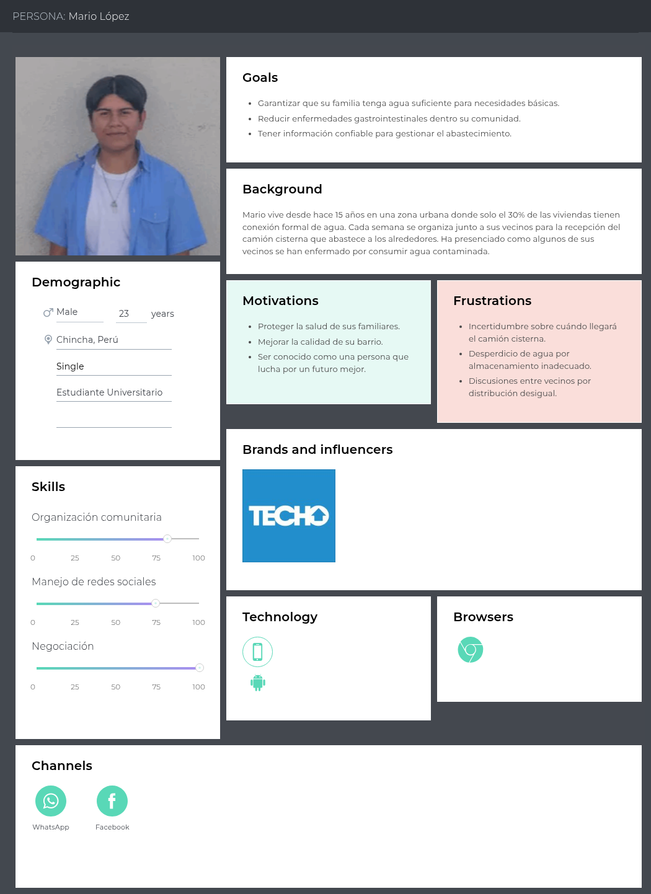
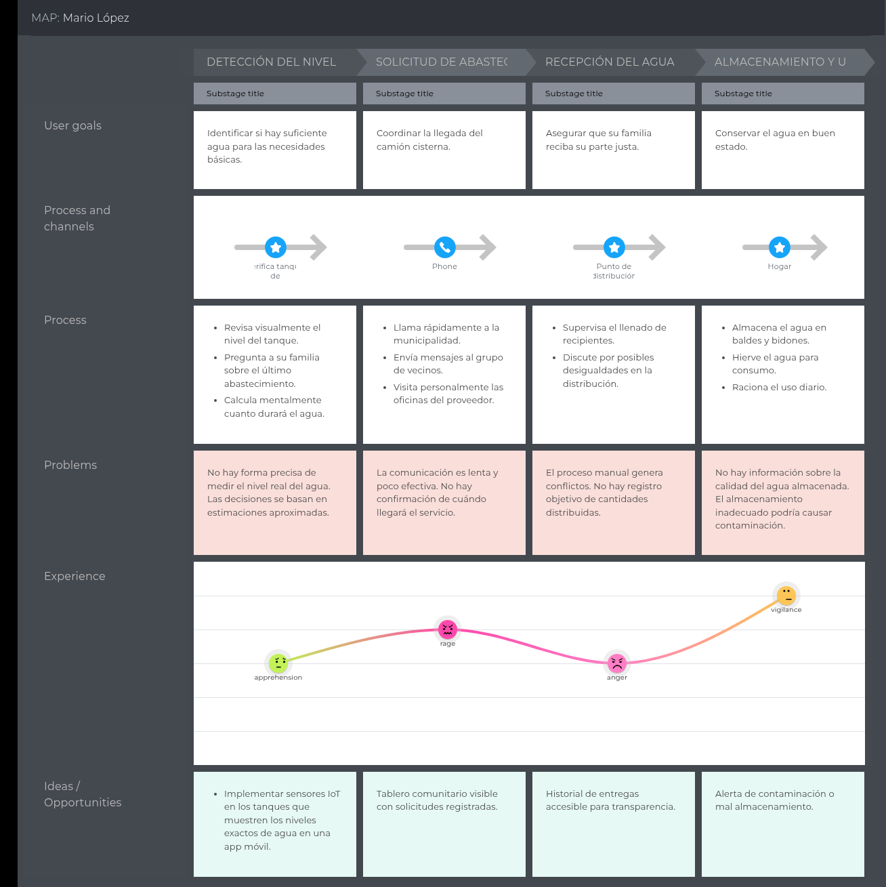
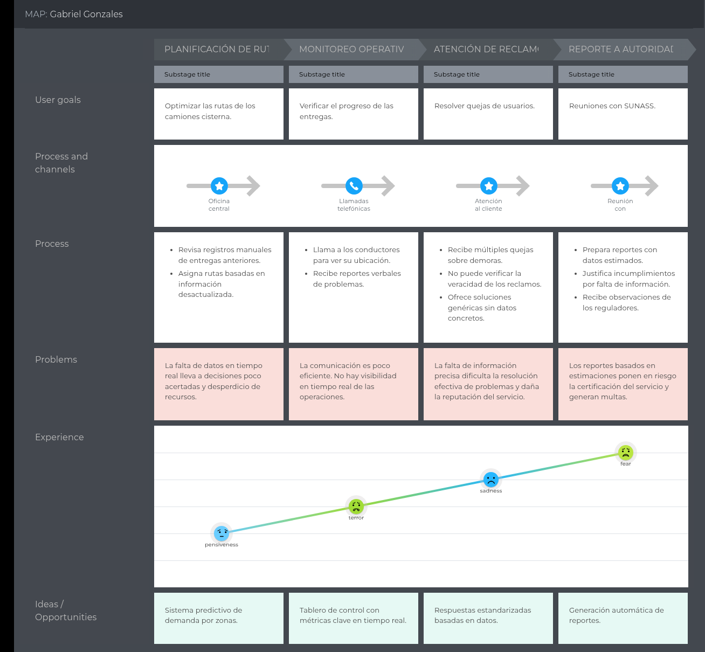
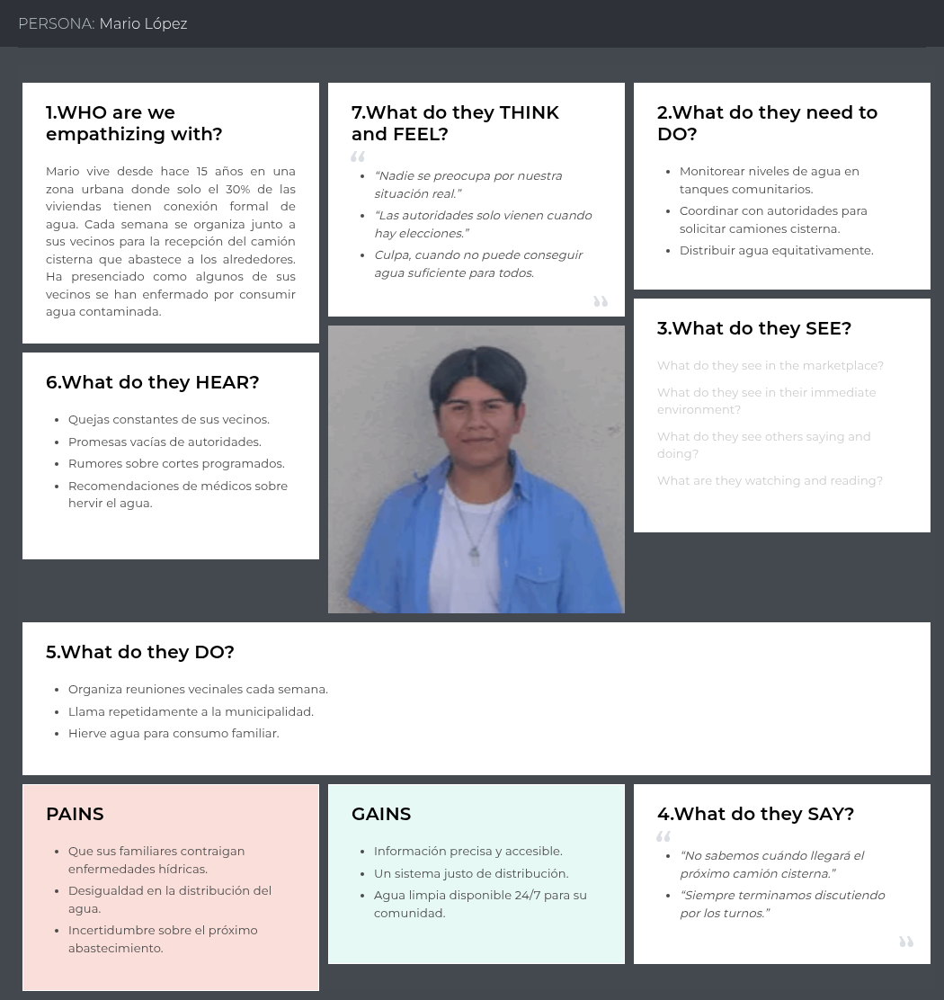

# Capítulo II: Requirements Elicitation & Analysis

## 2.1. Competidores
- AguaClara: Iniciativa tecnológica centrada en brindar acceso a agua potable en comunidades rurales mediante plantas de tratamiento modulares de bajo costo. Su enfoque se basa en la sostenibilidad, el empoderamiento comunitario y la facilidad de mantenimiento, ofreciendo soluciones que pueden ser operadas y mantenidas por las mismas comunidades, aunque con limitadas capacidades digitales o de monitoreo en tiempo real.
- Ingeniería Ambiental SAC: Empresa peruana especializada en el diseño e implementación de proyectos ambientales, especialmente en el área de tratamiento y distribución de agua potable. Ofrece servicios de ingeniería, consultoría y ejecución de sistemas hidráulicos convencionales, dirigidos principalmente a entidades públicas, empresas privadas y gobiernos regionales, con un enfoque más técnico que tecnológico.
- Transporte de Agua Potable Espinoza: Negocio local dedicado al suministro de agua potable mediante camiones cisterna, atendiendo zonas urbanas y periurbanas con escaso acceso a redes de agua. Su modelo de negocio se basa en la distribución directa bajo demanda, sin integrar herramientas tecnológicas de monitoreo o control de calidad del recurso hídrico.

### 2.1.1. Análisis competitivo

<table>
  <tr>
    <th colspan="7" valign="top"><b>Competitive Analysis Landscape</b></th>
  </tr>
  <tr>
    <td colspan="2" rowspan="2">¿Por qué llevar a cabo este análisis?</td>

  </tr>
  <tr>
    <td colspan="5">Para proporcionar información valiosa acerca de los competidores, lo cual nos servirá para mejorar la calidad de nuestra aplicación.</td>
  </tr>
  <tr>
    <td colspan="3"></td>
    <td colspan="1" valign="top" style="font-weight: bold;">
        AquaConecta
         
        

                
        

    <td colspan="1" valign="top" style="font-weight: bold;">
    AguaClara
    

                
        

    </td>
    <td colspan="1" valign="top" style="font-weight: bold;">
      Ingeniería Ambiental SAC
      

                
            

      </td>
    <td colspan="1" valign="top" style="font-weight: bold;" >
      Transporte de Agua Potable Espinoza
      

                
            

    </td>
  </tr>
  <tr>
    <td colspan="1" rowspan="2">
Perfil
</td>
    <td colspan="2">Overview</td>
    <td colspan="1" valign="top">
AquaConecta optimiza la distribución de agua potable conectando proveedores con comunidades sin acceso continuo, mediante monitoreo en tiempo real usando un enfoque tecnológico (IoT).
    </td>
    <td colspan="1" valign="top">
AguaClara mejora el acceso al agua potable en comunidades rurales mediante un sistema de distribución eficiente, coordinado con gobiernos y ONGs. 
    </td>
    <td colspan="1" valign="top">
La empresa se especializa en el abastecimiento de agua potable e industrial. Proporcionan cisternas adecuadamente equipadas para el transporte de agua hacia ubicaciones remotas
    </td>
    <td colspan="1" valign="top">
La empresa se dedica a la venta y distribución de agua potable para consumo. Cuenta con una flota moderna de camiones cisterna
    </td>
  </tr>
  <tr>
    <td colspan="2">Ventaja competitiva</td>
    <td colspan="1" valign="top">
Brinda distribución eficiente, monitoreo inteligente y mayor transparencia en el acceso al agua potable.
    </td>
    <td colspan="1" valign="top">
Ofrece acceso continuo a agua segura en zonas rurales mediante una distribución organizada y siguiendo un modelo de bajo costo
    </td>
    <td colspan="1" valign="top">
Brinda abastecimiento de agua para una variedad de aplicaciones y brinda precios personalizados basados en las necesidades del cliente
    </td>
    <td colspan="1" valign="top">
Ofrece el servicio de distribución de agua potable en zonas donde el suministro puede ser intermitente o limitado
    </td>
  </tr>
  <tr>
    <td colspan="1" rowspan="2">
Perfil de Marketing
</td>
    <td colspan="2">Mercado objetivo</td>
    <td colspan="1" valign="top">
    Comunidades en zonas urbanos y rurales con servicio intermitente de agua potable.
    Empresas proveedoras de agua
    </td>
    <td colspan="1" valign="top">
Comunidades rurales con acceso limitado a agua potable. Instituciones públicas o ONG’s interesada en desarrollos de proyectos sostenibles    
</td>
    <td colspan="1" valign="top">
Proyectos industriales que necesitan gran volumen de agua
</td>
    <td colspan="1" valign="top">
Hogares que carecen de suministro de agua potable. Proyectos comerciales o industriales 
    </td>
  </tr>
  <tr>
    <td colspan="2">Estrategias de marketing</td>
    <td colspan="1" valign="top">Alianzas estratégicas con municipalidades y ONG’s, además de una fuerte presencia en las redes sociales</td>
    <td colspan="1" valign="top">Cuenta con alianzas estratégicas con municipalidades y ONG’s. Además, comunidades beneficiadas recomiendan el servicio a través del boca a boca</td>
    <td colspan="1" valign="top">Ofrece tarifas ajustadas a las necesidades especificas de cada cliente. Por otro lado, Cuenta con atención disponible las 24 horas a través de canales como WhatsApp, teléfono y correo</td>
    <td colspan="1" valign="top">Brindan confiabilidad, puntualidad y se centrar en la satisfacción del cliente</td>
  </tr>
  <tr>
    <td colspan="1" rowspan="3">
Perfil de Producto
</td>
    <td colspan="2">Productos & Servicios</td>
    <td colspan="1" valign="top">
Distribución de agua potable y monitoreo en tiempo real del nivel y calidad del agua a través de sensores 
    </td>
    <td colspan="1" valign="top">
Servicio de distribución de agua potable mediante rutas planificas para camiones cisterna
    </td>
    <td colspan="1" valign="top">
Alquiler de cisternas y abastecimiento de agua potable para proyectos mineros, laboratorios, comedores, etc. 
    </td>
    <td colspan="1" valign="top">
Distribución de agua potable para consumo humano, obras civiles, agrícolas o eventos especiales
    </td>
  </tr>
  <tr>
    <td colspan="2">Precios & Costos</td>
    <td colspan="1" valign="top">
    Precios personalizados que se ajustan a las necesidades específicas de cada cliente
    </td>
    <td colspan="1" valign="top">
Costo bajo o subsidiado ya que trabajan junto a gobiernos o ONG’s
    </td>
    <td colspan="1" valign="top">
    Precios personalizados que se ajustan a las necesidades especificas de cada cliente
    </td>
    <td colspan="1" valign="top">
    Precios personalizados que se ajustan a las necesidades específicas de cada cliente
    </td>
  </tr>
  <tr>
    <td colspan="2">
    Canales de distribución (Web y/o Móvil)
    </td>
    <td colspan="1" valign="top">Sitio web con información esencial para nuestros usuarios, además de una aplicación web y móvil</td>
    <td colspan="1" valign="top">Implementación física directa del equipo técnico, no posee una plataforma web comercial</td>
    <td colspan="1" valign="top">Canales de comunicación por correo telefonía. Asimismo, cuanta con un sitio web para gestionar solicitudes</td>
    <td colspan="1" valign="top">Canales de comunicación por correo telefonía y redes sociales</td>
  </tr>
  <tr>
    <td colspan="1" rowspan="5">
Análisis SWOT
</td>
    <td colspan="6">Realice esto para su startup y sus competidores. Sus fortalezas deberían apoyar sus oportunidades y contribuir a lo que ustedes definen como su posible ventaja competitiva.</td>
  </tr>
  <tr>
    <td colspan="2">Fortalezas</td>
    <td colspan="1" valign="top">
    implementación de tecnologías IoT propia el monitoreo en tiempo real del agua
    </td>
    <td colspan="1" valign="top">
    Fuerte colaboración con gobiernos locales y ONG’s. Presencia en zonas rurales
    </td>
    <td colspan="1" valign="top">
    Monitoreo de camiones cisterna por GPS, servicio personalizado y solida experiencia en el sector
    </td>
    <td colspan="1" valign="top">Experiencia en el rubro de distribución de agua y atención las 24 horas del día</td>
  </tr>
  <tr>
    <td colspan="2">Debilidades</td>
    <td colspan="1" valign="top"> Alta dependencia de la conectividad a internet para operar</td>
    <td colspan="1" valign="top"> Limitada incorporación de tecnologías IoT</td>
    <td colspan="1" valign="top"> Costos variables pueden generar incertidumbre en los costos finales</td>
    <td colspan="1" valign="top"> Falta de presencia digital sólida y poca innovación tecnología</td>
  </tr>
  <tr>
    <td colspan="2">Oportunidades</td>
    <td colspan="1" valign="top"> Aprovechamiento de la baja penetración de tecnologías similares en el sector hídrico</td>
    <td colspan="1" valign="top"> Aumento del alcance con plataforma web e implementar soluciones digitales como aplicaciones móviles</td>
    <td colspan="1" valign="top"> Implementación de soluciones tecnológicas como aplicaciones móviles</td>
    <td colspan="1" valign="top"> Integración de tecnologías IoT para monitoreo en tiempo real de entregas </td>
  </tr>
  <tr>
    <td colspan="2">Amenazas</td>
    <td colspan="1" valign="top"> Posible resistencia al cambio por parte proveedores convencionales</td>
    <td colspan="1" valign="top"> Dificultar para operar sistemas en zonas remotas sin soporte técnico constante </td>
    <td colspan="1" valign="top"> Aparición de soluciones tecnológicas mas eficientes </td>
    <td colspan="1" valign="top">Problemas logísticos por tráfico o escasez de agua</td>
  </tr>
</table>

### 2.1.2. Estrategias y tácticas frente a competidores

AquaConecta implementará una estrategia de diferenciación tecnológica al ofrecer un sistema de monitoreo inteligente del consumo de agua en tiempo real, una propuesta que actualmente no es atendida de forma precisa por sus principales competidores. Esto permitirá posicionarse como una solución innovadora tanto para hogares como para proveedores de agua.

Para penetrar en el mercado, se priorizarán nichos desatendidos, como zonas periurbanas y rurales con acceso limitado al agua, aprovechando las debilidades de la competencia en estos sectores. Se buscarán alianzas con ONGs y gobiernos locales para implementar pilotos y subsidios en estas comunidades.

El canal de distribución será completamente digital, mediante una plataforma web y móvil intuitiva, con soporte automatizado, tutoriales y asistencia técnica virtual. Esto facilitará una rápida adopción y escalabilidad, en contraste con los métodos tradicionales de algunos competidores.

## 2.2. Entrevistas

### 2.2.1. Diseño de entrevistas
**Preguntas Generales**

1. ¿Cuál es su nombre? 
2. ¿Qué edad tiene? 
3. ¿A qué se dedica? 
4. ¿Que navegador usa?
5. ¿Que dispositivo usa con mas frecuencia y de que marca es?
6. ¿En que distrito se encuentra?

1. ¿Cómo obtienen actualmente el agua para el consumo diario?
2. ¿Sienten que el agua que reciben es segura? ¿Por qué?
3. ¿Han tenido problemas de salud relacionados con el agua en los últimos años?
4. ¿Qué hacen cuando sospechan que el agua está contaminada?
5. ¿Con qué frecuencia reciben información sobre la calidad del agua?
6. ¿Quién les informa actualmente sobre el estado del agua?
7. ¿Confían en la información que reciben sobre la calidad del agua?
8. ¿Les gustaría recibir alertas si el agua no es apta para el consumo?
9. ¿Qué tan importante consideran la calidad del agua en su bienestar diario?
10. ¿Estarían dispuestos a participar en el cuidado o monitoreo del sistema si eso ayudara a su comunidad?

**Entrevistas usuario segmento (Proveedores de agua)**
1. ¿Cuáles son los principales retos que enfrentan en la supervisión de la calidad del agua?
2. ¿Qué procesos siguen actualmente para analizar el agua en zonas rurales?
3. ¿Con qué frecuencia se realiza el control de calidad del agua?
4. ¿Qué tipo de datos les gustaría poder monitorear en tiempo real (pH, turbidez, cloro, etc.)?
5. ¿Qué herramientas utilizan para almacenar y analizar los datos del agua?
6. ¿Cómo actúan cuando detectan un problema de calidad en alguna zona?
7. ¿Qué costos están asociados actualmente al monitoreo de agua?
8. ¿Cuánto tiempo tardan en detectar y responder a una posible contaminación?
9. ¿Qué impacto creen que tendría un sistema IoT en su trabajo y en la comunidad?
10. ¿Qué funcionalidades consideran imprescindibles en una solución como esta?

### 2.2.2. Registro de entrevistas
**Entrevistas usuario segmento (Habitantes)**

**Segmento Doméstico**  

Nombre: Rodrigo Noreña Nuñez
 
Edad: 20
 
Ocupación: Estudiante de Arquitectura
 
Browser: Google Chrome
 
Device: Teléfono Iphone
 
Distrito: Chincha Alta
 
Timing: 0:00
 
 

Rodrigo Noreña, un joven residente de Chincha, nos cuenta que desde pequeño recuerda cómo llegaban cisternas a su barrio para repartir agua a las viviendas. Comenta que ni él ni sus vecinos sabían con certeza cuánta agua recibían ni qué tan limpia era. Aunque hoy el servicio ha mejorado en algunas zonas, muchas personas siguen sin tener información clara sobre la calidad del agua que consumen. Rodrigo menciona que nunca ha visto un reporte oficial ni ha recibido alertas cuando el agua podría estar contaminada, y cree que sería muy útil contar con un sistema de monitoreo que no solo informe a tiempo, sino que también permita a los vecinos involucrarse activamente en el cuidado del recurso. Para él, el agua es clave para la salud, y confía en que más transparencia y tecnología podrían mejorar mucho la vida en su comunidad.

### 2.2.3. Análisis de entrevistas
**Segmento 1: (...):**

Estadisticas y Aspectos comunes:

Caracteristicas Objetivas:

Caracteristicas Subjetivas:

**Segmento 2: (...)**
Estadisticas y Aspectos comunes:

Caracteristicas Objetivas:

Caracteristicas Subjetivas:

## 2.3. Needfinding

Para crear una solución que responda a las necesidades específicas de los usuarios, realizaremos la identificación del User persona, User Task Matrix, User Journey Maps, Empathy Mapping y As-is Scenario Mapping.

### 2.3.1. User Personas

Se han elaborado los User Persona correspondientes a cada uno de nuestros segmentos objetivos. Estos segmentos incluyen, por un lado, a los pobladores de zonas urbanas y rurales que enfrentan dificultades para acceder y gestionar un suministro de agua potable; y por otro lado, a los proveedores de agua. La construcción de estos perfiles se ha basado en los datos obtenidos a partir de las entrevistas realizadas. 

Los user persona nos permiten entender el perfil y comportamiento de cada segmento, ayudando a identificar sus necesidades técnicas y objetivos de forma general.

### Segmento 1: Habitantes

Presentamos a Mario López, un joven que reside en una zona urbana y enfrenta serias dificultades con el abastecimiento de agua. Este user persona representa a otro de nuestros segmentos objetivos, y fue creado a partir del análisis de problemáticas reales identificadas durante el proceso de entrevistas.

**Enlace para visualizar el User Persona de Habitantes realizado en UXPressia:**
[https://uxpressia.com/w/mDdvz/p/mIlB8](https://uxpressia.com/w/mDdvz/p/mIlB8)

### Segmento 2: Proveedores

Presentamos a Gabriel Gonzales, un user persona construido a partir de la información recopilada durante las entrevistas. Gracias a este proceso, fue posible identificar sus habilidades, motivaciones, frustraciones, canales de comunicación, permitiendo así una comprensión más profunda del perfil correspondiente a uno de nuestros segmentos objetivos.

**Enlace para visualizar el User Persona de Proveedores realizado en UXPressia:** [https://uxpressia.com/w/mDdvz/p/SLYog](https://uxpressia.com/w/mDdvz/p/SLYog)

### 2.3.2. User Task Matrix
El user task matrix permite identificar y comparar los procesos clave de cada segmento, destacando sus similitudes en cuanto a frecuencia e importancia.

| **Necesidad / Función**                                | **Importancia (Habitantes)** | **Frecuencia (Habitantes)** | **Importancia (Proveedores de Agua)** | **Frecuencia (Proveedores de Agua)** |
|--------------------------------------------------------|------------------------------|-----------------------------|----------------------------------------|---------------------------------------|
| Ver estado actual del nivel y calidad del agua         | Alta                         | Media                       | Alta                                   | Alta                                  |
| Recibir alertas por bajo nivel o agua no apta          | Alta                         | Alta                        | Alta                                   | Alta                                  |
| Consultar historial de consumo y calidad               | Media                        | Baja                        | Alta                                   | Alta                                  |
| Configurar o gestionar múltiples sensores IoT          | Baja                         | Baja                        | Alta                                   | Alta                                  |
| Medir impacto en distribución y eficiencia del reparto | Baja                         | Nula                        | Alta                                   | Alta                                  |
| Compartir información o generar reportes               | Media                        | Baja                        | Alta                                   | Media                                 |
| Acceder a la plataforma desde app móvil o web          | Alta                         | Alta                        | Media                                  | Media                                 |

En la matriz presentada, se pueden observar las siguientes tareas con mayor frecuencia e importancia:

- **Habitantes**:

  - **Recibir alertas por bajo nivel o agua no apta**  
    Funcionalidad **más crítica**, con **alta importancia y frecuencia**. Necesitan estar informados para actuar ante situaciones de riesgo.

  - **Ver el estado actual del agua** y **acceder a la plataforma móvil/web**  
    Funcionalidades altamente valoradas. Aunque el monitoreo no es constante, desean tener la información disponible de forma accesible.

  - **Consultar historial**, **generar reportes** o **gestionar sensores**  
    Tienen **baja o media relevancia y baja frecuencia**. No forman parte de su rutina diaria, por lo que pueden ofrecerse como funciones secundarias u opcionales.

- **Proveedores de Agua**:

  - **Ver estado actual del nivel y calidad del agua** y **recibir alertas por bajo nivel o agua no apta**  
    Tareas **críticas y frecuentes**, esenciales para el monitoreo constante y la respuesta inmediata ante situaciones de riesgo o emergencia.

  - **Consultar historial de consumo y calidad** y **gestionar múltiples sensores IoT**  
    Funcionalidades con **alta importancia y frecuencia**, necesarias para la supervisión técnica, análisis de patrones y mantenimiento del sistema.

  - **Medir impacto en la distribución y eficiencia del reparto** y **generar reportes**  
    Actividades de **alta importancia**, aunque de **frecuencia moderada**, ya que están orientadas a la planificación estratégica y cumplimiento de normativas.

  - **Acceder a la plataforma desde app móvil o web**  
    Tiene una **importancia y frecuencia media**, ya que suelen utilizar herramientas más especializadas o integradas en sus sistemas operativos diarios.

### 2.3.3. User Journey Mapping
El User Journey Mapping se desarrolló para comprender la experiencia de los usuarios al interactuar con nuestra plataforma. Este mapeo detalla cada paso que el usuario realiza, los obstáculos que puede encontrar, y las emociones que surgen en el proceso. Así, nos ayuda a identificar oportunidades para mejorar la usabilidad y satisfacción del usuario.

### Segmento 1: Habitantes

En este User Journey Map se muestra la experiencia actual del habitante responsable de gestionar el agua en su hogar. El proceso incluye la detección manual del nivel de agua, la solicitud de abastecimiento, la recepción y el almacenamiento. Identificamos problemas como la falta de precisión, comunicación ineficiente y riesgos de contaminación, lo que genera frustración e incertidumbre en el usuario.

**Enlace para visualizar el User Journey Map de Habitantes realizado en UXPressia:** [https://uxpressia.com/w/mDdvz/m/Q2oFD](https://uxpressia.com/w/mDdvz/m/Q2oFD)

### Segmento 2: Proveedores

En este User Journey Map decribimos el recorrido actual del proveedor responsable de coordinar y supervisar la distribución de agua. Desde la planificación de rutas hasta la presentación de informes a las autoridades, el proveedor enfrenta limitaciones como la falta de información en tiempo real, baja eficiencia en la comunicación y poca visibilidad operativa. Estas dificultades afectan la toma de decisiones, el seguimiento de entregas y el cumplimiento con las normas.

**Enlace para visualizar el User Journey Map de Proveedores realizado en UXPressia:** 
[https://uxpressia.com/w/mDdvz/m/wtXHH](https://uxpressia.com/w/mDdvz/m/wtXHH)

### 2.3.4. Empathy Mapping

Para la creación del Empathy Map, hemos utilizado la información obtenida de nuestros dos User Personas que representan nuestro segmento objetivo. Este mapa nos permite profundizar en la comprensión de las necesidades, pensamientos, emociones y comportamientos de los usuarios, ayudándonos a diseñar soluciones más alineadas con sus expectativas y experiencias reales.

### Segmento 1: Habitantes
En el siguiente Empathy Map tenemos a Mario Lopez, un joven que vive en una zona urbana en Chincha. Él lucha diariamente por garantizar agua segura para su familia y su comunidad. Podemos observar su experencia, la cual refleja los desafíos de miles de personas que dependen de camiones cisterna.

**Enlace para visualizar el Empathy Map de Proveedores realizado en UXPressia:**
[https://uxpressia.com/w/mDdvz/p/ZQOfG](https://uxpressia.com/w/mDdvz/p/ZQOfG) 

### Segmento 2: Proveedores
En el siguiente Empathy Map observamos la perspectiva de Gabriel Gonzales, encargado del
área principal de la proveedora de agua más grande Chincha. Dentro de su perfil podemos observar los desafíos sa los que se enfrenta como gestionar de recursos limitados mientrasse cumplen regulaciones estrictas y demandas de usuarios insatisfechos.

**Enlace para visualizar el Empathy Map de Proveedores realizado en UXPressia:**
[https://uxpressia.com/w/mDdvz/p/wA0jm](https://uxpressia.com/w/mDdvz/p/wA0jm) 

### 2.3.5. As-is Scenario Mapping
### Segmento 1: Habitantes

### Segmento 2: Proveedores

## 2.4. Ubiquitous Languange
| **Término**                           | **Definición** |
|--------------------------------------|----------------|
| **Habitante**                        | Usuario final que consume agua en su hogar y utiliza la plataforma para informarse sobre la calidad, nivel y alertas del servicio. |
| **Proveedor de Agua**                | Entidad responsable del monitoreo, gestión y distribución del agua en una comunidad o localidad. |
| **Sensor IoT**                       | Dispositivo instalado en puntos estratégicos que mide parámetros como nivel, calidad o presión del agua en tiempo real. |
| **Calidad del Agua**                 | Valor que indica si el agua es apta para el consumo, basado en parámetros químicos, físicos y biológicos. |
| **Nivel del Agua**                   | Altura del agua almacenada o distribuida, medida por sensores para prever escasez o exceso. |
| **Alerta**                           | Notificación automática enviada a usuarios cuando se detecta un nivel bajo o agua no apta para consumo. |
| **Historial de Consumo y Calidad**   | Registro de los niveles y calidad del agua a lo largo del tiempo, útil para análisis y seguimiento. |
| **Reporte**                          | Documento generado automáticamente con datos históricos, alertas, consumos y condiciones del agua. |
| **Panel de Control (Dashboard)**     | Vista personalizada (para habitantes o proveedores) que muestra datos relevantes, gráficas y alertas. |
| **Distribución del Agua**            | Proceso logístico y técnico mediante el cual el agua es repartida desde su fuente hasta los hogares. |
| **Impacto en la Distribución**       | Medición del efecto de las condiciones del sistema (fugas, presión, consumo alto) en la eficiencia del reparto. |
| **Plataforma Web/App Móvil**        | Interfaz digital accesible desde computadora o smartphone, donde usuarios visualizan y gestionan información relacionada al servicio de agua. |
| **Gestión de Sensores**              | Funcionalidad que permite a los proveedores configurar, monitorear o solucionar problemas con sensores IoT instalados. |
| **Visualización en Tiempo Real**     | Representación dinámica y continua de datos actuales sobre el sistema de agua. |
| **Usuarios Registrados**             | Personas con acceso autenticado a la plataforma, que pueden ser habitantes o proveedores, con funcionalidades diferenciadas. |
| **Zona de Cobertura**                | Área geográfica donde AquaConecta presta servicios y donde están ubicados los sensores. |

