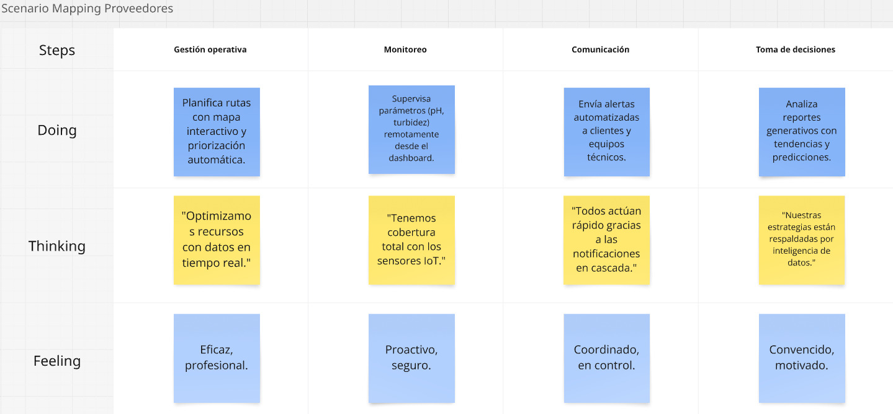

# Capítulo III: Introducción

## 3.1. To-Be Scenario Mapping

En To-Be se usaran los mismos escenarios, pero aplicando la solución que ofrecemos como equipo  

### Segmento Habitantes: 

### Segmento Proveedores:

## 3.2. User Stories

El apartado de User Stories permite identificar las diversas situaciones que experimenta el usuario al interactuar con las diferentes áreas del proyecto, desde la página de inicio de sesión hasta las funcionalidades técnicas implementadas por el equipo de desarrollo. Su relevancia radica en que facilita la creación de un product backlog y, mediante los criterios de aceptación, podemos comprobar si estas historias se han cumplido correctamente.

|**Epic / Story ID**|**Título**|**Descripción**|**Criterios de Aceptación**|**Relacionado con (Epic ID)**|
| - | - | - | - | - |
|**EP01**|**Monitoreo del Agua en Tiempo Real**|**Como** usuario,  **Quiero** visualizar en tiempo real el estado del agua (nivel y calidad) y acceder a su historial  **Para** tomar decisiones informadas sobre la gestión y consumo.|
**Escenario 1: El sistema debe mostrar datos actualizados cada minuto.** **Dado** que el usuario accede al panel de monitoreo **Cuando** transcurre un minuto desde la última actualización **Entonces** visualiza los datos de nivel y calidad del agua actualizados automáticamente.

**Escenario 2: Visualización clara de datos actuales e históricos.** **Dado** que el usuario visualiza el estado del agua **Cuando** consulta los datos actuales o selecciona un rango de fechas **Entonces** visualiza la información en formato comprensible y organizado para facilitar su análisis.

**Escenario 3: Gráficos e indicadores disponibles.** **Dado** que el usuario accede a la sección de monitoreo o historial **Cuando** selecciona una opción como nivel o calidad del agua **Entonces** visualiza gráficos e indicadores que reflejan los datos en tiempo real o por periodo.
||
|**HU01**|Ver nivel actual del agua|**Como** usuario, **Quiero** visualizar el nivel actual del agua  **Para** conocer su disponibilidad.|**Escenario 1: Mostrar nivel de agua al acceder al panel Dado** que el usuario accede al panel principal  **Cuando** se cargan los datos del nivel  **Entonces** observa el valor actualizado.|**EP01**|
|**HU02**|Ver calidad del agua|**Como** usuario,  **Quiero** consultar la calidad actual del agua  **Para** determinar si es apta para consumo.|**Escenario 1: Mostrar calidad del agua según indicadores Dado** que el usuario visualiza los indicadores **Cuando** revisa el parámetro de calidad del agua **Entonces** visualiza si es apta o no.|**EP01**|
|**HU03**|Actualización automática|**Como** usuario, **Quiero** que los datos del agua se actualicen automáticamente **Para** visualizarlos sin la necesidad de recargar la página.|**Escenario 1: Actualización automática de datos cada minuto Dado** que el usuario está en el panel **Cuando** espera un minuto   **Entonces** observa que los datos se actualizan automáticamente.|**EP01**|
|**HU04**|Consultar historial|**Como** usuario, **Quiero** consultar el historial de datos por fechas **Para** analizar el comportamiento del agua en distintos periodos.|**Escenario 1: Consultar historial de datos Dado** que el usuario elige un rango de fechas **Cuando** da clic en consultar **Entonces** visualiza los datos históricos y gráficos.|**EP01**|
|**HU05**|Exportar historial|**Como** usuario,  **Quiero** descargar los datos históricos en Excel o CSV **Para** analizar los datos dados.|**Escenario 1: Exportar historial en archivo descargable Dado** que el usuario selecciona un rango **Cuando** hace clic en exportar **Entonces** puede descargar el archivo con los datos.|**EP01**|
|**EP02**|**Alertas y Notificaciones Inteligentes**|**Como** usuario, **Quiero** recibir alertas cuando el agua esté en niveles críticos o no sea apta para consumo **Para** responder oportunamente ante situaciones que afecten el servicio.|
**Escenario 1:** Alertas configurables y en tiempo real. **Dado** que el usuario ha configurado el tipo de alertas que desea recibir **Cuando** se detecta una condición crítica según los parámetros definidos **Entonces** el sistema genera y envía la alerta correspondiente de forma inmediata.

**Escenario 2:** Envío por push, SMS o correo. **Dado** que el usuario ha seleccionado su medio de notificación preferido **Cuando** se activa una alerta por un evento crítico **Entonces** el sistema envía la notificación al canal configurado.

**Escenario 3:** Visualización personalizada según usuario. **Dado** que el usuario accede al módulo de alertas **Cuando** se muestran las notificaciones recientes **Entonces** el sistema presenta únicamente las alertas asociadas a su zona o sensores configurados
||
|**HU06**|Configurar tipo de alertas|**Como** usuario,  **Quiero** configurar qué tipo de alertas desea recibir **Para** estar adecuadamente informado.|**Escenario 1: Configurar tipos de alerta preferidos Dado** que el usuario ingresa a preferencias **Cuando** selecciona tipos de alerta **Entonces** el sistema guarda la configuración.|**EP02**|
|**HU07**|Elegir medio de notificación|**Como** usuario,  **Quiero** elegir si deseo recibir alertas por correo, SMS o push **Para** estar informado.|**Escenario 1: Guardar medio de notificación preferido Dado** que el usuario selecciona un canal **Cuando** lo guarda **Entonces** va a recibir alertas por ese medio.|**EP02**|
|**HU08**|Recibir alerta por nivel bajo|**Como** usuario,  **Quiero** recibir alertas si el nivel de agua es bajo **Para** comunicar de manera anticipada la necesidad de agua.|**Escenario 1: Enviar alerta cuando el nivel del agua es bajo Dado** que el usuario desea saber sobre el nivel es crítico del agua **Cuando** activa la condición **Entonces** el sistema envía una alerta.|**EP02**|
|**HU09**|Historial de alertas|**Como** usuario,  **Quiero** revisar un historial de alertas **Para** conocer eventos pasados y tomar decisiones informadas sobre el sistema.|**Escenario 1: Consultar historial de alertas Dado** que el usuario accede al módulo de alertas **Cuando** visualiza la lista **Entonces** ve las alertas anteriores.|**EP02**|
|**HU10**|Desactivar alertas temporalmente|**Como** usuario,  **Quiero** desactivar temporalmente el envío de alertas **Para** evitar interrupciones o notificaciones durante periodos de mantenimiento o baja actividad.|**Escenario 1: Desactivar temporalmente las alertas Dado** que el usuario ingresa a configuración **Cuando**  desactiva alertas **Entonces** el sistema deja de enviarlas temporalmente.|**EP02**|
|**EP03**|**Gestión de Sensores y Sistema**|**Como** proveedor,  **Quiero** gestionar sensores IoT y monitorear su estado **Para** supervisar su estado y garantizar una distribución eficiente del agua.|
**Escenario 1:** Gestión completa de sensores (alta, edición, baja). **Dado** que el proveedor accede al módulo de gestión de sensores **Cuando** registra, edita o desactiva un sensor directamente desde su panel **Entonces**  el sistema actualiza la información en tiempo real **Y** refleja los cambios en el dashboard de monitoreo.

**Escenario 2:**  Estado online/offline visible. **Dado** que el proveedor visualiza el listado de sensores **Cuando** el sistema carga los datos **Entonces** cada sensor muestra su estado (online/offline) y la última fecha de actividad registrada.

**Escenario 3:** Indicadores de eficiencia, presión, cobertura y consumo. **Dado** que el proveedor selecciona un sensor específico **Cuando** consulta las métricas de rendimiento **Entonces** el sistema muestra los gráficos de presión, cobertura y consumo en tiempo real.
||
|**HU11**|Registrar sensores|**Como** proveedor,  **Quiero** registrar nuevos sensores en el sistema  **Para** ampliar la red de monitoreo.|**Escenario 1: Registro de nuevo sensor por parte del proveedor Dado** que el proveedor está autenticado **Cuando**  ingresa los datos de un nuevo sensor y confirmo **Entonces** el sistema lo registra correctamente|**EP03**|
|**HU12**|Solicitar edición de sensor|**Como** proveedor, **Quiero** modificar la configuración de sensores existentes **Para** adaptar los parámetros a nuevas condiciones operativas.|**Escenario 1: Solicitar edición de sensor Dado que** el proveedor selecciona un sensor que requiere ajustes **Cuando** actualiza sus parámetros y guardo **Entonces** el sistema aplica los cambios.|**EP03**|
|**HU13**|Solicitar desactivación de sensor|**Como** proveedor, **Quiero** desactivar temporalmente sensores fuera de servicio **Para** evitar lecturas incorrectas.|**Escenario 1: Desactivación de sensor Dado que** el proveedor observa que el sensor está activo y fuera de funcionamiento **Cuando** lo marca como desactivado **Entonces** el sistema deja de mostrar sus datos.|**EP03**|
|**HU14**|Ver estado de sensores|**Como** proveedor,  **Quiero** visualizar el estado online/offline de todos los sensores **Para** monitorear la conectividad en tiempo real y detectar posibles fallos en la red.|**Escenario 1: Visualizar estado de los sensores Dado** que el proveedor accede al panel **Cuando**  revisa el listado **Entonces** cada sensor indica su estado en tiempo real.|**EP03**|
|**HU15**|Visualizar métricas por sensor|**Como** proveedor,  **Quiero** acceder a indicadores clave (presión, cobertura, consumo) **Para** evaluar el rendimiento del sistema.|**Escenario 1: Visualización de métricas de sensor seleccionado Dado** que el proveedor selecciona un sensor **Cuando**  consulta sus datos **Entonces** ve los gráficos e indicadores actualizados|**EP03**|
|**EP04**|**Reportes y Compartición de Datos**|**Como** usuario,  **Quiero** generar y exportar reportes sobre el servicio de agua **Para** compartir información útil con autoridades o la comunidad.|
**Escenario 1:** Reportes exportables en PDF y Excel. **Dado** que el usuario accede al módulo de reportes **Cuando** selecciona un rango de fechas y elige el formato de exportación **Entonces** el sistema genera el reporte y permite su descarga en formato PDF o Excel

**Escenario 2:** Estadísticas clave por período seleccionable. **Dado** que el usuario ha definido un período de análisis **Cuando** solicita el reporte del servicio **Entonces** el sistema incluye en el reporte estadísticas como máximos, mínimos y promedios relacionados con el consumo y calidad del agua.
||
|**HU16**|Generar reporte en PDF|**Como** proveedor,  **Quiero** generar un reporte PDF con datos clave **Para** compartir información consolidada y respaldar decisiones operativas.|**Escenario 1: Generación de reporte en PDF Dado** que el proveedor selecciona un rango de fechas **Cuando**  genera el reporte **Entonces** puede descargar el archivo PDF.|**EP04**|
|**HU17**|Exportar a Excel|**Como** proveedor,  **Quiero** exportar los datos a un archivo Excel **Para** analizarlos y manipularlos fácilmente en herramientas externas.|**Escenario 1: Exportación de datos en formato Excel Dado** que el proveedor accede al módulo de reportes **Cuando**  elige exportar **Entonces** se descarga un archivo Excel.|**EP04**|
|**HU18**|Incluir estadísticas clave|**Como** proveedor,  **Quiero** visualizar estadísticas clave del período seleccionado  **Para** analizar el comportamiento del sistema y tomar decisiones basadas en datos históricos.|**Escenario 1: Inclusión de estadísticas clave en el reporte Dado** que el proveedor genera un reporte **Cuando** se calcula el resumen **Entonces** el reporte incluye máximos, mínimos y promedios|**EP04**|
|**EP05**|**Acceso, Seguridad y Multiplataforma**|**Como** usuario,  **Quiero** acceder desde cualquier dispositivo y gestionar roles dentro de la plataforma  **Para** garantizar seguridad y usabilidad.|
**Escenario 1:** Plataforma responsiva y disponible en móvil y web. **Dado** que el usuario accede a la plataforma desde un dispositivo móvil o de escritorio **Cuando** inicia sesión o navega por los módulos principales **Entonces** el sistema ajusta su visualización para garantizar una experiencia adecuada al dispositivo usado.

**Escenario 2:** Roles diferenciados (habitante, proveedor, admin). **Dado** que el usuario ha sido autenticado **Cuando** accede a la plataforma **Entonces** el sistema permite o restringe el acceso a funcionalidades según el rol asignado

**Escenario 3:** Dashboard personalizado. **Dado** que el usuario ha iniciado sesión **Cuando** accede al panel principal **Entonces** el sistema presenta un dashboard con información y funcionalidades adaptadas a su rol.
||
|**HU19**|Acceso desde dispositivo móvil|**Como** usuario,  **Quiero** acceder a la plataforma desde su celular **Para** monitorear y gestionar información de forma práctica y en cualquier momento.|**Escenario 1: Acceso y navegación desde dispositivo móvil Dado** que el usuario usa un navegador móvil **Cuando**  accede a la plataforma **Entonces** puede navegar y ver los datos correctamente.|**EP05**|
|**HU20**|Dashboard personalizado|**Como** usuario,  **Quiero** ver un dashboard adaptado a su rol **Para** acceder rápidamente a la información que necesito según mis responsabilidades.|**Escenario 1: Carga de dashboard personalizado según rol Dado** que el usuario inicia sesión **Cuando**  ingresa al sistema **Entonces** visualiza un panel específico con información relevante.|**EP05**|
|**EP06**|**Infraestructura y servicio Backend**|**Como** desarrollador, **Quiero** desarrollar y mantener servicios backend seguros  **Para** garantizar la integración con sensores IoT y la gestión eficiente de datos en tiempo real.|
**Escenario 1 : Recepción exitosa de datos desde un sensor Dado** que un sensor IoT está configurado para enviar datos al endpoint /api/sensores/data **Cuando** envía datos en formato JSON con valores válidos de nivel, calidad, presión y consumo **Entonces** el sistema registra la información correctamente en la base de datos **Y** responde con un estado HTTP 200.** 

**Escenario 2: Recepción exitosa de datos desde un sensor Dado** que un sensor IoT está configurado para enviar datos al endpoint /api/sensores/data **Cuando** envía datos en formato JSON con valores válidos de nivel, calidad, presión y consumo **Entonces** el sistema registra la información correctamente en la base de datos **Y** responde con un estado HTTP 200.

**Escenario 3: Exportación de datos históricos mediante la API Dado** que un usuario autenticado accede al endpoint /api/reportes/historial **Y** envía un rango de fechas válido **Cuando** el sistema procesa la solicitud **Entonces** retorna un archivo con los datos en el formato especificado (JSON, CSV o PDF).

**Escenario 4: Generación automática de alerta por condición crítica Dado** que el sistema monitorea los datos en tiempo real **Cuando** un sensor reporta que el nivel de agua es inferior al umbral definido **Entonces** el sistema genera una alerta **Y** envía la notificación al usuario por el canal configurado.

**Escenario 5: Registro de acceso a endpoints protegidos Dado** que un usuario autenticado realiza una solicitud a un endpoint seguro **Cuando** el sistema valida el token y permite la operación **Entonces** registra en el log la IP, ID del usuario, hora y tipo de operación.

**Escenario 6: Restricción de acceso a endpoints protegidos Dado** que un usuario no autenticado intenta acceder al endpoint /api/sensores/data **Cuando** realiza una solicitud sin token o con token inválido **Entonces** el sistema responde con un estado HTTP 401.
||
|**HT01**|API para recepción de datos de sensores|**Como** desarrollador,  **Quiero** implementar un endpoint REST que reciba datos de sensores IoT **Para** asegurar la integración y el flujo continuo de información hacia el sistema.|**Escenario 1: Recepción de datos desde sensores Dado** que el sensor envía datos al endpoint configurado **Cuando** los datos llegan en formato JSON válido **Entonces** el sistema almacena los datos en la base de datos y responde con un código 200.|**EP06**|
|**HT02**|Servicio de actualización automática de datos|**Como** desarrollador**,  Quiero** desarrollar un servicio que procese y actualice datos de sensores cada minuto **Para** mantener el monitoreo en tiempo real sin intervención del usuario.|**Escenario 1: Actualización automática cada minuto Dado** que el servicio está activo **Cuando** se cumple el intervalo de un minuto **Entonces** el sistema actualiza los datos visibles en el frontend con los últimos valores reportados por los sensores.|**EP06**|
|**HT03**|Endpoint para reportes históricos|**Como** desarrollador, **Quiero** exponer un endpoint que permita consultar y exportar datos históricos **Para** que los usuarios puedan generar reportes por fechas desde la plataforma.|**Escenario 1: Exportación de datos históricos vía API Dado** que el usuario autenticado realiza una solicitud al endpoint con un rango de fechas **Cuando** el sistema valida los parámetros **Entonces** devuelve los datos históricos correspondientes en formato JSON, CSV o PDF según lo solicitado.|**EP06**|
|**HT04**|Servicio de alertas automáticas|**Como** desarrollador, **Quiero** implementar un servicio que detecte condiciones críticas y dispare alertas automáticas **Para** que el sistema notifique al usuario en tiempo real.|**Escenario 1: Generación automática de alertas Dado** que el sistema monitorea en segundo plano los valores de sensores **Cuando** detecta que el valor supera un umbral crítico **Entonces** se genera una alerta y se envía al usuario por el canal configurado.|**EP06**|
|**HT05**|Registro y auditoría de accesos API|**Como** desarrollador, **Quiero** registrar todas las solicitudes a los endpoints protegidos **Para** mantener un control y detectar posibles accesos indebidos.|**Escenario 1: Registro de accesos a la API Dado** que un usuario autenticado realiza una solicitud a un endpoint protegido **Cuando** el sistema procesa la solicitud **Entonces** guarda en los registros la hora, IP, usuario y tipo de operación realizada.|**EP06**|

## 3.3. Impact Mapping

### Segmento 1: Habitantes

Para el segmento del usuario final se elaboró un Impact Mapping con el objetivo de aumentar la participación activa en la plataforma y reducir la incertidumbre sobre la calidad del agua. Esta herramienta nos permitió identificar los comportamientos clave que se desean promover en los usuarios, como consultar el estado del agua y configurar alertas personalizadas. A partir de ello, se definieron deliverables y user stories que guían el desarrollo de funcionalidades útiles y alineadas con las necesidades reales de los habitantes.
**Enlace para visualizar el Impact Map de Habitantes realizado en UXPressia:**
[https://uxpressia.com/w/mDdvz/i/0Fem9](https://uxpressia.com/w/mDdvz/i/0Fem9)

### Segmento 2: Proveedores

En el caso del proveedor, el Impact Mapping se enfocó en facilitar la gestión de sensores y la producción de reportes para la toma de decisiones. Gracias a ello se establecieron los impacts esperados, como registrar y monitorear sensores activos, así como generar estadísticas clave del sistema. Esto permitió definir deliverables específicos y user stories que aseguran un desarrollo enfocado en la eficiencia operativa y el control del servicio por parte del proveedor.
**Enlace para visualizar el Impact Map de Proveedores realizado en UXPressia:**
[https://uxpressia.com/w/mDdvz/i/Ue2yy](https://uxpressia.com/w/mDdvz/i/Ue2yy)

## 3.4. Product Backlog

El Product Backlog es una lista priorizada de tareas, funcionalidades y requisitos necesarios para el desarrollo del proyecto, asegurando que se trabaje en los elementos más importantes y alineados con los objetivos del proyecto. Cada ítem del backlog incluye una descripción, prioridad y título.

<table border="1">
    <thead>
        <tr>
            <th>Orden</th>
            <th>User Story Id</th>
            <th>Título</th>
            <th>Descripción</th>
            <th>Story Points</th>
            <th>Justificación de Prioridad</th>
        </tr>
    </thead>
    <tbody>
        <tr>
            <td>1</td>
            <td>HT01</td>
            <td>API para recepción de datos</td>
            <td>Endpoint REST para integración con sensores IoT</td>
            <td>8</td>
            <td>Base técnica sin la cual el sistema no funciona</td>
        </tr>
        <tr>
            <td>2</td>
            <td>HU01</td>
            <td>Ver nivel actual</td>
            <td>Visualización del nivel de agua en tiempo real</td>
            <td>5</td>
            <td>Función principal para todos los usuarios</td>
        </tr>
        <tr>
            <td>3</td>
            <td>HU02</td>
            <td>Ver calidad del agua</td>
            <td>Indicadores de potabilidad del agua</td>
            <td>5</td>
            <td>Segunda métrica esencial para la salud pública</td>
        </tr>
        <tr>
            <td>4</td>
            <td>HT04</td>
            <td>Alertas automáticas</td>
            <td>Servicio que detecta condiciones críticas</td>
            <td>5</td>
            <td>Mecanismo de prevención clave</td>
        </tr>
        <tr>
            <td>5</td>
            <td>HU08</td>
            <td>Alertas por nivel bajo</td>
            <td>Notificaciones cuando el agua escasea</td>
            <td>3</td>
            <td>Primera línea de defensa contra desabastecimiento</td>
        </tr>
        <tr>
            <td>6</td>
            <td>HU03</td>
            <td>Actualización automática</td>
            <td>Datos que se refrescan sin recarga</td>
            <td>5</td>
            <td>Nueva: Experiencia en tiempo real esencial</td>
        </tr>
        <tr>
            <td>7</td>
            <td>HU11</td>
            <td>Registrar sensores</td>
            <td>Alta de nuevos dispositivos IoT</td>
            <td>5</td>
            <td>Base para la escalabilidad del sistema</td>
        </tr>
        <tr>
            <td>8</td>
            <td>HU14</td>
            <td>Estado de sensores</td>
            <td>Monitoreo de conectividad IoT</td>
            <td>3</td>
            <td>Mantenimiento preventivo básico</td>
        </tr>
        <tr>
            <td>9</td>
            <td>HU12</td>
            <td>Edición de sensores</td>
            <td>Ajustar parámetros de dispositivos</td>
            <td>3</td>
            <td>Nueva: Complemento necesario tras el registro</td>
        </tr>
        <tr>
            <td>10</td>
            <td>HU13</td>
            <td>Desactivar sensores</td>
            <td>Gestión de dispositivos inactivos</td>
            <td>2</td>
            <td>Nueva: Cierre del ciclo de gestión IoT</td>
        </tr>
        <tr>
            <td>11</td>
            <td>HU04</td>
            <td>Consultar historial</td>
            <td>Datos históricos por fechas</td>
            <td>5</td>
            <td>Primera capa de analítica</td>
        </tr>
        <tr>
            <td>12</td>
            <td>HT03</td>
            <td>Endpoint reportes</td>
            <td>API para exportación de datos</td>
            <td>8</td>
            <td>Infraestructura para análisis avanzado</td>
        </tr>
        <tr>
            <td>13</td>
            <td>HU05</td>
            <td>Exportar historial</td>
            <td>Descarga en formatos procesables</td>
            <td>3</td>
            <td>Nueva: Valor añadido para análisis externo</td>
        </tr>
        <tr>
            <td>14</td>
            <td>HU06</td>
            <td>Configurar alertas</td>
            <td>Selección de tipos de notificaciones</td>
            <td>3</td>
            <td>Adaptación a necesidades específicas</td>
        </tr>
        <tr>
            <td>15</td>
            <td>HU07</td>
            <td>Medios de notificación</td>
            <td>Elección de canales (email/SMS/push)</td>
            <td>2</td>
            <td>Mejora la efectividad de las alertas</td>
        </tr>
        <tr>
            <td>16</td>
            <td>HU09</td>
            <td>Historial de alertas</td>
            <td>Registro de eventos notificados</td>
            <td>2</td>
            <td>Nueva: Contexto para patrones recurrentes</td>
        </tr>
        <tr>
            <td>17</td>
            <td>HU15</td>
            <td>Métricas por sensor</td>
            <td>Indicadores técnicos detallados</td>
            <td>5</td>
            <td>Para usuarios técnicos/proveedores</td>
        </tr>
        <tr>
            <td>18</td>
            <td>HU16</td>
            <td>Reportes PDF</td>
            <td>Documentos formales para autoridades</td>
            <td>3</td>
            <td>Cumplimiento normativo</td>
        </tr>
        <tr>
            <td>19</td>
            <td>HU19</td>
            <td>Acceso móvil</td>
            <td>Plataforma responsive</td>
            <td>5</td>
            <td>Accesibilidad en terreno</td>
        </tr>
        <tr>
            <td>20</td>
            <td>HU20</td>
            <td>Dashboard personalizado</td>
            <td>Vistas adaptadas por rol</td>
            <td>3</td>
            <td>Optimización de flujos de trabajo</td>
        </tr>
    </tbody>
</table>