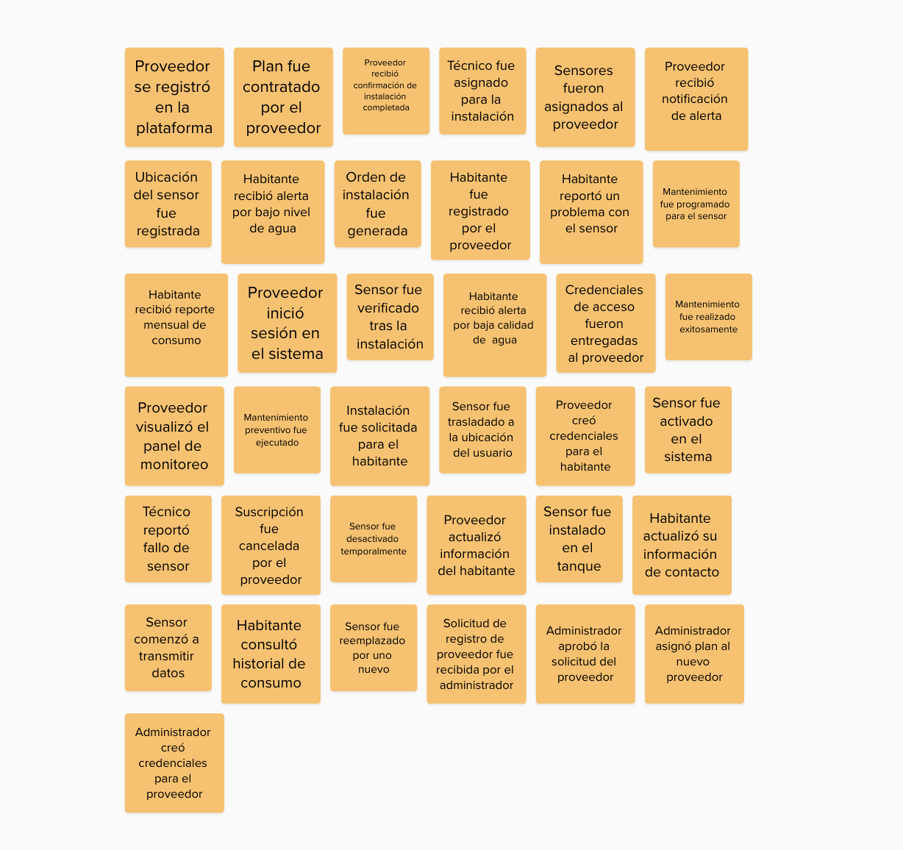

# Chapter IV: Solution Software Design
## 4.1. Strategic-Level Domain-Driven Design
### 4.1.1. EventStorming

Llevamos a cabo nuestro proceso de Event Storming utilizando la herramienta MURAL, donde construimos todo el flujo del sistema. Iniciamos con la fase de **Exploración No Estructurada**, en la que intercambiamos ideas y discutimos libremente los eventos del dominio, guiándonos por las recomendaciones establecidas para esta etapa.

#### 4.1.1.1 Candidate Context Discovery.

- 
#### 4.1.1.2 Domain Message Flows Modeling.

#### 4.1.1.3 Bounded Context Canvases. 

- Bounded context Analytics

- Bounded context Managment

### 4.1.2. Context Mapping.

### 4.1.3. Software Architecture.

#### 4.1.3.1. Software Architecture System Landscape Diagram.

#### 4.1.3.2. Software Architecture Context Level Diagrams.

#### 4.1.3.3. Software Architecture Container Level Diagrams.

#### 4.1.3.4. Software Architecture Deployment Diagrams.

## 4.2. Tactical-Level Domain-Driven Design
### 4.2.1. Bounded Context: Subscription & Payment

#### 4.2.1.1. Domain Layer.
En el núcleo del dominio se han definido los siguientes Agregados, que representan los conceptos más importantes del Bounded Context de Suscripciones.

## `Aggregates` 

### `Subscription` 

Representa la suscripción de un sensor. 
#### Atributos principales:

| Atributo     | Tipo                | Descripción                                                 |
|--------------|---------------------|-------------------------------------------------------------|
| `id`         | `Int`               | Identificador único de la suscripción                       |
| `startDate`  | `Date`              | Fecha de inicio de la suscripción                           |
| `endDate`    | `Date`              | Fecha de fin de la suscripción                              |
| `status`     | `SubscriptionStatus`| Estado actual de la suscripción (`ACTIVE`, `EXPIRED`, etc.) |
| `sensorId`   | `Int`               | Identificador del sensor asociado                           |
| `residentId` | `Int`               | Identificador del residente asociado                        |

#### Constructores:

- Por parámetros individuales 
- A partir de `CreateSubscriptionCommand`
- A partir de `UpdateSubscriptionStatusCommand`
- A partir de `UpdateSubscriptionEndDateCommand`
---

### `Payment` 

Representa el pago de una suscripción. 
#### Atributos principales:

| Atributo         | Tipo              | Descripción                         |
|------------------|-------------------|-------------------------------------|
| `id`             | `Int`             | Identificador único del pago        |
| `subscriptionId` | `Int`             | Relación con la suscripción asociada|
| `amount`         | `Decimal`         | Monto del pago                      |
| `status`         | `PaymentStatus`   | Estado del pago (PENDING, SUCCESS, etc.) |
| `method`         | `PaymentMethod`   | Método de pago (CARD, YAPE, etc.)   |
| `paidAt`         | `Date`            | Fecha en la que se realizó el pago  |    |

#### Constructores:

- Por parámetros individuales 
- A partir de `CreatePaymentCommand`
---

Los siguientes enumerados (enums) representan valores fijos que controlan el estado y comportamiento de las entidades del sistema dentro del contexto de suscripciones y pagos. Se utilizan para asegurar consistencia, facilitar validaciones y mejorar la legibilidad del código, evitando el uso de strings sueltos o valores mágicos.

### `SubscriptionStatus(Enum)` 

| Valor       | Descripción                                                  |
|-------------|--------------------------------------------------------------|
| ACTIVE      | La suscripción está activa y el sensor está en funcionamiento |
| EXPIRED     | La suscripción ha terminado su periodo de vigencia            |
| CANCELLED   | La suscripción fue cancelada antes de su vencimiento          |
| PENDING     | La suscripción ha sido creada pero aún no se ha activado      |

### `PaymentStatus (Enum)` 

 | Valor       | Descripción                                 |
|-------------|----------------------------------------------|
| PENDING     | El pago ha sido iniciado pero no completado  |
| SUCCESS     | El pago se procesó correctamente             |
| FAILED      | El intento de pago falló                     |
| CANCELLED   | El pago fue cancelado por el usuario o sistema |

### `PaymentMethod  (Enum)` 

| Valor         | Descripción                             |
|---------------|------------------------------------------|
| CARD          | Pago realizado con tarjeta               |
| YAPE          | Pago a través de la app Yape             |
| PLIN          | Pago a través de la app Plin             |
| BANK_TRANSFER | Transferencia bancaria                   |

## `Commands` 

### `Subscription Commands` 

| Comando                         | Descripción                                                         |
|--------------------------------|----------------------------------------------------------------------|
| `CreateSubscriptionCommand`    | Crea una nueva suscripción, asignando un sensor a un residente con fechas definidas |
| `CancelSubscriptionCommand`    | Cancela una suscripción activa antes de su fecha de fin             |
| `UpdateSubscriptionEndDateCommand` | Modifica la fecha de finalización de la suscripción                 |
| `ExpireSubscriptionCommand`    | Marca una suscripción como expirada si ha superado su fecha de fin  |
| `ActivateSubscriptionCommand`  | Cambia el estado de una suscripción a `ACTIVE`                      |

### `Payment Commands` 
| Comando                     | Descripción                                                       |
|----------------------------|--------------------------------------------------------------------|
| `CreatePaymentCommand`     | Registra un nuevo pago asociado a una suscripción                 |
| `UpdatePaymentStatusCommand` | Cambia el estado de un pago (`PENDING`, `SUCCESS`, `FAILED`, etc.) |

## `Queries` 

### `Subscription Queries` 
| Query                                | Descripción                                                                      |
|-------------------------------------|----------------------------------------------------------------------------------|
| `GetSubscriptionByIdQuery`          | Obtiene una suscripción específica por su ID                                    |
| `GetSubscriptionsByResidentIdQuery`| Lista todas las suscripciones activas o históricas de un residente              |
| `GetActiveSubscriptionBySensorIdQuery` | Devuelve la suscripción activa de un sensor determinado                         |
| `GetAllActiveSubscriptionsQuery`    | Lista todas las suscripciones activas del sistema                               |

### `Payment Queries` 
| Query                              | Descripción                                                    |
|-----------------------------------|----------------------------------------------------------------|
| `GetPaymentByIdQuery`             | Obtiene los detalles de un pago específico por su ID          |
| `GetPaymentsBySubscriptionIdQuery`| Lista todos los pagos hechos para una suscripción dada        |
| `GetRecentPaymentsByResidentIdQuery` | Devuelve los pagos recientes realizados por un residente      |

## `Repositories (Interfaces)` 
| Archivo                     | Descripción breve                                                                 |
|----------------------------|-------------------------------------------------------------------------------------|
| ISubscriptionRepository.cs | Define operaciones sobre suscripciones: `FindByIdAsync`, `FindByResidentIdAsync`, `FindActiveBySensorIdAsync`, `SaveAsync`, `UpdateStatusAsync` |
| IPaymentRepository.cs      | Define operaciones sobre pagos: `FindByIdAsync`, `FindBySubscriptionIdAsync`, `SaveAsync`, `UpdateStatusAsync`             |

## `Services` 
### `Subscription` 

| Archivo                          | Descripción breve                                                                 |
|----------------------------------|-------------------------------------------------------------------------------------|
| ISubscriptionCommandService.cs  | Define comandos como crear, cancelar o renovar suscripciones.                     |
| ISubscriptionQueryService.cs    | Define consultas para obtener suscripciones (por residente, por sensor, por estado, por id). |

### `Payment` 

| Archivo                      | Descripción breve                                                                 |
|------------------------------|-------------------------------------------------------------------------------------|
| IPaymentCommandService.cs   | Define comandos como registrar pago, actualizar estado o reintentar un pago.      |
| IPaymentQueryService.cs     | Define consultas para obtener pagos (por suscripción, por estado, por método, por id). |

#### 4.2.1.2. Interface Layer.

La carpeta `Interfaces/REST` expone los endpoints HTTP que permiten a clientes externos interactuar con la aplicación transformando solicitudes en comandos o queries y devolviendo respuestas.

## `Resources` 
Las clases `Resource` actúan como intermediarias que trasladan datos entre la API REST y la capa de aplicación.

| Archivo                           | Función                                                                 |
|----------------------------------|-------------------------------------------------------------------------|
| `CreateSubscriptionResource.cs`  | Recibe datos para registrar una nueva suscripción desde el cliente.    |
| `CancelSubscriptionResource.cs`  | Permite cancelar una suscripción existente.                            |
| `SubscriptionResource.cs`        | Devuelve información de una suscripción (GET).                         |
| `CreatePaymentResource.cs`       | Recibe datos para registrar un nuevo pago asociado a una suscripción.  |
| `PaymentResource.cs`             | Devuelve detalles del pago realizado (GET).                            |

## `Transform/Assemblers` 

Las clases ubicadas en la carpeta **Transform** (o también conocidas como **Assemblers**) se encargan de:

- Traducir los objetos **Resource** en **Command Objects** que serán procesados por la capa de aplicación.  
- Convertir las entidades del dominio en objetos **Resource** que se utilizarán para construir las respuestas de la API.

| Archivo                                             | Función                                                                 |
|-----------------------------------------------------|-------------------------------------------------------------------------|
| `CreateSubscriptionCommandFromResourceAssembler.cs` | Transforma `CreateSubscriptionResource` en `CreateSubscriptionCommand`. |
| `CreatePaymentCommandFromResourceAssembler.cs`      | Transforma `CreatePaymentResource` en `CreatePaymentCommand`.           |
| `SubscriptionResourceFromEntityAssembler.cs`        | Convierte una entidad `Subscription` en un `SubscriptionResource` limpio. |
| `PaymentResourceFromEntityAssembler.cs`             | Convierte una entidad `Payment` en un `PaymentResource` limpio.         |

## `Controllers` 
Cada entidad principal dentro del Bounded Context *Subscription & Payment* dispone de un **REST Controller**, encargado de exponer los endpoints públicos y coordinar la lógica de ejecución de la aplicación.

| Controlador              | Ruta base típica | Responsabilidad principal                                                                 |
|--------------------------|------------------|--------------------------------------------------------------------------------------------|
| `SubscriptionController.cs` | `/api/subscription` | Gestiona la creación, actualización y consulta de suscripciones.                          |
| `PaymentController.cs`      | `/api/payment`      | Maneja operaciones de pagos: registrar, consultar historial y actualizar estado de pago.  |

#### 4.2.1.3. Application Layer.

### Servicios de Aplicación – Gestión de Flujos de Negocio

## `CommandServices` 
| Clase                             | Descripción                                                                                              |
|----------------------------------|----------------------------------------------------------------------------------------------------------|
| `SubscriptionCommandService.cs`  | Gestiona la lógica para crear nuevas suscripciones, actualizar su estado o renovarlas.                   |
| `PaymentCommandService.cs`       | Maneja los procesos de creación de pagos, validación del estado y aplicación del método de pago.         |

## `QueryServices` 
| Clase                             | Descripción                                                                                              |
|----------------------------------|----------------------------------------------------------------------------------------------------------|
| `SubscriptionQueryService.cs`    | Permite consultar suscripciones por estado, residente, fechas o sensor asociado.                         |
| `PaymentQueryService.cs`         | Proporciona consultas sobre los pagos realizados, incluyendo filtros por suscripción,

#### 4.2.1.4. Infrastructure Layer.

### Implementación de Repositories

| Clase                      | Interfaz implementada       | Función principal |
|---------------------------|------------------------------|-------------------|
| `SubscriptionRepository.cs` | `ISubscriptionRepository`   | Implementa la lógica de persistencia y consultas sobre suscripciones (`Subscription`), permitiendo operaciones como buscar por residente, sensor o estado. |
| `PaymentRepository.cs`      | `IPaymentRepository`        | Gestiona el acceso a datos y operaciones sobre pagos (`Payment`), incluyendo la creación, actualización y consultas por suscripción o estado del pago. |

#### 4.2.1.5. Bounded Context Software Architecture Component Level Diagrams.

#### 4.2.1.6. Bounded Context Software Architecture Code Level Diagrams.

##### 4.2.1.6.1. Bounded Context Domain Layer Class Diagrams.

##### 4.2.1.6.2. Bounded Context Database Design Diagram.

## `subscriptions` 
| Atributo     | Tipo       | Descripción                                              |
|--------------|------------|----------------------------------------------------------|
| id           | int        | Identificador único de la suscripción                    |
| start_date   | datetime   | Fecha de inicio de la suscripción                        |
| end_date     | datetime   | Fecha de finalización de la suscripción                  |
| status       | string     | Estado actual (ACTIVE, EXPIRED, CANCELLED, etc.)         |
| sensor_id    | int        | Relación con el sensor asignado                          |
| resident_id  | int        | Relación con el residente al que pertenece la suscripción|

## `payments` 
| Atributo         | Tipo       | Descripción                                                |
|------------------|------------|------------------------------------------------------------|
| id               | int        | Identificador único del pago                               |
| amount           | decimal    | Monto total del pago realizado                             |
| status           | string     | Estado del pago (PENDING, SUCCESS, FAILED, CANCELLED)      |
| paid_at          | datetime   | Fecha en la que se efectuó el pago                         |
| method           | string     | Método de pago (YAPE, PLIN, BANK_TRANSFER, CARD, etc.)     |
| subscription_id  | int        | Relación con la suscripción a la que corresponde el pago   |

### 4.2.2. Bounded Context: User & Profile Managment
-
#### 4.2.2.1. Domain Layer.
-En el núcleo del dominio se han definido los siguientes Agregados, que representan los conceptos más importantes del Bounded Context de usuarios y perfiles.

## `Aggregates`

### `User`

Representa una cuenta de usuario dentro del sistema, asociada a un perfil y un rol.

#### Atributos principales:

| Atributo     | Tipo        | Descripción                                                   |
|--------------|-------------|---------------------------------------------------------------|
| `id`         | `Int`       | Identificador único del usuario                               |
| `username`   | `String`    | Nombre de usuario utilizado para autenticación                |
| `password`   | `String`    | Contraseña cifrada del usuario                                |
| `role`       | `UserRole`  | Rol del usuario dentro del sistema (`ADMIN`, `PROVIDER`, etc.)|
| `createdAt`  | `Date`      | Fecha de creación de la cuenta                                |
| `profileId`  | `Int`       | Relación con el perfil de usuario (`Profile`)                 |

#### Constructores:

- Por parámetros individuales  
- A partir de `RegisterUserCommand`  
- A partir de `UpdateUserPasswordCommand`

### `Profile`

Representa la información personal complementaria de un usuario dentro del sistema.

#### Atributos principales:

| Atributo         | Tipo     | Descripción                                      |
|------------------|----------|--------------------------------------------------|
| `id`             | `Int`    | Identificador único del perfil                  |
| `documentType`   | `String` | Tipo de documento de identidad (DNI, CE, etc.)  |
| `documentNumber` | `String` | Número del documento de identidad               |
| `address`        | `String` | Dirección del usuario                           |
| `phone`          | `String` | Número de teléfono del usuario                  |

#### Constructores:

- Por parámetros individuales  
- A partir de `CreateProfileCommand`  
- A partir de `UpdateProfileInfoCommand`

### `Provider`

Representa un proveedor del servicio que puede gestionar sensores, suscripciones y residentes.

#### Atributos principales:

| Atributo   | Tipo     | Descripción                                          |
|------------|----------|------------------------------------------------------|
| `id`       | `Int`    | Identificador único del proveedor                    |
| `userId`   | `Int`    | Relación con el usuario asociado (`User`)           |
| `taxName`  | `String` | Nombre comercial o razón social del proveedor        |
| `ruc`      | `String` | Registro Único de Contribuyentes (identificación fiscal) |

#### Constructores:

- Por parámetros individuales  
- A partir de `RegisterProviderCommand`  
- A partir de `UpdateProviderInfoCommand`

### `Resident`

Representa a un habitante asociado a un proveedor, que recibe el servicio a través de sensores.

#### Atributos principales:

| Atributo     | Tipo     | Descripción                                          |
|--------------|----------|------------------------------------------------------|
| `id`         | `Int`    | Identificador único del residente                    |
| `firstName`  | `String` | Nombre del residente                                 |
| `lastName`   | `String` | Apellido del residente                               |
| `userId`     | `Int`    | Relación con el usuario asociado (`User`)           |
| `providerId` | `Int`    | Relación con el proveedor que gestiona al residente  |

#### Constructores:

- Por parámetros individuales  
- A partir de `RegisterResidentCommand`  
- A partir de `UpdateResidentInfoCommand`

---

Los siguientes enumerados (enums) representan valores fijos que definen el comportamiento y las características de las entidades dentro del contexto de gestión de usuarios, perfiles, proveedores y residentes. Su uso permite mantener la consistencia del sistema, facilitar las validaciones y mejorar la legibilidad del código, evitando el uso de valores literales o cadenas sueltas.

### `UserRole (Enum)` 

| Valor     | Descripción                                                    |
|-----------|----------------------------------------------------------------|
| ADMIN     | Usuario con permisos de administración sobre todo el sistema   |
| PROVIDER  | Usuario que gestiona sensores, residentes y suscripciones      |
| RESIDENT  | Usuario final que recibe el servicio y visualiza información   |

## `Commands`
## `User Commands`

| Comando                      | Descripción                                                                 |
|-----------------------------|-----------------------------------------------------------------------------|
| `RegisterUserCommand`       | Registra un nuevo usuario en el sistema con su rol y datos de acceso       |
| `UpdateUserPasswordCommand` | Permite actualizar la contraseña de un usuario existente                   |

## `Profile Commands`
| Comando                      | Descripción                                                                 |
|-----------------------------|-----------------------------------------------------------------------------|
| `CreateProfileCommand`      | Crea el perfil personal asociado a un usuario                               |
| `UpdateProfileInfoCommand`  | Actualiza la información de documento, dirección o teléfono del perfil      |

## `Provider Commands`
| Comando                         | Descripción                                                              |
|--------------------------------|---------------------------------------------------------------------------|
| `RegisterProviderCommand`       | Registra un nuevo proveedor del servicio asociado a un usuario            |
| `UpdateProviderInfoCommand`     | Actualiza la razón social (`taxName`) o el RUC del proveedor              |
| `RegisterResidentCommand` | Comando que se ejecuta cuando un proveedor registra a un nuevo residente asociado a él |

## `Resident Commands`
| Comando                          | Descripción                                                              |
|---------------------------------|---------------------------------------------------------------------------|
| `RegisterResidentCommand`       | Registra un nuevo residente asociado a un proveedor                      |
| `UpdateResidentInfoCommand`     | Actualiza el nombre o apellido de un residente                           |

## `Queries` 

### `User Queries`
| Query                     | Descripción                                                                |
|--------------------------|----------------------------------------------------------------------------|
| `GetUserByIdQuery`       | Obtiene los datos de un usuario específico por su ID                       |
| `GetUsersByRoleQuery`    | Lista todos los usuarios que tienen un rol específico (`ADMIN`, `PROVIDER`, etc.) |

### `Profile Queries`
| Query                      | Descripción                                                              |
|---------------------------|---------------------------------------------------------------------------|
| `GetProfileByUserIdQuery` | Obtiene el perfil asociado a un usuario específico                       |
| `GetProfileByIdQuery`     | Recupera el perfil directamente por su identificador único               |

### `Provider  Queries`

| Query                      | Descripción                                                               |
|---------------------------|----------------------------------------------------------------------------|
| `GetProviderByIdQuery`    | Recupera la información de un proveedor por su ID                         |
| `GetProviderByUserIdQuery`| Obtiene los datos del proveedor asociado a un usuario                     |
| `GetAllProvidersQuery`    | Lista todos los proveedores registrados en el sistema                     |

### `Resident   Queries`
| Query                         | Descripción                                                            |
|------------------------------|-------------------------------------------------------------------------|
| `GetResidentByIdQuery`       | Recupera un residente específico por su ID                             |
| `GetResidentsByProviderIdQuery` | Lista todos los residentes registrados bajo un proveedor              |
| `GetResidentByUserIdQuery`   | Obtiene el residente vinculado a un usuario determinado                |

## `Services` 

### `User`
| Archivo                      | Descripción breve                                                                 |
|-----------------------------|-------------------------------------------------------------------------------------|
| IUserCommandService.cs      | Define comandos para registrar usuarios, cambiar rol o actualizar contraseña.      |
| IUserQueryService.cs        | Permite consultas de usuarios por ID o por rol.                                   |

### `Profile`
| Archivo                      | Descripción breve                                                                   |
|-----------------------------|---------------------------------------------------------------------------------------|
| IProfileCommandService.cs   | Maneja la creación y actualización de perfiles personales.                          |
| IProfileQueryService.cs     | Permite obtener perfiles por ID o por usuario asociado.                             |

### `Provider`
| Archivo                        | Descripción breve                                                                   |
|-------------------------------|---------------------------------------------------------------------------------------|
| IProviderCommandService.cs     | Define comandos para registrar o actualizar información de proveedores.             |
| IProviderQueryService.cs       | Permite consultar proveedores por ID o por usuario asociado.                        |

### `Resident`
| Archivo                        | Descripción breve                                                                   |
|-------------------------------|---------------------------------------------------------------------------------------|
| IResidentCommandService.cs     | Gestiona el registro y actualización de datos personales de los residentes.         |
| IResidentQueryService.cs       | Consulta residentes por ID, usuario o proveedor al que están asociados.             |

#### 4.2.2.2. Interface Layer.
La carpeta `Interfaces/REST` expone los endpoints HTTP que permiten a clientes externos interactuar con la aplicación transformando solicitudes en comandos o queries y devolviendo respuestas.

## `Resources`
Las clases `Resource` actúan como intermediarias que trasladan datos entre la API REST y la capa de aplicación.

| Archivo                           | Función                                                                 |
|----------------------------------|-------------------------------------------------------------------------|
| `RegisterUserResource.cs`        | Recibe los datos necesarios para registrar un nuevo usuario.           |
| `UpdateUserPasswordResource.cs`  | Permite actualizar la contraseña del usuario.                          |
| `UserResource.cs`                | Devuelve la información del usuario (GET).                             |
| `CreateProfileResource.cs`       | Recibe los datos para crear un perfil de usuario.                      |
| `UpdateProfileResource.cs`       | Permite actualizar dirección, documento o teléfono del perfil.         |
| `ProfileResource.cs`             | Devuelve los datos de perfil asociados a un usuario.                   |
| `RegisterProviderResource.cs`    | Recibe datos para registrar un nuevo proveedor.                        |
| `UpdateProviderInfoResource.cs`  | Permite actualizar la razón social o el RUC de un proveedor.           |
| `ProviderResource.cs`            | Devuelve información pública de un proveedor (GET).                    |
| `RegisterResidentResource.cs`    | Recibe los datos necesarios para registrar un residente.               |
| `UpdateResidentInfoResource.cs`  | Permite modificar los datos personales del residente.                  |
| `ResidentResource.cs`            | Devuelve la información de un residente (GET).                         |

## `Transform/Assemblers` 
Las clases ubicadas en la carpeta **Transform** (o también conocidas como **Assemblers**) se encargan de:

- Traducir los objetos **Resource** en **Command Objects** que serán procesados por la capa de aplicación.  
- Convertir las entidades del dominio en objetos **Resource** que se utilizarán para construir las respuestas de la API.

| Archivo                                               | Función                                                                 |
|-------------------------------------------------------|-------------------------------------------------------------------------|
| `RegisterUserCommandFromResourceAssembler.cs`         | Transforma `RegisterUserResource` en `RegisterUserCommand`.            |
| `UpdateUserPasswordCommandFromResourceAssembler.cs`   | Transforma `UpdateUserPasswordResource` en `UpdateUserPasswordCommand`.|
| `UserResourceFromEntityAssembler.cs`                  | Convierte una entidad `User` en un `UserResource` limpio.              |
| `CreateProfileCommandFromResourceAssembler.cs`        | Transforma `CreateProfileResource` en `CreateProfileCommand`.          |
| `UpdateProfileCommandFromResourceAssembler.cs`        | Transforma `UpdateProfileResource` en `UpdateProfileInfoCommand`.      |
| `ProfileResourceFromEntityAssembler.cs`               | Convierte una entidad `Profile` en un `ProfileResource`.               |
| `RegisterProviderCommandFromResourceAssembler.cs`     | Transforma `RegisterProviderResource` en `RegisterProviderCommand`.    |
| `UpdateProviderCommandFromResourceAssembler.cs`       | Transforma `UpdateProviderInfoResource` en `UpdateProviderInfoCommand`.|
| `ProviderResourceFromEntityAssembler.cs`              | Convierte una entidad `Provider` en un `ProviderResource`.             |
| `RegisterResidentCommandFromResourceAssembler.cs`     | Transforma `RegisterResidentResource` en `RegisterResidentCommand`.    |
| `UpdateResidentCommandFromResourceAssembler.cs`       | Transforma `UpdateResidentInfoResource` en `UpdateResidentInfoCommand`.|
| `ResidentResourceFromEntityAssembler.cs`              | Convierte una entidad `Resident` en un `ResidentResource`.             |

## `Controllers` 
Cada entidad principal dentro del Bounded Context User & Identity Management dispone de un **REST Controller**, encargado de exponer los endpoints públicos y coordinar la lógica de ejecución de la aplicación.

| Controlador               | Ruta base típica     | Responsabilidad principal                                                                   |
|---------------------------|----------------------|----------------------------------------------------------------------------------------------|
| `UserController.cs`       | `/api/users`         | Gestiona el registro, autenticación, y actualización del usuario.                           |
| `ProfileController.cs`    | `/api/profiles`      | Permite la creación, modificación y consulta del perfil de un usuario.                      |
| `ProviderController.cs`   | `/api/providers`     | Gestiona el registro de proveedores y la actualización de su información fiscal.            |
| `ResidentController.cs`   | `/api/residents`     | Maneja el registro de residentes y sus datos personales asociados al proveedor.             |

#### 4.2.2.3. Application Layer.

### Servicios de Aplicación – Gestión de Flujos de Negocio

## `CommandServices` 

| Clase                             | Descripción                                                                                      |
|----------------------------------|--------------------------------------------------------------------------------------------------|
| `UserCommandService.cs`          | Gestiona el registro de usuarios, cambio de rol y actualización de contraseña.                   |
| `ProfileCommandService.cs`       | Maneja la creación y actualización de perfiles personales.                                       |
| `ProviderCommandService.cs`      | Administra el registro de proveedores y edición de su información fiscal (razón social y RUC).   |
| `ResidentCommandService.cs`      | Gestiona el registro de residentes y la modificación de sus datos personales.                    |yaya 

## `QueryServices` 

| Clase                             | Descripción                                                                                     |
|----------------------------------|-------------------------------------------------------------------------------------------------|
| `UserQueryService.cs`            | Permite consultar usuarios por ID o por rol.                                                    |
| `ProfileQueryService.cs`         | Recupera perfiles asociados a usuarios o directamente por ID.                                   |
| `ProviderQueryService.cs`        | Obtiene la información de proveedores por ID o usuario asociado.                                |
| `ResidentQueryService.cs`        | Permite listar residentes por proveedor o consultar uno específico por ID o usuario.            |

#### 4.2.2.4. Infrastructure Layer.
### Implementación de Repositories

| Clase                        | Interfaz implementada       | Función principal                                                                 |
|-----------------------------|------------------------------|-----------------------------------------------------------------------------------|
| `UserRepository.cs`         | `IUserRepository`           | Gestiona la persistencia y consultas de usuarios, incluyendo búsquedas por ID o rol. |
| `ProfileRepository.cs`      | `IProfileRepository`        | Administra el acceso a datos de perfiles, permitiendo crear, editar y consultar por usuario. |
| `ProviderRepository.cs`     | `IProviderRepository`       | Implementa la lógica para registrar y actualizar información fiscal de proveedores. |
| `ResidentRepository.cs`     | `IResidentRepository`       | Permite almacenar y recuperar información de residentes asociados a un proveedor.  |

-
#### 4.2.2.5. Bounded Context Software Architecture Component Level Diagrams.

#### 4.2.2.6. Bounded Context Software Architecture Code Level Diagrams.
##### 4.2.2.6.1. Bounded Context Domain Layer Class Diagrams.

.png>)

##### 4.2.2.6.2. Bounded Context Database Design Diagram.

## `users` 

| Atributo     | Tipo       | Descripción                                  |
|--------------|------------|----------------------------------------------|
| id           | int        | Identificador único del usuario              |
| username     | string     | Nombre de usuario del sistema                |
| password     | string     | Contraseña cifrada del usuario               |
| role         | string     | Rol del usuario (`ADMIN`, `PROVIDER`, etc.) |
| createdAt    | datetime   | Fecha de creación del usuario                |
| profile_id   | int        | FK al perfil asociado                        |

## `profiles` 
| Atributo         | Tipo     | Descripción                            |
|------------------|----------|----------------------------------------|
| id               | int      | Identificador único del perfil         |
| documentType     | string   | Tipo de documento (DNI, CE, etc.)      |
| documentNumber   | string   | Número del documento                   |
| address          | string   | Dirección del usuario                  |
| phone            | string   | Número telefónico                      |

## `providers` 
| Atributo     | Tipo     | Descripción                               |
|--------------|----------|-------------------------------------------|
| id           | int      | Identificador único del proveedor         |
| tax_name     | string   | Nombre tributario del proveedor           |
| ruc          | string   | RUC del proveedor                         |
| user_id      | int      | FK al usuario asociado                    |

## `residents` 

| Atributo     | Tipo     | Descripción                                  |
|--------------|----------|----------------------------------------------|
| id           | int      | Identificador único del residente            |
| first_name   | string   | Nombres del residente                        |
| last_name    | string   | Apellidos del residente                      |
| user_id      | int      | FK al usuario asociado                       |
| provider_id  | int      | FK al proveedor que administra al residente  |

### 4.2.3. Bounded Context: Request Management 

#### 4.2.3.1. Domain Layer.
- Este bounded context abarca la gestión de solicitudes generales y de agua realizadas por los residentes a los proveedores dentro de una comunidad.

---

###  Aggregates

## `WaterRequest`

Representa una solicitud específica de agua realizada por un residente.

| Atributo         | Tipo     | Descripción                                                    |
|------------------|----------|----------------------------------------------------------------|
| id             | Int      | Identificador único de la solicitud                           |
| residentId     | Int      | ID del residente que solicita el agua                         |
| providerId     | Int      | ID del proveedor que entregará el agua                        |
| requestedLiters| Float    | Litros solicitados                                             |
| status         | Enum     | Estado: PENDING, DELIVERED, CANCELLED                   |
| deliveredAt    | DateTime | Fecha y hora de entrega del agua (si aplica)                  |

Constructores:

- Por parámetros individuales
- A partir de CreateWaterRequestCommand

---

## `Request`

Representa una solicitud general realizada por un residente a un proveedor.

| Atributo       | Tipo     | Descripción                                                       |
|----------------|----------|-------------------------------------------------------------------|
| id           | Int      | Identificador único de la solicitud                               |
| residentId   | Int      | ID del residente solicitante                                      |
| providerId   | Int      | ID del proveedor al que se dirige la solicitud                    |
| title        | String   | Título de la solicitud                                            |
| description  | String   | Detalle de la solicitud                                           |
| status       | Enum     | Estado: OPEN, IN_PROGRESS, RESOLVED, CLOSED               |

Constructores:

- Por parámetros individuales
- A partir de CreateRequestCommand

---

## Enumerados (Enums)

## `WaterRequestStatus`

| Valor       | Descripción                                |
|-------------|--------------------------------------------|
| PENDING   | Solicitud pendiente de entrega             |
| DELIVERED | Agua entregada                             |
| CANCELLED | Solicitud cancelada                        |

## `RequestStatus`

| Valor         | Descripción                                  |
|---------------|----------------------------------------------|
| OPEN        | La solicitud fue creada y está pendiente     |
| IN_PROGRESS | El proveedor está atendiendo la solicitud    |
| RESOLVED    | La solicitud fue atendida satisfactoriamente |
| CLOSED      | La solicitud fue cerrada manualmente         |

---

##  Commands

## `Water Management Commands`

| Comando                             | Descripción                                                        |
|-------------------------------------|--------------------------------------------------------------------|
| CreateWaterRequestCommand         | Crea una solicitud de agua                                         |
| UpdateWaterRequestStatusCommand   | Actualiza el estado de una solicitud de agua                       |

## `General Request Commands`

| Comando                        | Descripción                                                        |
|--------------------------------|--------------------------------------------------------------------|
| CreateRequestCommand         | Crea una nueva solicitud general                                   |
| UpdateRequestStatusCommand   | Cambia el estado de una solicitud general                          |

---

## `Queries`

| Query                                  | Descripción                                                               |
|----------------------------------------|---------------------------------------------------------------------------|
| GetWaterRequestsByResidentIdQuery    | Solicitudes de agua por residente                                         |
| GetPendingWaterRequestsQuery         | Solicitudes de agua pendientes                                            |
| GetDeliveredWaterRequestsByDateQuery | Solicitudes de agua entregadas en un rango de fechas                     |
| GetRequestsByStatusQuery             | Lista de solicitudes generales por estado                                |
| GetRequestsByResidentIdQuery         | Solicitudes generales hechas por un residente                            |

---

##  `Repositories (Interfaces)`

| Archivo                          | Descripción                                                         |
|----------------------------------|---------------------------------------------------------------------|
| IWaterRequestRepository.cs     | Persistencia y consultas sobre solicitudes de agua                 |
| IRequestRepository.cs          | Persistencia y consultas sobre solicitudes generales               |

---

##  `Services`

| Archivo                          | Descripción                                                         |
|----------------------------------|---------------------------------------------------------------------|
| IWaterRequestCommandService.cs | Comandos de solicitudes de agua                                    |
| IWaterRequestQueryService.cs   | Consultas de solicitudes de agua                                   |
| IRequestCommandService.cs      | Comandos de solicitudes generales                                  |
| IRequestQueryService.cs        | Consultas de solicitudes generales                                 |

---

## 4.2.3.2. Interface Layer.

## `Resources`

| Archivo                          | Descripción                                                             |
|----------------------------------|-------------------------------------------------------------------------|
| CreateWaterRequestResource.cs | Para registrar solicitud de agua                                       |
| WaterRequestResource.cs       | JSON de solicitud de agua                                              |
| CreateRequestResource.cs      | Para registrar solicitud general                                       |
| RequestResource.cs            | JSON de solicitud general                                              |

---

##  `Transform / Assemblers`

| Archivo                                          | Función                                                              |
|--------------------------------------------------|----------------------------------------------------------------------|
| CreateWaterRequestCommandFromResourceAssembler.cs | De recurso a comando de agua                                     |
| WaterRequestResourceFromEntityAssembler.cs     | De entidad WaterRequest a recurso JSON                          |
| CreateRequestCommandFromResourceAssembler.cs   | De recurso a comando de solicitud general                          |
| RequestResourceFromEntityAssembler.cs          | De entidad Request a recurso JSON                                |

---

## `Controllers`

| Controlador              | Ruta Base             | Descripción                                                           |
|--------------------------|-----------------------|-----------------------------------------------------------------------|
| WaterRequestController.cs | /api/water-requests | Manejo de solicitudes de agua                                         |
| RequestController.cs      | /api/requests       | Manejo de solicitudes generales                                       |

---
## 4.2.3.3. Application Layer.

## `Command Services`

| Archivo                      | Descripción                                                |
|------------------------------|------------------------------------------------------------|
| WaterRequestCommandService.cs | Implementa lógica de comandos para solicitudes de agua |
| RequestCommandService.cs      | Implementa lógica de comandos para solicitudes generales|

## `Query Services`

| Archivo                     | Descripción                                                  |
|-----------------------------|--------------------------------------------------------------|
| WaterRequestQueryService.cs | Consultas específicas de agua                             |
| RequestQueryService.cs      | Consultas generales de solicitudes                        |

## 4.2.3.4. Infrastructure Layer.

## `Implementación de Repositories`

| Clase                    | Interfaz implementada      | Función principal                                                                 |
|--------------------------|----------------------------|------------------------------------------------------------------------------------|
| `WaterRequestRepository.cs` | `IWaterRequestRepository`   | Gestiona la persistencia y consultas de solicitudes de agua por residente, estado o fecha. |
| `RequestRepository.cs`      | `IRequestRepository`        | Administra solicitudes generales, permitiendo crear, consultar y actualizar por residente o estado. |

-
#### 4.2.3.5. Bounded Context Software Architecture Component Level Diagrams.

#### 4.2.3.6. Bounded Context Software Architecture Code Level Diagrams.
##### 4.2.3.6.1. Bounded Context Domain Layer Class Diagrams.

##### 4.2.3.6.2. Bounded Context Database Design Diagram.

## 4.2.4. Bounded Context: Dashboard & Analytics
- Este bounded context abarca la gestión de datos analíticos y reportes generados a partir de las interacciones entre residentes, proveedores y sensores. Su objetivo es proporcionar información valiosa para la toma de decisiones estratégicas y operativas.
#### 4.2.4.1. Domain Layer.

## `Event`

Representa un evento individual registrado por un sensor de monitoreo ambiental.

| Atributo       | Tipo     | Descripción                                                           |
|----------------|----------|------------------------------------------------------------------------|
| `id`           | Int      | Identificador único del evento                                        |
| `sensorId`     | Int      | Identificador del sensor asociado                                     |
| `value`        | Float    | Valor registrado por el sensor (ej. nivel de agua)                    |
| `type`         | Enum     | Tipo de evento: `WATER_LEVEL`, `WATER_QUALITY`, `PRESSURE`, etc.      |
| `status`       | Enum     | Estado del evento: `NORMAL`, `ALERT`, `CRITICAL`                      |
| `created_at`   | DateTime | Fecha de creación del evento                                          |

**Constructores:**

- Por parámetros individuales
- A partir de `RegisterEventCommand`

---

## `SensorManagement`

Representa la administración y configuración de un sensor en campo.

| Atributo     | Tipo     | Descripción                                                |
|--------------|----------|------------------------------------------------------------|
| `id`         | Int      | Identificador único del sensor                             |
| `type`       | Enum     | Tipo de sensor (ej. `WATER_LEVEL`, `PRESSURE`, etc.)       |
| `status`     | Enum     | Estado del sensor: `INSTALLED`, `INACTIVE`, etc.           |
| `description`| String   | Descripción general del sensor                             |
| `residentId` | Int      | ID del residente o responsable asociado al sensor          |
| `location`   | String   | Ubicación o comunidad donde está instalado el sensor       |

**Constructores:**

- Por parámetros individuales
- A partir de `InstallSensorCommand`

---

##  Enumerados (Enums)

## `EventStatus`

| Valor      | Descripción                                     |
|------------|-------------------------------------------------|
| `NORMAL`   | Valores dentro de lo aceptable                  |
| `ALERT`    | Valores fuera del promedio, no críticos         |
| `CRITICAL` | Riesgo de salud o impacto grave                 |

### `EventType`

| Valor           | Descripción                      |
|------------------|---------------------------------|
| `WATER_LEVEL`    | Nivel de agua                   |
| `WATER_QUALITY`  | Calidad del agua                |
| `PRESSURE`       | Presión                         |
| `TEMPERATURE`    | Temperatura                     |

## `SensorStatus`

| Valor        | Descripción                                       |
|--------------|---------------------------------------------------|
| `INSTALLED`  | Sensor instalado y operativo                      |
| `INACTIVE`   | Sensor fuera de servicio temporalmente            |
| `MAINTENANCE`| Sensor en mantenimiento                           |
| `FAULTY`     | Sensor con fallas                                 |

---

##  Commands

## `Analytics Commands`

| Comando                     | Descripción                                                |
|-----------------------------|------------------------------------------------------------|
| `RegisterEventCommand`      | Registra un nuevo evento generado por un sensor           |
| `UpdateEventStatusCommand`  | Actualiza el estado de un evento específico               |

## `Management Commands`

| Comando                     | Descripción                                                |
|-----------------------------|------------------------------------------------------------|
| `InstallSensorCommand`      | Instala un sensor en un lugar determinado                 |
| `UpdateSensorStatusCommand` | Modifica el estado operativo de un sensor                 |

---

## Queries

## `Analytics Queries`

| Query                                  | Descripción                                                                 |
|----------------------------------------|-----------------------------------------------------------------------------|
| `GetEventsBySensorIdQuery`            | Lista todos los eventos registrados por un sensor específico               |
| `GetRecentCriticalEventsQuery`        | Devuelve eventos recientes con estado crítico                              |
| `GetMonthlyEventsBySensorQuery`       | Devuelve eventos agrupados por mes para un sensor                          |
| `GenerateSensorReportQuery`           | Genera reporte consolidado con estadísticas de eventos de un sensor        |
| `GetEventsByDateRangeQuery`           | Lista eventos registrados entre dos fechas (`created_at`)                  |
| `GetEventsByStatusAndSensorIdQuery`   | Lista eventos filtrados por estado (`status`) y sensor específico          |

## `Management Queries`

| Query                             | Descripción                                                                 |
|-----------------------------------|-----------------------------------------------------------------------------|
| `GetSensorsByLocationQuery`       | Lista sensores instalados en una ubicación específica                      |
| `GetSensorStatusByIdQuery`        | Devuelve el estado actual de un sensor                                     |

---

## ` Repositories (Interfaces)`

| Archivo                          | Descripción                                                                  |
|----------------------------------|------------------------------------------------------------------------------|
| `IEventRepository.cs`            | Operaciones sobre eventos:                                                   |
|                                  | - `FindBySensorIdAsync`                                                     |
|                                  | - `FindByDateRangeAsync`                                                    |
|                                  | - `FindByStatusAndSensorIdAsync`                                            |
|                                  | - `FindMonthlyAsync`, `SaveAsync`                                           |
| `ISensorManagementRepository.cs` | Operaciones sobre sensores:                                                 |
|                                  | - `FindByIdAsync`, `FindByLocationAsync`, `UpdateStatusAsync`, `SaveAsync` |

---

## Services

## `Analytics Services`

| Archivo                    | Descripción                                                              |
|----------------------------|--------------------------------------------------------------------------|
| `IEventCommandService.cs`   | Comandos para registrar y modificar eventos                             |
| `IEventQueryService.cs`     | Consultas de eventos: por sensor, por mes, por estado, por fechas, etc. |

## `Management Services`

| Archivo                      | Descripción                                                             |
|------------------------------|-------------------------------------------------------------------------|
| `ISensorCommandService.cs`    | Comandos para instalación y actualización de sensores                   |
| `ISensorQueryService.cs`      | Consultas por ubicación o ID del sensor                                |

---

#### 4.2.4.2. Interface Layer.
## `Resources`

| Archivo                          | Descripción                                                            |
|----------------------------------|------------------------------------------------------------------------|
| `RegisterEventResource.cs`       | Recurso para registrar nuevos eventos                                  |
| `EventResource.cs`               | Recurso JSON para listar eventos                                       |
| `MonthlyEventsResource.cs`       | Agrupación de eventos por mes                                          |
| `SensorReportResource.cs`        | Resumen estadístico de sensor                                          |
| `InstallSensorResource.cs`       | Recurso para registrar un sensor nuevo                                 |
| `SensorManagementResource.cs`    | Estado, descripción y ubicación del sensor                             |

---

## `Transform / Assemblers`

| Archivo                                           | Función                                                                  |
|--------------------------------------------------|---------------------------------------------------------------------------|
| `RegisterEventCommandFromResourceAssembler.cs`   | Transforma recurso en `RegisterEventCommand`                             |
| `EventResourceFromEntityAssembler.cs`            | Convierte entidad `Event` a recurso JSON                                 |
| `MonthlyEventsResourceFromEntityAssembler.cs`    | Agrupa eventos y los transforma a recurso mensual                        |
| `SensorReportResourceFromDataAssembler.cs`       | Convierte datos agregados en un recurso tipo reporte                     |
| `InstallSensorCommandFromResourceAssembler.cs`   | Transforma recurso en `InstallSensorCommand`                             |
| `SensorResourceFromEntityAssembler.cs`           | Convierte `SensorManagement` en recurso JSON                             |

---

## ` Controllers`

| Controlador             | Ruta Base          | Descripción                                                      |
|--------------------------|--------------------|------------------------------------------------------------------|
| `EventController.cs`     | `/api/events`      | Registro, consulta, filtro por sensor, estado y fechas           |
| `SensorController.cs`    | `/api/sensors`     | Instalación y gestión de sensores                                |

---
#### 4.2.4.3. Application Layer.
## `Command Services`

| Archivo                  | Descripción                                                         |
|--------------------------|---------------------------------------------------------------------|
| `EventCommandService.cs`  | Lógica para registrar y actualizar eventos                         |
| `SensorCommandService.cs` | Lógica para instalación y modificación de sensores                 |

## `Query Services`

| Archivo                    | Descripción                                                                 |
|----------------------------|-----------------------------------------------------------------------------|
| `EventQueryService.cs`      | Consultas sobre eventos incluyendo:                                         |
|                            | - Por sensorId                                                              |
|                            | - Por rango de fechas                                                       |
|                            | - Por estado y sensorId                                                     |
|                            | - Agrupados por mes                                                         |
|                            | - Generación de reporte                                                     |
| `SensorQueryService.cs`     | Consultas por ubicación, ID o estado de sensor                             |

---
#### 4.2.4.4. Infrastructure Layer.

## `Implementación de Repositories`

| Clase                          | Interfaz implementada         | Función principal                                                                 |
|-------------------------------|-------------------------------|------------------------------------------------------------------------------------|
| `EventRepository.cs`          | `IEventRepository`            | Gestiona la persistencia de eventos generados por sensores, incluyendo búsqueda por sensor, fechas o estado. |
| `SensorManagementRepository.cs` | `ISensorManagementRepository` | Administra la configuración y estado de sensores, incluyendo consultas por ubicación e ID. |

#### 4.2.4.5. Bounded Context Software Architecture Component Level Diagrams.
-
#### 4.2.4.6. Bounded Context Software Architecture Code Level Diagrams.
##### 4.2.4.6.1. Bounded Context Domain Layer Class Diagrams.

##### 4.2.4.6.2. Bounded Context Database Design Diagram.

## Bounded Context Database Design Diagram

## Tabla: `events`
| Columna    | Tipo    |
|------------|---------|
| id         | int     |
| sensor_it  | int     |
| value      | decimal |
| type       | string  |
| status     | string  |

## Tabla: `sensors`
| Columna     | Tipo    |
|-------------|---------|
| id          | int     |
| type        | string  |
| description | string  |
| status      | string  |
| resident_id | int     |
| location    | string  |

### Relación
- Un `sensor` puede tener múltiples `events`.
- La relación es de **uno a muchos** (1:N) desde `sensors` hacia `events`.
